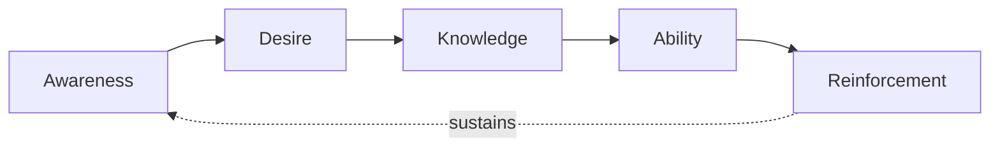

## Leading Strategic Change

### Definition and Conceptual Overview

Leading strategic change refers to the deliberate practice of guiding an organization through a significant shift in strategic direction, structure, capabilities, or culture, requiring the coordinated application of leadership, communication, governance, and organizational design tools covered throughout this course. Unlike incremental operational adjustment, strategic change typically involves altering the organization's fundamental competitive logic, resource allocation patterns, or ways of operating, which generates predictable organizational friction that must be actively managed rather than assumed away.

**Key Points**

- Leading strategic change integrates capabilities from across the strategy execution toolkit: governance, structure, human capital, culture, and communication, rather than being a standalone discipline
- Most established change leadership models share a common underlying logic despite differing terminology: build the case for change, mobilize commitment, execute deliberately, and institutionalize the new state
- Sustaining change after initial implementation is frequently harder than launching it, since organizations tend to drift back toward prior equilibrium absent deliberate reinforcement mechanisms

### Major Change Leadership Models

#### Lewin's Three-Stage Model

Kurt Lewin's foundational framework frames change as a three-phase process of altering an organizational equilibrium:

$$\text{Unfreeze} \rightarrow \text{Change (Move)} \rightarrow \text{Refreeze}$$

- **Unfreeze**: Disrupting the existing equilibrium by building awareness of the need for change and reducing the forces resisting it (connecting to the "perceived need" dimension of change readiness discussed elsewhere)
- **Change/Move**: The transition period during which new behaviors, processes, and structures are actually implemented
- **Refreeze**: Stabilizing the organization at a new equilibrium by embedding new behaviors into culture, systems, and routines so they persist rather than reverting

#### Kotter's Eight-Step Model

John Kotter's more granular sequential model (introduced in the change readiness discussion) extends Lewin's logic into eight specific actions: establishing urgency, forming a guiding coalition, developing vision and strategy, communicating the change vision, empowering broad-based action, generating short-term wins, consolidating gains, and anchoring new approaches in culture.

#### The ADKAR Model

A more individual-level, outcome-oriented model (developed by Prosci) framing successful change as requiring five sequential individual conditions: **A**wareness of the need for change, **D**esire to support the change, **K**nowledge of how to change, **A**bility to implement required skills and behaviors, and **R**einforcement to sustain the change.

**[Inference]** ADKAR's individual-level focus makes it particularly useful for diagnosing where a specific change effort is stalling at the individual level (e.g., employees may have awareness and desire but lack the knowledge or ability to actually change behavior), whereas Kotter's model operates more at the organizational/process level; the two are complementary rather than competing, and many practitioners combine organizational-level sequencing (Kotter) with individual-level diagnosis (ADKAR) within a single change effort.

### Comparative Summary of Change Models

| Model | Level of Analysis | Core Contribution |
| --- | --- | --- |
| Lewin's Three-Stage | Organizational equilibrium | Foundational unfreeze-change-refreeze logic |
| Kotter's Eight-Step | Organizational process sequence | Detailed, actionable sequential steps |
| ADKAR | Individual psychological/behavioral | Diagnoses individual-level barriers to change |
| McKinsey 7-S | Organizational alignment | Ensures multiple organizational elements move in coordination |

### Integrating Structural, Human Capital, and Cultural Levers

Leading strategic change effectively requires synchronized action across multiple organizational levers covered in this course, rather than treating change leadership as a purely communication-driven exercise:

- **Structural adjustment**: Modifying reporting lines, decision rights, or structural form (per the organizational structure chapter) to remove structural barriers to the new strategic direction
- **Workforce and capability alignment**: Applying strategic workforce planning gap analysis to identify and close capability gaps the change requires, using build/buy/borrow/bridge/bot approaches as appropriate
- **HR system realignment**: Adjusting compensation, performance management, and staffing practices (per the HR-strategy alignment discussion) so that formal incentive systems reinforce rather than contradict the change
- **Cultural reinforcement**: Applying the leadership mechanisms discussed in the organizational culture material (attention, critical incident response, reward criteria, role modeling) to embed the new behaviors the change requires
- **Governance adaptation**: Establishing appropriate change-specific governance structures (steering committees, PMO functions) per the governance structures discussion, with genuine decision authority to manage the transition

### Diagram: Integrated Strategic Change Leadership Framework (svg_diagram)

<svg xmlns="http://www.w3.org/2000/svg" viewBox="0 0 900 480" font-family="Arial, sans-serif">
<text x="450" y="30" text-anchor="middle" font-size="18" font-weight="bold">Integrated Strategic Change Leadership Framework (svg_diagram)</text>
<rect x="330" y="55" width="240" height="50" rx="8" fill="#1e3a8a" stroke="#1e293b" />
<text x="450" y="85" text-anchor="middle" font-size="13" fill="white" font-weight="bold">Strategic Narrative &amp; Vision</text>
<line x1="450" y1="105" x2="450" y2="135" stroke="#333" stroke-width="2" />
<rect x="60" y="135" width="160" height="60" rx="8" fill="#dbeafe" stroke="#1e40af" />
<text x="140" y="160" text-anchor="middle" font-size="12">Governance</text>
<text x="140" y="178" text-anchor="middle" font-size="10">Steering committees, PMO</text>
<rect x="240" y="135" width="160" height="60" rx="8" fill="#dcfce7" stroke="#166534" />
<text x="320" y="160" text-anchor="middle" font-size="12">Structure</text>
<text x="320" y="178" text-anchor="middle" font-size="10">Reporting lines, decision rights</text>
<rect x="420" y="135" width="160" height="60" rx="8" fill="#fef3c7" stroke="#92400e" />
<text x="500" y="160" text-anchor="middle" font-size="12">Workforce/HR</text>
<text x="500" y="178" text-anchor="middle" font-size="10">Capability, incentives</text>
<rect x="600" y="135" width="160" height="60" rx="8" fill="#ede9fe" stroke="#5b21b6" />
<text x="680" y="160" text-anchor="middle" font-size="12">Culture</text>
<text x="680" y="178" text-anchor="middle" font-size="10">Reinforcement mechanisms</text>
<line x1="140" y1="195" x2="140" y2="230" stroke="#333" stroke-width="1.5" />
<line x1="320" y1="195" x2="320" y2="230" stroke="#333" stroke-width="1.5" />
<line x1="500" y1="195" x2="500" y2="230" stroke="#333" stroke-width="1.5" />
<line x1="680" y1="195" x2="680" y2="230" stroke="#333" stroke-width="1.5" />
<rect x="140" y="230" width="620" height="60" rx="8" fill="#f1f5f9" stroke="#64748b" />
<text x="450" y="255" text-anchor="middle" font-size="13" font-weight="bold">Coordinated, Synchronized Implementation</text>
<text x="450" y="273" text-anchor="middle" font-size="10">All levers must move together, not independently</text>
<line x1="450" y1="290" x2="450" y2="330" stroke="#333" stroke-width="2" />
<rect x="300" y="330" width="300" height="55" rx="8" fill="#fecaca" stroke="#991b1b" />
<text x="450" y="360" text-anchor="middle" font-size="13" font-weight="bold">Institutionalization / Refreeze</text>
<line x1="450" y1="385" x2="450" y2="410" stroke="#333" stroke-width="2" />
<text x="450" y="430" text-anchor="middle" font-size="11" font-style="italic">Feedback loop: monitor and reinforce continuously post-implementation</text>
</svg>

### Sequencing Considerations in Complex Strategic Change

$$\text{Change Success Probability} = f(\text{Sequencing Coherence}, \text{Lever Synchronization}, \text{Sustained Reinforcement Duration})$$

A common practical challenge involves sequencing when multiple levers cannot realistically move simultaneously:

- **Structure-before-culture debates**: Some change practitioners advocate establishing new structures first (which then forces new behaviors and, over time, shifts culture), while others advocate cultural groundwork first (building readiness and buy-in before structural disruption); the appropriate sequence is contingent on the severity of the felt need for change and the degree of existing trust in leadership
- **Quick wins versus foundational change**: Generating early visible wins (per Kotter) builds momentum and perceived efficacy, but pursuing only easy wins while deferring more difficult foundational changes risks stalling before the harder, more consequential elements of the change are addressed
- **Pilot-and-scale versus full rollout**: Testing change approaches in a limited pilot before organization-wide rollout reduces risk and builds an evidence base (supporting the "efficacy" readiness dimension) but extends the overall timeline and may create perceived inequity between pilot and non-pilot populations during the interim period

**[Inference]** There is no universally correct sequencing choice among these trade-offs; the appropriate approach is likely contingent on factors such as the urgency of the strategic situation (crisis conditions may favor faster, more directive sequencing), the organization's risk tolerance, and the depth of existing trust in leadership, meaning change leaders should treat sequencing itself as a strategic decision requiring situational judgment rather than applying a fixed template regardless of context.

### Institutionalizing Change: Avoiding Reversion

**Example**

An organization successfully implements a new decentralized decision-making structure and observes improved responsiveness during the initial implementation period, but if performance evaluation criteria, promotion patterns, and senior leadership's own day-to-day behavior are not correspondingly and durably updated to reinforce decentralized decision-making, the organization may gradually drift back toward centralized patterns over subsequent months or years as the initial change effort's visibility and momentum fade — illustrating why "refreeze" or institutionalization mechanisms (per Lewin's model) are as critical to sustained change success as the initial implementation itself.

Common institutionalization mechanisms include:

- Embedding new behaviors into formal performance management and compensation criteria
- Updating recruitment and onboarding processes to select for and train new required behaviors from the outset
- Retiring or modifying legacy systems, processes, and structures that would otherwise passively pull the organization back toward prior patterns
- Continued leadership attention and visible reinforcement well beyond the initial "launch" period, since attention frequently wanes once initial visible milestones are achieved

### Common Failure Modes in Leading Strategic Change

- **Underestimating required time and sustained attention**: Treating change as a discrete project with a defined end date rather than an ongoing process requiring extended reinforcement
- **Insufficient stakeholder coalition**: Relying on a single senior sponsor without building broader coalition support across the organization, creating vulnerability if that individual sponsor departs or loses influence
- **Declaring victory prematurely**: Stopping reinforcement efforts after early visible wins, before new behaviors are genuinely institutionalized, allowing reversion to prior patterns
- **Ignoring the human/psychological dimension**: Focusing exclusively on structural and process redesign while neglecting the change readiness and engagement dynamics discussed elsewhere in this course, generating resistance that structural redesign alone cannot overcome
- **Lever misalignment**: Pursuing structural or cultural change while leaving incentive systems, governance, or staffing practices unchanged, sending contradictory signals that undermine the credibility of the overall change effort

### Practical Diagnostic Questions

- Which established change model (or combination) best fits the current situation's level of analysis needs — organizational sequencing, individual-level diagnosis, or both?
- Are structural, human capital, cultural, and governance levers being adjusted in a coordinated, synchronized manner, or is one lever being changed while others remain misaligned?
- What specific institutionalization mechanisms are planned to prevent reversion to prior patterns once initial implementation momentum fades?
- Has the change effort built a sufficiently broad stakeholder coalition, or does it depend disproportionately on a single senior sponsor?

**Next Steps**

- Change Readiness and Employee Engagement
- Strategic Communication and Narrative
- Building and Shaping Organizational Culture
- The Role of the Strategic Leader
- Governance Structures for Strategy Execution
- Organizational Design for Strategic Agility
- Mergers, Acquisitions, and Post-Merger Integration Governance