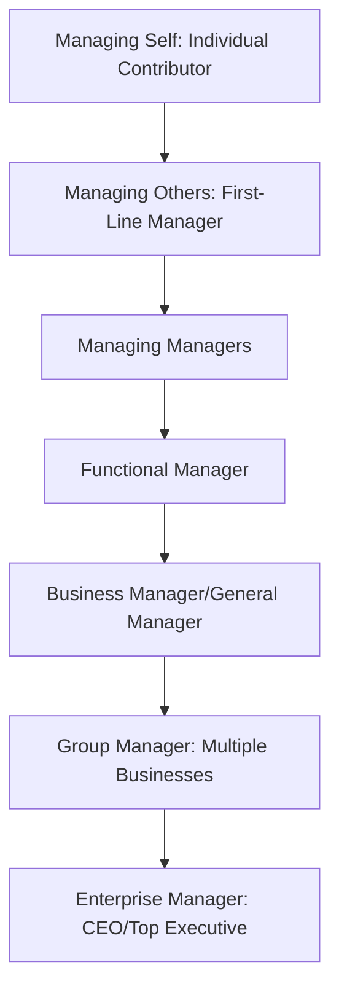

## Succession Planning and Leadership Pipelines

### Definition and Conceptual Overview

Succession planning is the systematic process of identifying and developing internal candidates capable of filling key leadership positions when they become vacant, ensuring continuity of strategic leadership capability rather than treating leadership transitions as ad hoc, reactive events. A leadership pipeline extends this concept into an ongoing organizational capability: a structured system for continuously identifying, developing, and advancing leadership talent through progressively more senior and complex roles over time, so that capable successors exist at every organizational level, not solely at the top.

**Key Points**

- Succession planning treats strategic leadership capability as a form of organizational capital requiring deliberate cultivation, directly extending the "developing successor leadership" responsibility identified in the strategic leader role discussion
- Effective succession planning distinguishes between emergency/interim succession (readiness for sudden, unplanned vacancy) and long-term development succession (multi-year capability building for anticipated future needs)
- Leadership pipeline models emphasize that leadership development is not a single event but a sequence of qualitatively distinct transitions, each requiring different skills that are not automatically acquired through prior success at a lower level

### Why Succession Planning Matters Strategically

Poor succession planning creates several forms of strategic vulnerability directly connected to concepts discussed elsewhere in this course:

- **Discontinuity risk**: Sudden, unplanned leadership vacancy (departure, illness, termination) without a ready successor can stall strategic execution and create governance uncertainty at the board level
- **Strategic drift risk**: An externally recruited successor unfamiliar with the organization's specific strategic context, culture, and capabilities may require a lengthy learning curve, during which strategic momentum can be lost
- **Talent retention risk**: High-potential internal talent who perceive limited advancement opportunity, due to the absence of a visible and credible development pipeline, may be more likely to depart for external opportunities offering clearer progression
- **Upper Echelons discontinuity**: Since executive characteristics and cognitive frames materially shape strategic choice (per Upper Echelons Theory), an unplanned or poorly matched leadership transition can produce an unintended and potentially disruptive shift in strategic direction

$$\text{Succession Risk} = f(\text{Bench Depth at Key Positions}, \text{Time-to-Readiness of Identified Successors}, \text{Vacancy Probability})$$

### The Leadership Pipeline Model

A widely referenced framework (developed by Charan, Drotter, and Noel) conceptualizes leadership development as a series of distinct career transitions, or "passages," each requiring a genuine shift in skills, time application, and work values rather than simply doing more of what made the individual successful at the prior level.

| Passage | Key Skill Shift Required |
| --- | --- |
| Managing Self → Managing Others | From individual technical excellence to valuing and enabling others' work |
| Managing Others → Managing Managers | From directly managing individual contributors to selecting and developing other managers |
| Managing Managers → Functional Manager | From operational management to strategic thinking within a functional domain |
| Functional Manager → Business Manager | From single-function expertise to integrating multiple functions toward overall business results |
| Business Manager → Group Manager | From managing a single business to allocating resources and strategy across a portfolio of businesses |
| Group Manager → Enterprise Manager | From managing a portfolio to leading the entire enterprise, including external stakeholder and board relationships |

**[Inference]** A common practical failure identified in leadership pipeline theory is promoting individuals based on excellence at the prior level's skill set without verifying that they have genuinely made the required passage in mindset and time application at the new level; an individual who continues to apply "managing self" behaviors (e.g., personally executing technical work rather than developing others) after being promoted to "managing others" is likely to struggle regardless of their prior individual excellence, since the underlying skill requirements are qualitatively different rather than merely a matter of scale.

### Diagram: Succession Planning and Pipeline Integration (svg_diagram)

<svg xmlns="http://www.w3.org/2000/svg" viewBox="0 0 900 440" font-family="Arial, sans-serif">
<text x="450" y="30" text-anchor="middle" font-size="18" font-weight="bold">Succession Planning and Pipeline Integration (svg_diagram)</text>
<rect x="60" y="70" width="200" height="55" rx="8" fill="#1e3a8a" stroke="#1e293b" />
<text x="160" y="102" text-anchor="middle" font-size="12" fill="white">Identify Key Positions</text>
<line x1="260" y1="97" x2="320" y2="97" stroke="#333" stroke-width="2" />
<rect x="320" y="70" width="200" height="55" rx="8" fill="#2563eb" stroke="#1e293b" />
<text x="420" y="102" text-anchor="middle" font-size="12" fill="white">Assess Bench Strength</text>
<line x1="520" y1="97" x2="580" y2="97" stroke="#333" stroke-width="2" />
<rect x="580" y="70" width="240" height="55" rx="8" fill="#60a5fa" stroke="#1e293b" />
<text x="700" y="102" text-anchor="middle" font-size="12" fill="white">Identify High-Potential Candidates</text>
<line x1="700" y1="125" x2="700" y2="165" stroke="#333" stroke-width="2" />
<rect x="480" y="165" width="340" height="55" rx="8" fill="#dcfce7" stroke="#166534" />
<text x="650" y="197" text-anchor="middle" font-size="12">Develop via Pipeline Passages (Stretch Roles, Rotation)</text>
<line x1="480" y1="192" x2="420" y2="192" stroke="#333" stroke-width="2" />
<rect x="100" y="165" width="320" height="55" rx="8" fill="#fef3c7" stroke="#92400e" />
<text x="260" y="197" text-anchor="middle" font-size="12">Emergency/Interim Succession Readiness</text>
<line x1="260" y1="220" x2="260" y2="260" stroke="#333" stroke-width="2" />
<line x1="650" y1="220" x2="650" y2="260" stroke="#333" stroke-width="2" />
<rect x="150" y="260" width="600" height="55" rx="8" fill="#ede9fe" stroke="#5b21b6" />
<text x="450" y="292" text-anchor="middle" font-size="12" font-weight="bold">Board/Governance Review and Calibration</text>
<line x1="450" y1="315" x2="450" y2="350" stroke="#333" stroke-width="2" />
<rect x="270" y="350" width="360" height="55" rx="8" fill="#fecaca" stroke="#991b1b" />
<text x="450" y="382" text-anchor="middle" font-size="12" font-weight="bold">Continuous Reassessment (Annual Cycle)</text>
</svg>

### Succession Planning Process Components

#### 1. Position Criticality Assessment

Identifying which roles are genuinely mission-critical to strategic execution, connecting to the "pivotal role" concept from the talent-as-competitive-advantage discussion — succession planning resources should be concentrated on positions where a vacancy or poor fit would materially damage strategic execution, not distributed uniformly across all roles.

#### 2. Talent Assessment and Calibration

Systematically assessing potential successors against the competencies required at the target level (not merely current-level performance), often using structured tools such as 9-box grids (plotting current performance against assessed future potential) and calibration sessions where senior leaders jointly review talent assessments to reduce individual manager bias.

$$\text{9-Box Assessment: } \text{Performance (Current)} \times \text{Potential (Future)}$$

|  | Low Potential | Moderate Potential | High Potential |
| --- | --- | --- | --- |
| **High Performance** | Solid, reliable performer | Growth candidate | Future leader — top development priority |
| **Moderate Performance** | Inconsistent performer | Core performer | Potential star, needs stretch opportunity |
| **Low Performance** | Performance concern | Underperforming, monitor | Potential mismatch — reassess role fit |

#### 3. Development Planning

Constructing individualized development plans for identified successors, commonly including stretch assignments, cross-functional rotation (directly connecting to the cross-functional rotation mechanism from the organizational learning discussion), formal executive education, mentoring/sponsorship relationships, and exposure to board-level interaction.

#### 4. Emergency Succession Planning

Distinct from long-term development planning, emergency succession planning identifies who could step into a critical role on an interim basis immediately upon an unplanned vacancy, ensuring basic organizational continuity even where the identified interim successor may not be the eventual permanent choice.

#### 5. Board and Governance Oversight

For CEO and top-executive succession specifically, the board (per the governance structures discussed earlier) holds direct fiduciary responsibility for succession oversight, typically including regular (often annual) succession review sessions independent of any specific anticipated vacancy, to ensure readiness regardless of timing uncertainty.

### Internal Development versus External Recruitment

| Consideration | Favors Internal Development | Favors External Recruitment |
| --- | --- | --- |
| Strategic continuity | Preserves existing strategic direction and cultural fit | Introduces new perspective, may be needed if strategic change is required |
| Cultural knowledge | Retains deep firm-specific tacit knowledge (see talent-as-advantage discussion) | Risks cultural mismatch, longer ramp-up time |
| Signal to internal talent | Reinforces internal advancement credibility, aids retention | May signal limited internal advancement opportunity, risking morale/retention |
| Speed | Faster transition given existing organizational familiarity | Typically slower onboarding and relationship-building period |
| Fresh perspective | Lower likelihood of challenging existing (potentially outdated) assumptions | Higher likelihood of challenging cognitive entrenchment (see strategic leader discussion) |

**[Inference]** The appropriate balance between internal development and external recruitment for a specific succession decision likely depends on whether the strategic situation calls primarily for continuity (favoring internal candidates, given their embedded understanding of existing strategy and culture) or for significant strategic redirection (where an external candidate's lack of cognitive entrenchment in prior organizational assumptions may be a genuine asset rather than merely a knowledge gap to be overcome); this is a contextual judgment rather than a fixed rule favoring one approach universally.

### Succession Planning and Strategic Leadership Continuity

**Example**

A company anticipating a multi-year digital transformation strategy identifies that its current bench of internal successors for key technology leadership roles was primarily developed within the organization's prior, less digitally-oriented strategic paradigm. Recognizing this gap through succession planning review (rather than discovering it reactively at the point of an actual vacancy), the organization can proactively adjust development plans — providing digital-specific stretch assignments and external exposure to internal candidates, or deliberately building a slate that includes some external candidates — well before an actual leadership transition becomes urgent.

### Common Pitfalls in Succession Planning

- **Succession planning as a paper exercise**: Maintaining succession charts that are updated annually for compliance purposes but not genuinely used to guide development investment or actual selection decisions when vacancies arise
- **Overreliance on current performance as sole predictor**: Assuming strong current-role performance automatically predicts success at a substantially different, more senior role, without accounting for the qualitatively different skill requirements identified in the leadership pipeline model
- **Insufficient breadth**: Concentrating succession planning attention exclusively on the CEO role while neglecting other pivotal senior leadership positions whose vacancy could equally disrupt strategic execution
- **Failure to update for strategic shifts**: Maintaining a static succession slate developed for a prior strategic context without reassessing whether identified successors' capabilities remain matched to the organization's evolving strategic direction
- **Insufficient board engagement**: Treating succession planning as a purely management-driven HR process without adequate board-level oversight, particularly problematic for CEO and top-executive succession given the board's direct fiduciary responsibility

### Practical Diagnostic Questions

- Which positions are genuinely pivotal to strategic execution, and does succession planning investment concentrate appropriately on those roles rather than being spread uniformly?
- Are identified successors being assessed against the skill requirements of the target role (the next pipeline passage) rather than merely their performance at their current level?
- Does an emergency succession plan exist for immediate coverage of critical roles, separate from longer-term development succession planning?
- Is succession planning reassessed regularly against the organization's evolving strategic direction, or does it reflect an outdated strategic context?
- Is the board genuinely engaged in CEO and top-executive succession oversight, consistent with its governance responsibilities?

**Related Topics**

- The Role of the Strategic Leader
- Upper Echelons Theory
- Strategic Workforce Planning
- Talent as a Source of Competitive Advantage
- Governance Structures for Strategy Execution
- Organizational Learning Systems
- Leading Strategic Change