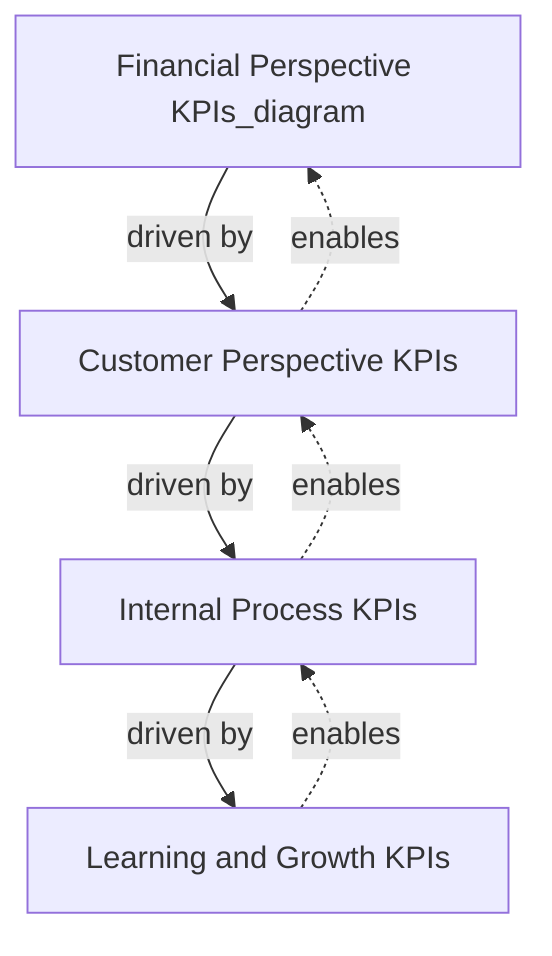
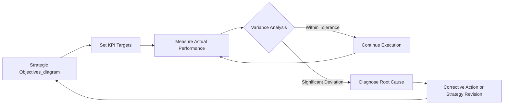

## Key Performance Indicators for Strategy

### Definition and Conceptual Foundation

A Key Performance Indicator (KPI) is a quantifiable metric used to evaluate the extent to which an organization, business unit, or individual is achieving predefined strategic objectives. Unlike generic performance metrics, KPIs are distinguished by their direct linkage to strategic priorities — they are selected specifically because movement in the metric signals progress (or regression) toward stated strategic goals.

KPIs sit within the broader discipline of strategic control, which is the process of monitoring and evaluating the strategy-implementation process to ensure that actual performance conforms to planned performance, and correcting deviations when it does not. Without KPIs, strategic control is reduced to intuition; with them, it becomes evidence-based.

A useful conceptual distinction:

- **Metric**: Any quantifiable measure (e.g., number of website visits)
- **KPI**: A metric selected because it indicates progress on a strategic objective (e.g., customer acquisition cost, tied to a growth strategy)
- **Target**: The specific numerical value a KPI is expected to reach within a timeframe (e.g., reduce customer acquisition cost to $40 by Q4)

### Strategic Rationale for KPIs

KPIs exist to solve a specific managerial problem: strategy is formulated at a high level of abstraction (e.g., "achieve differentiation through superior customer service"), but execution happens at the operational level (e.g., call center wait times, complaint resolution rates). KPIs act as the translation mechanism between abstract strategic intent and concrete, measurable operational behavior.

This translation function serves several purposes in strategic management:

- **Alignment**: KPIs cascade strategic priorities downward so that individual and departmental goals reinforce the overall strategy rather than working at cross-purposes.
- **Accountability**: Assigning ownership of specific KPIs to specific managers creates clear responsibility for strategic outcomes.
- **Early warning**: Leading KPIs can signal strategic drift before it manifests in lagging financial results.
- **Resource allocation**: Performance data on KPIs informs where budget, talent, and management attention should be redirected.
- **Communication**: KPIs provide a shared, unambiguous vocabulary for discussing performance across all levels of the organization.

### Characteristics of Effective KPIs

Effective KPIs are generally evaluated against the following criteria, commonly summarized by the **SMART** framework, extended with strategy-specific considerations:

- **Specific**: Clearly defined, unambiguous, and tied to a particular strategic objective
- **Measurable**: Quantifiable using available or obtainable data
- **Achievable**: Realistic given organizational capabilities and resources
- **Relevant**: Directly connected to strategic priorities, not merely convenient to measure
- **Time-bound**: Associated with a specific measurement period and target date

Additional strategy-specific criteria:

- **Actionable**: Management must be able to influence the KPI through decisions; a KPI the organization cannot affect (e.g., macroeconomic exchange rates for a purely domestic firm) has limited control value, though it may still be a useful *contextual* indicator.
- **Owned**: A single accountable owner should exist for each KPI to avoid diffusion of responsibility.
- **Limited in number**: Excessive KPIs dilute managerial attention. Most frameworks recommend 15–25 KPIs at the corporate level, with 5–7 per balanced perspective or business unit.
- **Resistant to gaming**: A well-designed KPI should be difficult to manipulate without genuinely improving the underlying strategic outcome.

**Example**

A firm pursuing a differentiation strategy through customer experience might reject "Number of customer service calls handled" (easily gamed by rushing calls) in favor of "First-contact resolution rate" (harder to game without genuinely improving service quality).

### Classification of KPIs

**By timing orientation**

- **Lagging indicators**: Measure outcomes after they have occurred (e.g., annual revenue growth, market share, net profit margin). These confirm whether strategy succeeded but offer little opportunity for mid-course correction.
- **Leading indicators**: Measure activities or conditions that predict future outcomes (e.g., R&D pipeline strength, employee engagement scores, sales pipeline volume). These allow proactive intervention.

Effective strategic control systems deliberately balance both types, since lagging-only systems detect problems too late, while leading-only systems risk losing sight of ultimate financial and market outcomes.

**By organizational level**

- **Corporate-level KPIs**: Enterprise-wide measures tied to overall strategic direction (e.g., total shareholder return, portfolio diversification ratio)
- **Business-unit-level KPIs**: Tied to competitive strategy within a specific market or industry (e.g., relative market share, cost-per-unit versus competitors)
- **Functional-level KPIs**: Operational measures within departments that support the higher-level strategy (e.g., inventory turnover for operations, cost-per-lead for marketing)

**By strategic perspective (Balanced Scorecard categories)**

- **Financial**: Return on invested capital (ROIC), economic value added (EVA), revenue growth rate
- **Customer**: Net Promoter Score (NPS), customer retention rate, customer lifetime value (CLV)
- **Internal Process**: Cycle time, defect rate, process capacity utilization
- **Learning and Growth**: Employee turnover, training hours per employee, innovation rate (percentage of revenue from new products)

### The Balanced Scorecard as a KPI Framework

The Balanced Scorecard, developed by Robert Kaplan and David Norton, is the most widely adopted structured framework for organizing strategic KPIs. Its central premise is that financial KPIs alone are lagging and incomplete; sustainable strategic performance requires measuring the drivers of financial results across four interconnected perspectives.

The logic flows causally: investment in employee capability and information systems (Learning and Growth) improves internal processes (Internal Process), which improves the customer value proposition (Customer), which ultimately drives financial performance (Financial). Strategic control using the Balanced Scorecard means monitoring KPIs across all four layers, not just the financial output.

**Strategy maps**, a companion tool, visually link individual KPIs across the four perspectives into cause-and-effect chains, making the underlying strategic hypothesis explicit and testable against actual performance data.

### KPI Selection Process

A structured approach to deriving KPIs from strategy typically follows these steps:

1. **Clarify strategic objectives**: Begin with explicit statements of what the strategy is trying to achieve (e.g., "become the low-cost leader in regional logistics").
2. **Identify critical success factors (CSFs)**: Determine the handful of things that must go right for the objective to be achieved (e.g., fleet utilization, fuel efficiency, route optimization).
3. **Derive candidate KPIs per CSF**: For each CSF, generate metrics that would indicate performance (e.g., for fleet utilization: "vehicle capacity utilization rate").
4. **Filter using SMART and strategic-fit criteria**: Eliminate KPIs that are not actionable, not measurable with reasonable effort, or redundant with existing KPIs.
5. **Set targets and thresholds**: Establish baseline, target, and stretch values, often informed by historical performance, industry benchmarks, or competitor data.
6. **Assign ownership and reporting cadence**: Designate accountable owners and the frequency of measurement (daily, weekly, monthly, quarterly).
7. **Establish a review and revision cycle**: KPIs should be periodically reassessed, since a KPI appropriate for one strategic phase (e.g., market entry) may become irrelevant or counterproductive in another (e.g., market maturity).

### Common KPI Examples by Generic Strategy Type

**Cost Leadership Strategy**

- Cost per unit relative to industry average
- Overhead cost as a percentage of revenue
- Capacity utilization rate
- Inventory turnover ratio

**Differentiation Strategy**

- Price premium sustained over competitors
- Net Promoter Score / customer satisfaction index
- Brand equity index
- Percentage of revenue from premium product lines

**Focus/Niche Strategy**

- Market share within the target segment (not overall market)
- Customer retention rate within the niche
- Segment-specific profitability margin

**Growth Strategy**

- Revenue growth rate (organic vs. acquired)
- Customer acquisition rate
- Market penetration rate
- New product/market revenue contribution

### KPI Dashboards and Reporting Cadence

Strategic control requires that KPI data be visible to decision-makers at the appropriate frequency and level of aggregation. A typical tiered reporting structure:

| Level | Typical KPIs | Reporting Frequency | Primary Audience |
| --- | --- | --- | --- |
| Board / Executive | ROIC, EVA, market share, TSR | Quarterly | Board, C-suite |
| Business Unit | Segment margin, unit growth rate | Monthly | BU heads, VPs |
| Departmental | Cycle time, defect rate, CAC | Weekly | Middle management |
| Operational | Units produced, calls handled | Daily | Front-line supervisors |

[Inference] The specific cadence above reflects common practice conventions in strategic management literature rather than a universal rule; actual reporting frequency varies by industry volatility and organizational maturity.

### Common Pitfalls in KPI Design and Use

- **Vanity metrics**: Tracking metrics that look impressive (e.g., total social media followers) but have no demonstrated link to strategic objectives or financial outcomes.
- **Metric overload**: Monitoring too many KPIs dilutes managerial focus and creates reporting fatigue, obscuring which indicators genuinely matter.
- **Goal displacement / gaming**: When compensation or evaluation is tied too tightly to a KPI, employees may optimize the metric at the expense of the underlying strategic intent (e.g., sales reps front-loading discounts to hit quarterly targets at the cost of long-term margin).
- **Lagging-only measurement**: Relying solely on financial outcome KPIs means problems are detected only after damage has occurred.
- **Static KPIs in a changing strategy**: Continuing to track KPIs tied to an obsolete strategic phase, which sends misleading signals to management.
- **Misalignment across levels**: Functional KPIs that are locally optimal but conflict with overall strategy (e.g., a purchasing department minimizing unit cost by buying lower-quality inputs, undermining a differentiation strategy built on quality).

**Example**

A classic illustration of goal displacement: a customer service center that adopts "average call handling time" as its primary KPI may see handling times fall, but if the underlying strategic goal was "improve customer satisfaction," the shorter calls may result from agents rushing customers off the line — the KPI improves while the strategic objective deteriorates.

### KPIs and the Strategic Control Feedback Loop

KPIs function as the sensing mechanism within a broader control loop:

This loop reflects the core logic of strategic control systems: objectives generate targets, targets are compared against actual measured performance, and material variances trigger diagnostic and corrective managerial action, which may in turn feed back into a revision of the objectives themselves.

### Financial vs. Non-Financial KPI Debate

A recurring theme in strategic management is the tension between financial KPIs (which are standardized, auditable, and comparable across firms) and non-financial KPIs (which often capture strategic drivers earlier but are harder to measure consistently).

[Inference] Much of the academic and practitioner consensus, reflected in frameworks like the Balanced Scorecard, holds that an overreliance on financial KPIs alone tends to encourage short-termism, since financial results are the final output of a chain of operational and market activities that non-financial KPIs can reveal much earlier. This is a widely-held position in strategic management theory rather than an empirically universal law, and its applicability can vary by industry and firm context.

### Related Topics

- Balanced Scorecard design and implementation
- Strategy maps and cause-and-effect linkage modeling
- Objectives and Key Results (OKRs) as an alternative goal-cascading framework
- Strategic control types (premise control, implementation control, strategic surveillance, special alert control)
- Management by Objectives (MBO) and its relationship to KPI systems
- Benchmarking as a source of KPI target-setting
- Economic Value Added (EVA) and Return on Invested Capital (ROIC) as corporate-level financial KPIs
- Employee compensation design and KPI-linked incentive alignment
- Environmental, Social, and Governance (ESG) KPIs in contemporary strategic control systems