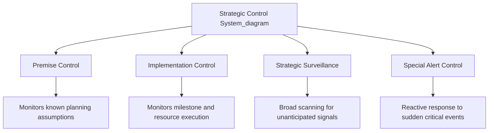

## Strategic Control Systems

### Definition and Purpose

A strategic control system is the formal set of processes, structures, and information flows an organization uses to monitor whether its strategy is being implemented as intended and whether that strategy remains appropriate given internal and external conditions. Strategic control differs fundamentally from operational control: operational control asks "are we doing things right?" (efficiency, within an existing plan), while strategic control asks "are we doing the right things?" (validity of the plan itself).

Strategic control systems perform two distinct functions simultaneously:

- **Implementation monitoring**: Tracking whether the strategy is being executed as designed (execution fidelity)
- **Strategic validity testing**: Continuously testing whether the assumptions underlying the strategy still hold, and whether the strategy itself remains the right one given a changing environment

This dual function distinguishes strategic control from simple performance measurement. A firm can be executing its strategy flawlessly (high implementation fidelity) while the strategy itself has become obsolete due to environmental shifts — strategic control is designed to catch this scenario, which operational metrics alone cannot detect.

### The Four Types of Strategic Control

The most widely referenced typology, developed by Schendel and Hofer and later refined by Pearce and Robinson, identifies four distinct types of strategic control operating in parallel:

**1. Premise Control**

Premise control systematically tracks whether the environmental and industry assumptions on which the strategy was built remain valid. Every strategy is formulated on a set of explicit or implicit premises (e.g., "raw material costs will remain stable," "regulatory environment will not tighten," "customer preference for feature X will continue").

- **Mechanism**: Identify key planning premises during strategy formulation, assign responsibility for monitoring each, and set trigger thresholds for when a premise's invalidation should prompt strategic review.
- **Example**: An airline's low-cost strategy premised on stable fuel prices would use premise control to track fuel price indices; a sustained breach of a defined threshold (e.g., 20% above the planning assumption) would trigger a formal strategic reassessment rather than waiting for the annual planning cycle.

**2. Implementation Control**

Implementation control tracks whether the sequence of actions, resource commitments, and events required to execute the strategy are occurring as planned. It operates at two levels:

- **Strategic thrusts / milestone reviews**: Monitoring critical implementation steps or projects (e.g., "was the new distribution center operational by Q2 as planned?")
- **Milestone reviews**: Periodic checkpoints assessing overall implementation progress, often tied to major resource allocation decisions or phase-gate reviews

**Example**

A firm executing a market-entry strategy into a new country might define implementation milestones such as: regulatory approval secured (Month 3), local partnership signed (Month 6), first product shipment (Month 9). Implementation control tracks actual dates against these milestones and triggers management attention when material slippage occurs.

**3. Strategic Surveillance**

Strategic surveillance is broad, unfocused environmental scanning designed to detect unanticipated information relevant to strategy that would not be caught by premise control's specific, predefined variables. Where premise control watches known, named variables, strategic surveillance is deliberately open-ended monitoring for the "unknown unknowns."

- **Mechanism**: General scanning of trade publications, industry conferences, competitor announcements, regulatory filings, and technology trends without a predefined hypothesis about what will be found.
- **Example**: A traditional taxi company's strategic surveillance system picking up early, seemingly minor press coverage of ride-sharing startups years before they became a recognized competitive threat.

**4. Special Alert Control**

Special alert control is the rapid, thorough reconsideration of strategy triggered by a sudden, unexpected event of high strategic significance. Unlike the other three types, which operate continuously, special alert control is activated reactively.

- **Mechanism**: Pre-established crisis response protocols, cross-functional response teams, and rapid escalation paths that can be activated on short notice.
- **Example**: A sudden product recall, a major competitor's acquisition of a key supplier, or a natural disaster disrupting a critical supply chain node would each trigger special alert control processes.

### Design Requirements of an Effective Strategic Control System

For a strategic control system to function, it must satisfy several structural design conditions:

- **Focus on strategically significant variables**: The system should track a limited set of variables genuinely material to strategic success, not an exhaustive list of everything measurable.
- **Integration with the planning process**: Strategic control should be embedded within, not separate from, the strategic planning cycle so that control findings directly feed the next planning iteration.
- **Timeliness**: Information must reach decision-makers quickly enough to permit corrective action before damage compounds; a strategically excellent control system that reports quarterly on a fast-moving threat is functionally inadequate.
- **Accuracy and reliability of data**: Control decisions are only as sound as the underlying data; systems require validation mechanisms to prevent reliance on distorted or manipulated inputs.
- **Flexibility**: The set of monitored variables must be revisable as the strategy and environment evolve; a control system that becomes fixed becomes progressively less relevant.
- **Actionable output**: Control system outputs should be structured to prompt specific managerial decisions (continue, adjust, or abandon), not simply generate reports for their own sake.
- **Appropriate organizational placement**: Responsibility and authority for acting on strategic control information must be assigned to managers who actually have the authority to change the strategy or its implementation.

### Feedback vs. Feedforward Control Orientation

Strategic control systems can be designed with different temporal orientations:

- **Feedback control** (reactive): Compares actual results against targets *after* outcomes have occurred, and adjusts future action based on the gap. This is the traditional, retrospective form of control (e.g., quarterly variance analysis against budget).
- **Feedforward control** (proactive): Monitors inputs and leading conditions *before* outcomes materialize, aiming to correct course while there is still time to influence the final result. Premise control and strategic surveillance are inherently feedforward in orientation; implementation control blends both.

[Inference] Strategic management literature generally favors feedforward-oriented design wherever feasible, since by the time feedback control detects a strategic problem through lagging financial results, the cost and difficulty of corrective action have typically increased substantially. This is a widely accepted normative position rather than a measurable universal outcome, since the practicality of feedforward monitoring depends on how observable the relevant leading variables are in a given industry.

### Relationship to Organizational Structure and Culture

Strategic control systems do not operate in isolation from organizational design; their effectiveness depends heavily on structural and cultural context:

- **Decentralization and control tension**: Highly decentralized organizations require strategic control systems that can aggregate meaningful signals from autonomous units without imposing excessive reporting burden or undermining the autonomy that decentralization is meant to preserve.
- **Culture of honest reporting**: A strategic control system depends on managers reporting unfavorable variances truthfully; a culture that punishes bad news disproportionately incentivizes suppression or manipulation of control data, degrading the system's diagnostic value.
- **Incentive alignment**: Compensation and evaluation systems must be designed so that managers are not penalized for the honest surfacing of strategic problems, since punitive responses to bad news create incentives to hide rather than escalate emerging issues.

### Strategic Control vs. Financial Control vs. Operational Control

| Dimension | Strategic Control | Financial Control | Operational Control |
| --- | --- | --- | --- |
| Primary Question | Is the strategy still valid and being implemented correctly? | Are financial targets being met? | Are day-to-day activities efficient? |
| Time Horizon | Long-term (years) | Medium-term (quarters/year) | Short-term (daily/weekly) |
| Key Tools | Premise control, milestone reviews, surveillance | Budgets, variance analysis, ratio analysis | Standard operating procedures, quality control charts |
| Typical Owner | Senior executives, board | CFO, finance function | Line managers, supervisors |
| Failure Mode if Absent | Strategic drift, obsolete strategy pursued indefinitely | Cost overruns, liquidity problems | Inefficiency, quality defects |

### Common Failure Modes in Strategic Control Systems

- **Premise control neglect**: Organizations frequently build detailed strategic plans but fail to formally identify or monitor the underlying premises, discovering invalidated assumptions only after significant damage.
- **Over-reliance on financial lagging indicators**: Treating quarterly financial performance as the sole strategic control mechanism, which by design detects problems only after they have already materialized in outcomes.
- **Surveillance atrophy**: Strategic surveillance functions (competitive intelligence, environmental scanning) are often the first budget cuts during cost-reduction periods, precisely when environmental volatility may be increasing.
   
- **Information overload without synthesis**: Collecting large volumes of data without a clear escalation and synthesis mechanism to convert raw signals into decision-relevant conclusions.
- **Escalation bottlenecks**: Special alert control systems that exist on paper but lack tested, rehearsed escalation paths tend to fail precisely during the high-pressure situations they were designed for.
- **Strategic control captured by operational metrics**: Boards and executives sometimes substitute readily available operational KPIs for genuine strategic control, creating a false sense of strategic oversight.

**Example**

Kodak's continued strategic commitment to film photography despite internally-generated evidence (including its own early digital camera research) of the coming digital disruption is frequently cited [Unverified — specific internal decision documentation is not something this analysis can confirm in detail] as illustrating premise control failure: the assumption that film would remain the dominant photography medium was not adequately challenged despite disconfirming signals available to the organization.

### Strategic Control in Practice: Implementation Steps

1. **Formalize strategic premises**: During strategy formulation, explicitly document the key assumptions the strategy depends on, and assign monitoring ownership for each.
2. **Establish milestone maps**: Break strategic initiatives into discrete, dated implementation milestones with clear success criteria.
3. **Build environmental scanning routines**: Institutionalize regular (not merely ad hoc) surveillance activities — competitive intelligence reviews, industry conference debriefs, technology scouting.
4. **Design escalation protocols**: Predefine trigger thresholds and escalation paths for premise violations, milestone slippage, and crisis events, so that response does not depend on improvised judgment under pressure.
5. **Integrate with the planning calendar**: Schedule formal strategic control reviews (not just budget reviews) at defined intervals, with outputs that explicitly feed the next strategic planning cycle.
6. **Conduct periodic system audits**: Reassess whether the control system itself — the variables monitored, the thresholds set, the escalation paths — remains appropriate as the strategy and environment evolve.

### Related Topics

- Premise, implementation, surveillance, and special alert control mechanisms in depth
- Balanced Scorecard as an integrative strategic control and measurement tool
- Environmental scanning and competitive intelligence methodologies
- Strategic drift and organizational inertia
- Corporate governance and the board's role in strategic oversight
- Scenario planning as a complement to premise control
- Crisis management and business continuity planning
- Management control systems theory (Robert Simons' Levers of Control framework)