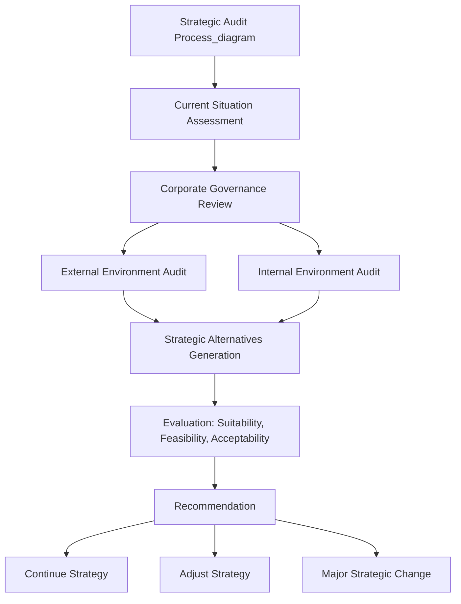

## Strategic Auditing and Review Processes

### Definition and Purpose

A strategic audit is a comprehensive, structured examination of an organization's strategy, its implementation, and the environmental and internal conditions surrounding it, conducted to assess whether the current strategic direction remains sound and to identify necessary adjustments. Strategic review processes refer to the ongoing institutional mechanisms — calendars, forums, governance structures — through which such audits and lighter-weight periodic assessments are conducted on a recurring basis.

Where strategic control systems (premise control, implementation control, surveillance, special alert control) provide continuous, often narrowly-scoped monitoring, strategic auditing is typically a deeper, periodic, holistic diagnostic exercise — closer to a comprehensive health check than to continuous vital-sign monitoring. The two are complementary: strategic control systems generate the ongoing data and trigger points; strategic audits periodically synthesize that data alongside fresh environmental and internal analysis into a comprehensive strategic reassessment.

### Distinguishing Strategic Audit from Related Concepts

| Concept | Scope | Frequency | Primary Question |
| --- | --- | --- | --- |
| Strategic Audit | Entire strategy: formulation, implementation, environment | Periodic (annual, or triggered) | Is the overall strategy still sound? |
| Strategic Control | Specific, ongoing variables and premises | Continuous | Are execution and key assumptions on track? |
| Financial Audit | Financial statements and controls | Annual (often regulatory) | Are the financial statements accurate and compliant? |
| Operational Review | Process efficiency within functions | Frequent (monthly/quarterly) | Are operations running efficiently? |
| Management Audit | Managerial competence and organizational capability | Periodic | Is management capable of executing the strategy? |

### Core Components of a Strategic Audit

A comprehensive strategic audit typically examines the organization across several interlocking dimensions, often structured around a sequential audit framework:

**1. Current Situation Assessment**

- Review of current mission, vision, and stated strategic objectives
- Assessment of current strategic posture (which generic strategy is being pursued, and how consistently)
- Review of the most recent strategic plan and its stated assumptions

**2. Corporate Governance Review**

- Board composition, independence, and involvement in strategic oversight
- Management's track record of strategic decision-making and capital allocation
- Alignment between governance structures and long-term strategic accountability

**3. External Environment Audit**

- **Macro-environmental scan (PESTEL)**: Political, Economic, Social, Technological, Environmental, and Legal factors that may have shifted since the last audit
- **Industry and competitive analysis (Porter's Five Forces)**: Reassessment of competitive rivalry, buyer/supplier power, threat of substitutes, and barriers to entry
- **Competitor strategic profiling**: Updated assessment of competitor strategies, capabilities, and likely future moves
- **Opportunity and threat identification**: Systematic cataloguing of what has changed in the external landscape

**4. Internal Environment Audit**

- **Resource and capability assessment**: Often structured using the VRIO framework (Value, Rarity, Imitability, Organization) to determine whether internal resources still constitute sources of sustainable competitive advantage
- **Value chain analysis**: Reassessment of where value is created and where cost or differentiation advantages reside
- **Financial ratio analysis**: Profitability, liquidity, leverage, and efficiency ratios benchmarked against historical performance and industry peers
- **Organizational structure and culture fit**: Whether current structure and culture continue to support (or now hinder) strategy execution
- **Strength and weakness identification**: Systematic cataloguing of internal capability changes

**5. Strategic Alternatives Generation and Evaluation**

- Generation of alternative strategic options in light of updated external and internal analysis
- Evaluation of alternatives against suitability (does it address the SWOT position), feasibility (can resources support it), and acceptability (will stakeholders accept the risk/return profile) — the classic **SFA framework**
- Comparison of the status quo strategy against generated alternatives

**6. Recommendation and Implementation Planning**

- Formal recommendation: continue current strategy, adjust it incrementally, or pursue significant strategic change
- Revised implementation roadmap, resource reallocation plan, and updated strategic control system design if the strategy is changed

### Triggers for Conducting a Strategic Audit

Strategic audits are conducted both on a scheduled basis and in response to specific triggering conditions:

- **Scheduled/cyclical**: Most organizations conduct a comprehensive strategic audit annually, often aligned with the annual planning and budgeting cycle
- **Performance-triggered**: Sustained underperformance against strategic KPIs over multiple periods
- **Event-triggered**: Major mergers, acquisitions, leadership transitions (especially CEO succession), significant regulatory changes, or disruptive competitive entry
- **Premise-triggered**: A strategic control system's premise control mechanism detecting invalidation of a core planning assumption (linking directly back to strategic control systems)
- **Governance-triggered**: Board-mandated review, often following investor pressure, activist shareholder involvement, or a governance failure elsewhere in the organization

### Strategic Audit Methodologies and Tools

Several established analytical tools are typically deployed within a strategic audit, often in combination:

- **SWOT analysis**: Synthesizes internal strengths/weaknesses with external opportunities/threats into a unified strategic picture
- **TOWS matrix**: An extension of SWOT that systematically generates strategic options by cross-referencing each internal factor against each external factor (SO, WO, ST, WT strategies)
- **Porter's Five Forces**: Structured industry attractiveness assessment
- **VRIO framework**: Resource-based assessment of sustainable competitive advantage
- **PESTEL analysis**: Macro-environmental scanning
- **Gap analysis**: Quantifying the difference between desired and actual strategic performance across key metrics
- **Scenario analysis**: Stress-testing the current strategy against multiple plausible future states, particularly under high environmental uncertainty
- **Benchmarking**: Comparative assessment against best-in-class competitors or cross-industry exemplars on key strategic capabilities

**Example**

A strategic audit conducted after two consecutive quarters of market share decline might combine gap analysis (quantifying the shortfall against target market share), updated Five Forces analysis (checking whether a new entrant or substitute has shifted industry structure), and a TOWS matrix (systematically generating response options that leverage existing strengths against the newly identified threat).

### Governance and Institutional Design of Review Processes

For strategic audits to be effective rather than symbolic, they require specific institutional support:

- **Independent perspective**: Effective strategic audits often incorporate input from parties outside the immediate operating management — board strategy committees, external consultants, or a dedicated corporate strategy function — to counteract confirmation bias among managers invested in the current strategy.
- **Defined cadence integrated with governance calendar**: Strategic audit findings should be formally presented to the board (or equivalent governance body), not merely circulated internally among executives who authored the existing strategy.
- **Explicit devil's advocacy / red-teaming**: Structured processes (e.g., formally assigning a team to argue against the current strategy) help counteract groupthink and escalation of commitment to a failing strategic course.
- **Documentation and traceability**: Formal audit reports create an institutional record, enabling later assessment of whether audit recommendations were acted upon and whether those actions produced the anticipated results.
- **Resourcing**: A strategic audit requires meaningful time and analytical resources from senior personnel; under-resourced "check-the-box" audits tend to produce superficial findings that fail to surface genuine strategic problems.

### Common Pitfalls in Strategic Auditing

- **Confirmation bias**: Audits conducted primarily by those who designed and are invested in the current strategy tend to systematically underweight disconfirming evidence.
- **Escalation of commitment**: Sunk-cost reasoning ("we have already invested heavily in this strategy") biasing recommendations toward continuation even when external evidence suggests otherwise.
- **Superficial/ritualistic execution**: Treating the strategic audit as an annual compliance exercise rather than a genuine strategic reassessment, often producing generic SWOT lists with limited decision-relevant insight.
- **Data without synthesis**: Compiling extensive environmental and internal data without a clear analytical framework to convert it into actionable strategic recommendations.
- **Disconnection from implementation**: Producing audit recommendations that are not linked to a concrete resourced implementation plan, resulting in findings that are acknowledged but never acted upon.
- **Infrequent timing relative to environmental velocity**: An annual audit cadence may be inadequate in fast-moving industries (e.g., technology), where strategic assumptions can become invalidated well within a single audit cycle — this is where continuous strategic control mechanisms (premise control, surveillance) must supplement periodic audits.

[Inference] The relative emphasis an organization should place on continuous strategic control versus periodic comprehensive audit is generally understood to depend on industry clockspeed — firms in high-velocity industries benefit from heavier investment in continuous surveillance and premise control, while firms in more stable industries may rely more heavily on periodic comprehensive audits. This is a widely-held contingency view in strategic management rather than a fixed rule applicable identically across all firms.

### Strategic Audit Output: Typical Report Structure

A formal strategic audit report typically follows a structure resembling:

1. Executive summary and key recommendations
2. Current strategy and objectives review
3. External environment findings (PESTEL, Five Forces, competitor analysis)
4. Internal environment findings (resource/capability audit, financial analysis)
5. SWOT/TOWS synthesis
6. Strategic alternatives considered and evaluation against suitability/feasibility/acceptability
7. Final recommendation with supporting rationale
8. Implementation roadmap and resource implications
9. Proposed revisions to the ongoing strategic control system (updated premises to monitor, revised KPIs, new milestones)

### Related Topics

- Strategic control systems (premise, implementation, surveillance, special alert control)
- SWOT and TOWS matrix construction and application
- Porter's Five Forces industry analysis
- VRIO framework and resource-based view of the firm
- Corporate governance and board strategic oversight responsibilities
- Escalation of commitment and cognitive biases in strategic decision-making
- Scenario planning under strategic uncertainty
- Mergers, acquisitions, and leadership succession as strategic audit triggers