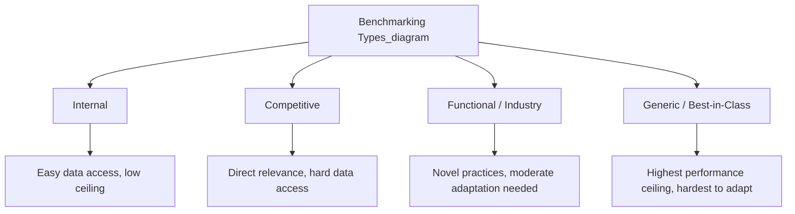
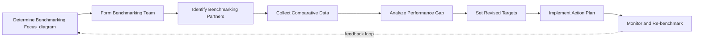

## Benchmarking Techniques

### Definition and Strategic Purpose

Benchmarking is the systematic process of comparing an organization's processes, practices, and performance metrics against those of other organizations — typically industry leaders or best-in-class performers regardless of industry — with the objective of identifying performance gaps and adopting superior practices. Within performance measurement and strategic control, benchmarking serves a specific diagnostic function that internal historical comparison cannot: it reveals not merely whether performance is improving relative to the firm's own past, but whether that improvement is sufficient relative to what is externally achievable.

Benchmarking directly supports strategic control by supplying external reference points against which KPI targets, strategic premises, and implementation milestones can be calibrated and validated. Without benchmarking, an organization risks setting targets that are internally reasonable but externally uncompetitive — the classic failure mode of "winning against yourself while losing to the market."

### Types of Benchmarking

**1. Internal Benchmarking**

Comparison of practices and performance across different units, divisions, or teams within the same organization.

- **Advantage**: Data access is straightforward, comparability is high (similar systems, culture, definitions), and organizational resistance to adoption is typically lower
- **Limitation**: Improvement ceiling is bounded by the best internal performer; if no internal unit is truly excellent, internal benchmarking cannot reveal that ceiling itself is too low
- **Example**: A multinational retailer comparing inventory turnover rates across its regional divisions to identify and propagate the practices of its highest-performing region

**2. Competitive Benchmarking**

Direct comparison against direct industry competitors on metrics relevant to competitive positioning.

- **Advantage**: Directly relevant to competitive strategy; reveals genuine competitive gaps
- **Limitation**: Data access is difficult, since competitors have no incentive to share detailed operational data; often relies on public financial disclosures, industry reports, reverse engineering, or third-party benchmarking services
- **Example**: An automobile manufacturer benchmarking its manufacturing cycle time and defect rates against a named direct competitor using published quality reports and industry association data

**3. Functional/Industry Benchmarking**

Comparison against organizations that perform the same function but operate in different (often non-competing) industries.

- **Advantage**: Access to comparative data is generally easier since there is no direct competitive threat; can reveal genuinely novel practices not present anywhere in the home industry
- **Limitation**: Requires careful adaptation, since practices proven in one industry context may not transfer directly due to differing constraints
- **Example**: A hospital benchmarking its patient intake and processing workflow against airline check-in and boarding processes — a widely cited real-world case of functional benchmarking improving healthcare logistics

**4. Generic/Best-in-Class Benchmarking**

Comparison against the recognized best performer of a specific process across any industry, without regard to functional similarity.

- **Advantage**: Targets the theoretical performance ceiling for a given process type
- **Limitation**: Highest degree of context translation required; risk of adopting practices unsuited to the organization's actual operating constraints
- **Example**: Benchmarking a company's order fulfillment and logistics process against Amazon's distribution network, even when operating in an entirely unrelated industry

### The Benchmarking Process

A structured benchmarking initiative typically follows a defined sequence, commonly summarized in variations of the following stages:

1. **Determine what to benchmark**: Identify the specific process, function, or metric that is strategically significant and where a performance gap is suspected (e.g., order-to-delivery cycle time rather than a vague target like "logistics performance")
2. **Form the benchmarking team**: Assemble cross-functional representation including process owners who will be responsible for implementing changes
3. **Identify benchmarking partners**: Select comparison organizations appropriate to the benchmarking type chosen (internal units, direct competitors, functional analogues, or best-in-class exemplars)
4. **Collect data**: Gather comparative data through public sources, industry consortia, benchmarking clearinghouses, site visits, surveys, or reciprocal data-sharing arrangements
5. **Analyze the performance gap**: Quantify the difference between current performance and the benchmark, and diagnose the underlying process or capability differences driving the gap
6. **Set target performance levels**: Establish revised targets informed by benchmark data, typically calibrated to close the gap over a defined timeframe rather than instantaneously matching the benchmark
7. **Develop and implement action plans**: Translate identified best practices into an adapted implementation plan suited to the organization's own context and constraints
8. **Monitor progress and recalibrate**: Track implementation against the revised targets and periodically re-benchmark, since the external benchmark itself continues to move

### Metrics Commonly Subject to Benchmarking

- **Financial**: Return on invested capital, operating margin, cost-per-unit, revenue per employee
- **Operational**: Cycle time, defect/error rate, capacity utilization, on-time delivery rate
- **Customer**: Net Promoter Score, customer retention rate, first-contact resolution rate
- **Innovation**: R&D spend as a percentage of revenue, time-to-market for new products, percentage of revenue from products launched within the last three years
- **Human capital**: Employee turnover rate, revenue per employee, training investment per employee

### Gap Analysis as the Core Analytical Output

The central analytical output of benchmarking is a **performance gap**, typically expressed in one of three forms:

- **Positive gap**: The organization outperforms the benchmark (a competitive strength worth protecting and potentially leveraging further)
- **Negative gap**: The organization underperforms the benchmark (a candidate area for targeted improvement investment)
- **Parity**: Performance is roughly equivalent (may still warrant monitoring if the benchmark's trajectory is improving faster than the organization's own)

A rigorous gap analysis distinguishes not just the size of the gap but its underlying **cause category**, since different causes require different remediation strategies:

- **Process gap**: The benchmark organization uses a fundamentally different, more efficient process design
- **Resource/capability gap**: The organization lacks a specific technology, skill set, or asset the benchmark possesses
- **Scale gap**: Performance differences driven by economies of scale not readily replicable
- **Strategic choice gap**: The benchmark's performance stems from a genuinely different strategic positioning (e.g., accepting lower margins for higher volume) that may not be desirable to replicate

**Example**

If Company A finds its manufacturing defect rate is triple that of a benchmarked competitor, gap analysis should determine whether this stems from process design (competitor uses statistical process control the organization has not adopted), technology (competitor has invested in automated inspection systems), or scale (competitor's higher volume enables tighter process control economics) — each diagnosis leads to a different corrective investment.

### Limitations and Risks of Benchmarking

- **Backward-looking orientation**: Benchmarking measures current or historical best practice; it can encourage organizations to chase where competitors currently are rather than anticipate where the industry is heading, potentially reinforcing incremental rather than transformative strategic thinking.
- **Context transfer risk**: Practices that succeed in one organizational, cultural, or regulatory context frequently fail to transfer without substantial adaptation; naive direct replication ("cargo cult" adoption of surface practices without understanding underlying enablers) is a common implementation failure.
- **Data comparability problems**: Differing accounting standards, definitions, and measurement methodologies across organizations can produce misleading comparisons if not carefully normalized.
- **Complacency at parity**: Reaching benchmark parity can create a false sense of strategic security if the benchmark itself is not the true performance frontier or is improving faster than the organization's own rate of change.
- **Legal and ethical constraints on competitive data collection**: Competitive benchmarking must avoid practices that could constitute anticompetitive information sharing (e.g., direct price-fixing communication) or misappropriation of trade secrets; benchmarking should rely on legitimately obtained public or consensually shared data.
- **Resource intensity**: Rigorous benchmarking, particularly competitive and generic benchmarking, requires meaningful time and analytical investment; poorly resourced efforts tend to produce superficial comparisons of limited strategic value.

[Inference] The tension between benchmarking's diagnostic value and its inherently backward-looking nature is a recurring theme in strategic management literature; the generally recommended practice is to pair benchmarking with forward-looking tools such as scenario planning or trend analysis so that strategic targets are informed by both current best practice and anticipated future requirements, rather than relying on benchmarking in isolation.

### Benchmarking Data Sources

- Published financial statements and annual reports (for competitive and financial benchmarking)
- Industry associations and trade groups that aggregate anonymized member data
- Third-party benchmarking consortia and clearinghouses (organizations that collect standardized data across member firms under confidentiality agreements)
- Management consulting firm proprietary databases
- Site visits and reciprocal data-sharing agreements (common in functional and generic benchmarking, where non-competing organizations have mutual incentive to share)
- Government and regulatory statistical publications (for industry-wide operational and economic benchmarks)
- Academic and industry research reports

### Related Topics

- Balanced Scorecard integration of benchmark-informed targets
- Key Performance Indicators and target-setting methodology
- Total Quality Management (TQM) and continuous improvement (Kaizen)
- Value chain analysis as a complement to benchmarking
- Competitive intelligence gathering methods
- Six Sigma and statistical process control
- Best practice transfer and organizational learning
- Strategic control systems and premise validation