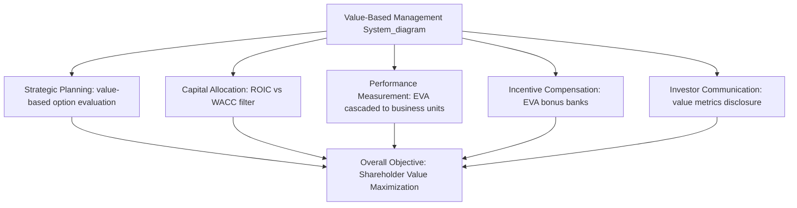

## Economic Value Added and Value-Based Management

### Definition and Conceptual Foundation

Economic Value Added (EVA) is a financial performance metric that measures the economic profit generated by an organization after accounting for the full cost of all capital employed — both debt and equity. It was developed and trademarked by the consulting firm Stern Stewart & Co. and popularized in the 1990s as a corrective to conventional accounting profit measures, which subtract the cost of debt (interest expense) but ignore the opportunity cost of equity capital entirely.

The foundational insight behind EVA is that a business is not genuinely creating value unless it earns a return exceeding the *total* cost of the capital invested in it. A firm can report positive accounting net income while still destroying shareholder value, if that income is insufficient to compensate equity holders for the risk-adjusted return they could have earned elsewhere.

Value-Based Management (VBM) is the broader managerial philosophy and system of practices — of which EVA is the most prominent implementation — that orients all strategic decision-making, performance measurement, and incentive design around the objective of maximizing shareholder value creation, rather than accounting-based proxies such as earnings per share or accounting return on equity.

### The EVA Formula

$$EVA = NOPAT - (WACC \times InvestedCapital)$$

Where:

- $NOPAT$ = Net Operating Profit After Tax
- $WACC$ = Weighted Average Cost of Capital
- $InvestedCapital$ = Total capital employed in operations (debt plus equity, adjusted for certain accounting distortions)

An equivalent and often more intuitive reformulation:

$$EVA = (ROIC - WACC) \times InvestedCapital$$

Where $ROIC$ is Return on Invested Capital. This form makes explicit that EVA is positive only when the return earned on invested capital exceeds the cost of that capital — the excess return, or **economic spread**, multiplied by the capital base, yields the absolute dollar value created.

**Example**

A business unit with $100 million in invested capital, a WACC of 9%, and an ROIC of 13% generates:

$$EVA = (0.13 - 0.09) \times \$100,000,000 = \$4,000,000$$

This $4 million represents genuine economic value created above and beyond compensating all capital providers for their risk-adjusted opportunity cost — a result that a conventional net income figure alone would not reveal.

### NOPAT and Invested Capital: Accounting Adjustments

A distinguishing feature of the EVA methodology is that both NOPAT and Invested Capital are typically calculated with a series of adjustments to standard GAAP/IFRS accounting figures, intended to convert accounting profit into a closer approximation of true economic profit. Stern Stewart's original methodology identified over 150 potential adjustments, though most practical implementations use a much smaller subset (commonly 5–15) selected for materiality.

Common adjustments include:

- **Capitalizing R&D and major marketing/training expenditures**: Rather than expensing these items in the period incurred (as standard accounting requires), they are capitalized and amortized over their expected useful economic life, on the reasoning that they generate value across future periods, not solely the current one.
- **Operating lease adjustments**: Converting operating leases to a capitalized asset/liability basis so that leased assets are reflected in Invested Capital rather than being treated as a pure operating expense (though this adjustment has become less consequential following lease accounting standard changes, e.g., ASC 842 / IFRS 16, which already bring most leases onto the balance sheet).
- **LIFO reserve adjustments**: Adjusting inventory valuation to remove distortions from LIFO accounting relative to economic replacement cost.
- **Goodwill treatment**: Adding back accumulated goodwill amortization/impairment in certain formulations, since goodwill write-offs are viewed as non-cash accounting events not reflective of current operating economics.
- **Deferred tax adjustments**: Converting deferred tax accounting entries to a cash-tax basis to better reflect actual cash tax obligations.

[Inference] The specific set and magnitude of adjustments applied varies considerably by implementation and by the specific consulting methodology used; there is no single universally standardized adjustment list, and firms adopting EVA internally often simplify the original Stern Stewart framework to the handful of adjustments most material to their specific industry and capital structure.

### Weighted Average Cost of Capital (WACC)

WACC represents the blended, risk-adjusted required return demanded by all providers of capital (both debt and equity holders), weighted by their respective proportions in the capital structure:

$$WACC = \left(\frac{E}{V}\right) \times R_e + \left(\frac{D}{V}\right) \times R_d \times (1 - T_c)$$

Where:

- $E$ = market value of equity
- $D$ = market value of debt
- $V = E + D$ (total capital)
- $R_e$ = cost of equity (commonly estimated via the Capital Asset Pricing Model)
- $R_d$ = cost of debt (pre-tax)
- $T_c$ = corporate tax rate

The cost of equity, $R_e$, is frequently estimated using the **Capital Asset Pricing Model (CAPM)**:

$$R_e = R_f + \beta \times (R_m - R_f)$$

Where $R_f$ is the risk-free rate, $\beta$ is the equity's systematic risk relative to the market, and $(R_m - R_f)$ is the equity market risk premium.

The explicit inclusion of the cost of equity is the central methodological distinction between EVA and conventional accounting profit: interest expense on debt already reduces accounting net income, but no equivalent charge for equity capital exists in standard financial statements. EVA closes this gap.

### EVA vs. Traditional Performance Metrics

| Metric | Accounts for Cost of Debt | Accounts for Cost of Equity | Time Horizon Bias | Manipulability |
| --- | --- | --- | --- | --- |
| Net Income | Yes | No | Short-term (accounting period) | Moderate (accrual choices) |
| Earnings Per Share (EPS) | Yes | No | Short-term | High (share buybacks can inflate) |
| Return on Equity (ROE) | Yes (indirectly) | No (measures against equity, not cost of equity) | Short-term | High (leverage-inflatable) |
| Return on Invested Capital (ROIC) | N/A (relative measure) | N/A (relative measure) | Short-term | Moderate |
| EVA | Yes | Yes | Can be short-term, though often paired with MVA for long-term view | Moderate (adjustments reduce some accounting manipulation) |

A key limitation ROE illustrates clearly: ROE can be inflated purely through increased financial leverage (more debt relative to equity) without any genuine improvement in underlying operating performance — a firm can report a rising ROE while its EVA deteriorates because the added leverage increases financial risk and thus WACC. EVA is specifically designed to be resistant to this form of leverage-driven metric inflation, since increased debt raises the capital charge base and typically the cost of capital as well.

### Market Value Added (MVA)

Market Value Added is a related metric that measures the cumulative value the market believes the firm will create, calculated as:

$$MVA = MarketValue_{(Debt+Equity)} - InvestedCapital$$

MVA represents the present value of the market's expectation of all future EVA the firm will generate, and is generally interpreted as the definitive external market verdict on management's value-creation track record, whereas EVA is the internal, single-period operating measure. A firm can show consistently positive current EVA while nonetheless having negative or declining MVA if the market anticipates deteriorating future performance, illustrating that EVA is inherently backward/current-looking while MVA reflects forward market expectations.

### Value-Based Management as an Organizational System

VBM extends beyond EVA as a measurement metric into a comprehensive management philosophy encompassing:

**1. Strategic Planning Integration**

Strategic alternatives are evaluated and ranked based on their projected contribution to value creation (typically discounted cash flow or EVA-based valuation) rather than accounting metrics like projected revenue growth or market share alone, which can be pursued in value-destructive ways (e.g., growth financed by returns below the cost of capital).

**2. Capital Allocation Discipline**

Capital budgeting decisions (which projects, business units, or acquisitions receive investment) are filtered through value-creation criteria — specifically, whether a proposed investment's expected ROIC exceeds WACC — rather than simpler payback-period or accounting-profit criteria that ignore the capital charge.

**3. Performance Measurement Cascading**

EVA or related value metrics are decomposed and cascaded down through the organization to business-unit and even individual-manager levels, so that managers throughout the hierarchy are evaluated against value-creation criteria consistent with the overall corporate objective, rather than potentially conflicting divisional metrics.

**4. Incentive Compensation Alignment**

Executive and manager compensation is tied directly to EVA improvement (often via **EVA bonus banks**, where a portion of bonus is held back and subject to clawback in future periods of poor performance, discouraging short-term EVA manipulation at the expense of long-term value).

**5. Investor Communication**

Value-based metrics are used in external communication with capital markets and investors, aiming to align market expectations and internal management incentives around a common measurement framework.

### Strategic Applications of EVA

- **Business unit performance comparison**: EVA enables comparison of business units with fundamentally different capital intensities on a common, capital-charge-adjusted basis, whereas raw profit comparisons would unfairly favor capital-light units.
- **Portfolio strategy and resource reallocation**: Corporate strategists can use EVA to identify which business units in a diversified portfolio are net value creators versus net value destroyers, informing divestiture, harvest, or investment decisions — closely related to portfolio planning tools like the BCG matrix, but grounded in an explicit capital-charge calculation rather than growth/share positioning alone.
- **M&A evaluation**: Acquisition targets can be assessed on whether the acquirer can realistically improve the target's ROIC above the target's WACC by more than the acquisition premium paid, providing discipline against overpayment driven by strategic enthusiasm alone.
- **Strategic control premise validation**: Sustained EVA improvement or deterioration serves as a strategic control signal, complementing premise control and implementation control by providing an integrated, capital-adjusted verdict on whether the strategy is genuinely creating economic value, not just accounting profit.

### Criticisms and Limitations of EVA and VBM

- **Complexity and adjustment subjectivity**: The extensive (and somewhat discretionary) accounting adjustments required to calculate "true" NOPAT and Invested Capital reduce transparency and comparability, and can themselves become a source of manipulation or disagreement.
- **Short-termism risk despite intent**: Although EVA was designed partly to counter short-termism inherent in accounting profit metrics, single-period EVA can still incentivize managers to underinvest in long-payback strategic initiatives (e.g., R&D, brand building) that reduce current-period EVA but create substantial long-term value — a criticism EVA bonus banks and MVA-based long-term incentives attempt to mitigate.
- **WACC estimation sensitivity**: EVA results are highly sensitive to the WACC estimate used, particularly the cost of equity derived from CAPM, which depends on inherently uncertain inputs (beta estimation, equity risk premium) that can vary meaningfully depending on methodology and time period chosen.
- **Difficulty in capital-light or intangible-intensive businesses**: Firms with substantial intangible value not fully captured on the balance sheet (e.g., software, brand-driven businesses) can produce EVA figures that inadequately reflect true economic performance unless significant additional adjustments are made.
- **Implementation and change management burden**: Full VBM implementation requires substantial changes to planning processes, management information systems, and compensation structures — a significant organizational change effort that can face internal resistance, particularly from managers whose historical performance appears less favorable under an EVA lens than under prior metrics.

[Inference] The degree to which EVA-based compensation genuinely improves long-run shareholder value creation, as opposed to simply redistributing which specific managerial behaviors are incentivized, has been debated in the finance and strategy literature; empirical findings on this question vary by study design, time period, and industry context, and are not treated here as a settled, universal conclusion.

### Related Topics

- Return on Invested Capital (ROIC) and its decomposition
- Discounted cash flow (DCF) valuation and strategic decision-making
- Weighted Average Cost of Capital (WACC) estimation methodologies
- Capital Asset Pricing Model (CAPM)
- Balanced Scorecard as a complementary non-financial measurement framework
- BCG Growth-Share Matrix and portfolio strategy
- Executive compensation design and pay-for-performance structures
- Mergers and acquisitions valuation and premium assessment
- Agency theory and the separation of ownership and control