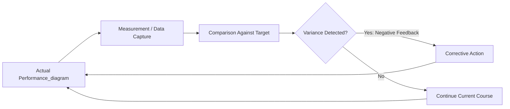
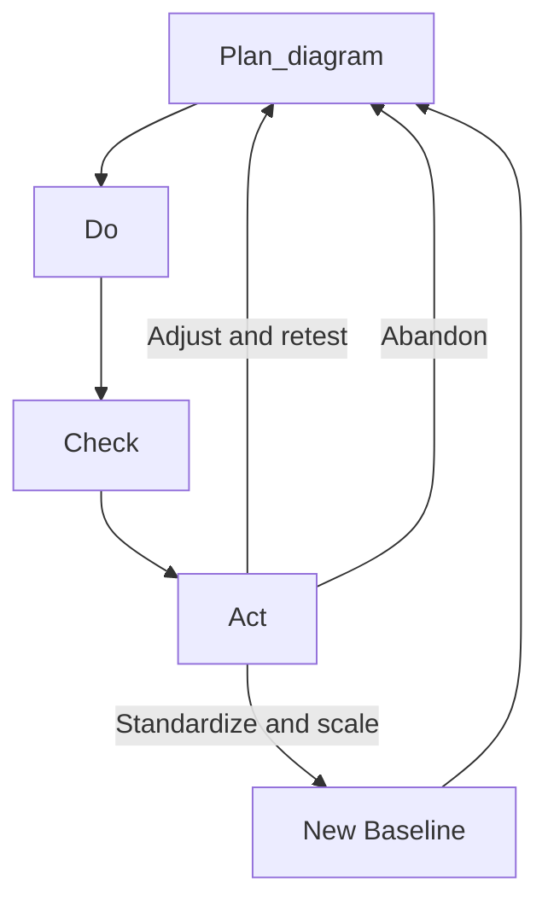
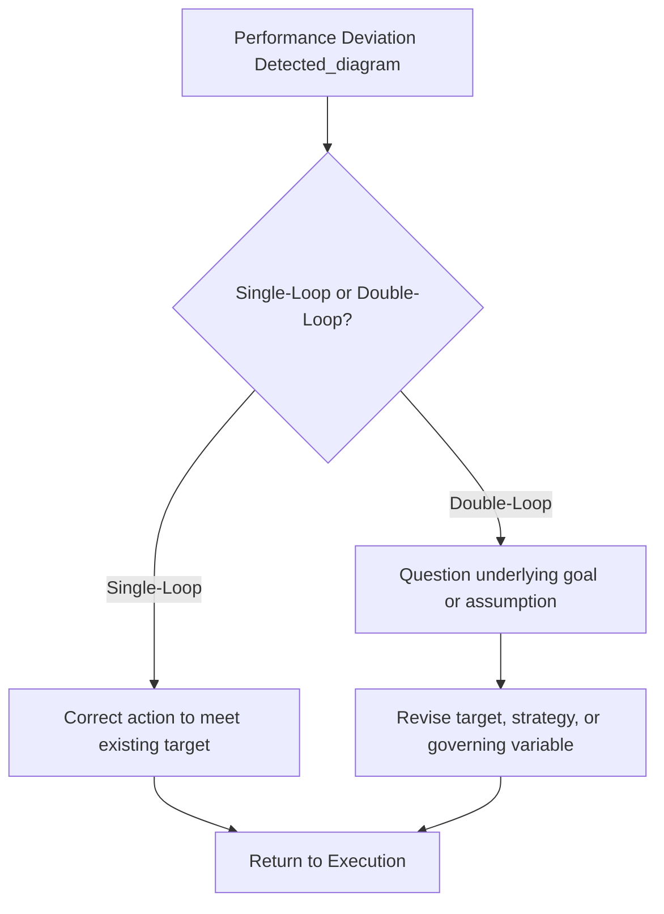

## Continuous Improvement and Feedback Loops

### Definition and Strategic Role

Continuous improvement is the ongoing, incremental effort to enhance products, processes, services, and organizational capabilities in a systematic, iterative manner, rather than through infrequent, large-scale transformation initiatives alone. Feedback loops are the structural mechanisms — informational and procedural — through which performance data is captured, returned to decision-makers, and used to inform the next cycle of action, making continuous improvement operationally possible.

Within performance measurement and strategic control, continuous improvement and feedback loops constitute the connective tissue linking measurement (KPIs, benchmarking, EVA) and control (strategic control systems, audits) to actual behavioral and process change. A measurement system that generates accurate data but lacks functioning feedback loops produces awareness without adaptation; strategic control is only completed when performance information demonstrably alters subsequent decisions and actions.

### The Feedback Loop as a Systems Concept

A feedback loop, in general systems and cybernetics terms, is a structure in which the output of a process is measured and returned as an input that influences the process's future behavior. Two fundamental types exist:

- **Negative (balancing) feedback loops**: Act to reduce deviation from a target state, stabilizing performance around a desired setpoint. Most strategic control mechanisms (variance analysis against budget, corrective action after KPI shortfalls) are negative feedback loops by design — they exist to pull performance back toward the planned trajectory.
- **Positive (reinforcing) feedback loops**: Amplify a trend in a given direction, whether beneficial or harmful. Positive feedback loops are strategically significant both as sources of virtuous cycles (e.g., network effects, where user growth improves product value, which drives further user growth) and as sources of vicious cycles (e.g., declining quality reducing customer trust, which reduces revenue available to invest in quality, further declining quality).

### The PDCA / Deming Cycle

The most widely used structured framework for continuous improvement is the **Plan-Do-Check-Act (PDCA) cycle**, associated with W. Edwards Deming and foundational to Total Quality Management.

- **Plan**: Identify an improvement opportunity (often surfaced through KPI variance or benchmarking gap analysis) and design a change intended to address it, including a hypothesis about expected impact.
- **Do**: Implement the planned change, typically on a small or pilot scale to limit risk before full deployment.
- **Check**: Measure the results of the pilot against the original hypothesis and pre-change baseline, using the same KPI and measurement infrastructure that informed the original planning.
- **Act**: Based on the check results, standardize and scale the change if successful, adjust and re-test if partially successful, or abandon the change and return to planning if unsuccessful.

The cycle then repeats, with each iteration's "Act" findings feeding directly into the next cycle's "Plan" stage — the defining characteristic that makes PDCA a genuine continuous loop rather than a one-time linear improvement project.

**Example**

A logistics firm's KPI dashboard reveals a persistent gap in on-time delivery rate relative to a benchmarked competitor. **Plan**: hypothesize that route optimization software will close the gap. **Do**: pilot the software in one regional depot. **Check**: measure on-time delivery rate in the pilot depot against the pre-change baseline and the benchmark target. **Act**: if the pilot closes the gap meaningfully, roll out the software company-wide; if not, diagnose why (e.g., driver adoption issues) and redesign the intervention.

### Kaizen and the Continuous Improvement Philosophy

**Kaizen** (Japanese for "change for better") is the broader organizational philosophy, originating from Japanese manufacturing practice (notably the Toyota Production System), that continuous, incremental improvement — driven by employees at all levels, not only specialists or management — is a more sustainable source of long-term competitive advantage than periodic, large-scale change initiatives alone.

Key principles distinguishing Kaizen-based continuous improvement from ad hoc improvement efforts:

- **Frontline employee involvement**: Employees closest to a process are treated as the primary source of improvement ideas, since they possess direct, granular knowledge of process friction points that management-level analysis may miss.
- **Small, frequent changes over large, infrequent changes**: Kaizen favors numerous small experiments with low individual risk over rare, high-risk transformation projects, on the reasoning that small changes are easier to test, reverse, and compound over time.
- **Standardization as a precondition for improvement**: A process must first be standardized before genuine improvement can be measured and sustained; without a stable baseline, it is difficult to attribute performance changes to a specific intervention rather than random process variation.
- **Waste elimination (Muda)**: Systematic identification and elimination of non-value-adding activity, commonly categorized into forms such as overproduction, waiting, unnecessary transport, over-processing, excess inventory, unnecessary motion, and defects.

### Types of Organizational Feedback Loops in Strategic Control

Building on the general feedback loop concept, several specific feedback loop structures operate within organizational performance measurement:

**1. Single-Loop Learning**

Detects and corrects deviations from an existing target or standard without questioning the underlying assumptions, goals, or strategy that produced that standard. Analogous to a thermostat: it corrects temperature deviations from a setpoint without questioning whether the setpoint itself is correct.

- **Example**: A sales team missing its quarterly quota triggers additional sales training and incentive adjustments to close the gap against the existing quota — the quota itself, and the strategy underlying it, is not reconsidered.

**2. Double-Loop Learning**

Goes further by questioning and potentially revising the underlying goals, assumptions, or governing strategic variables themselves, not merely correcting performance against them. This concept, developed by Chris Argyris, is directly analogous to premise control within strategic control systems — both involve testing the validity of the assumptions behind a target, not simply the achievement of the target.

- **Example**: Persistent sales quota shortfalls across an entire market segment, despite repeated single-loop corrective actions, prompting a reassessment of whether the underlying market entry strategy or product-market fit assumption itself is flawed — not merely whether the sales team is executing adequately against it.

**3. Real-Time / Operational Feedback Loops**

High-frequency feedback loops embedded directly into operational systems (e.g., real-time production quality dashboards, live customer satisfaction pulse surveys) that enable near-immediate corrective action, distinct from periodic (monthly/quarterly) management reporting cycles.

**4. Periodic Management Review Loops**

Lower-frequency, higher-synthesis feedback loops — monthly operating reviews, quarterly business reviews, annual strategic audits — where accumulated performance data is synthesized into broader strategic and resource-allocation decisions rather than immediate operational corrections.

### Integrating Continuous Improvement with Strategic Control Systems

Continuous improvement and feedback loops connect directly to the broader strategic control architecture:

- **Implementation control feeds single-loop learning**: Milestone and execution variance data primarily drives corrective, single-loop adjustments to keep implementation on track against existing plans.
- **Premise control and strategic surveillance feed double-loop learning**: When these mechanisms reveal that underlying strategic assumptions have shifted, the appropriate response is not merely tighter execution but reconsideration of the strategy itself.
- **KPI systems supply the raw data for both loop types**: Well-designed KPI dashboards (see Balanced Scorecard architecture) must support both rapid single-loop operational correction and periodic synthesis for double-loop strategic reassessment.
- **Benchmarking supplies external calibration for feedback loop targets**: Feedback loops that only compare current performance to the organization's own historical baseline risk optimizing toward an internally satisfactory but externally uncompetitive standard; benchmarking provides the external reference point against which "improvement" is genuinely validated.

### Common Failure Modes in Continuous Improvement Systems

- **Loop closure failure**: Data is collected and reported, but no formal mechanism exists to ensure that reported variances actually result in a decision or action — a feedback loop that captures information but does not close the cycle back into behavior change is not functioning as a true loop.
- **Single-loop lock-in**: Organizations become highly proficient at single-loop correction (hitting existing targets more efficiently) while systematically failing to trigger the double-loop reassessment needed when the targets themselves have become strategically obsolete.
- **Metric fixation over genuine improvement**: Continuous improvement efforts narrowly targeting a specific KPI can produce local optimization that does not translate into genuine strategic value, particularly if the KPI can be improved through means other than the intended underlying process improvement (see the goal displacement risk discussed under Key Performance Indicators).
- **Improvement fatigue**: Excessive frequency or volume of small-scale change initiatives, without adequate consolidation and standardization between cycles, can create organizational fatigue and inconsistent process execution.
- **Insufficient psychological safety**: Genuine continuous improvement depends on frontline employees surfacing problems and failures candidly; organizational cultures that punish the reporting of defects or shortfalls suppress the very information the feedback loop requires to function.
- **Delayed feedback timing**: Feedback that arrives too long after the action it should inform (e.g., annual performance reviews as the sole feedback mechanism for daily operational decisions) substantially weakens the loop's capacity to drive timely correction.

[Inference] The relative organizational emphasis warranted between rapid, frequent single-loop operational feedback and periodic, deeper double-loop strategic reassessment is generally understood in the strategic management literature to depend on environmental volatility — in fast-changing environments, underinvestment in double-loop mechanisms carries a greater strategic risk than in more stable environments. This represents a widely-held contingency perspective rather than a fixed, universally quantified guideline.

### Related Topics

- Total Quality Management (TQM) and Six Sigma methodologies
- Toyota Production System and Lean management principles
- Organizational learning theory (Chris Argyris, Peter Senge)
- Strategic control systems: premise, implementation, surveillance, special alert control
- Key Performance Indicators and goal displacement risk
- Benchmarking techniques and external performance calibration
- Psychological safety and organizational culture in performance management
- Balanced Scorecard cascading and review cadence design