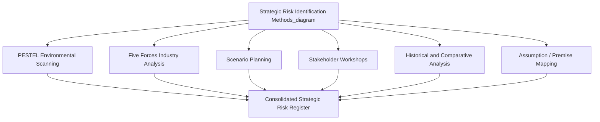
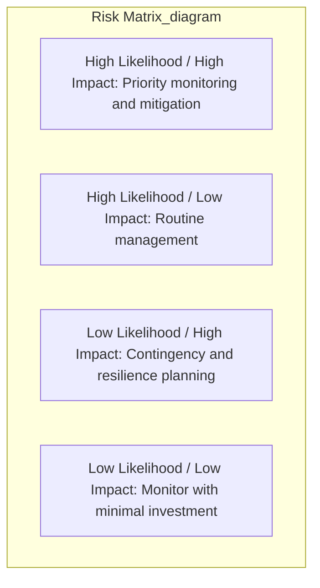

## Identifying and Categorizing Strategic Risks

### Definition and Strategic Importance

Strategic risk is the exposure an organization faces to events or conditions that could impair its ability to achieve its strategic objectives, or that could render its current strategy invalid entirely. Strategic risk is distinguished from operational, financial, and compliance risk primarily by its scope and time horizon: while operational risk concerns process-level failures and financial risk concerns capital and market exposures, strategic risk concerns threats to the fundamental viability and competitive positioning of the strategy itself.

Identifying and categorizing strategic risk is a prerequisite activity for strategic risk management and organizational resilience: an organization cannot design appropriate mitigation, monitoring, or contingency mechanisms for risks it has not first systematically identified and classified. This activity connects directly to strategic control systems — particularly premise control and strategic surveillance — since a well-constructed risk taxonomy identifies precisely which assumptions and environmental signals those control mechanisms should be monitoring.

### Distinguishing Strategic Risk from Other Risk Categories

| Risk Category | Definition | Time Horizon | Example |
| --- | --- | --- | --- |
| Strategic Risk | Threats to overall strategy validity and competitive position | Long-term | Disruptive technology substitution |
| Operational Risk | Failures in internal processes, systems, or people | Short-to-medium term | Production line equipment failure |
| Financial Risk | Exposure to market, credit, liquidity, or currency fluctuations | Variable | Interest rate exposure on variable-rate debt |
| Compliance/Legal Risk | Exposure to regulatory violation or legal liability | Variable | Non-compliance with data privacy regulation |
| Reputational Risk | Damage to brand or stakeholder trust | Can be sudden or cumulative | Product safety scandal |

In practice these categories overlap and interact: a compliance failure can escalate into a strategic risk if it invalidates a core business model (e.g., a regulatory ban on a product category central to the firm's strategy), illustrating that strategic risk categorization must consider not only risks that are strategic in origin, but also risks in other categories with sufficient magnitude to become strategic in consequence.

### Strategic Risk Identification Methods

**1. Environmental Scanning and PESTEL Analysis**

Systematic scanning of the Political, Economic, Social, Technological, Environmental, and Legal macro-environment to identify emerging conditions that could threaten the current strategy. This overlaps directly with the external environment component of strategic auditing and the strategic surveillance function of strategic control systems.

**2. Industry Structure Analysis (Porter's Five Forces)**

Reviewing shifts in competitive rivalry, buyer/supplier power, threat of substitutes, and barriers to entry to identify structural industry risks — for example, declining barriers to entry signaling rising new-entrant risk, or increasing buyer concentration signaling rising margin-compression risk.

**3. Scenario Planning**

Constructing multiple plausible future states of the environment (not single-point forecasts) to surface risks that may not be visible under a single expected-case assumption. Scenario planning is particularly effective at identifying risks arising from the interaction of multiple uncertain variables, which single-variable premise monitoring can miss.

**4. Stakeholder Consultation and Cross-Functional Workshops**

Structured risk identification workshops drawing on functional experts (sales, operations, R&D, finance, legal) and external stakeholders (customers, suppliers, industry advisors), since different organizational vantage points surface different categories of risk exposure that a single centralized risk function may not independently identify.

**5. Historical and Comparative Analysis**

Reviewing the organization's own risk event history, near-misses, and the risk events experienced by industry peers and comparable organizations (including cross-industry analogues) to identify recurring or previously underestimated risk patterns.

**6. Assumption and Premise Mapping**

Explicitly documenting the assumptions underlying the current strategy (directly linked to premise control) and systematically stress-testing each for plausibility of failure, likelihood, and potential impact magnitude.

### Categorization Frameworks for Strategic Risk

**By Source (Origin-Based Categorization)**

- **Competitive risk**: New entrants, aggressive competitor moves, substitute products/services, price wars
- **Technological/disruption risk**: Emerging technologies that could obsolete the current business model or value proposition
- **Market/demand risk**: Shifts in customer preferences, demographic change, demand volatility
- **Regulatory/political risk**: Changes in law, regulation, trade policy, or political stability affecting the operating environment
- **Macroeconomic risk**: Interest rate shifts, currency fluctuation, inflation, recession exposure
- **Reputational/stakeholder risk**: Erosion of trust among customers, investors, employees, or communities
- **Organizational/execution risk**: Internal capability gaps, leadership transition risk, culture misalignment with strategic direction
- **Supply chain/partner risk**: Dependency on key suppliers, partners, or distribution channels whose failure could disrupt strategy execution
- **Environmental/climate risk**: Physical climate impacts and transition risks associated with shifting toward lower-carbon operating models
- **Cybersecurity and data risk**: Exposure to breaches, system compromise, or data misuse with strategic-level consequences (e.g., loss of intellectual property central to competitive advantage)

**By Impact Nature**

- **Preventable risk**: Internal risks arising from operational or compliance breakdowns that offer no strategic upside and should be minimized through control systems (e.g., fraud, safety violations)
- **Strategy risk**: Risks voluntarily accepted in pursuit of superior returns, inherent to the chosen strategy itself (e.g., entering a new geographic market carries risk, but also the potential strategic upside that motivated the entry)
- **External/environmental risk**: Risks arising from events largely outside organizational control (e.g., natural disasters, macroeconomic shocks, geopolitical events)

This tripartite framework, associated with Robert Kaplan and Anette Mikes, is significant because it implies fundamentally different management approaches: preventable risks should be minimized through rules-based control systems, strategy risks should be actively managed through risk-informed strategic decision-making (accepting risk deliberately in exchange for expected return), and external risks require resilience and contingency planning rather than prevention, since they cannot be controlled directly.

**By Likelihood and Impact (Risk Matrix Approach)**

Strategic risks are commonly plotted on a two-dimensional matrix assessing:

- **Probability/likelihood**: The estimated chance the risk event occurs within a defined time horizon
- **Impact/severity**: The magnitude of strategic consequence if the risk materializes (often assessed across financial, reputational, operational, and strategic-positioning dimensions)

This categorization directly informs resource allocation for risk management: high-likelihood, high-impact risks warrant the most intensive monitoring and mitigation investment, while low-likelihood, high-impact risks (sometimes termed "tail risks") warrant contingency and resilience planning rather than prevention-focused investment, since their low probability makes prevention-focused resource allocation inefficient relative to the risk of occurrence.

**By Time Horizon**

- **Immediate/emerging risks**: Already visible and developing, requiring near-term monitoring and response (linked to special alert control)
- **Medium-term risks**: Identifiable trends likely to materialize within the current strategic planning cycle (linked to premise control)
- **Long-term/horizon risks**: Distant, high-uncertainty risks requiring longer-range scenario planning and strategic optionality rather than immediate mitigation (e.g., long-term climate transition risk, generational demographic shifts)

### The Strategic Risk Register

A strategic risk register is the formal documentation artifact consolidating identified risks into a structured, trackable format. A typical risk register entry includes:

| Field | Description |
| --- | --- |
| Risk ID | Unique identifier for tracking |
| Risk Description | Clear statement of the risk event and its potential strategic consequence |
| Category | Classification per the source-based or impact-based taxonomy |
| Likelihood | Qualitative or quantitative probability estimate |
| Impact | Qualitative or quantitative severity estimate across relevant dimensions |
| Risk Owner | Individual or function accountable for monitoring and response |
| Current Mitigation | Existing controls or mitigation measures in place |
| Residual Risk Level | Assessed risk level after accounting for existing mitigation |
| Trigger Indicators | Specific observable signals that would indicate the risk is materializing (linking directly to premise control variables) |
| Review Date | Scheduled reassessment date |

**Example**

A retail chain's strategic risk register might include an entry for "e-commerce disintermediation risk," categorized as competitive/technological risk, assessed as high likelihood and high impact, owned by the Chief Strategy Officer, with trigger indicators including quarterly e-commerce market share shifts within the category and foot traffic trend data, and mitigation measures including an omnichannel strategy investment already underway.

### Common Pitfalls in Strategic Risk Identification

- **Availability bias**: Overweighting risks that are vivid, recent, or easily recalled (e.g., a recently experienced supply chain disruption) while underweighting less salient but potentially more consequential risks.
- **Narrow framing / silo effects**: Risk identification conducted within functional or business-unit silos may miss cross-cutting strategic risks that only become visible when multiple functional perspectives are combined.
- **Premise blindness**: Failing to make strategic assumptions explicit in the first place, which prevents systematic testing of those assumptions for risk exposure — directly connecting risk identification quality to the rigor of premise control.
- **Underestimating interconnected/compounding risks**: Treating risks as independent when they may be correlated or capable of triggering cascading effects (e.g., a supply chain disruption triggering both operational risk and reputational risk simultaneously).
- **Static risk registers**: Producing a risk register once during a planning cycle and failing to update it as new information emerges through ongoing strategic surveillance, reducing its value as a living strategic control tool.
- **Groupthink in workshop-based identification**: Risk identification workshops dominated by senior voices or organizational consensus can suppress dissenting risk perspectives, particularly regarding risks that implicate current strategic choices championed by workshop participants themselves.

[Inference] The strategic management literature generally recommends combining multiple identification methods (environmental scanning, scenario planning, and structured stakeholder workshops) rather than relying on any single method, since each method has known blind spots that the others can partially compensate for; this represents an established best-practice recommendation rather than an empirically fixed formula for risk coverage completeness.

### Related Topics

- Strategic control systems (premise control and strategic surveillance)
- Scenario planning methodology
- Risk mitigation and organizational resilience strategies
- Business continuity and crisis management planning
- Porter's Five Forces and PESTEL analysis
- Enterprise Risk Management (ERM) frameworks (e.g., COSO ERM)
- Black swan events and tail-risk management
- Strategic audit and review processes