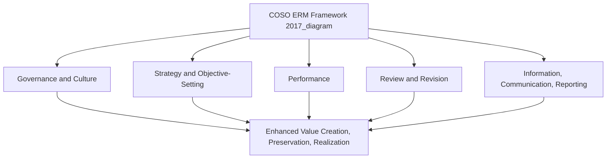
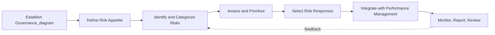

## Enterprise Risk Management Frameworks

### Definition and Purpose

Enterprise Risk Management (ERM) is an organization-wide, integrated approach to identifying, assessing, managing, and monitoring risk across all categories — strategic, operational, financial, and compliance — under a unified governance structure, rather than managing each risk category through isolated, siloed functions. ERM frameworks are the formal, structured methodologies that codify how this integration should be designed and operated.

The core conceptual advance ERM represents over earlier, fragmented risk management practice is the recognition that risks interact across categories and functions, and that an organization's aggregate risk exposure cannot be understood, let alone managed, by summing independently-assessed departmental risk silos. ERM frameworks provide the structural scaffolding — common risk language, consistent assessment methodology, integrated governance — needed to achieve this enterprise-wide view.

### The COSO ERM Framework

The most widely referenced ERM framework is published by the Committee of Sponsoring Organizations of the Treadway Commission (COSO). The current framework, *Enterprise Risk Management — Integrating with Strategy and Performance* (2017), explicitly repositioned ERM as integral to strategy-setting and performance management, rather than a separate compliance-oriented function — a significant shift from the original 2004 framework's more control-and-compliance-centric orientation.

The 2017 COSO ERM framework is organized around five interrelated components:

**1. Governance and Culture**

Establishes the tone at the top, organizational structures, and cultural values that determine how risk is discussed, escalated, and factored into decision-making. This component recognizes that even the most sophisticated risk assessment methodology fails if organizational culture discourages honest risk reporting or discounts risk considerations in favor of short-term performance pressure.

**2. Strategy and Objective-Setting**

Integrates risk consideration directly into the strategic planning process itself — evaluating the risk implications of strategic alternatives, understanding risk appetite in relation to strategic choice, and formulating objectives that reflect an explicit risk tolerance, rather than treating risk assessment as a separate exercise conducted after strategy has already been set.

**3. Performance**

Involves identifying and assessing risks that could affect strategy and business objective achievement, prioritizing risks by severity, and selecting risk responses — this component overlaps significantly with the risk identification and categorization activities (PESTEL scanning, Five Forces analysis, scenario planning, risk registers) and connects the ERM framework to ongoing performance measurement.

**4. Review and Revision**

Involves assessing substantial changes in the internal and external environment, reviewing risk and performance, and pursuing improvement in enterprise risk management — directly analogous to premise control and strategic surveillance within strategic control systems, ensuring the ERM system itself remains calibrated to a changing risk landscape.

**5. Information, Communication, and Reporting**

Establishes the information systems and communication channels necessary to capture and disseminate risk-relevant information both within the organization and to external stakeholders (investors, regulators, rating agencies).

The COSO 2017 framework further specifies 20 underlying principles distributed across the five components, providing a more granular operational checklist for implementation than the high-level component structure alone conveys. [Unverified — the exact current count and wording of individual principles should be confirmed against COSO's current published materials, as frameworks are periodically updated]

### ISO 31000

**ISO 31000** (*Risk Management — Guidelines*) is an international standard providing generic risk management principles and guidelines applicable across any organization type, industry, or risk category, in contrast to COSO ERM's somewhat more US-corporate-governance-oriented origin and framing.

ISO 31000 structures risk management around three core elements:

- **Principles**: Foundational characteristics risk management should exhibit (integrated, structured and comprehensive, customized, inclusive, dynamic, best available information, human and cultural factors, continual improvement)
- **Framework**: The organizational arrangements for designing, implementing, monitoring, reviewing, and continually improving risk management across the organization
- **Process**: The core operational risk management activities — communication and consultation, scope/context/criteria establishment, risk assessment (identification, analysis, evaluation), risk treatment, monitoring and review, and recording and reporting

A key distinguishing feature of ISO 31000 relative to COSO is its explicit framing of risk management as value-creating and integral to all organizational decision-making and governance, applicable at any organizational level, rather than a framework specifically scoped to enterprise-level strategic risk oversight.

### Comparing COSO ERM and ISO 31000

| Dimension | COSO ERM (2017) | ISO 31000 |
| --- | --- | --- |
| Origin | US-based, corporate governance/audit tradition | International standards body (ISO) |
| Primary Orientation | Integration of risk with strategy and performance | Generic risk management principles applicable to any context |
| Structure | Five components, twenty principles | Principles, framework, process |
| Typical Adopters | Large corporations, particularly US-listed and audit-committee-driven organizations | Broader international adoption across public and private sectors, diverse organization types |
| Certification | Not a certifiable standard | Not a certifiable standard (guidance document, unlike some other ISO management system standards) |

[Inference] In practice, many organizations do not adopt either framework in pure, unmodified form; hybrid approaches drawing selectively from both COSO ERM and ISO 31000 (and often industry-specific regulatory risk frameworks as well) are common, particularly in regulated industries such as financial services, where sector-specific regulatory risk frameworks may take precedence over either generic framework.

### Risk Appetite and Risk Tolerance

Central to any ERM framework is the formal articulation of:

- **Risk appetite**: The aggregate level and type of risk an organization is willing to accept in pursuit of its strategic objectives, typically approved at board level and expressed both qualitatively (a risk appetite statement) and, where feasible, quantitatively (e.g., maximum acceptable earnings volatility, capital-at-risk limits).
- **Risk tolerance**: The acceptable variation around specific objectives or metrics, operationalizing the broader risk appetite into measurable boundaries for specific risk categories or business units.
- **Risk capacity**: The maximum risk an organization is able to absorb given its financial resources and capabilities, which may differ from (and should bound) its stated risk appetite.

Risk appetite statements typically address multiple risk categories separately, since an organization's willingness to accept risk often differs meaningfully by category — a firm might have high strategic risk appetite (willing to pursue aggressive market expansion) alongside very low compliance risk appetite (zero tolerance for regulatory violations).

### The ERM Implementation Process

A structured ERM implementation, drawing on the common elements of major frameworks, typically follows this sequence:

1. **Establish governance structure**: Define board and management oversight roles, often including a dedicated risk committee and/or Chief Risk Officer (CRO) function
2. **Define risk appetite and tolerance**: Formally articulate the organization's risk appetite, ideally integrated with strategic planning rather than developed in isolation
3. **Identify and categorize risks**: Systematically identify risks across all categories using the methods and taxonomies used in strategic risk identification (PESTEL, Five Forces, scenario planning, stakeholder workshops)
4. **Assess and prioritize risks**: Evaluate likelihood and impact for each identified risk, often using a risk matrix or more quantitative risk-modeling techniques where feasible
5. **Select and implement risk responses**: For each material risk, select from the standard response categories — avoid, reduce/mitigate, transfer (e.g., insurance, hedging, contractual risk transfer), or accept
6. **Integrate with performance management**: Embed risk considerations into strategic planning, capital allocation, and performance measurement systems (connecting ERM directly to KPI design and strategic control systems)
7. **Monitor, report, and review**: Establish ongoing monitoring (dashboards, key risk indicators), regular reporting to governance bodies, and periodic reassessment of the overall ERM framework's effectiveness

### Risk Response Strategies

- **Avoid**: Exiting or declining to enter an activity that generates unacceptable risk exposure relative to expected return (e.g., declining to enter a market with regulatory or political risk exceeding the organization's risk appetite)
- **Reduce/Mitigate**: Implementing controls or process changes that lower the likelihood or impact of a risk without eliminating the underlying activity (e.g., diversifying a supplier base to reduce single-supplier dependency risk)
- **Transfer/Share**: Shifting some or all of the financial consequence of a risk to a third party, commonly through insurance, hedging instruments, or contractual risk-sharing arrangements (e.g., joint ventures that distribute market-entry risk across partners)
- **Accept**: Consciously retaining a risk without specific mitigating action, typically appropriate for risks within accepted risk appetite and tolerance, or where the cost of mitigation exceeds the expected value of the risk reduction

The choice among these responses should be explicitly informed by the risk categorization discussed under strategic risk identification — Kaplan and Mikes' distinction between preventable, strategy, and external risk is directly relevant here, since preventable risks are primarily addressed through reduction/mitigation controls, strategy risks are addressed through informed acceptance calibrated to expected strategic return, and external risks often require a combination of transfer and resilience-oriented acceptance.

### Key Risk Indicators (KRIs)

Analogous to Key Performance Indicators in performance measurement, **Key Risk Indicators** are metrics specifically selected to provide early warning of increasing risk exposure in a particular category, enabling proactive risk response before a risk event fully materializes.

**Example**

A bank's ERM framework might include KRIs such as loan portfolio concentration ratio (credit risk), employee turnover in critical control functions (operational risk), and the ratio of customer complaints to total transaction volume (reputational/conduct risk) — each providing a leading signal within its risk category, functioning analogously to premise control variables within the broader strategic control architecture.

### Governance Structures Supporting ERM

- **Board Risk Committee**: A board-level committee with dedicated oversight responsibility for the organization's aggregate risk profile and the effectiveness of the ERM framework
- **Chief Risk Officer (CRO)**: A senior executive role, common in financial services and increasingly in other regulated or risk-intensive industries, responsible for the design and operation of the ERM function
- **Three Lines Model** (previously "Three Lines of Defense"): A governance structure distinguishing (1) operational management, which owns and manages risk directly; (2) risk management and compliance functions, which provide oversight, challenge, and specialized risk expertise; and (3) internal audit, which provides independent assurance on the effectiveness of the first two lines
- **Risk culture integration**: Embedding risk consideration into performance evaluation and incentive structures across the organization, not confining risk responsibility to a specialized risk function alone

### Criticisms and Limitations of ERM Frameworks

- **Compliance-oriented implementation despite strategic intent**: Despite the 2017 COSO framework's explicit strategic integration intent, many organizations implement ERM primarily as a compliance and audit exercise, failing to achieve genuine integration with strategic decision-making.
- **False precision in risk quantification**: Risk matrices and scoring systems can create an appearance of analytical rigor that exceeds the genuine reliability of the underlying likelihood and impact estimates, particularly for novel or low-frequency strategic risks lacking robust historical data.
- **Framework fatigue and box-ticking**: Extensive principle checklists (such as COSO's twenty principles) can be implemented superficially, satisfying documentation requirements without producing genuine behavioral change in risk-aware decision-making.
- **Difficulty capturing genuinely novel or unprecedented risk**: ERM frameworks, particularly those relying heavily on historical risk categorization, can struggle to anticipate genuinely novel strategic risks with no close historical analogue (a limitation shared with strategic surveillance more broadly).
- **Risk appetite articulation challenges**: Translating a qualitative risk appetite statement into consistent, operational decision-making guidance across a large, decentralized organization is a persistent practical challenge.

[Inference] The empirical evidence on whether formal ERM adoption measurably improves risk-adjusted organizational performance is mixed across academic studies, with results varying by industry, implementation quality, and measurement methodology; this is presented as an open and debated question in the literature rather than a settled finding in either direction.

### Related Topics

- Identifying and categorizing strategic risks
- Strategic control systems (premise control and strategic surveillance)
- COSO Internal Control — Integrated Framework (the related but distinct internal controls framework)
- Corporate governance and board committee structures
- Scenario planning and stress testing
- Business continuity and crisis management planning
- Insurance and hedging as risk transfer mechanisms
- Organizational resilience and antifragility concepts