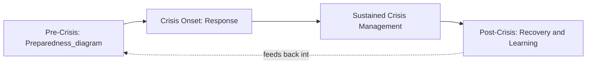
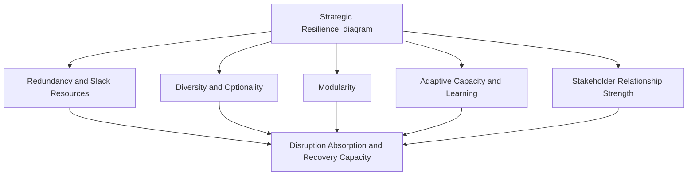

## Crisis Management and Strategic Resilience

### Definition and Strategic Distinction

Crisis management is the set of organizational processes, structures, and capabilities deployed to respond to sudden, high-impact, and typically unanticipated events that threaten the organization's viability, reputation, or ability to pursue its strategy. Strategic resilience is the broader, longer-term organizational capacity to anticipate, absorb, adapt to, and recover from disruption — encompassing not only the acute response to a specific crisis event but also the underlying organizational design characteristics that determine how well the organization withstands and rebounds from disruption generally.

The relationship between the two concepts is sequential and complementary: crisis management is the acute, event-triggered response capability, while resilience is the accumulated organizational capacity — built over time through deliberate design choices — that determines how effectively that acute response functions and how quickly the organization returns to (or exceeds) its pre-crisis strategic trajectory. This directly connects to special alert control within strategic control systems, which provides the triggering and escalation mechanism, while crisis management and resilience determine the substantive organizational response once triggered.

### The Crisis Lifecycle

Crisis management is commonly modeled across four sequential phases:

**1. Pre-Crisis / Prevention and Preparedness**

- Risk identification and scenario planning to anticipate plausible crisis triggers (directly linked to strategic risk identification and categorization)
- Development of crisis response plans, escalation protocols, and pre-designated crisis response teams
- Crisis simulation exercises and tabletop drills to test response readiness before an actual event
- Establishment of monitoring systems capable of detecting early warning signals (linking to strategic surveillance)

**2. Crisis Onset / Response**

- Activation of the special alert control mechanism and pre-established crisis response team
- Rapid situation assessment and fact-gathering under time pressure and incomplete information
- Initial stakeholder communication, often within hours of crisis recognition, to control the narrative before information vacuums are filled by external speculation
- Execution of the immediate operational response (containment, safety measures, service restoration)

**3. Crisis Management / Sustained Response**

- Ongoing coordinated management of the situation as it develops, including continued stakeholder communication, resource reallocation, and adjustment of the response as new information emerges
- Coordination across internal functions (legal, communications, operations, HR) and external parties (regulators, media, affected stakeholders)

**4. Post-Crisis / Recovery and Learning**

- Formal post-crisis review (often structured similarly to a strategic audit, but focused specifically on the crisis event and organizational response)
- Recovery planning to restore normal operations and rebuild affected stakeholder relationships and trust
- Incorporation of lessons learned into revised risk registers, updated crisis plans, and, where the crisis reveals fundamental premise invalidation, broader strategic reassessment

### Crisis Management Governance Structures

- **Crisis Management Team (CMT)**: A pre-designated, cross-functional senior team (typically including executive leadership, communications, legal, operations, and relevant subject-matter functions) with pre-defined roles and decision authority, activated upon crisis declaration
- **Incident Command Structure**: A clear, hierarchical decision-making structure adapted from emergency management practice, ensuring rapid decision-making authority is unambiguous during time-pressured crisis conditions rather than diffused across normal organizational hierarchy
- **Crisis Communication Protocols**: Pre-established templates, spokesperson designation, and approval chains for external communication, since crisis communication delay or inconsistency can compound reputational damage beyond the underlying crisis event itself
- **Business Continuity Planning (BCP) Integration**: Formal documentation of how critical business functions will continue operating (or be rapidly restored) during and after a crisis, including backup systems, alternate facilities, and succession arrangements for key personnel

### Strategic Resilience: Structural Dimensions

Where crisis management addresses acute events, strategic resilience concerns durable organizational characteristics that determine disruption tolerance more broadly. Commonly identified structural dimensions include:

**1. Redundancy and Slack Resources**

Deliberate maintenance of buffer capacity — financial reserves, diversified supplier relationships, spare operational capacity — that can absorb shocks without immediately threatening viability. This directly trades off against short-term efficiency optimization, since redundancy by definition involves capacity that is not fully utilized under normal conditions.

**2. Diversity and Optionality**

Maintaining diversity in revenue sources, markets, suppliers, and strategic options reduces dependency on any single point of failure. Real options reasoning — treating early-stage investments in adjacent markets or technologies as options that can be exercised (scaled up) or abandoned as uncertainty resolves — is a related concept supporting strategic optionality under uncertainty.

**3. Modularity**

Organizational and operational structures designed so that disruption in one module (a business unit, product line, supply chain node) does not automatically propagate failure throughout the entire system, in contrast to tightly-coupled systems where local failures cascade rapidly.

**4. Adaptive Capacity and Organizational Learning**

The organization's capability to sense environmental change, rapidly generate and evaluate response options, and reconfigure resources and strategy accordingly — closely linked to double-loop learning and the broader continuous improvement and feedback loop architecture discussed in performance measurement.

**5. Strong Stakeholder Relationships**

Deep, trust-based relationships with customers, suppliers, employees, and communities that provide a reservoir of goodwill and cooperative flexibility during disruption, reducing the likelihood that a crisis event triggers abandonment by key stakeholders.

### The Efficiency-Resilience Trade-off

A central strategic tension in resilience design is that many resilience-enhancing measures directly reduce short-term operational efficiency:

| Efficiency-Oriented Choice | Resilience-Oriented Alternative | Trade-off |
| --- | --- | --- |
| Single-source supplier for lowest cost | Diversified supplier base | Higher input cost vs. reduced disruption risk |
| Just-in-time inventory | Strategic buffer inventory | Higher carrying cost vs. reduced stockout risk |
| Maximum capacity utilization | Reserve capacity margin | Lower asset utilization vs. surge capacity availability |
| Highly specialized, optimized processes | Modular, flexible processes | Potentially higher unit cost vs. faster reconfiguration capability |

[Inference] The appropriate balance point along this efficiency-resilience trade-off is generally understood in strategic management literature to depend on the volatility and disruption frequency characteristic of a given industry — firms operating in highly volatile or disruption-prone environments generally warrant greater resilience investment even at meaningful efficiency cost, while firms in more stable environments may rationally prioritize efficiency more heavily. This is a widely-held contingency perspective rather than a precisely quantifiable universal formula, and high-profile supply chain disruptions have prompted considerable reassessment of this balance across many industries in recent years.

### Crisis Communication Principles

Effective crisis communication, as an integral component of crisis management, is commonly guided by several established principles:

- **Speed**: Rapid initial communication, even with incomplete information, generally outperforms delayed, more complete communication, since information vacuums tend to be filled by speculation, rumor, or unfavorable external narratives.
- **Transparency and honesty**: Acknowledging what is known, what is not yet known, and what actions are being taken tends to preserve stakeholder trust more effectively than defensive or evasive communication, particularly as facts continue to emerge after initial statements.
- **Empathy and stakeholder-centered framing**: Communication should address the concerns and impacts experienced by affected stakeholders directly, rather than focusing primarily on organizational or legal self-protection.
- **Consistency across channels and spokespersons**: A single, coordinated communication approach prevents the appearance of confusion or concealment that can arise from inconsistent statements across different organizational representatives or channels.
- **Continuous updates**: Regular follow-up communication as the situation develops, rather than a single initial statement followed by silence.

**Example**

A manufacturer facing a product safety recall that communicates proactively within hours, clearly explains the identified defect and affected product range, and provides concrete remediation steps (replacement, refund, repair) is generally expected to preserve materially more stakeholder trust than one that delays disclosure or minimizes the issue's scope, based on established crisis communication principles, though the ultimate reputational outcome in any specific case also depends on factors such as the severity of the underlying harm and the organization's prior reputational standing. [Inference — the illustrative comparison reflects established crisis communication principles rather than a specific documented case]

### Post-Crisis Learning and Strategic Reassessment

The post-crisis phase should feed directly back into the broader strategic control and risk management architecture:

- **Risk register updates**: Newly revealed risk categories or underestimated likelihood/impact assessments should be incorporated into the strategic risk register
- **Premise reassessment**: If a crisis reveals that a core strategic assumption was invalid, this should trigger the double-loop learning and strategic audit processes, not merely single-loop operational correction of the immediate crisis symptoms
- **Crisis plan revision**: Post-crisis reviews (often called "after-action reviews" or "post-incident reviews") should produce concrete revisions to crisis response plans, communication protocols, and business continuity arrangements based on identified gaps in the actual response
- **Resilience investment reprioritization**: A crisis event often provides the organizational impetus and evidence base needed to justify resilience investments (redundancy, diversification) that may have been difficult to prioritize against efficiency-oriented alternatives in the absence of a demonstrated disruption event

### Common Failure Modes in Crisis Management and Resilience

- **Absence of pre-established plans**: Organizations that attempt to design crisis response structures and communication protocols during the crisis itself, rather than in advance, typically respond more slowly and less coherently than those with pre-tested plans.
- **Escalation delay**: Organizational reluctance to formally declare a crisis and activate special alert control mechanisms, often due to optimism bias or concern about the internal and external signaling implications of crisis declaration, which compounds response delay.
- **Communication vacuum**: Delayed or absent external communication allowing external narratives to form in the absence of organizational input, often significantly amplifying reputational damage beyond what the underlying crisis event alone would have caused.
- **Efficiency over-optimization eroding resilience**: Sustained pursuit of operational efficiency (e.g., aggressive supply chain consolidation, minimal buffer inventory) without corresponding resilience investment can leave organizations acutely vulnerable to disruptions that a more redundant, diversified structure would have absorbed with less damage.
- **Failure to convert lessons into structural change**: Conducting post-crisis reviews that produce documented findings but no genuine change to underlying plans, risk registers, or resilience investment, resulting in repeated vulnerability to similar future events.
- **Single-crisis focus over generalized resilience**: Building highly specific response plans for the most recently experienced or most vivid crisis type, while underinvesting in generalized adaptive capacity that would improve response to a broader range of unanticipated disruption types.

### Related Topics

- Identifying and categorizing strategic risks
- Enterprise Risk Management frameworks
- Special alert control within strategic control systems
- Business continuity planning
- Real options reasoning under strategic uncertainty
- Scenario planning and stress testing
- Organizational learning theory (single-loop and double-loop learning)
- Reputational risk and stakeholder trust management
- Supply chain risk management and diversification strategy