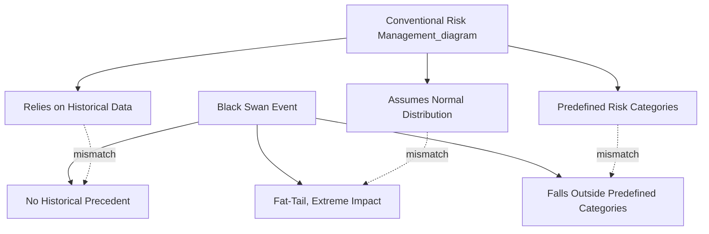
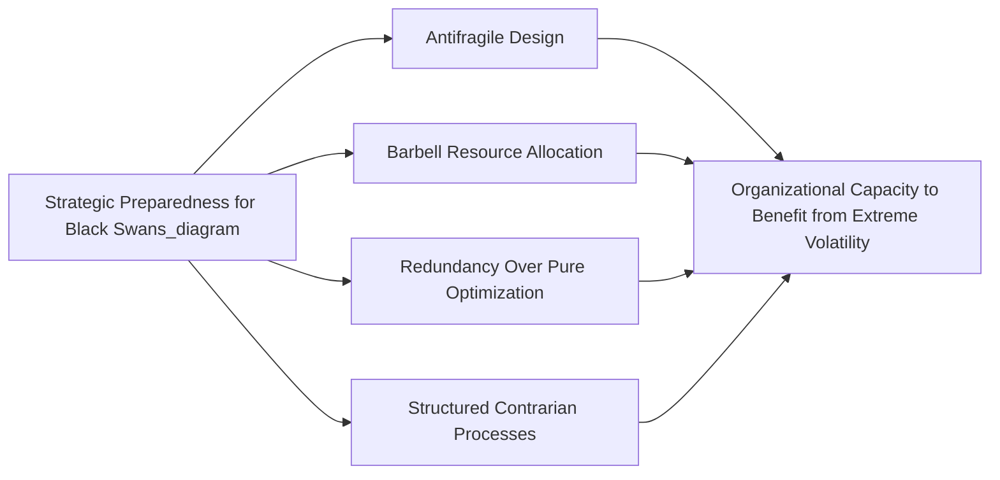

## Black Swan Events and Strategic Preparedness

### Definition and Conceptual Origin

A Black Swan event, as defined by Nassim Nicholas Taleb in his 2007 work of the same name, is an occurrence characterized by three specific properties: it is an outlier lying outside the realm of regular expectations (nothing in the past convincingly points to its possibility), it carries an extreme impact, and — critically — human nature drives people to concoct explanations for its occurrence after the fact, making it appear explainable and predictable in hindsight even though it genuinely was not predictable in advance.

This third property, often termed the **hindsight bias** or **retrospective predictability**, is what most sharply distinguishes true Black Swan events from merely rare or difficult-to-forecast events. Strategic management's interest in the concept centers on the specific challenge it poses to conventional risk management and strategic planning: standard risk assessment tools (probability distributions, scenario planning, historical trend extrapolation) are structurally built on inference from past data, yet Black Swan events are, by definition, poorly captured by exactly that kind of historical inference.

### Distinguishing Black Swans from Related Risk Concepts

| Concept | Predictability Ex Ante | Historical Precedent | Strategic Management Implication |
| --- | --- | --- | --- |
| Known Risk | High (quantifiable probability) | Extensive | Standard risk management tools apply (KRIs, risk matrices, insurance) |
| Known Unknown (identified uncertainty) | Moderate (aware of possibility, uncertain of specifics) | Some | Scenario planning and contingency reserves appropriate |
| Black Swan | Very low to none (genuinely unanticipated) | Absent or misleadingly indirect | Resilience and adaptive capacity, not prediction-based mitigation |
| Gray Swan | Low but non-zero (some experts anticipate, mainstream does not) | Limited, often dismissed | Requires deliberate cultivation of minority/contrarian risk perspectives |

[Inference] The term "Gray Swan" is a widely used extension of Taleb's original concept in subsequent risk management discourse, referring to events that were anticipated by some knowledgeable observers but dismissed or ignored by mainstream planning processes — this represents a common practitioner elaboration rather than a term Taleb himself centrally emphasized in the original formulation.

### Why Conventional Strategic Tools Struggle with Black Swans

Several structural features of standard strategic planning and risk management tools create specific vulnerability to Black Swan-type events:

- **Historical data dependency**: Premise control, benchmarking, and quantitative risk modeling are all fundamentally calibrated against historical patterns; a genuinely unprecedented event has, by construction, no historical base rate from which to calibrate likelihood.
- **Normal distribution assumptions**: Many financial and risk models implicitly assume outcomes are distributed according to bell-curve (Gaussian) statistics, which systematically underestimate the probability of extreme tail events relative to fat-tailed distributions that better describe many real-world strategic and financial phenomena.
- **Narrative fallacy**: Human cognition tends to construct coherent causal narratives explaining past events, which creates a false sense that similar future events would be recognizable and predictable in advance — precisely the hindsight distortion Taleb identifies as core to the Black Swan concept.
- **Silo-based risk identification**: Traditional risk registers categorize risks into predefined categories (competitive, regulatory, technological); genuinely novel Black Swan events frequently do not fit cleanly into any pre-existing category, making them structurally difficult for conventional risk identification workshops to surface.
- **Confirmation bias in premise monitoring**: Premise control systems monitor pre-identified variables for deviation; a Black Swan event, by definition, was not among the variables anyone thought to monitor in the first place.

### Strategic Preparedness: A Different Paradigm

Because Black Swan events resist prediction by construction, the strategic management response Taleb and subsequent risk scholars advocate is not improved forecasting but a fundamental shift toward **robustness and antifragility** — building organizational structures that perform well, or even improve, under conditions of extreme and unpredictable stress, rather than attempting to predict which specific extreme event will occur.

**1. Antifragility**

Taleb's related concept of **antifragility** describes systems that do not merely resist or recover from shocks and volatility (robustness/resilience) but actively benefit and improve from exposure to disorder, stressors, and volatility, up to a point. This is presented as a distinct category from mere resilience: a resilient system returns to its prior state after a shock, while an antifragile system emerges stronger.

- **Strategic application**: Organizations can pursue antifragile design through mechanisms such as maintaining significant strategic optionality (many small, low-cost experimental bets rather than concentrated large bets), which allows the organization to benefit disproportionately from unpredictable positive outlier outcomes while limiting downside exposure to any single failed bet — a structure Taleb terms a "barbell strategy."

**2. Barbell Strategy**

A resource allocation approach combining a large proportion of very conservative, low-risk positions with a small proportion of highly speculative, high-optionality positions, while deliberately avoiding the "middle" — moderately risky positions that offer neither the safety of the conservative allocation nor the extreme optionality of the speculative allocation.

- **Strategic application**: A firm might maintain a highly stable, low-risk core business generating reliable cash flow, while allocating a small, deliberately limited portion of resources to numerous small, high-optionality strategic experiments (new technology bets, adjacent market pilots), any one of which could produce outsized returns if a favorable Black Swan-type development occurs, without the conservative core being jeopardized if the experimental bets fail.

**3. Redundancy Over Optimization**

As discussed under strategic resilience, deliberate maintenance of buffer capacity and slack resources — which appears inefficient under normal conditions — provides the absorption capacity that allows survival through genuinely unanticipated shocks, where finely-optimized, lean structures with no slack are disproportionately vulnerable.

**4. Structured Contrarian and Devil's Advocacy Processes**

Deliberately cultivating internal mechanisms that surface low-probability, high-impact possibilities that mainstream planning processes tend to dismiss — related to the "Gray Swan" concept above — including formally empowering a devoted team or role to argue for the strategic significance of tail-risk scenarios that consensus planning would otherwise exclude.

### Scenario Planning's Adapted Role for Extreme Uncertainty

While standard scenario planning constructs a limited number of plausible future states, addressing Black Swan-type uncertainty typically requires an adapted approach:

- **Widening the scenario range deliberately beyond "plausible"**: Including deliberately extreme, low-probability scenarios specifically to stress-test organizational resilience against conditions outside the normal planning envelope, rather than confining scenarios to what currently appears reasonably likely.
- **Focus on organizational capability rather than event prediction**: Rather than attempting to scenario-plan for a specific unprecedented event (which is close to definitionally impossible for genuine Black Swans), preparedness planning shifts toward ensuring the organization possesses generalized capabilities — financial reserves, decision-making speed, communication infrastructure — that would support an effective response to a wide range of unanticipated extreme events, whatever their specific nature.
- **Stress testing against extreme but non-specific shocks**: Testing organizational and financial resilience against generic severe shock magnitudes (e.g., "a 40% sudden revenue decline sustained for two quarters") rather than only against specific named risk scenarios, since this generalized stress testing captures resilience against a broader range of unanticipated shock types than event-specific scenario planning alone.

### Illustrative Historical Examples

[Inference — the following are commonly cited illustrative examples in the Black Swan and strategic risk literature; the degree to which each event fully satisfies Taleb's strict three-part definition, versus representing a more foreseeable "Gray Swan," has been debated among commentators]

- The 2008 global financial crisis is frequently discussed in relation to Black Swan dynamics, particularly regarding the failure of risk models built on historical mortgage default correlations that did not anticipate the systemic, correlated nature of the eventual crisis.
- The COVID-19 pandemic's economic and operational disruption is commonly cited as an example that severely tested organizational resilience and supply chain robustness across many industries, prompting widespread post-event reassessment of the efficiency-resilience trade-off discussed under crisis management and strategic resilience.
- The rapid rise of certain disruptive digital technologies displacing incumbent business models has, in some analyses, been characterized as exhibiting Black Swan-like unpredictability from the perspective of incumbent firms, though this characterization is debated, since some industry observers and incumbents did identify the disruptive potential in advance without acting on it — which would place such cases closer to the Gray Swan category.

### Criticisms and Limitations of the Black Swan Framework in Strategic Application

- **Risk of fatalism or strategic paralysis**: An overly literal application of "genuinely unpredictable" events can discourage legitimate risk identification effort, if managers conclude that because some risks are unpredictable, systematic risk identification is not worthwhile — a conclusion the framework's original proponents explicitly reject, since the framework advocates preparedness and robustness precisely because prediction fails, not abandonment of risk management altogether.
- **Retrospective classification difficulty**: Determining in advance whether a given emerging risk constitutes a genuine Black Swan (unforeseeable) versus a Gray Swan (foreseeable but neglected) versus a conventional known risk is itself analytically difficult, and organizations may too readily classify preventable strategic failures as "unforeseeable Black Swans" after the fact as a form of accountability avoidance.
- **Tension with conventional ERM and strategic control practice**: The Black Swan framework's skepticism toward probability-based risk modeling sits in some tension with the more probabilistic, quantification-oriented approach of frameworks like COSO ERM; reconciling the two in practice generally involves treating conventional risk management as appropriate for known and moderately uncertain risks while reserving antifragility/robustness-oriented approaches specifically for genuinely unprecedented tail risk.
- **Resource allocation tension with efficiency demands**: As with strategic resilience more broadly, antifragile and barbell-oriented resource allocation strategies impose ongoing costs (maintained slack, diversified experimental investment) that must be justified against more immediately measurable efficiency-oriented alternatives, a justification that can be organizationally difficult absent a recent, vivid disruption event.

### Related Topics

- Strategic resilience and the efficiency-resilience trade-off
- Enterprise Risk Management frameworks and their limitations for tail risk
- Scenario planning methodology, including extreme scenario construction
- Crisis management and post-crisis strategic learning
- Real options reasoning and strategic optionality
- Fat-tailed probability distributions in risk modeling
- Cognitive biases in strategic decision-making (hindsight bias, narrative fallacy, confirmation bias)
- Strategic surveillance within strategic control systems