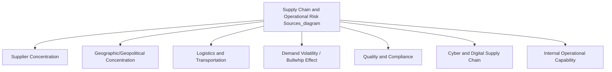
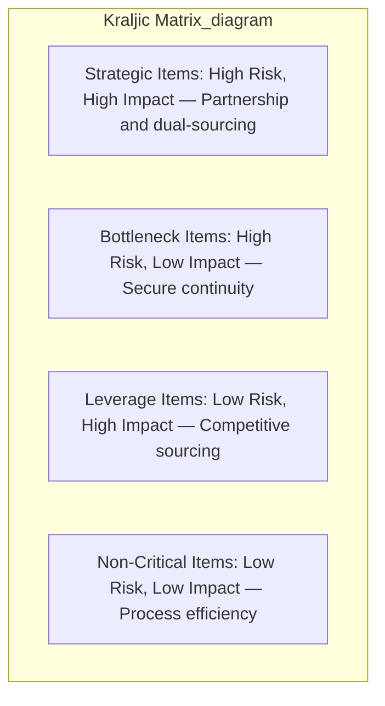

## Supply Chain and Operational Risk in Strategy

### Definition and Strategic Significance

Supply chain and operational risk refers to the exposure an organization faces to disruptions in the network of suppliers, logistics processes, production systems, and internal operational capabilities that convert inputs into the products and services underlying its strategy. While often treated as a purely operational management concern, supply chain and operational risk has increasingly been elevated to strategic significance, since supply chain structure directly determines whether a firm's chosen strategy (cost leadership, differentiation, speed-to-market) can actually be executed reliably, and disruptions can invalidate strategic positioning even when the underlying strategy itself remains sound.

This topic sits at the intersection of the operational and strategic risk categories introduced under identifying and categorizing strategic risks: a supply chain disruption often begins as an operational risk event but escalates into a strategic risk when its scale, duration, or recurrence threatens the organization's competitive positioning, customer relationships, or fundamental strategic viability.

### Sources of Supply Chain and Operational Risk

**1. Supplier Concentration and Dependency Risk**

Reliance on a single supplier, or a small number of suppliers concentrated in a single geographic region, for critical inputs creates a single point of failure. This risk is amplified when the input is highly specialized (few alternative sources exist) or when switching suppliers requires substantial time or capital investment (high switching costs).

**2. Geographic and Geopolitical Concentration Risk**

Concentration of supply, manufacturing, or logistics infrastructure within a single country or region exposes the organization to geographically-correlated disruption sources: natural disasters, political instability, trade policy shifts, export controls, and regional conflict.

**3. Logistics and Transportation Risk**

Dependency on specific transportation modes, routes, or chokepoints (ports, canals, specific shipping lanes) creates vulnerability to disruption of that specific logistics infrastructure, independent of whether the underlying supply source itself remains intact.

**4. Demand Volatility and Bullwhip Effect**

Amplification of demand variability as it propagates upstream through a multi-tier supply chain — small fluctuations in end-customer demand can translate into significantly larger fluctuations in orders placed with upstream suppliers, creating episodic overcapacity and shortage cycles that are difficult to manage through standard forecasting alone.

**5. Quality and Compliance Risk**

Risk that inputs or processes fail to meet required quality, safety, or regulatory compliance standards, particularly significant in extended, multi-tier supply chains where the focal organization has limited direct visibility into upstream supplier practices (sub-tier suppliers beyond the immediate, contracted supplier relationship).

**6. Cyber and Digital Supply Chain Risk**

Increasing digital integration across supply chain partners creates exposure to cybersecurity incidents originating anywhere within the interconnected digital supply chain, not solely within the focal organization's own systems.

**7. Internal Operational Capability Risk**

Risk arising from the focal organization's own internal operational systems, processes, and workforce — equipment failure, process breakdown, workforce disruption (labor actions, skill shortages), and internal quality control failures.

### The Efficiency-Resilience Trade-off in Supply Chain Design

Supply chain strategy is a primary domain in which the general efficiency-resilience trade-off (introduced under crisis management and strategic resilience) manifests concretely:

| Efficiency-Oriented Practice | Resilience-Oriented Alternative | Underlying Trade-off |
| --- | --- | --- |
| Single-source, lowest-cost supplier | Dual or multi-sourcing across suppliers | Higher unit cost vs. reduced single-point-of-failure exposure |
| Just-in-time (JIT) inventory | Strategic safety stock buffers | Higher carrying and warehousing cost vs. reduced stockout risk |
| Geographic concentration for scale economies | Geographic diversification of production/sourcing | Lost scale efficiency vs. reduced correlated regional disruption exposure |
| Lean, minimal-redundancy logistics network | Redundant routing and logistics options | Higher logistics cost vs. faster rerouting capability during disruption |
| Deep, narrow supplier relationships (fewer, more integrated partners) | Broader supplier base with maintained but less deeply integrated relationships | Reduced collaborative efficiency vs. lower dependency concentration |

[Inference] Following a series of high-profile global supply chain disruptions in recent years, considerable managerial and academic attention has been directed toward re-examining this trade-off, with many organizations reportedly reassessing the degree to which decades of just-in-time and single-sourcing optimization had left supply chains under-resilient relative to the disruption frequency subsequently observed; the durability and full extent of this reassessment across industries remains an evolving and debated question rather than a settled conclusion.

### Strategic Frameworks for Supply Chain Risk Assessment

**1. Supply Chain Mapping and Tiered Visibility**

Systematic mapping of the full supply chain network — not only direct (Tier 1) suppliers, but sub-tier (Tier 2, Tier 3) suppliers further upstream — to identify concentration risk and single points of failure that may not be visible from direct contractual relationships alone. Limited visibility beyond Tier 1 is a commonly cited practical constraint, since organizations often lack contractual or informational access to their suppliers' own supplier relationships.

**2. Kraljic Matrix (Purchasing Portfolio Analysis)**

A framework classifying purchased items along two dimensions — supply risk and profit impact — into four categories, each warranting a different sourcing and risk management strategy:

- **Strategic items** (high supply risk, high profit impact): Warrant close supplier partnership, dual-sourcing consideration, and dedicated risk monitoring
- **Bottleneck items** (high supply risk, low profit impact): Warrant securing supply continuity (safety stock, alternative sourcing) even though profit impact is modest, since disruption can still halt production
- **Leverage items** (low supply risk, high profit impact): Warrant competitive sourcing and negotiation leverage given ready availability of alternatives
- **Non-critical items** (low supply risk, low profit impact): Warrant process efficiency and administrative simplification in procurement

**3. Supply Chain Risk Scoring**

Quantitative or semi-quantitative scoring of individual suppliers and supply chain nodes across risk dimensions (financial stability, geographic concentration, single-source dependency, quality history, cyber posture), aggregated into an overall supply chain risk profile that can be tracked over time as a set of key risk indicators.

### Strategic Risk Mitigation Approaches

**1. Supplier Diversification**

Deliberately maintaining relationships with multiple qualified suppliers for critical inputs, distributed across different geographic regions where feasible, to reduce dependency on any single supplier or region.

**2. Nearshoring and Reshoring**

Relocating supply or production closer to end-markets (nearshoring) or back to the home country (reshoring) to reduce logistics complexity, geopolitical exposure, and lead-time risk, generally at some efficiency cost relative to lowest-cost offshore sourcing.

**3. Vertical Integration for Critical Inputs**

Strategic acquisition or internal development of production capability for inputs deemed sufficiently critical and risk-exposed that external dependency is judged strategically unacceptable — directly connecting supply chain risk mitigation to the broader make-versus-buy and vertical integration strategic decision.

**4. Strategic Inventory and Buffer Stock**

Maintaining safety stock for critical, high-risk inputs beyond what pure demand-driven inventory optimization would suggest, functioning as a direct redundancy mechanism against supply disruption.

**5. Collaborative Supplier Relationship Management**

Deeper information sharing and joint planning with key suppliers (shared demand forecasts, joint capacity planning) to reduce bullwhip effect amplification and improve mutual visibility into emerging risk conditions.

**6. Digital Supply Chain Visibility Tools**

Technology platforms providing real-time tracking and monitoring across the supply chain network, enabling faster detection of emerging disruption and more rapid rerouting or contingency activation — functioning as an operational-level analogue to strategic surveillance.

**7. Contractual Risk Transfer**

Supply agreements incorporating risk-sharing provisions, penalty/incentive clauses for delivery performance, and business continuity requirements imposed on suppliers as a condition of the commercial relationship.

### Integration with Broader Strategic Risk Management

Supply chain and operational risk connects directly to the strategic risk management architecture established elsewhere in this domain:

- **Risk register integration**: Supply chain risks should be formally documented within the organization's strategic risk register, with clear ownership (often a dedicated supply chain risk or procurement risk function) and defined trigger indicators (supplier financial health metrics, geographic concentration ratios, lead-time variance).
- **ERM alignment**: Given supply chain risk's cross-functional nature (procurement, operations, finance, legal all hold relevant information), it is a frequently cited example of the kind of risk that benefits specifically from an integrated ERM approach rather than siloed departmental risk management, since supply chain disruptions typically generate simultaneous financial, operational, and reputational consequences that siloed risk functions may address inconsistently.
- **Crisis management linkage**: Severe supply chain disruptions frequently trigger the special alert control and crisis management processes discussed under crisis management and strategic resilience, requiring the same rapid cross-functional response coordination.
- **Strategic control premise monitoring**: Key supply chain assumptions underlying the current strategy (e.g., "our primary supplier region will remain politically stable and cost-competitive") should be explicitly identified and monitored through premise control, rather than left implicit until a disruption event forces reactive reassessment.

### Common Pitfalls in Supply Chain Risk Management

- **Tier 1 tunnel vision**: Limiting risk assessment to direct, contracted suppliers while remaining unaware of concentration or vulnerability at deeper sub-tier levels of the supply network, where significant disruption risk frequently originates.
- **Cost-only sourcing criteria**: Procurement decisions optimized purely for unit cost, without formal incorporation of supply risk criteria (as the Kraljic matrix framework recommends), can create risk exposure that is invisible until a disruption event materializes.
- **Underinvestment in visibility infrastructure**: Treating supply chain mapping and monitoring as a one-time exercise rather than an ongoing capability, resulting in outdated risk assessments that fail to capture evolving supplier and geographic risk conditions.
- **Reactive-only risk management**: Addressing supply chain risk primarily through crisis response after disruption occurs, rather than through proactive diversification, buffer maintenance, and premise monitoring that could reduce disruption likelihood or impact in advance.
- **Underestimating interdependency and cascading effects**: Treating individual supplier risks as independent when, in practice, correlated disruption sources (a single regional event affecting multiple suppliers simultaneously) can produce compounding impact significantly greater than any single supplier risk assessment would suggest in isolation.

### Related Topics

- Identifying and categorizing strategic risks
- Enterprise Risk Management frameworks
- Crisis management and strategic resilience
- Vertical integration and make-versus-buy strategic decisions
- Value chain analysis
- Just-in-time and lean operations management
- Geopolitical risk and international strategy
- Key Risk Indicators and risk monitoring systems