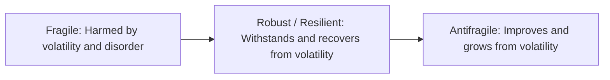
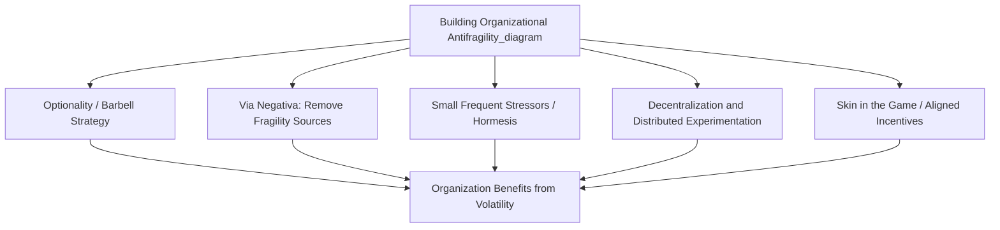

## Building Organizational Antifragility

### Definition and Conceptual Foundation

Antifragility, a concept developed by Nassim Nicholas Taleb in his 2012 work *Antifragile: Things That Gain from Disorder*, describes a property of systems that do not merely withstand or recover from stress, volatility, and disorder — they actively improve and grow stronger as a result of exposure to it, up to a point. This is presented as a distinct third category, conceptually separate from both fragility (harmed by disorder) and robustness/resilience (unaffected by, or able to recover from, disorder).

The critical distinction for strategic management purposes is that resilience returns a system to its prior state after a shock, while antifragility results in a system that ends up in a *better* state than before the shock occurred. Building organizational antifragility, therefore, is a strategic design objective that goes beyond the risk mitigation and resilience-building activities discussed under strategic resilience and Black Swan preparedness: it asks how an organization can be deliberately structured to convert volatility and stress into a source of competitive advantage rather than merely a threat to be survived.

### The Fragile-Robust-Antifragile Spectrum

| Property | Response to Stress/Volatility | Strategic Posture | Example |
| --- | --- | --- | --- |
| Fragile | Degrades or fails | Avoid volatility at all costs | Highly leveraged firm with no cash buffer, single customer dependency |
| Robust/Resilient | Withstands, returns to prior state | Absorb and recover | Diversified firm with adequate cash reserves that survives a downturn intact |
| Antifragile | Improves, grows stronger | Benefit from and seek out (bounded) volatility | Firm using industry downturns to acquire distressed competitors or talent at favorable terms, emerging with strengthened market position |

### Core Mechanisms for Building Antifragility

**1. Optionality and the Barbell Strategy**

As introduced under Black Swan preparedness, the barbell strategy combines a large proportion of conservative, low-risk resource allocation with a small proportion of highly speculative, high-optionality positions, avoiding moderate-risk middle-ground allocations that offer neither safety nor significant upside optionality.

- **Strategic application**: An organization might protect a stable, reliable core business (generating consistent cash flow, low leverage, diversified customer base) while allocating a deliberately bounded portion of resources to numerous small, independent strategic experiments — new technology pilots, adjacent market tests, minority-stake investments in early-stage ventures — where downside from any single failed experiment is capped, but upside from a successful one is asymmetrically large and can benefit disproportionately from unexpected favorable volatility.

**2. Redundancy and Via Negativa**

Antifragile design favors **subtraction over addition** where possible — removing sources of fragility (excessive debt, single points of failure, brittle rigid processes) is often argued to contribute more robustly to antifragility than adding further complexity-laden protective mechanisms, since added complexity itself can introduce new, poorly understood fragilities. This principle, which Taleb terms **via negativa**, suggests that identifying and eliminating fragility-creating elements is frequently a more reliable antifragility-building action than attempting to construct positive protective mechanisms whose own failure modes may not be fully understood.

- **Strategic application**: Systematically reviewing organizational structure, financial leverage, and operational dependencies to identify and eliminate specific sources of concentrated fragility (e.g., reducing debt levels, eliminating single-supplier dependencies, simplifying overly complex process chains) rather than solely adding new risk management overlays on top of an unchanged, fragility-laden underlying structure.

**3. Small, Frequent Stressors Over Large, Rare Shocks**

Systems that are regularly exposed to small, manageable stressors tend to develop adaptive capacity that improves their ability to handle larger shocks, analogous to the biological concept of **hormesis**, where controlled exposure to mild stress strengthens a system's subsequent response capacity — in contrast to systems artificially shielded from all stress, which may become more fragile to eventual larger disruptions precisely because adaptive capacity was never exercised.

- **Strategic application**: Deliberately exposing organizational processes and decision-making structures to controlled, small-scale stress tests, simulated disruptions, and low-stakes experimentation, rather than optimizing exclusively for a stable, disruption-free operating environment that leaves latent capabilities untested until a genuine major shock arrives.

**4. Decentralization and Distributed Decision-Making**

Highly centralized systems concentrate both the benefits and risks of decisions in a small number of decision points, creating fragility if those central points fail or make poor decisions under stress. Distributing decision-making authority across multiple, semi-autonomous units allows the organization to run many parallel, smaller-scale strategic experiments simultaneously, increasing the likelihood that some subset will discover favorable adaptations to emerging conditions.

- **Strategic application**: Structuring the organization so that individual business units or teams have meaningful autonomy to respond to local market signals and experiment with adapted approaches, with successful local adaptations subsequently identified and scaled organization-wide — functioning as an internal variation-and-selection mechanism analogous to evolutionary adaptation.

**5. Skin in the Game and Aligned Incentives**

Taleb's related concept of **skin in the game** holds that decision-makers who bear the direct consequences (positive or negative) of their decisions make systematically better decisions than those insulated from consequence, since insulation from downside consequence permits the pursuit of fragility-creating strategies (excessive risk-taking, short-term optimization) without personal accountability for resulting harm.

- **Strategic application**: Designing governance, compensation, and accountability structures so that key decision-makers meaningfully share in the downside consequences of excessive risk-taking, not solely the upside of favorable outcomes — reducing the incentive to pursue fragility-creating strategies that appear favorable under normal conditions but generate catastrophic tail risk.

### Antifragility Compared to Related Strategic Concepts

| Concept | Core Focus | Relationship to Antifragility |
| --- | --- | --- |
| Strategic Resilience | Absorbing and recovering from disruption | Antifragility extends resilience — resilience returns to baseline, antifragility exceeds it |
| Real Options Reasoning | Preserving strategic flexibility and staged investment under uncertainty | A primary mechanism for building antifragility; options provide asymmetric (capped downside, uncapped upside) payoff structures |
| Organizational Learning (Double-Loop) | Revising strategic assumptions based on new information | A necessary complement — antifragility requires that lessons from volatility genuinely update organizational strategy and capability, not merely survive the immediate event |
| Dynamic Capabilities | Sensing, seizing, and reconfiguring resources in response to change | Closely related; dynamic capabilities theory describes the organizational mechanisms through which antifragile adaptation is operationally achieved |

### Practical Organizational Design Elements Supporting Antifragility

- **Diversified experimentation portfolios**: Running numerous small, independent strategic experiments (new products, market tests, partnership pilots) with capped individual downside, rather than concentrated bets, increases the probability of discovering asymmetrically favorable opportunities that emerging volatility or disruption may create.
- **Financial conservatism in the core business**: Maintaining low leverage and strong liquidity in the stable core of the business preserves the capacity to act opportunistically during periods of market stress (e.g., acquiring distressed assets, talent, or competitors at favorable terms) when more highly leveraged competitors are forced into defensive retrenchment.
- **Fast feedback and rapid iteration cycles**: Short cycle times between experimentation, feedback, and adaptation (connecting directly to the PDCA cycle and continuous improvement feedback loop architecture) increase the rate at which favorable adaptations discovered through small-scale stress exposure can be identified and scaled.
- **Cultivated internal diversity of perspective**: Organizational structures and cultures that actively surface dissenting, contrarian, and minority viewpoints (connecting to the structured contrarian processes discussed under Black Swan preparedness) increase the likelihood that favorable adaptive responses to volatility are identified rather than suppressed by consensus-driven planning.
- **Post-disruption learning capture**: Formal mechanisms ensuring that lessons learned from volatility and disruption episodes are captured and translated into genuine strategic and capability change (linking to post-crisis learning processes), rather than the organization simply reverting to its pre-disruption state once acute pressure subsides — this is the specific mechanism distinguishing antifragile adaptation from mere resilient recovery.

### The Limits and Boundary Conditions of Antifragility

Antifragility, as Taleb's framework itself emphasizes, operates only within bounded ranges of stress exposure — the concept explicitly does not imply that unlimited volatility or disorder is beneficial:

- **Threshold effects**: Stress exposure beyond a certain magnitude transitions from a strengthening stimulus to a genuinely destructive shock; the antifragile benefit applies to survivable, bounded stressors, not to catastrophic or existential-level disruption.
- **Irreversibility risk**: Some forms of organizational damage (loss of key talent, destruction of critical infrastructure, catastrophic reputational harm) are not fully reversible even with strong adaptive capacity, meaning certain categories of risk exposure should still be avoided or transferred entirely rather than treated as a source of potential antifragile benefit.
- **Distinguishing genuine antifragility from survivorship bias**: Retrospective identification of organizations that "grew stronger" from a disruption can conflate genuine antifragile design with simple survivorship — organizations that happened to survive a shock for reasons unrelated to deliberate antifragile structuring, while less fortunate peers with similar structures did not survive, are not evidence of a reliably replicable antifragile mechanism.

[Inference] The empirical measurement and validation of antifragility as an organizational property, as distinct from resilience or simple survivorship, is inherently challenging, since it requires establishing not merely that an organization survived a disruption but that it demonstrably improved *because of* that specific disruption exposure, a causal claim that is difficult to establish with confidence in complex organizational settings; this remains a more conceptually and qualitatively developed framework in the strategic management literature than a rigorously and consistently quantified one.

### Criticisms and Limitations

- **Definitional ambiguity in practice**: Distinguishing antifragile improvement from ordinary post-crisis recovery, learning, or coincidental favorable timing can be analytically difficult in specific organizational cases, raising questions about how operationally distinct the concept is from established organizational learning and resilience frameworks.
- **Resource cost of maintained optionality**: Barbell strategies, redundancy, and diversified experimentation portfolios all impose ongoing costs that compete with more immediately measurable efficiency-oriented resource allocation, a tension shared with strategic resilience investment more broadly.
- **Risk of misapplied "beneficial disorder" reasoning**: An imprecise application of antifragility thinking risks providing intellectual justification for genuinely reckless risk-taking under the guise of "seeking beneficial volatility," when the underlying exposure in fact carries unbounded or irreversible downside inconsistent with the framework's own bounded-stress premise.

### Related Topics

- Black Swan events and strategic preparedness
- Strategic resilience and the efficiency-resilience trade-off
- Real options reasoning and strategic optionality
- Dynamic capabilities theory
- Organizational learning theory (single-loop and double-loop learning)
- Crisis management and post-crisis strategic learning
- Corporate governance and incentive alignment (skin in the game)
- Decentralized organizational structure design