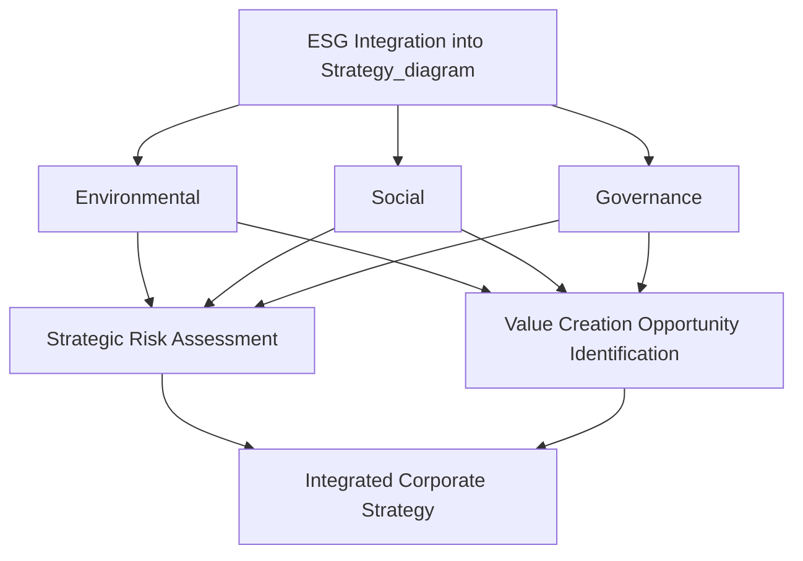
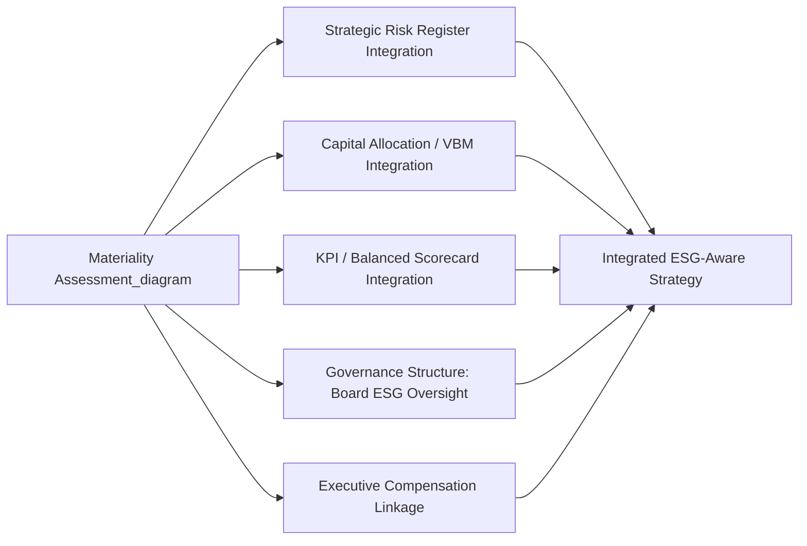

## ESG Integration into Corporate Strategy

### Definition and Strategic Positioning

ESG (Environmental, Social, and Governance) integration is the systematic incorporation of environmental, social, and governance considerations into core strategic decision-making — encompassing strategy formulation, capital allocation, risk management, and performance measurement — rather than treating these considerations as a peripheral corporate social responsibility (CSR) function separate from the core business strategy. The strategic significance of this distinction is central: ESG integration positions environmental and social factors as material inputs to value creation and risk management, whereas earlier CSR approaches often positioned similar activities as philanthropic or reputational expenditures adjacent to, rather than embedded within, strategy.

This shift connects directly to several concepts already established in this course: ESG integration extends the strategic risk identification and categorization framework (environmental and social factors as strategic risk sources), links to Value-Based Management and EVA (whether ESG factors demonstrably affect long-term ROIC and cost of capital), and requires the same KPI and strategic control system architecture used for financial performance to be extended to non-financial ESG metrics.

### The Three ESG Pillars

**Environmental**

- Climate change exposure and greenhouse gas emissions (commonly categorized into Scope 1: direct emissions, Scope 2: purchased energy emissions, and Scope 3: value chain emissions)
- Resource use efficiency, waste management, and circular economy practices
- Biodiversity and land use impact
- Water usage and management, particularly in water-stressed operating regions
- Physical climate risk (direct exposure to climate-related physical events) and transition risk (exposure to the economic and regulatory shifts accompanying decarbonization)

**Social**

- Labor practices, employee health and safety, and workforce diversity and inclusion
- Human rights practices across the organization's own operations and its supply chain
- Product safety, quality, and responsible marketing practices
- Community relations and social license to operate, particularly for organizations with significant local operational footprint
- Data privacy and responsible technology use

**Governance**

- Board composition, independence, and diversity
- Executive compensation structure and its alignment with long-term (including ESG-related) performance
- Business ethics, anti-corruption practices, and internal control quality
- Shareholder rights and ownership structure transparency
- Risk oversight and disclosure practices

### The Strategic Rationale for ESG Integration

Strategic management literature and practice generally identify several distinct mechanisms through which ESG factors are argued to affect strategic value creation, moving beyond a purely compliance or reputational framing:

**1. Risk Mitigation and Cost of Capital**

ESG factors, particularly environmental and governance risks, can constitute material strategic risks under the identification and categorization framework established earlier in this course — regulatory risk (carbon pricing, environmental regulation), physical risk (climate-related disruption to operations or supply chains), and governance-related risk (fraud, control failures) can each threaten strategic viability. Some financial market participants and academic studies have examined whether strong ESG performance is associated with a lower cost of capital, reflecting reduced perceived risk. [Inference — the strength, consistency, and causal direction of any such relationship is genuinely debated in the empirical finance and management literature, with study results varying significantly by methodology, time period, and market context; this should not be treated as an established universal financial relationship]

**2. Operational Efficiency and Cost Reduction**

Certain environmental initiatives (energy efficiency, waste reduction, resource optimization) can generate direct cost savings that improve operating margins independent of any external stakeholder or reputational consideration, representing a straightforward efficiency rationale for ESG-related operational investment.

**3. Innovation and New Market Opportunity**

ESG-driven shifts in regulation and customer preference can create genuine new market opportunities (e.g., renewable energy, sustainable materials, circular economy business models) that firms positioned to capture through early strategic investment may access ahead of slower-moving competitors — framing ESG not solely as risk mitigation but as a source of strategic opportunity consistent with standard strategic management opportunity-identification frameworks (PESTEL, blue ocean strategy).

**4. Talent Attraction and Retention**

Workforce preferences regarding employer environmental and social practices are frequently cited as a factor in talent attraction and retention, particularly among certain demographic and professional segments, with corresponding implications for human capital as a strategic resource.

**5. Stakeholder Trust and Social License to Operate**

Strong social and governance practices can support the maintenance of stakeholder trust and "social license to operate" — the informal, ongoing acceptance of an organization's operations by the communities and stakeholders affected by them — which can be strategically significant for organizations whose operations depend on sustained regulatory and community acceptance (e.g., extractive industries, large-scale infrastructure).

[Inference] The overall empirical relationship between strong ESG performance and superior financial performance has been the subject of extensive academic study with genuinely mixed and debated findings; results vary considerably depending on how ESG performance is measured, which specific ESG factors are examined, the industry and time period studied, and the methodology used to establish causality versus correlation. This summary should not be read as endorsing a settled, universally validated positive financial relationship, nor as dismissing the possibility of a material relationship in specific contexts — the state of the evidence is genuinely contested and evolving.

### Stakeholder Theory as the Underlying Strategic Framework

ESG integration is conceptually grounded in **stakeholder theory**, most closely associated with R. Edward Freeman, which holds that organizations should consider and balance the interests of all parties affected by or able to affect the organization's activities — not solely shareholders — as a matter of both ethical obligation and, in stakeholder theory's strategic management application, long-term value creation.

This stands in explicit contrast to the **shareholder primacy** view (most closely associated with Milton Friedman's position that a corporation's principal social responsibility is to increase profits for shareholders within legal and ethical bounds), and represents one of the more actively debated theoretical and normative tensions within strategic management, corporate governance, and business ethics scholarship. Contemporary ESG integration frameworks generally attempt to reconcile the two positions by arguing that attending to stakeholder interests is itself instrumental to long-term shareholder value creation (an "enlightened shareholder value" or "instrumental stakeholder theory" position), though this reconciliation is itself a contested claim rather than a universally accepted resolution of the underlying theoretical tension.

### ESG Reporting and Disclosure Frameworks

Multiple, evolving reporting standards and frameworks support ESG measurement and external disclosure, reflecting an area of active regulatory and standard-setting development. Given the pace of change in this specific domain, this content should be verified against current sources for the most up-to-date framework status.

Established and commonly referenced frameworks and standards include:

- **Global Reporting Initiative (GRI)**: A widely used voluntary sustainability reporting framework emphasizing broad stakeholder-relevant impact disclosure
- **Sustainability Accounting Standards Board (SASB) standards**: Industry-specific standards focused on financially material ESG factors, now operating under the International Sustainability Standards Board (ISSB)
- **Task Force on Climate-related Financial Disclosures (TCFD)**: A framework specifically for climate-related risk and opportunity disclosure, organized around governance, strategy, risk management, and metrics/targets
- **International Sustainability Standards Board (ISSB)**: Established to develop a global baseline of sustainability disclosure standards, consolidating several predecessor frameworks
- **EU Corporate Sustainability Reporting Directive (CSRD)** and associated European Sustainability Reporting Standards (ESRS): A significant regulatory disclosure regime applicable to qualifying organizations operating in or connected to the EU market

[Unverified — given the active and ongoing evolution of specific regulatory requirements, implementation timelines, and framework consolidation in this domain, the current specific status, scope, and applicability of any of the above frameworks should be verified against current regulatory and standard-setting sources rather than relied upon as fixed]

### Materiality Assessment as the Integration Starting Point

A **materiality assessment** is the foundational analytical step for genuine ESG integration, identifying which specific ESG factors are financially and strategically material to a given organization's specific industry, business model, and stakeholder relationships — as opposed to generic ESG reporting against a broad, undifferentiated checklist of possible factors.

- **Financial materiality**: ESG factors that could reasonably be expected to affect the organization's financial condition, operating performance, or enterprise value (the primary orientation of frameworks like SASB/ISSB)
- **Impact materiality** (or "double materiality," a framing prominent in EU regulatory approaches such as CSRD): ESG factors reflecting the organization's impact on the environment and society, independent of whether that impact is currently reflected in financial performance

The distinction between financial materiality and double materiality reflects an active area of divergence across international regulatory and standard-setting approaches, with some frameworks (particularly US-oriented, investor-focused standards) emphasizing financial materiality primarily, and others (particularly EU regulatory approaches) mandating double materiality assessment.

### Embedding ESG into the Strategic Management Process

Genuine ESG integration, as distinct from disclosure-only compliance, typically requires embedding ESG considerations across the core strategic management activities established throughout this course:

- **Strategic risk identification**: Formally incorporating environmental and social risk categories into the strategic risk register, with defined ownership and trigger indicators (connecting directly to the risk categorization frameworks covered under strategic risk management)
- **Capital allocation and Value-Based Management**: Incorporating climate transition risk and other material ESG factors into capital budgeting and investment appraisal, potentially including internal carbon pricing mechanisms that adjust project-level ROIC calculations to reflect anticipated regulatory or transition costs
- **KPI and Balanced Scorecard integration**: Extending the Balanced Scorecard's four perspectives (or adding a dedicated sustainability perspective) to include material ESG KPIs alongside financial, customer, process, and learning/growth metrics, ensuring ESG factors are tracked with the same rigor as financial performance
- **Governance structure**: Establishing board-level oversight of ESG strategy (often through a dedicated board sustainability or ESG committee) analogous to the board risk committee structure discussed under Enterprise Risk Management
- **Executive compensation linkage**: Incorporating material ESG metrics into executive incentive compensation structures, aligning management incentives with long-term ESG-related strategic objectives rather than short-term financial metrics alone

### Common Pitfalls and Criticisms

- **Greenwashing**: The practice of overstating or misrepresenting genuine ESG performance or impact, whether through selective disclosure, vague or unsubstantiated claims, or reporting that emphasizes favorable metrics while omitting material unfavorable ones — an increasingly significant regulatory and reputational risk in its own right as disclosure scrutiny has intensified.
- **Superficial/disclosure-only integration**: Producing extensive ESG reporting without corresponding embedding of ESG considerations into actual capital allocation, risk management, and strategic decision-making — a "checkbox" implementation that mirrors the compliance-oriented ERM implementation failure discussed under Enterprise Risk Management frameworks.
- **Metric proliferation and comparability challenges**: The historical absence of a single, universally adopted ESG reporting standard has created significant comparability challenges across organizations and industries, complicating benchmarking and external evaluation, though ongoing standard-consolidation efforts (e.g., ISSB) are intended to address this over time.
- **Politicization and polarized stakeholder reception**: ESG as a corporate strategic framing has become a subject of significant public and political debate in some jurisdictions, with differing views on its appropriate role, scope, and mandatory versus voluntary status; this is presented here as a genuine, ongoing area of societal and political disagreement rather than a settled matter, and organizations navigate materially different regulatory and stakeholder expectations depending on jurisdiction.
- **Short-term cost versus long-term benefit tension**: Material ESG-related investments (decarbonization infrastructure, supply chain remediation) frequently require substantial upfront capital with benefits realized over long time horizons, creating the same short-termism tension discussed under Value-Based Management, where quarterly financial pressure can crowd out long-payback strategic investment.

### Related Topics

- Identifying and categorizing strategic risks (environmental and social risk categories)
- Enterprise Risk Management frameworks and board governance structures
- Value-Based Management and Economic Value Added
- Balanced Scorecard KPI integration
- Stakeholder theory versus shareholder primacy debate
- Corporate governance and executive compensation design
- Climate transition risk and physical climate risk
- Supply chain and operational risk (human rights and environmental due diligence)