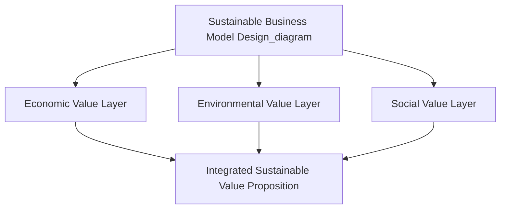
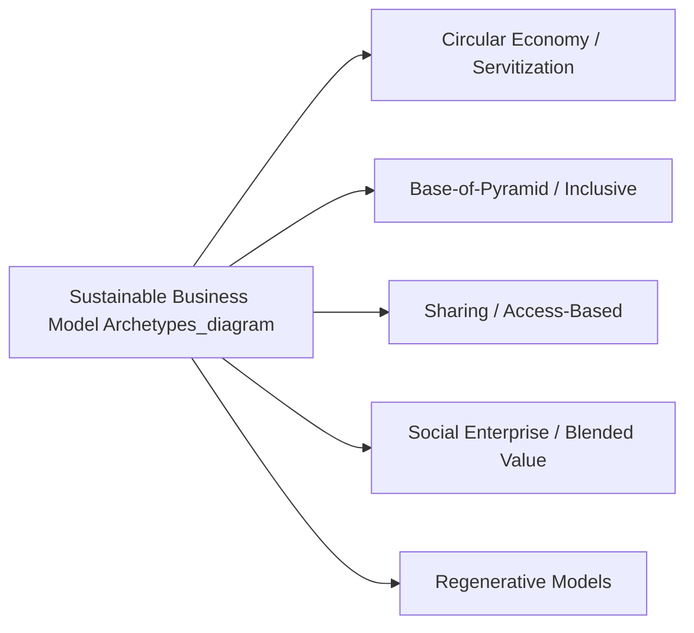

## Sustainable Business Model Design

### Definition and Strategic Distinction

Sustainable business model design is the deliberate structuring of an organization's value creation, delivery, and capture mechanisms — its core business model architecture — so that environmental and social value creation is embedded as an integral part of how the organization generates economic value, rather than pursued as an activity layered on top of an otherwise unchanged conventional business model. This is a meaningfully distinct concept from ESG integration into corporate strategy as covered previously: ESG integration concerns incorporating environmental, social, and governance considerations into the strategic management processes of an existing business model, whereas sustainable business model design concerns the more fundamental architecture of the business model itself — what value is created, for whom, and how that value is captured and monetized.

The distinction matters strategically because a firm can achieve strong ESG integration (rigorous risk management, disclosure, governance oversight) while still operating a business model whose fundamental value-creation logic is not inherently aligned with long-term environmental or social sustainability. Sustainable business model design addresses this more structural question directly.

### The Business Model Canvas as an Analytical Starting Point

Sustainable business model design typically builds on standard business model analysis frameworks — most commonly a variant of the Business Model Canvas (value proposition, customer segments, channels, customer relationships, revenue streams, key resources, key activities, key partnerships, cost structure) — extended to explicitly incorporate environmental and social value flows alongside conventional economic value flows. Several specialized extensions have been developed for this purpose, including the **Triple Layered Business Model Canvas**, which adds distinct environmental and social layers to the standard economic layer, and the **Flourishing Business Canvas**, which broadens the analysis to consider value flows across a wider network of stakeholders including future generations and non-human stakeholders.

### Categories of Sustainable Business Model Innovation

Strategic management and sustainability scholarship commonly identify several recurring archetypes of sustainable business model design, each representing a distinct approach to embedding sustainability into value creation logic:

**1. Circular Economy Models**

Business models designed around minimizing resource extraction and waste generation by keeping materials and products in use for as long as possible through reuse, repair, remanufacturing, and recycling loops, in contrast to the conventional linear "take-make-dispose" model.

- **Product-as-a-Service / Servitization**: Shifting revenue capture from one-time product sales to ongoing service provision (leasing, subscription, pay-per-use), which realigns the provider's economic incentive toward product durability and lifecycle value rather than sales volume, since the provider retains ownership and responsibility for the physical asset.
- **Remanufacturing and refurbishment**: Capturing residual value from used products through professional restoration to as-new or near-new condition, generating revenue from materials and components that would otherwise be discarded.
- **Industrial symbiosis**: Business models in which the waste or byproduct output of one organization's process becomes a valuable input for another organization, creating mutually reinforcing resource loops across otherwise unrelated firms.

**2. Base-of-the-Pyramid and Inclusive Business Models**

Business models specifically designed to serve low-income populations profitably through adapted pricing, distribution, and product design, generating both financial returns and social value through expanded access to goods and services previously unavailable or unaffordable to these populations.

**3. Sharing Economy and Access-Based Models**

Business models built around facilitating shared access to underutilized assets (vehicles, accommodation, equipment) rather than individual ownership, potentially reducing aggregate resource consumption relative to a model in which each user independently owns the asset.

**4. Social Enterprise and Blended-Value Models**

Business models explicitly designed to pursue a defined social or environmental mission as a core organizational objective alongside (rather than subordinate to) financial sustainability, often incorporating structural mechanisms (mission-lock governance provisions, profit reinvestment commitments) to protect the social objective from erosion under financial pressure.

**5. Regenerative Business Models**

Business models designed to generate net-positive environmental or social impact — actively restoring or improving ecological or social systems — rather than merely minimizing negative impact relative to a conventional baseline, representing the most structurally ambitious category on the sustainability spectrum from harm reduction to net-positive contribution.

### The Value Proposition Redesign Process

Embedding sustainability into a business model's core value proposition, rather than adding it as a peripheral feature, typically involves reworking several interconnected business model elements:

1. **Value proposition redefinition**: Explicitly articulating environmental and/or social value alongside conventional functional and economic value as part of what the offering delivers to customers, rather than treating sustainability attributes as a secondary marketing claim layered onto an unchanged core offering
2. **Revenue model realignment**: Restructuring how revenue is captured so that the organization's financial incentives are structurally aligned with sustainable outcomes (e.g., servitization models realigning incentives toward product durability rather than sales volume, as discussed above)
3. **Resource and activity redesign**: Reconfiguring key resources, activities, and supply chain relationships to reduce environmental footprint and/or increase positive social impact as an integral part of core operations, not an isolated corporate responsibility initiative
4. **Partnership ecosystem development**: Establishing key partnerships (with suppliers, waste-stream partners, certification bodies, or complementary organizations) specifically structured to enable circular, regenerative, or inclusive value flows that a conventional linear supply chain would not support
5. **Cost structure adaptation**: Recognizing and planning for the different cost structure profile that sustainable business models frequently entail (e.g., higher upfront asset costs in servitization models offset by extended revenue capture over the asset's service life)

### Tensions and Trade-offs in Sustainable Business Model Design

**1. The Paradox of Embedded Sustainability**

A recurring strategic tension in sustainable business model design is that some models designed to reduce environmental impact per unit of consumption (e.g., a durable, repairable product commanding a premium price) may simultaneously reduce sales volume relative to a conventional lower-durability model optimized for repeat purchase — creating a genuine tension between environmental impact reduction and conventional volume-based revenue growth that requires deliberate business model redesign (such as servitization) to resolve rather than being automatically compatible.

**2. Scaling Challenges**

Business models successfully piloted at small scale, particularly base-of-the-pyramid and social enterprise models, frequently encounter significant challenges scaling to broader markets while preserving the specific design features (adapted pricing, distribution innovation, mission fidelity) that made the original model successful, representing a common gap between promising pilot results and durable, sustained scale.

**3. Stakeholder Value Distribution Complexity**

Sustainable business models explicitly designed around multi-stakeholder value creation (economic, environmental, and social value simultaneously) require more complex governance and decision-making processes than conventional single-stakeholder-optimized (typically shareholder-value-optimized) business models, since trade-offs between different value dimensions must be explicitly navigated rather than resolved by a single dominant optimization criterion.

**4. Certification and Verification Costs**

Business models relying on credible signaling of genuine sustainability performance (to counter greenwashing skepticism, as discussed under ESG integration) frequently require costly third-party certification, verification, and ongoing compliance processes, representing a meaningful cost structure consideration, particularly for smaller organizations.

[Inference] The strategic management and sustainability literature generally frames the paradox of embedded sustainability and the scaling challenges above as significant, actively-researched design problems rather than fully resolved issues; specific resolution approaches (servitization, ecosystem partnership, blended finance for scaling) represent proposed strategies with varying degrees of demonstrated success across different industry and market contexts, rather than universally validated solutions.

### Governance Structures Supporting Sustainable Business Models

- **Mission-lock legal structures**: Corporate forms such as benefit corporations (in relevant jurisdictions) or similar legal structures that formally embed social and environmental mission consideration into directors' fiduciary obligations, alongside (rather than automatically subordinate to) financial shareholder interests
- **B Corp certification**: A third-party certification (administered by the nonprofit B Lab) assessing an organization's overall social and environmental performance, accountability, and transparency against a defined standard, providing external verification supporting the sustainable business model's credibility with stakeholders
- **Impact measurement and management systems**: Formal systems for measuring and reporting the actual social and environmental impact generated by the business model (distinct from, though related to, the ESG disclosure frameworks discussed under ESG integration), often using frameworks such as the Impact Management Project's dimensions of impact (what, who, how much, contribution, and risk)

### Integration with Broader Strategic Management Concepts

Sustainable business model design connects to several concepts established elsewhere in this course:

- **Value chain analysis**: Sustainable business model redesign frequently requires fundamental reconfiguration of value chain activities, not merely incremental efficiency improvement within an unchanged value chain structure
- **Strategic risk management**: Business models with embedded sustainability characteristics can reduce exposure to certain regulatory and reputational risk categories identified under strategic risk identification, though they may introduce new risk categories of their own (certification dependency, scaling execution risk)
- **KPI and performance measurement**: Sustainable business models require extended KPI systems capturing environmental and social value creation alongside financial performance, consistent with the Balanced Scorecard extension discussed under ESG integration
- **Blue ocean strategy and value innovation**: Several sustainable business model archetypes (particularly base-of-the-pyramid and circular economy models) exhibit characteristics of value innovation — simultaneously pursuing differentiation (new value dimensions) and, in some cases, cost reduction (resource efficiency), consistent with blue ocean strategic logic applied to a sustainability-oriented value proposition

### Related Topics

- ESG integration into corporate strategy
- Circular economy principles and servitization models
- Business Model Canvas and its sustainability-oriented extensions
- Blue ocean strategy and value innovation
- Stakeholder theory and multi-stakeholder governance
- Social enterprise structures and B Corp certification
- Value chain analysis and reconfiguration
- Impact measurement and management frameworks