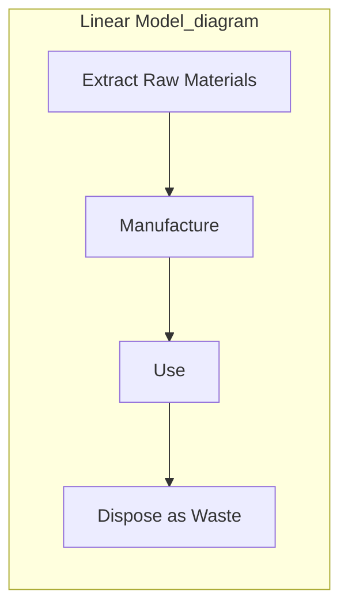
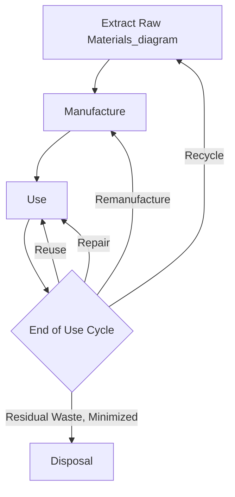
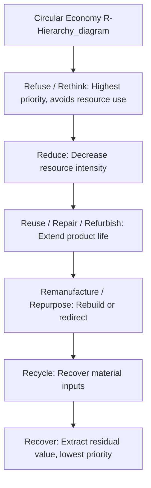

## Circular Economy Strategy

### Definition and Conceptual Foundation

Circular economy strategy is the deliberate design of organizational operations, product architecture, and business models around minimizing resource extraction and waste generation by maximizing the retention of materials, components, and products in productive use for as long as possible. This stands in explicit contrast to the conventional **linear economy model** — the "take-make-dispose" pattern in which raw materials are extracted, processed into products, consumed, and then discarded as waste at the end of a single use cycle.

Where sustainable business model design (covered previously) addresses the broader question of how value creation, delivery, and capture can embed environmental and social value generally, circular economy strategy addresses a more specific and structurally defined objective: closing, narrowing, slowing, and regenerating material and resource loops within the value chain. Circular economy strategy is one of the most developed and operationally concrete archetypes within the broader sustainable business model design landscape, with well-established design principles and implementation frameworks.

### The Linear vs. Circular Economic Model

### The Core Circular Economy Strategies: The R-Framework

Circular economy strategies are commonly organized according to an ordered hierarchy of intervention strategies — frequently referred to as the "R-framework" — reflecting the general principle that strategies higher in the hierarchy (requiring less material and energy throughput) are generally preferable to those lower in the hierarchy (which still involve significant processing, even if they avoid landfill disposal). Different versions of this framework in circulating literature use varying numbers of R's (commonly 3R, 6R, 9R, or 10R formulations); a widely referenced expanded formulation includes:

- **Refuse**: Eliminating a product or function entirely by rendering it unnecessary, or replacing it with a radically different offering (the strongest intervention, avoiding resource use altogether)
- **Rethink**: Fundamentally redesigning the product or business model (e.g., shifting from product ownership to service-based access, as discussed under servitization in sustainable business model design)
- **Reduce**: Decreasing the amount of material and energy resources used in manufacturing or consumption
- **Reuse**: Enabling a product, in its original form, to be used again by another user for the same purpose
- **Repair**: Restoring a broken or defective product to functional condition, extending its useful life without full remanufacturing
- **Refurbish**: Restoring an older product to good working condition, typically involving more extensive intervention than simple repair
- **Remanufacture**: Disassembling a product and rebuilding it using a combination of reused, repaired, and new components to a standard equivalent to (or better than) the original
- **Repurpose**: Using a discarded product or its components for a different function than originally intended
- **Recycle**: Processing materials to recover raw material inputs for the manufacture of new products, generally requiring more energy and processing than the strategies above but still avoiding disposal
- **Recover**: Extracting remaining value from waste through, for example, energy recovery (incineration with energy capture), applied when higher-hierarchy strategies are not feasible

[Inference] The specific number and precise labeling of "R" categories vary meaningfully across different circular economy frameworks published by different research institutions and standard-setting bodies; the hierarchy principle (favoring strategies that preserve product and component integrity over those that break materials down to raw inputs) is a widely shared foundational concept, but the exact taxonomy presented above represents one common synthesis rather than a single universally standardized framework.

### Business Model Archetypes for Circular Economy Strategy

**1. Circular Supply Chain Models**

Sourcing fully renewable, recycled, or bio-based inputs to replace virgin, finite raw materials, reducing dependency on extractive resource flows at the input stage of production.

**2. Resource Recovery Models**

Capturing value from waste and byproduct streams — either the organization's own production waste or post-consumer waste — recovering usable materials or energy that would otherwise be lost to disposal.

**3. Product Life Extension Models**

Extending the useful life of existing products through repair services, refurbishment programs, and remanufacturing operations, capturing additional revenue and reducing the resource intensity per unit of consumer utility delivered relative to models optimized for shorter product life and repeat purchase.

**4. Sharing Platform Models**

Enabling multiple users to access a single product or asset over its lifetime, increasing utilization intensity and reducing the aggregate number of units required to satisfy a given level of user demand — connecting directly to the sharing/access-based business model archetype discussed under sustainable business model design.

**5. Product-as-a-Service Models**

As discussed under sustainable business model design, shifting from product sale to service provision realigns the provider's economic incentive toward product durability, repairability, and end-of-life material recovery, since the provider retains ownership responsibility across the full product lifecycle rather than transferring it to the buyer at point of sale.

### Design Principles Enabling Circularity

Circular economy strategy requires specific product and process design choices made deliberately at the design stage, since retrofitting circularity onto products designed under linear-economy assumptions is frequently far less effective:

- **Design for disassembly**: Products engineered so that components can be readily separated at end-of-life, enabling repair, remanufacturing, or material-specific recycling rather than requiring destructive, energy-intensive separation processes
- **Design for durability**: Extending baseline product lifespan through robust materials and construction, directly opposing the practice of planned obsolescence in which products are deliberately designed with limited useful life to drive repeat purchase
- **Design for modularity**: Structuring products so that individual components can be replaced, upgraded, or repaired independently, extending overall product life without requiring full product replacement when a single component fails or becomes outdated
- **Material selection for circularity**: Prioritizing materials that are readily recyclable, biodegradable (where appropriate), or already recycled/renewable in origin, and avoiding material combinations that are difficult or impossible to separate and recycle (e.g., certain composite materials)
- **Standardization of components**: Using standardized components and fasteners across product lines and, where feasible, across the broader industry, facilitating repair, remanufacturing, and cross-product component reuse

### Strategic Rationale for Circular Economy Adoption

**1. Resource Cost and Supply Risk Mitigation**

Reducing dependency on virgin raw material inputs can mitigate exposure to raw material price volatility and supply concentration risk — directly connecting to the supply chain and operational risk concepts discussed earlier in this course, since circular material sourcing can function as a form of supply diversification.

**2. Regulatory Anticipation**

Extended producer responsibility (EPR) regulations, landfill restrictions, and other circular-economy-oriented regulatory developments in various jurisdictions create both compliance risk for organizations that fail to adapt and potential first-mover advantage for organizations that proactively adopt circular practices ahead of regulatory mandate.

**3. New Revenue Stream Creation**

Product life extension, remanufacturing, and resource recovery activities can generate entirely new revenue streams from materials and products that would otherwise represent pure cost (waste disposal) under a linear model.

**4. Customer Value Proposition Differentiation**

For customer segments with genuine sustainability-related preferences, circular economy positioning can support product and brand differentiation, consistent with the differentiation strategic positioning discussed in prior course material, though the strength and durability of any resulting price premium or purchase preference varies by market segment and is not universal across all customer bases.

### Barriers and Challenges to Circular Economy Implementation

- **Reverse logistics complexity**: Collecting used products or materials back from dispersed end-users for reuse, remanufacturing, or recycling requires logistics infrastructure that is typically far more complex and costly than the conventional one-directional forward distribution logistics most organizations have optimized for.
- **Quality and liability concerns in remanufactured/refurbished products**: Ensuring consistent quality and managing liability exposure for products incorporating reused or remanufactured components can be more complex than for products manufactured entirely from new components, and customer willingness to pay full price for remanufactured products may be lower than for new equivalents.
- **Economic viability at current material and energy price levels**: In some cases, the cost of collection, sorting, and processing required for circular material recovery exceeds the market value of virgin material inputs, creating an economic barrier to circular adoption absent regulatory intervention (e.g., extended producer responsibility fees, virgin material taxation) or shifts in relative material pricing.
- **Cross-organizational coordination requirements**: Many circular strategies (industrial symbiosis, standardized component design across an industry) require coordination across multiple organizations that may be competitors or have otherwise limited natural incentive to collaborate, creating coordination challenges beyond what a single organization can resolve unilaterally.
- **Consumer behavior and acceptance**: Product life extension and sharing-based models often require shifts in consumer ownership preferences and behavior (accepting shared access, refurbished products, or service-based consumption rather than new product ownership) that may face resistance depending on market segment and product category.
- **Existing infrastructure lock-in**: Organizations with substantial existing capital investment in linear production infrastructure may face significant transition costs and stranded-asset risk in shifting toward circular production and supply chain models.

[Inference] The pace and extent of circular economy adoption across industries is generally understood in the literature to depend significantly on the interaction between regulatory push (extended producer responsibility mandates, landfill restrictions, virgin material taxation) and market pull (customer willingness to pay for circular attributes, cost-competitiveness of recovered versus virgin materials); the relative importance of these two forces varies considerably by industry, material type, and jurisdiction, and represents an evolving rather than settled area of both policy and business practice.

### Integration with Broader Strategic Frameworks

- **Value chain analysis**: Circular economy strategy frequently requires fundamental reconfiguration of the value chain, particularly inbound logistics (incorporating reverse logistics) and procurement (incorporating recycled/recovered material sourcing)
- **Supply chain and operational risk**: Circular material sourcing can serve as a risk mitigation mechanism against the supplier concentration and geographic concentration risks discussed under supply chain and operational risk in strategy
- **ESG integration and disclosure**: Circular economy performance metrics (recycled material content, product take-back rates, material recovery rates) increasingly feature within ESG disclosure frameworks, particularly within the environmental pillar
- **Sustainable business model design**: Circular economy strategy represents one of the most operationally developed archetypes within the broader sustainable business model design landscape, frequently implemented in combination with servitization and product-as-a-service revenue models

### Related Topics

- Sustainable business model design and servitization
- Supply chain and operational risk in strategy
- ESG integration into corporate strategy
- Extended producer responsibility regulation
- Value chain analysis and reconfiguration
- Design for disassembly and modular product architecture
- Industrial symbiosis and cross-organizational resource sharing
- Reverse logistics network design