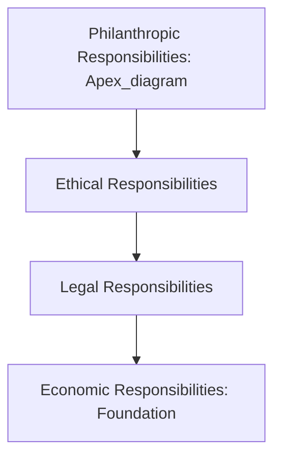

## Corporate Social Responsibility Strategy

### Definition and Historical Development

Corporate Social Responsibility (CSR) is the set of organizational commitments, practices, and initiatives through which a firm addresses its social and environmental impact and obligations to stakeholders beyond its shareholders, historically encompassing philanthropy, community investment, ethical labor and environmental practices, and voluntary self-regulation beyond legal compliance minimums. CSR strategy, specifically, refers to the deliberate integration of these commitments into the organization's strategic planning process, as distinct from ad hoc or reactive CSR activity conducted independently of core strategic decision-making.

CSR as a concept has evolved considerably since its mid-20th-century origins, moving through several identifiable phases: an early emphasis on philanthropic giving largely disconnected from core business operations; a subsequent compliance and risk-mitigation orientation focused on avoiding reputational and legal harm; and more recent frameworks (including Creating Shared Value and the ESG integration approach discussed previously in this chapter) that position social and environmental responsibility as integral to, rather than separate from, core value creation and competitive strategy.

### CSR in Relation to ESG Integration and Sustainable Business Model Design

A precise conceptual distinction among these three related but non-identical concepts, all covered within this chapter, is useful:

| Concept | Primary Focus | Typical Scope |
| --- | --- | --- |
| CSR Strategy | Organizational commitments and initiatives addressing social/environmental obligations and stakeholder relationships | Broad, historically inclusive of philanthropy, ethics, community relations |
| ESG Integration | Incorporating environmental, social, governance factors into strategic decision-making, risk management, and performance measurement | Investor and risk-management-oriented, emphasizing measurement and disclosure |
| Sustainable Business Model Design | Structuring the core value creation/delivery/capture architecture around embedded sustainability | Focused specifically on business model architecture |

[Inference] These three terms carry overlapping meanings that are used with varying precision across different organizational, academic, and practitioner contexts; the distinctions presented above reflect a commonly used analytical separation in contemporary strategic management literature, though usage in practice is not fully standardized, and many organizations use these terms somewhat interchangeably or with organization-specific definitions.

### Carroll's Pyramid of Corporate Social Responsibility

One of the most widely referenced conceptual frameworks for CSR, developed by Archie Carroll, organizes corporate social responsibilities into four hierarchical categories:

- **Economic responsibilities** (the foundation): The responsibility to be profitable, since a financially unsustainable organization cannot fulfill any of its other responsibilities to stakeholders over time
- **Legal responsibilities**: The responsibility to comply with laws and regulations, representing society's codified expectations of acceptable business conduct
- **Ethical responsibilities**: The responsibility to act in ways consistent with societal norms and ethical expectations that may exceed what law strictly requires
- **Philanthropic responsibilities** (the apex): The responsibility to contribute resources to the community and broader society, improving quality of life beyond what is required by economic, legal, or ethical obligation

Carroll's framework is significant for CSR strategy because it explicitly positions economic performance as the foundational responsibility upon which the others depend, directly countering a common misconception that CSR and financial performance are inherently in tension — the framework instead frames sustained economic viability as a precondition for meeting broader social responsibilities, not a competing objective.

### Creating Shared Value (CSV)

**Creating Shared Value**, a framework developed by Michael Porter and Mark Kramer, represents a significant conceptual evolution beyond traditional CSR, explicitly arguing that the most effective approach to social responsibility involves identifying opportunities where addressing social needs directly creates competitive advantage and economic value for the firm, rather than treating social responsibility and economic value creation as separate, potentially competing activities (the traditional CSR framing that Porter and Kramer explicitly critique as an inadequate "trade-off" mental model).

Porter and Kramer identify three principal mechanisms through which shared value can be created:

- **Reconceiving products and markets**: Identifying unmet social needs that represent genuine market opportunities, designing products and services that address these needs profitably (closely related to the base-of-the-pyramid business model archetype discussed under sustainable business model design)
- **Redefining productivity in the value chain**: Identifying ways that addressing social and environmental issues within the value chain (energy use, resource efficiency, employee wellbeing, supplier practices) simultaneously reduces cost or improves quality, generating both social benefit and economic value
- **Building supportive industry clusters**: Investing in the broader local business ecosystem and community conditions (education, infrastructure, supplier development) that support the firm's own long-term competitiveness, benefiting the firm and the surrounding community simultaneously

[Inference] The Creating Shared Value framework has itself been the subject of academic critique, including arguments that it may understate genuine cases where social benefit and shareholder economic interest are not readily reconcilable, or that it risks providing intellectual cover for organizations to selectively emphasize socially-beneficial-and-profitable activities while deprioritizing socially important but less directly profitable responsibilities; this critique is presented as part of an ongoing academic and practitioner debate rather than a settled conclusion about the framework's validity or limitations.

### Strategic CSR Design Process

A structured approach to developing genuinely strategic (rather than peripheral or reactive) CSR initiatives typically follows a process resembling:

1. **Stakeholder mapping and materiality assessment**: Identifying the organization's key stakeholders and the social/environmental issues most material to both stakeholder concern and the organization's specific business context — closely related to the materiality assessment process discussed under ESG integration
2. **Competency and asset alignment assessment**: Evaluating which CSR initiatives can leverage the organization's existing distinctive competencies, resources, and capabilities, since CSR initiatives built on core organizational strengths tend to be more effective, more sustainable, and more genuinely differentiated from what competitors could readily replicate than generic philanthropic activity unconnected to core capability
3. **Strategic fit evaluation**: Assessing which potential CSR initiatives most directly connect to and reinforce the organization's core strategic positioning (cost leadership, differentiation, or focus strategy), maximizing the likelihood that CSR investment also supports competitive strategy rather than operating as a wholly separate cost center
4. **Initiative design and resource commitment**: Formally designing selected initiatives with clear objectives, resource allocation, and success metrics, integrated into the organization's planning and budgeting processes rather than funded through discretionary, unplanned allocations
5. **Performance measurement and reporting**: Establishing KPIs to track CSR initiative performance and impact, integrated with the broader ESG measurement and disclosure architecture discussed previously in this chapter
6. **Stakeholder communication**: Transparently communicating CSR strategy, initiatives, and outcomes to relevant stakeholders, while avoiding the greenwashing risk discussed under ESG integration through substantiated, verifiable claims rather than unsubstantiated or exaggerated ones

### CSR Strategic Positioning Approaches

Organizations can adopt varying levels of strategic ambition and integration in their approach to CSR, commonly characterized along a spectrum:

- **Reactive/defensive**: CSR activity undertaken primarily in response to external pressure (activist campaigns, regulatory threat, reputational crisis), with minimal proactive strategic integration
- **Compliance-oriented**: CSR framed primarily around meeting minimum legal and regulatory obligations, without significant activity beyond what is required
- **Accommodative**: Voluntary CSR activity beyond strict compliance requirements, often in response to stakeholder expectations, but not deeply integrated with core competitive strategy
- **Proactive/strategic**: CSR initiatives deliberately designed and resourced as an integral part of competitive strategy, consistent with the Creating Shared Value logic, where social and economic value creation are pursued as mutually reinforcing objectives rather than separately managed activities

[Inference] This spectrum represents a commonly used analytical categorization in strategic CSR literature for describing varying degrees of CSR strategic maturity and integration; organizations in practice frequently exhibit characteristics of multiple categories simultaneously across different initiatives, rather than falling cleanly into a single category across their entire CSR activity.

### CSR and Competitive Advantage

Strategic CSR literature identifies several mechanisms through which well-designed CSR strategy can contribute to sustainable competitive advantage, extending the value-creation mechanisms discussed under ESG integration:

- **Differentiation through authentic values alignment**: CSR initiatives genuinely aligned with organizational values and core competencies can support brand differentiation with customer segments that value such alignment, though (as with ESG generally) the strength of any resulting price premium or purchase preference is market- and segment-dependent rather than universal
- **Risk mitigation and social license to operate**: Proactive CSR engagement with communities and stakeholders can reduce the likelihood of regulatory, reputational, or operational disruption arising from stakeholder conflict, directly connecting to the strategic risk categories discussed under identifying and categorizing strategic risks
- **Innovation stimulus**: Addressing social or environmental challenges as design constraints can stimulate genuine product, process, and business model innovation that would not have emerged absent the CSR-driven design challenge, consistent with the Creating Shared Value logic of reconceiving products and markets
- **Talent attraction and organizational culture**: Strategic CSR commitment can support talent attraction, retention, and internal organizational culture and engagement, consistent with the talent-related rationale discussed under ESG integration

### Common Pitfalls and Criticisms of CSR Strategy

- **Disconnection from core strategy**: CSR initiatives pursued as isolated philanthropic activity unconnected to core business strategy, competencies, or value chain frequently fail to generate either meaningful social impact at scale or meaningful strategic business benefit, representing the specific failure mode that Creating Shared Value and strategic CSR frameworks are designed to address.
- **Greenwashing and "CSR-washing"**: Overstating or misrepresenting the genuine scope, impact, or sincerity of CSR commitments — the reputational and regulatory risks here mirror the greenwashing risk discussed under ESG integration and disclosure.
- **Superficial stakeholder engagement**: Conducting stakeholder consultation processes that do not genuinely influence CSR strategy design, functioning as a legitimation exercise rather than authentic input into decision-making.
- **Underinvestment relative to public commitment**: A gap between publicly announced CSR commitments and actual resource allocation and organizational priority, creating reputational exposure if the gap becomes visible to stakeholders or media scrutiny.
- **Short-termism undermining long-horizon CSR investment**: As with ESG-related capital investment more broadly, CSR initiatives with long payback periods or diffuse, difficult-to-quantify benefits can be deprioritized under short-term financial performance pressure, a tension shared with the broader Value-Based Management short-termism concern discussed earlier in this course.
- **CSR as reputational insurance without behavior change**: Using visible CSR activity to build reputational goodwill that is drawn upon during periods of controversy or crisis, without corresponding genuine change in the underlying practices that generated stakeholder concern in the first place.

### Related Topics

- ESG integration into corporate strategy
- Sustainable business model design
- Stakeholder theory versus shareholder primacy
- Creating Shared Value framework (Porter and Kramer)
- Strategic risk management and social license to operate
- Corporate reputation management
- Value-Based Management and long-term versus short-term investment horizon tension
- Circular economy strategy