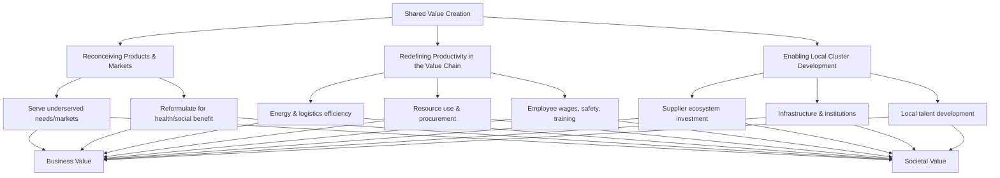

## Shared Value Creation

### Definition and Core Concept

Shared Value Creation refers to policies and operating practices that enhance the competitiveness of a firm while simultaneously advancing the economic and social conditions of the communities in which it operates. The concept was formally articulated by Michael Porter and Mark Kramer in their 2011 Harvard Business Review article "Creating Shared Value," which argued that businesses should reconnect company success with social progress rather than treating them as competing priorities.

The central premise is that societal needs, not just conventional economic needs, define markets, and that social harms or weaknesses frequently create internal costs for firms (wasted energy, costly accidents, inefficient use of raw materials, need for remedial training) without requiring anyone to pay for those externalities. Addressing societal challenges can therefore create economic value by expanding markets, reducing costs, or enabling innovation.

### Distinction from Corporate Social Responsibility (CSR)

Shared Value is frequently contrasted with traditional CSR, though the two are not mutually exclusive.

| Dimension | Traditional CSR | Shared Value Creation |
| --- | --- | --- |
| Value framing | Doing good vs. doing well (trade-off) | Economic and social value jointly |
| Driver | Reputation, compliance, philanthropy | Competitive advantage and strategy |
| Budget logic | Discretionary spending, often capped | Reallocation of the full corporate budget |
| Integration | Peripheral to strategy, often a separate department | Embedded in core business strategy |
| Example agenda | Cause marketing, community giving, corporate philanthropy | Reconceiving products, redefining productivity in the value chain, building supportive industry clusters |

[Inference] Porter and Kramer's framing of CSR as largely reactive and peripheral was itself contested by CSR scholars, who argued that strategic CSR already incorporated many of these ideas; this remains a debated point in the management literature rather than a settled distinction.

### The Three Mechanisms of Shared Value

Porter and Kramer identify three primary ways companies can create shared value.

#### 1. Reconceiving Products and Markets

Firms identify unmet or underserved societal needs and design products or services that address them profitably. This includes serving previously overlooked markets (e.g., low-income consumers, smallholder farmers) and reformulating existing products for health, environmental, or social benefit.

**Example:** A food and beverage company reformulating products to reduce sodium, sugar, and saturated fat content in response to nutrition and public health concerns, opening new health-conscious market segments while mitigating regulatory and reputational risk.

#### 2. Redefining Productivity in the Value Chain

Companies improve the quality, quantity, cost, and reliability of inputs and distribution while simultaneously acting as stewards of essential natural resources and driving economic and social development in the areas where they operate. Sub-areas include:

- **Energy use and logistics** — reducing energy consumption and transportation footprints, which cuts both costs and emissions
- **Resource use** — improving water use efficiency, reducing packaging, and enabling recycling and reuse
- **Procurement** — moving away from purely transactional, cost-minimizing supplier relationships toward practices that improve supplier quality and productivity (e.g., providing access to inputs, financing, or technical assistance)
- **Distribution** — rethinking distribution channels to reduce cost or improve market access
- **Employee productivity** — investing in wages, safety, wellness, training, and advancement opportunities, which studies increasingly link to lower turnover and higher productivity [Inference: the magnitude of these effects is context- and firm-specific and not universally guaranteed]
- **Location** — decisions about where to locate facilities that account for logistics costs and access to talent alongside social impact

**Example:** A beverage company working directly with smallholder farmers to improve agricultural techniques and yields, securing a more reliable and higher-quality supply chain while raising farmer incomes.

#### 3. Enabling Local Cluster Development

No company is self-contained; success depends on supporting industries and infrastructure around it — reliable local suppliers, functioning transportation and communications infrastructure, access to talent, and effective, transparent markets. Building or strengthening these "clusters" in a company's key operating locations can lower transaction costs, improve productivity, and expand available skilled labor, while also generating broad-based regional economic and social development.

**Example:** A technology company investing in local vocational training programs or digital infrastructure in a developing region where it sources labor or sells products, strengthening the ecosystem it depends on.

### Diagram: Shared Value Mechanisms

### Strategic Rationale and Link to Competitive Advantage

Shared Value connects to established strategy frameworks rather than replacing them:

- **Value Chain Analysis** — each primary and support activity is examined for shared value opportunities, not just cost or differentiation opportunities
- **Five Forces / Industry Structure** — improving the health of suppliers, buyers, and complementary institutions in an industry can shift competitive dynamics favorably
- **Resource-Based View** — investments in unique social capabilities (e.g., proprietary supplier development programs) can constitute a source of competitive advantage that is difficult for rivals to imitate

The strategic logic is that shared value initiatives, when done well, should show up in conventional performance measures — cost reduction, revenue growth, margin improvement, market share, or risk mitigation — rather than being justified solely on ethical grounds.

### Criticisms and Limitations

- **Ignores inherent trade-offs:** Critics (notably Andrew Crane and colleagues in a widely cited 2014 critique) argue that shared value creation understates situations where corporate profit and societal welfare are genuinely in tension, and that not all social problems have profitable solutions
- **Naive about compliance and governance:** The framework has been criticized for underplaying the role of regulation, law, and independent governance in ensuring responsible business conduct, implicitly assuming voluntary corporate action is sufficient
- **Insufficiently attentive to business's role in causing social problems:** Some critics argue the framework treats companies primarily as solvers of societal problems, understating cases where core business models are a source of the harm (e.g., extractive industries, certain consumer product categories)
- **Risk of "shared value washing":** [Inference] Because the concept lends legitimacy to CSR-adjacent activities, it can be invoked rhetorically for initiatives that generate limited genuine social benefit, similar to concerns raised about greenwashing
- **Measurement difficulty:** Quantifying the "shared" social return on a given initiative is often more difficult than quantifying the financial return, complicating prioritization and accountability

### Relationship to ESG and Stakeholder Theory

Shared Value Creation overlaps conceptually with, but is distinct from, adjacent frameworks:

- **ESG (Environmental, Social, Governance):** ESG is primarily a measurement and disclosure framework used by investors to assess non-financial risk and performance; shared value is a strategy formulation concept about how to generate competitive advantage through social value. A firm can score well on ESG metrics without necessarily practicing shared value strategy, and vice versa.
- **Stakeholder Theory (Freeman):** Stakeholder theory provides the underlying justification that firms must attend to multiple stakeholder interests (not just shareholders) to sustain long-term value; shared value operationalizes this by identifying specific mechanisms through which stakeholder and shareholder interests can converge.
- **Triple Bottom Line (Elkington):** The triple bottom line (people, planet, profit) proposes parallel accounting across three dimensions; shared value instead argues these dimensions should be integrated into a single strategic logic rather than tracked as separate "bottom lines."

### Implementation Considerations

**Key Points**

- Shared value initiatives should be evaluated with the same rigor as any other strategic investment (ROI, market sizing, competitive positioning)
- Cross-functional integration is critical — shared value cannot reside solely in a CSR or sustainability department if it is meant to affect core strategy
- Metrics should combine financial indicators (cost savings, revenue growth) with social outcome indicators (farmer income change, employee retention, community health outcomes) specific to the initiative
- Leadership commitment and long time horizons matter, since many shared value investments (e.g., supplier development, cluster building) have payback periods longer than typical CSR campaigns
- [Unverified] The extent to which shared value strategies outperform conventional strategies in financial terms across industries has not been established through large-scale, controlled empirical research; most evidence remains case-based

### Illustrative Case Patterns (Generic, Non-Attributed)

- **Agribusiness:** Multinational sourcing companies providing farmer training, credit access, and quality-linked pricing to smallholders, improving both supply security and rural incomes
- **Healthcare/Pharma:** Tiered pricing models and last-mile distribution partnerships that expand access to medicines in low-income markets while building brand presence ahead of future market growth
- **Financial Services:** Microfinance and mobile banking products that extend formal financial access to unbanked populations, creating new customer bases while advancing financial inclusion
- **Manufacturing:** Circular economy redesigns (e.g., take-back and remanufacturing programs) that reduce material costs while cutting waste

### SVG Diagram: Value Convergence Model

<svg xmlns="http://www.w3.org/2000/svg" viewBox="0 0 640 340">
<text x="320" y="28" text-anchor="middle" font-size="16" font-weight="bold" fill="#1a1a1a">Shared Value: Convergence Model (svg_diagram)</text>
<circle cx="230" cy="180" r="120" fill="#4a7fb5" fill-opacity="0.55" stroke="#2c5a8c" stroke-width="2" />
<circle cx="410" cy="180" r="120" fill="#b5794a" fill-opacity="0.55" stroke="#8c5a2c" stroke-width="2" />
<text x="160" y="130" font-size="14" font-weight="bold" fill="#1a1a1a">Economic Value</text>
<text x="160" y="150" font-size="11" fill="#333">Cost, revenue,</text>
<text x="160" y="165" font-size="11" fill="#333">margin, growth</text>
<text x="450" y="130" font-size="14" font-weight="bold" fill="#1a1a1a">Social Value</text>
<text x="450" y="150" font-size="11" fill="#333">Community welfare,</text>
<text x="450" y="165" font-size="11" fill="#333">environmental outcomes</text>
<text x="320" y="185" text-anchor="middle" font-size="13" font-weight="bold" fill="#ffffff">Shared</text>
<text x="320" y="202" text-anchor="middle" font-size="13" font-weight="bold" fill="#ffffff">Value</text>
<text x="320" y="290" text-anchor="middle" font-size="11" font-style="italic" fill="#555">Intersection = initiatives creating both</text>
<text x="320" y="305" text-anchor="middle" font-size="11" font-style="italic" fill="#555">competitive advantage and societal benefit</text>
</svg>

### Conclusion

Shared Value Creation reframes the relationship between business strategy and social impact by proposing that the two can be mutually reinforcing rather than inherently opposed. Its practical value lies in the three mechanisms — reconceiving products and markets, redefining value chain productivity, and enabling local cluster development — which give managers concrete levers for integrating social considerations into core strategic decision-making. However, the framework has legitimate limitations, particularly its understatement of genuine trade-offs and the risk of superficial adoption, meaning it functions best as one lens among several (alongside ESG measurement, stakeholder theory, and conventional competitive strategy analysis) rather than a complete substitute for rigorous social and environmental accountability.

**Related Topics**

- Porter's Five Forces and industry cluster theory
- Value Chain Analysis (Porter)
- Stakeholder Theory (Freeman) and stakeholder mapping
- ESG metrics, ratings, and disclosure frameworks (GRI, SASB, ISSB)
- Triple Bottom Line and Integrated Reporting
- Base of the Pyramid (BoP) strategy
- Corporate Social Responsibility (CSR) vs. Corporate Social Performance
- B Corporations and benefit corporation legal structures
- Supplier development and inclusive sourcing strategy
- Circular economy business models