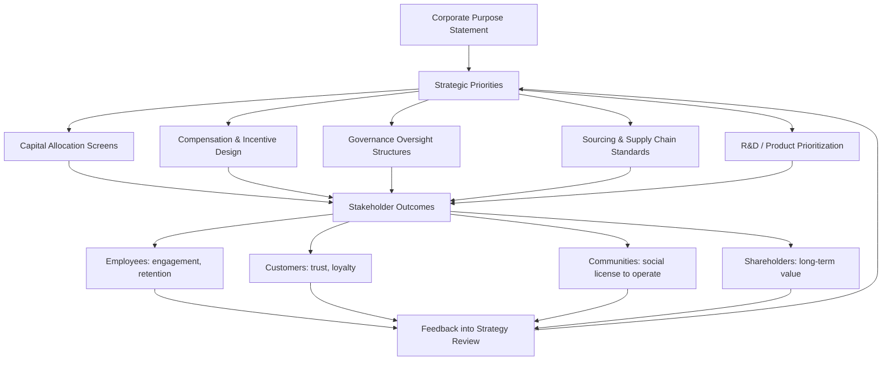

## Stakeholder Capitalism and Purpose-Driven Strategy

### Definition and Core Concept

Stakeholder capitalism is a system of corporate governance and strategy in which firms orient decision-making toward creating long-term value for all stakeholders — employees, customers, suppliers, communities, and the environment — rather than prioritizing shareholder wealth maximization as the sole or dominant objective. Purpose-driven strategy is the operational counterpart: it embeds an organization's stated reason for existing (beyond profit generation) into strategic choices about markets served, products developed, and resource allocation.

The two concepts are linked but distinct: stakeholder capitalism describes a macro-level governance philosophy about *whose* interests a firm should serve, while purpose-driven strategy describes a firm-level mechanism for translating a stated *why* into concrete strategic and operational decisions.

### Theoretical Foundations

#### Stakeholder Theory (Freeman, 1984)

R. Edward Freeman's foundational work, *Strategic Management: A Stakeholder Approach*, defined a stakeholder as any group or individual who can affect, or is affected by, the achievement of an organization's objectives. Freeman argued that managers must balance the interests of these groups rather than treat shareholders as categorically privileged.

Core stakeholder categories typically include:

- **Primary/direct stakeholders** — shareholders, employees, customers, suppliers (parties with direct contractual or transactional relationships)
- **Secondary/indirect stakeholders** — communities, government/regulators, media, civil society organizations, competitors (parties without direct transactions but with influence over or exposure to firm activity)

#### Contrast with Shareholder Primacy (Friedman Doctrine)

Milton Friedman's 1970 essay "The Social Responsibility of Business Is to Increase Its Profits" articulated the competing view: that a corporation's sole social responsibility is to increase profits within the rules of the game (open, free competition without deception or fraud), and that using corporate resources for broader social ends is effectively an unauthorized tax on shareholders.

| Dimension | Shareholder Primacy (Friedman) | Stakeholder Capitalism (Freeman et al.) |
| --- | --- | --- |
| Primary objective | Maximize shareholder wealth | Balance value creation across stakeholders |
| Manager's role | Agent of shareholders | Steward of multiple relationships |
| Time horizon | Often implicitly short-to-medium term | Explicitly long-term |
| Social responsibility | Bounded by legal compliance and market rules | Integrated into core strategic objectives |
| Risk view | Externalities are someone else's problem unless regulated | Externalities create long-term firm risk |

[Inference] The degree to which these two positions are actually incompatible in practice is debated; some scholars (e.g., proponents of "enlightened shareholder value") argue long-run shareholder value maximization requires stakeholder consideration, effectively converging with stakeholder capitalism under a long time horizon.

### Historical and Institutional Milestones

- **1984** — Freeman publishes stakeholder management framework
- **1997–2019** — U.S. Business Roundtable's official "Statement on the Purpose of a Corporation" affirms shareholder primacy as the guiding principle
- **2019** — Business Roundtable issues a revised statement, signed by 181 CEOs, redefining corporate purpose to explicitly commit to delivering value to customers, investing in employees, dealing fairly with suppliers, supporting communities, and generating long-term value for shareholders
- **World Economic Forum (Davos)** — has promoted a "Davos Manifesto" and stakeholder capitalism metrics framework advocating that companies serve all stakeholders

[Unverified] The practical behavioral impact of the 2019 Business Roundtable statement — whether signatory firms measurably changed capital allocation, wage policy, or governance practices as a result — remains an area of ongoing empirical debate, with some academic studies finding limited evidence of concrete follow-through.

### Purpose-Driven Strategy: Components

#### 1. Purpose Statement Design

A well-constructed purpose statement typically:

- Articulates *why* the organization exists beyond profit (distinct from mission, which describes *what* it does, and vision, which describes *where* it aims to be)
- Is specific enough to guide trade-off decisions, not so generic it could apply to any company
- Connects to a genuine capability or market position the firm holds

#### 2. Strategic Embedding Mechanisms

Purpose becomes strategy (rather than marketing rhetoric) through concrete mechanisms:

- **Portfolio and capital allocation decisions** — screening investments, acquisitions, or product launches against purpose alignment
- **Incentive and compensation design** — tying executive and employee compensation, at least partially, to non-financial or stakeholder-related metrics
- **Governance structures** — board-level committees for sustainability/stakeholder oversight, dual-class structures protecting long-term orientation, or alternative legal forms (see Legal Structures below)
- **Supply chain and sourcing standards** — codified requirements reflecting purpose commitments (e.g., labor standards, environmental sourcing criteria)
- **Product and R&D prioritization** — directing innovation pipelines toward purpose-aligned opportunities

#### 3. Legal and Organizational Structures Supporting Purpose

- **Benefit Corporations** — a U.S. legal status requiring companies to consider stakeholder impact (not just shareholder return) in fiduciary decision-making, and to report on social/environmental performance
- **B Corp Certification** — a private certification (administered by B Lab) assessing a company's overall social and environmental performance against a standard, distinct from the legal benefit corporation status (a company can be one, both, or neither)
- **Steward-ownership models** — structures separating voting control from profit rights, often used to lock in mission orientation regardless of shareholder pressure [Inference: these remain a small share of overall corporate forms and their long-run performance characteristics relative to conventional ownership are not well-established at scale]

### Diagram: From Purpose to Strategic Action

### Strategic Rationale: Why Purpose and Stakeholder Orientation Can Drive Performance

- **Talent attraction and retention** — particularly relevant for younger workforce segments, who report purpose alignment as a factor in employment decisions [Inference: survey-based evidence on stated preferences does not always predict actual retention or productivity outcomes]
- **Customer trust and brand equity** — purpose alignment can differentiate commoditized offerings and support premium positioning
- **Risk mitigation** — strong stakeholder relationships (regulators, communities, suppliers) can reduce regulatory, reputational, and operational risk exposure, sometimes termed a "social license to operate"
- **Access to capital** — growth in ESG-oriented and impact investing mandates has, in some markets, made stakeholder-oriented positioning relevant to capital access [Inference: the durability of this capital flow trend is subject to shifting regulatory and investor sentiment and should not be treated as guaranteed]
- **Innovation direction** — purpose can provide a longer-term compass for R&D that pure short-term financial screening might deprioritize

### Criticisms and Tensions

- **Accountability diffusion:** Critics (including some corporate governance scholars) argue that "serving all stakeholders" without a clear priority ordering can reduce managerial accountability, since underperformance can always be justified by trade-offs among competing stakeholder interests
- **Measurement and enforceability:** Unlike shareholder returns, most stakeholder outcomes lack a single, comparable, audited metric, making it harder to hold management accountable for purpose commitments
- **"Purpose washing":** Statements of purpose not backed by structural or incentive changes risk being dismissed as public relations exercises rather than genuine strategic commitments
- **Legal fiduciary duty questions:** In many jurisdictions, directors' fiduciary duties remain primarily owed to shareholders (subject to jurisdiction-specific variation); purpose-driven decisions that reduce shareholder value can raise legal exposure absent a benefit corporation structure or explicit charter provisions [Unverified — this varies materially by jurisdiction and should not be treated as legal advice]
- **Empirical performance evidence is mixed:** [Unverified] Academic findings on whether purpose-driven or high stakeholder-orientation firms outperform financially are mixed and sensitive to methodology, time period, and industry; causality is difficult to establish given that better-managed firms may adopt purpose framing for reasons correlated with, rather than caused by, purpose itself

### Stakeholder Capitalism Metrics (Illustrative Categories)

The World Economic Forum's stakeholder capitalism metrics initiative organizes disclosure around four pillars:

| Pillar | Illustrative Metrics |
| --- | --- |
| Principles of Governance | Governing purpose, quality of governing body, stakeholder engagement, anti-corruption |
| Planet | Greenhouse gas emissions, land use, water consumption |
| People | Diversity, wage levels, health and safety, training hours |
| Prosperity | Employment created, economic contribution, tax paid, R&D investment |

[Unverified] Specific metric definitions and reporting requirements continue to evolve; organizations should consult current WEF and related standard-setter (e.g., ISSB, GRI) publications for authoritative, up-to-date metric definitions rather than relying on a fixed list.

### Implementation Framework

**Key Points**

- Purpose should be tested against a "trade-off test": can it survive a scenario where it costs the firm short-term profit? If not, it is likely marketing language rather than strategy
- Governance mechanisms (board oversight, compensation linkage) are what convert purpose from aspiration into enforceable strategic discipline
- Metrics should be selected for decision-relevance, not just disclosure compliance
- Cross-functional ownership (not confined to a CSR/sustainability team) is necessary for purpose to shape core resource allocation
- Purpose statements should be revisited periodically as markets, stakeholder expectations, and competitive context evolve

### Illustrative Example (Generic, Non-Attributed)

A mid-sized consumer goods manufacturer articulates a purpose centered on reducing environmental impact across its product lifecycle. Strategic embedding might include: screening new product launches for recyclability before approval, tying a portion of senior leadership bonuses to verified emissions-reduction targets, requiring key suppliers to meet defined labor and environmental standards as a condition of contract renewal, and establishing a board sustainability committee with authority to escalate concerns about strategic decisions inconsistent with stated purpose. The test of genuine purpose-driven strategy is whether the firm can point to at least one instance where it forwent a profitable opportunity because it was inconsistent with the stated purpose.

### Relationship to Adjacent Frameworks in This Chapter

- **Shared Value Creation** provides specific mechanisms (product reconception, value chain productivity, cluster development) through which stakeholder-oriented strategy can also generate competitive advantage
- **ESG** provides the measurement and disclosure infrastructure that can operationalize accountability for stakeholder capitalism commitments
- **Corporate Governance** structures (board composition, committee mandates, executive compensation design) are the primary enforcement mechanism converting purpose from statement into strategic constraint

### Conclusion

Stakeholder capitalism reframes the fundamental question of corporate purpose from "for whom does the firm create value" toward a multi-constituency model, while purpose-driven strategy provides the operational architecture for embedding that orientation into concrete decisions. The frameworks' strategic credibility depends heavily on whether governance, incentive, and capital allocation mechanisms are actually restructured to enforce stated commitments — absent such mechanisms, purpose risks remaining aspirational rather than strategic. Firms and scholars remain divided on both the practical enforceability and the financial performance implications of this shift, making it an actively contested area of strategic management theory and corporate governance practice rather than a settled consensus.

**Related Topics**

- Shared Value Creation (Porter & Kramer)
- Corporate Governance and Board Oversight Structures
- ESG Metrics, Ratings, and Disclosure Frameworks
- Agency Theory and the Separation of Ownership and Control
- Triple Bottom Line and Integrated Reporting
- B Corporations and Benefit Corporation Legal Structures
- Executive Compensation Design and Non-Financial Incentives
- Corporate Social Responsibility (CSR) vs. Corporate Social Performance
- Legitimacy Theory and Social License to Operate
- Long-Termism vs. Short-Termism in Capital Markets