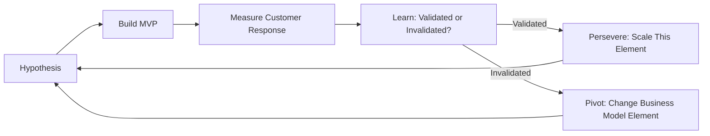
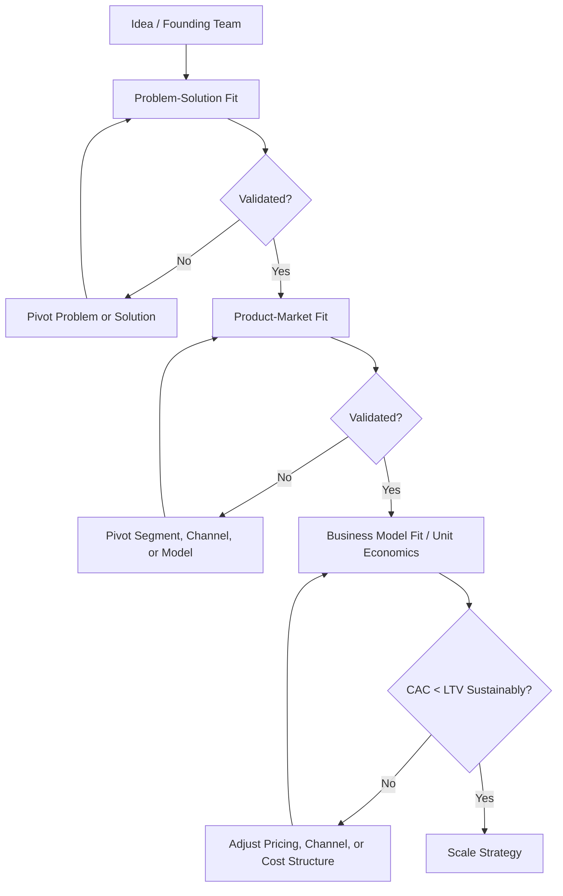

## Strategy for Startups and New Ventures

### Definition and Core Concept

Strategy for startups and new ventures concerns how young, resource-constrained organizations make decisions under conditions of extreme uncertainty — where the market, the customer, the business model, and sometimes the product itself are not yet validated. This differs substantially from strategy for established firms, which typically operate with known customer bases, proven business models, and predictable competitive dynamics. New venture strategy therefore emphasizes hypothesis testing, rapid iteration, and resource husbanding over long-range planning and market positioning analysis.

### Distinctive Conditions Facing New Ventures

- **Liability of newness** — a well-documented phenomenon (Stinchcombe, 1965) whereby new organizations face higher failure rates due to lack of established routines, relationships, legitimacy, and trust relative to incumbents
- **Resource constraints** — limited capital, talent, and time, requiring different strategic logic than resource-rich incumbents
- **Radical uncertainty** — unlike risk (where probability distributions of outcomes are knowable), many startup decisions involve genuine uncertainty where outcomes and even the relevant variables are unknown in advance
- **Small numbers/high variance outcomes** — venture-backed portfolios in particular are built around the expectation that most individual ventures fail and a small number generate outsized returns [Inference: exact loss/return ratios cited in industry commentary vary by fund, vintage year, and methodology, and should not be treated as fixed constants]

### Effectuation vs. Causation Logic

Saras Sarasvathy's research on expert entrepreneurs (early 2000s) identified two contrasting decision-making logics relevant to new venture strategy.

| Dimension | Causation Logic | Effectuation Logic |
| --- | --- | --- |
| Starting point | Defined goal, then select means to achieve it | Available means (who I am, what I know, who I know), then imagine possible goals |
| Approach to uncertainty | Prediction — forecast the future and plan accordingly | Control — focus on aspects of the future controllable through action |
| Risk approach | Expected return calculation | Affordable loss — how much can I afford to lose in this action |
| View of other stakeholders | Competitive analysis | Pre-commitments and partnerships that co-create the venture |
| View of the unexpected | Contingencies to avoid | Leverage — surprises as sources of new opportunity |
| Typical fit | Established firms in known markets | Early-stage ventures in uncertain markets |

[Inference] Sarasvathy's framework describes a spectrum rather than a strict binary; most experienced founders apply both logics at different stages and for different classes of decisions, shifting toward causation logic as uncertainty resolves.

### The Lean Startup Methodology

Eric Ries's Lean Startup framework (drawing on Steve Blank's customer development model) provides a widely adopted operational methodology for navigating early-stage uncertainty.

#### Build-Measure-Learn Loop

The central iterative cycle:

1. **Build** — construct a Minimum Viable Product (MVP): the smallest version of a product that allows the team to test a specific hypothesis with real customers
2. **Measure** — collect data on customer behavior and response, using metrics tied to the hypothesis being tested (not vanity metrics such as raw pageviews or downloads)
3. **Learn** — validate or invalidate the hypothesis and decide whether to persevere (continue the current strategy), pivot (fundamentally change one or more elements of the business model while retaining validated learning), or, less commonly discussed but real, shut down

#### Types of Pivots (Ries's Taxonomy, Illustrative Subset)

- **Zoom-in pivot** — a single feature becomes the whole product
- **Customer segment pivot** — the product is correct but serves a different customer than originally targeted
- **Channel pivot** — the product/customer combination is correct but the distribution/sales channel changes
- **Business model pivot** — shift between, e.g., a high-margin/low-volume model and a low-margin/high-volume model, or between B2B and B2C
- **Platform pivot** — shift between selling a single application and a platform, or vice versa

### Customer Development (Blank)

Steve Blank's customer development framework runs parallel to product development and consists of four stages:

1. **Customer Discovery** — test hypotheses about customer problems and whether the proposed product solves a real, significant problem
2. **Customer Validation** — test whether a repeatable and scalable sales/business model exists
3. **Customer Creation** — build end-user demand and scale marketing/sales once the model is validated
4. **Company Building** — transition from an informal, hypothesis-driven learning organization to a structured organization with formal departments

### Business Model Design for New Ventures

#### Business Model Canvas (Osterwalder & Pigneur)

A widely used tool structuring nine building blocks for articulating and testing a venture's business model:

- Customer Segments
- Value Propositions
- Channels
- Customer Relationships
- Revenue Streams
- Key Resources
- Key Activities
- Key Partnerships
- Cost Structure

For early-stage ventures, Ash Maurer's adaptation — the **Lean Canvas** — replaces some blocks (Key Partnerships, Key Resources, Customer Relationships) with startup-specific concerns: Problem, Solution, Key Metrics, and Unfair Advantage, reflecting the greater emphasis on problem-solution fit before scaling.

### Achieving Fit: The Sequential Validation Framework

New venture strategy is often described as a sequence of "fit" milestones that must be validated before scaling:

1. **Problem-Solution Fit** — evidence that a real, significant customer problem exists and that the proposed solution concept addresses it
2. **Product-Market Fit** — a term popularized by Marc Andreessen, denoting the point at which a product satisfies strong market demand, typically evidenced by organic growth, low churn, and customers who would be "very disappointed" without the product (a heuristic threshold sometimes cited, e.g., via Sean Ellis's PMF survey methodology, is roughly 40% of surveyed users indicating this) [Unverified as a universal threshold — this figure originates from a specific survey methodology and its generalizability across industries and business models is not established]
3. **Business Model Fit** — evidence that the venture can acquire customers at a cost sustainably lower than the value it derives from them, indicating a scalable and repeatable revenue engine
4. **Scale readiness** — organizational, operational, and financial capacity to grow the validated model efficiently

### Financing Strategy and Its Interaction with Venture Strategy

Financing strategy shapes and constrains venture strategy at each stage:

| Stage | Typical Capital Source | Strategic Implication |
| --- | --- | --- |
| Pre-seed/idea | Founder savings, friends & family, accelerators | Maximum strategic flexibility; minimal external constraint |
| Seed | Angel investors, seed VC, some accelerators | First external validation signal; initial governance obligations begin |
| Series A and beyond | Venture capital | Investor expectations for growth trajectory and eventual exit increasingly shape strategic choices (e.g., growth-over-profitability logic) |
| Alternative paths | Revenue-based financing, bootstrapping, crowdfunding | Can preserve founder control and strategic flexibility at the cost of slower capital-fueled growth |

[Inference] The dominant "venture-scale growth" strategic logic (prioritizing rapid user/revenue growth over near-term profitability) is appropriate primarily for ventures pursuing markets with strong network effects or winner-take-most dynamics; it is not the correct strategic logic for all new ventures, including many that are better served by profitability-first, bootstrapped growth paths.

### Entry Strategy Considerations for New Ventures

- **Market entry timing** — first-mover advantages (brand recognition, switching costs, network effects) versus fast-follower advantages (learning from pioneer mistakes, lower market education costs) [Inference: empirical evidence on first-mover advantage is mixed and heavily dependent on industry structure; it is not a reliable general rule]
- **Niche/beachhead strategy** — entering a narrowly defined initial market segment where the venture can achieve a dominant position before expanding, a concept central to Geoffrey Moore's *Crossing the Chasm* framework for technology adoption
- **Judo strategy** — using an incumbent's size and existing commitments against it, by entering markets or making moves the incumbent is structurally unwilling or unable to respond to quickly [Inference: this term is used inconsistently across strategy literature and does not have a single canonical definition]

### Common Strategic Failure Modes

- **Premature scaling** — investing in growth (headcount, marketing spend, geographic expansion) before achieving product-market fit
- **Solving a problem customers don't sufficiently value** — building a technically impressive product without validated demand
- **Misjudging unit economics** — customer acquisition cost (CAC) exceeding customer lifetime value (LTV) without a credible path to correction
- **Founder-market or founder-team misalignment** — strategic decisions poorly matched to founder capabilities or an incomplete founding team skill set
- **Running out of runway before validating the model** — a function of burn rate management relative to the time required to reach key validation milestones

### Diagram: New Venture Strategic Sequencing

### Corporate Venture Strategy Distinctions (Bridging Context)

Where new ventures are launched from within an established corporation (corporate venturing, intrapreneurship, or spin-outs), additional strategic tensions arise:

- **Autonomy vs. integration** — the degree to which the venture is shielded from parent company processes, metrics, and culture (relevant to the "ambidextrous organization" literature)
- **Resource access vs. speed** — corporate ventures often have superior access to capital, distribution, and brand, but may face slower decision cycles than independent startups
- **Cannibalization risk** — internal resistance when a new venture threatens existing corporate revenue lines or business units
- **Governance structure** — options range from internal incubators and innovation labs to externally structured corporate venture capital (CVC) arms with more startup-like independence

### Implementation Framework

**Key Points**

- Strategy formulation for new ventures should prioritize the fastest, cheapest path to validated learning over comprehensive planning
- Metrics selected should be tied directly to the hypothesis under test at each stage, not vanity metrics
- Financing strategy is not neutral — it shapes the strategic logic (growth-first vs. profitability-first) the venture will be expected to pursue
- Pivot decisions should preserve validated learning rather than discarding all previous work
- Strategic frameworks from established-firm strategy (Five Forces, generic strategies) remain useful once a venture reaches business model fit and moves into a scale/defend posture, but are less reliable guides during the pre-fit stages of extreme uncertainty

### Illustrative Example (Generic, Non-Attributed)

An early-stage software venture initially targets a broad small-business market with a generalized project management tool (causation-style planning). After limited traction, the team applies effectuation logic: leveraging a founder's prior industry relationships (available means), they narrow focus to a niche vertical (e.g., a specific licensed trades sector) where a beachhead can realistically be won. This constitutes a customer segment pivot. Following validated problem-solution fit within the niche (evidenced by high engagement and voluntary referrals), the team tests pricing and channel strategy to establish sustainable unit economics before pursuing expansion into adjacent verticals — following the sequential fit framework rather than scaling prematurely.

### Relationship to Broader Strategic Management Theory

- **Resource-Based View** — new ventures typically lack resource advantages, making effectuation's "means-first" logic a practical adaptation of RBV thinking under resource scarcity
- **Real Options Reasoning** — staged financing and MVP testing function as a form of real options logic, where small, reversible investments purchase information that reduces uncertainty before larger commitments
- **Blue Ocean Strategy** — niche/beachhead entry strategies often overlap conceptually with blue ocean logic, seeking uncontested market space rather than direct competition with incumbents
- **Dynamic Capabilities** — the capacity for structured, repeated pivoting is itself a strategic capability, distinguishing more adaptable ventures from less adaptable ones

### Conclusion

Strategy for startups and new ventures operates under fundamentally different assumptions than strategy for established firms: uncertainty is treated as pervasive rather than exceptional, and strategic logic shifts from prediction and positioning toward experimentation, affordable-loss reasoning, and sequential validation. Frameworks such as effectuation, the Lean Startup methodology, and customer development provide structured approaches to navigating this uncertainty, while financing choices materially shape which strategic logic (growth-first or profitability-first) a venture is expected to pursue. As ventures achieve successive fit milestones and uncertainty resolves, strategic logic typically shifts toward more conventional, causation-based approaches drawn from established-firm strategic management theory.

**Related Topics**

- Effectuation Theory (Sarasvathy)
- Lean Startup Methodology and MVP Design
- Business Model Canvas and Lean Canvas
- Corporate Venture Capital and Intrapreneurship
- Real Options Reasoning in Strategic Decision-Making
- Blue Ocean Strategy
- Dynamic Capabilities Framework
- Crossing the Chasm and Technology Adoption Lifecycle (Moore)
- Venture Capital Financing Stages and Term Sheets
- Ambidextrous Organizations (Exploration vs. Exploitation)