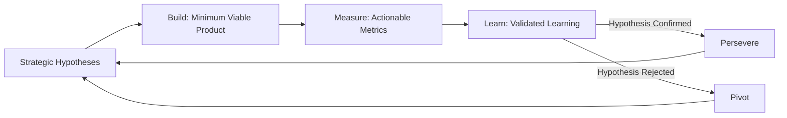
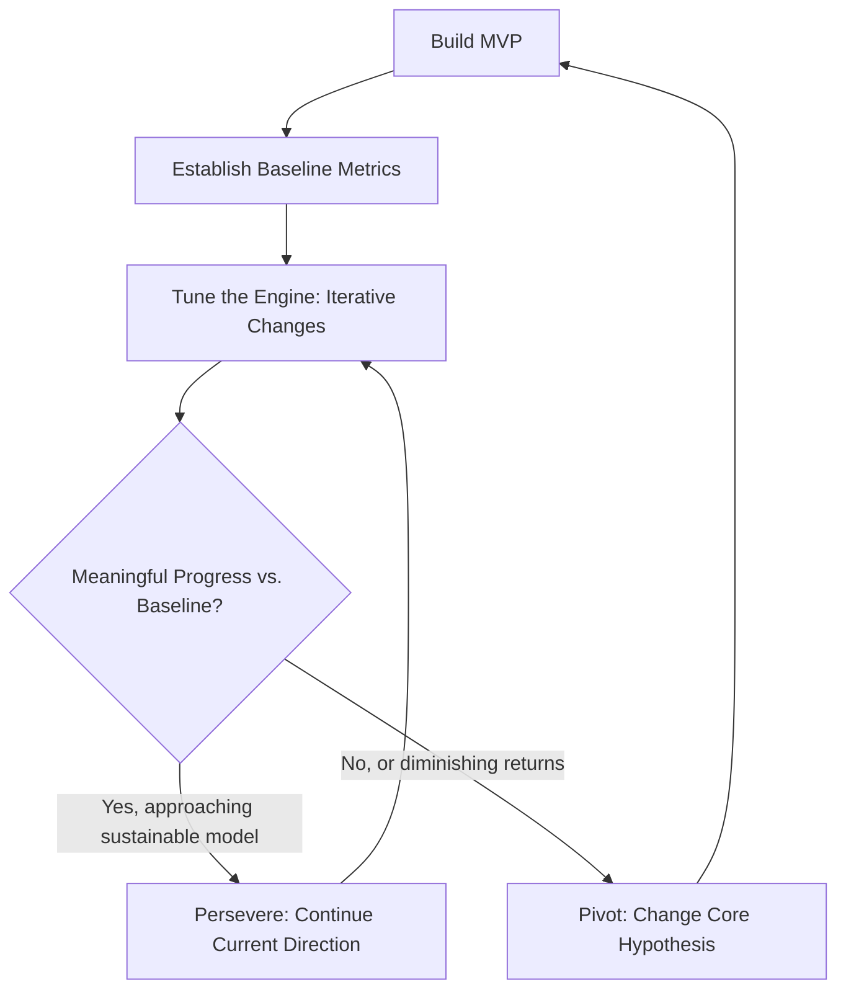

## Lean Startup Methodology and Strategic Iteration

### Definition and Core Concept

The Lean Startup methodology is a systematic approach to developing new products and businesses under conditions of extreme uncertainty, developed by Eric Ries (formalized in his 2011 book *The Lean Startup*), building on Steve Blank's customer development framework and applying lean manufacturing principles (originating from the Toyota Production System) to entrepreneurial contexts. The core reframe is that a startup is not a smaller version of a large company but a temporary organization designed to search for a repeatable and scalable business model. Strategic iteration refers to the disciplined, cyclical process of testing strategic assumptions, measuring outcomes, and adjusting course — treating strategy itself as a hypothesis to be validated rather than a fixed plan to be executed.

### Foundational Principles

- **Validated learning** — the unit of progress for a startup is not features shipped or revenue booked, but demonstrable, empirical evidence that specific hypotheses about the business are true or false
- **Build-Measure-Learn as the central feedback loop** — all activity is oriented toward minimizing the total time through this loop
- **Innovation accounting** — a framework for measuring progress in pre-revenue or pre-scale ventures, where traditional accounting metrics are uninformative or misleading
- **Genchi genbutsu ("go and see")** — a lean manufacturing principle adapted to mean that strategic decisions should be grounded in direct observation of customer behavior, not secondhand reports or assumptions

### The Build-Measure-Learn Loop in Detail

The loop is explicitly meant to run in the *reverse* order conceptually: teams should first determine what they need to learn, then determine what metrics would demonstrate that learning, and only then determine what minimum product is needed to generate those metrics — a discipline intended to prevent building unnecessary features.

#### Two Categories of Startup Hypotheses

Ries distinguishes two foundational hypotheses that most ventures must validate early:

1. **Value hypothesis** — tests whether a product or service actually delivers value to customers once they are using it
2. **Growth hypothesis** — tests how new customers will discover and adopt the product, and whether that discovery mechanism can scale

### Minimum Viable Product (MVP)

An MVP is defined as the version of a product that enables a full turn of the Build-Measure-Learn loop with the minimum amount of effort and development time — not simply "a smaller version of the product," but specifically the smallest experiment that generates valid, actionable learning about a targeted hypothesis.

#### Common MVP Types

| MVP Type | Description | Illustrative Use Case |
| --- | --- | --- |
| Landing page MVP | A page describing the product/value proposition with a call to action, before the product exists | Testing demand/interest before building |
| Concierge MVP | The founding team manually performs the service behind the scenes for early customers | Testing whether the underlying value proposition resonates before automating |
| Wizard of Oz MVP | Customers believe they are interacting with an automated system, but a human is manually operating it behind the scenes | Testing product experience/workflow before building the automation |
| Piecemeal/Frankenstein MVP | Assembling existing third-party tools to simulate the intended product experience | Rapid testing without custom development |
| Single-feature MVP | A product stripped to a single core feature | Isolating and testing the core value hypothesis |

[Inference] The appropriate MVP type depends heavily on the specific hypothesis being tested and the cost/speed trade-offs of each approach; there is no universally "correct" MVP format, and Ries's own examples emphasize context-dependent selection.

### Innovation Accounting

Ries proposes a three-stage process for measuring progress when traditional financial metrics (revenue, profit) are not yet meaningful:

1. **Establish the baseline** — using an MVP, gather real data on the current state of the venture's key metrics (this data point, however unflattering, becomes the starting reference)
2. **Tune the engine** — make incremental product, marketing, or business model changes intended to move metrics from the baseline toward the ideal
3. **Pivot or persevere** — after genuine attempts to tune the engine, decide whether the venture is making sufficient progress toward the business model's underlying assumptions, or whether a more fundamental change (pivot) is required

#### Actionable vs. Vanity Metrics

A central distinction in innovation accounting:

- **Vanity metrics** — numbers that trend positively regardless of specific actions taken, or that do not clarify cause and effect (e.g., total registered users, cumulative pageviews, total downloads)
- **Actionable metrics** — metrics tied to specific, repeatable actions that demonstrate clear cause-and-effect relationships, enabling informed decisions (e.g., cohort-based conversion rates, activation rates by acquisition channel)

**Criteria for good metrics (Ries's "three A's"):**

- **Actionable** — demonstrates clear causality, so people can reasonably act on it
- **Accessible** — reports are simple and understandable to everyone involved, including non-technical stakeholders
- **Auditable** — data is credible, and employees can verify it is connected to real customer behavior (e.g., by talking directly to customers behind the numbers)

#### Cohort Analysis

Rather than examining aggregate, cumulative totals (which tend to always trend upward and obscure trends), innovation accounting emphasizes cohort analysis — examining the behavior of customers who joined during a specific, discrete time period, and tracking how that cohort's behavior (conversion, retention, revenue per customer) changes over time and compares to prior cohorts.

### Pivot Types (Extended Taxonomy)

Beyond the pivot types discussed as a subset in venture strategy generally, Ries's fuller taxonomy for strategic iteration includes:

- **Zoom-in pivot** — a single feature within a larger product becomes the entire product
- **Zoom-out pivot** — the reverse; what was considered the whole product becomes a single feature of a much larger product
- **Customer segment pivot** — the product correctly solves a problem, but for a different customer segment than originally targeted
- **Customer need pivot** — closer contact with customers reveals a different problem worth solving than the one originally identified
- **Platform pivot** — a change between an application and a platform (or vice versa)
- **Business architecture pivot** — a shift between high-margin, low-volume models and low-margin, high-volume models (adapted from Geoffrey Moore's distinction between "complex systems" and "volume operations" businesses)
- **Value capture pivot** — changes to how the company monetizes or captures value (e.g., pricing model, revenue model)
- **Engine of growth pivot** — a shift between the growth engines discussed below
- **Channel pivot** — the same underlying solution is delivered through a different distribution/sales channel
- **Technology pivot** — a new technology achieves the same solution to the same problem, typically for improved performance or cost

A pivot is explicitly distinguished from a failure: it is defined as a structured course correction designed to test a new fundamental hypothesis about the product, strategy, or growth engine, while retaining and building on validated learning already gathered.

### Engines of Growth

Ries identifies three primary "engines of growth" that describe how sustainable ventures acquire new customers:

1. **Sticky engine of growth** — growth driven by customer retention exceeding churn, typically measured via customer retention/churn rate; relevant for products where repeat engagement is central to the business model
2. **Viral engine of growth** — growth driven by customers organically recruiting other customers as a byproduct of normal product use (measured via a viral coefficient — the number of new customers each existing customer generates)
3. **Paid engine of growth** — growth driven by using revenue (or investment capital) to fund customer acquisition through paid channels, sustainable when customer lifetime value (LTV) exceeds customer acquisition cost (CAC)

[Inference] Most real ventures combine elements of more than one engine, though Ries's framework emphasizes that management attention and metrics should generally focus on the dominant engine for a given venture, since optimization strategies differ significantly across the three.

### Continuous Deployment and Small Batch Size

Drawing directly from lean manufacturing, the methodology advocates for small batch sizes in development work — releasing small increments of work frequently rather than large releases infrequently — because:

- Problems are detected and localized more quickly
- Feedback loops with real customers are shortened
- Work-in-progress inventory (unreleased, unvalidated features) is minimized

This principle underlies (though is not synonymous with) continuous integration/continuous deployment (CI/CD) practices in modern software engineering.

### Diagram: Innovation Accounting Cycle

### Application to Corporate Strategic Iteration

Ries later extended these principles to established organizations (in *The Startup Way*, 2017), applying them to corporate innovation, internal venture teams, and strategic planning more broadly:

- **Internal startups/innovation teams** — cross-functional teams with dedicated, protected budgets and metrics operating under startup-style Build-Measure-Learn discipline within a larger corporation
- **Growth board governance** — periodic review structures resembling venture capital board meetings, where internal teams present validated learning and metrics rather than only financial projections, and where continued funding is tied to demonstrated learning
- **Portfolio approach to internal innovation** — treating multiple internal ventures as a portfolio with different risk/stage profiles, analogous to a venture capital portfolio

[Inference] The transferability of Lean Startup discipline to large, established organizations depends heavily on genuine executive sponsorship and willingness to fund experiments without traditional ROI projections upfront; without this, many corporate "lean startup" initiatives function as branding for conventional stage-gate processes rather than genuine strategic iteration.

### Common Criticisms and Limitations

- **Overemphasis on speed over depth** — critics argue rapid MVP iteration can favor superficial validation (e.g., landing page click-through rates) over the deeper market research needed for markets with long sales cycles, regulatory complexity, or capital-intensive product development (e.g., biotech, hardware, infrastructure)
- **Misapplication outside software contexts** — the methodology's origins in software development make MVP iteration comparatively straightforward; applying it literally to businesses with high fixed costs, long development cycles, or safety/regulatory constraints (e.g., medical devices, aerospace) requires substantial adaptation
- **Risk of "pivot-itis"** — an [Inference] observed pattern (not a formally defined term in Ries's original work) where teams pivot too frequently without adequately testing the current hypothesis, driven by impatience rather than genuine validated learning
- **Metrics gaming risk** — actionable metrics chosen poorly, or optimized narrowly, can still create perverse incentives, similar to Goodhart's Law concerns in any metrics-driven management system
- **Underestimates strategic/competitive positioning** — the methodology is largely customer- and product-centric; it does not, on its own, address broader competitive strategy questions (industry structure, sustainable competitive advantage) once product-market fit is achieved, meaning it is typically complementary to, not a replacement for, conventional strategic frameworks at later stages

### Implementation Framework

**Key Points**

- Define specific, falsifiable hypotheses before building anything; vague goals ("see if people like it") do not generate actionable learning
- Select actionable metrics tied to the specific hypothesis, using cohort-based analysis rather than cumulative totals
- Keep batch sizes small to shorten feedback loops and reduce wasted, unvalidated work
- Distinguish genuinely informative pivot/persevere decisions from premature abandonment or stubborn persistence — this decision should be based on evidence against a pre-defined threshold, established before the experiment, not post-hoc rationalization
- Recognize the methodology's software/digital origins and adapt batch size, MVP design, and iteration speed appropriately for capital-intensive, regulated, or long-cycle industries

### Illustrative Example (Generic, Non-Attributed)

An early-stage venture builds a concierge MVP for a personalized meal-planning service: instead of building recommendation algorithms, the founders manually create meal plans for the first 20 customers based on a simple intake questionnaire. They track a specific actionable metric — week-over-week retention by signup cohort — rather than total signups. After several weeks, retention plateaus below the team's pre-defined threshold for viability. Rather than abandoning the venture, they conduct a customer need pivot after direct customer interviews reveal that customers value grocery list automation more than meal plan personalization itself. The team then builds a narrower MVP testing grocery list automation as the core value hypothesis, retaining the customer relationships and much of the domain knowledge validated in the first iteration.

### Relationship to Broader Strategic Management Theory

- **Effectuation** — the Lean Startup's emphasis on affordable, small-scale experimentation aligns closely with effectuation's affordable-loss principle
- **Real Options Reasoning** — each MVP experiment functions as a real option: a small, bounded investment that purchases information reducing uncertainty before a larger, less reversible commitment
- **Dynamic Capabilities** — the organizational capacity for disciplined, repeated Build-Measure-Learn cycles is itself a form of dynamic capability, particularly the "sensing" and "seizing" components of Teece's framework
- **Customer Development (Blank)** — Lean Startup's Build-Measure-Learn loop operationalizes the hypothesis-testing discipline that customer development established as a parallel process to product development

### Conclusion

The Lean Startup methodology reframes entrepreneurial strategy as a disciplined, empirical search process rather than an exercise in upfront planning and forecasting. Its core contribution — the Build-Measure-Learn loop, paired with innovation accounting's emphasis on actionable, cohort-based metrics — provides a structured mechanism for strategic iteration under genuine uncertainty. While the framework has clear origins and strongest applicability in digital/software contexts, its underlying principles (validated learning, small batch experimentation, disciplined pivot/persevere decisions) have been extended, with adaptation, to corporate innovation and a broader range of venture types, though practitioners should calibrate iteration speed and MVP design to the capital intensity, regulatory environment, and sales cycle length of their specific domain.

**Related Topics**

- Customer Development Framework (Steve Blank)
- Effectuation Theory (Sarasvathy)
- Real Options Reasoning in Strategic Decision-Making
- Dynamic Capabilities Framework (Teece)
- Business Model Canvas and Lean Canvas
- Corporate Venture Capital and Intrapreneurship
- The Startup Way: Applying Lean Principles to Established Organizations
- Cohort Analysis and Retention Metrics
- Continuous Integration/Continuous Deployment (CI/CD) in Product Development
- Crossing the Chasm and Technology Adoption Lifecycle (Moore)