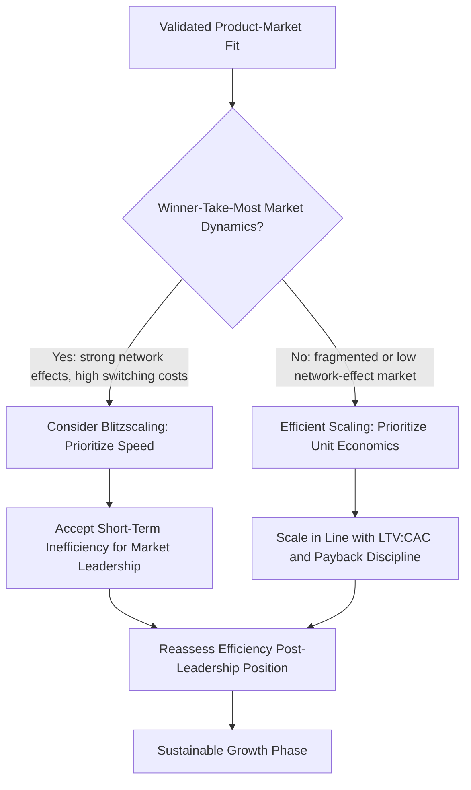

## Scaling Strategy for Growth Ventures

### Definition and Core Concept

Scaling strategy addresses how a venture that has achieved product-market fit and validated business model fit transitions to rapid, efficient growth — expanding revenue, customer base, headcount, and operational capacity while preserving (or improving) unit economics and organizational coherence. Scaling is distinct from earlier-stage venture strategy (effectuation, Lean Startup iteration) in a key respect: the central strategic problem shifts from *reducing uncertainty about what to build* to *reducing friction and inefficiency in delivering a validated model at increasing volume*.

### Preconditions for Scaling

Premature scaling — investing heavily in growth before these preconditions are met — is one of the most frequently cited causes of new venture failure. Key preconditions typically include:

- **Product-market fit** — validated evidence of strong, organic customer demand (see prior coverage under new venture strategy)
- **Favorable unit economics** — customer lifetime value (LTV) sustainably exceeding customer acquisition cost (CAC), with a defensible payback period
- **Repeatable, documented go-to-market motion** — a sales/marketing/onboarding process that produces consistent results independent of the founding team's personal involvement
- **Operational scalability** — systems, infrastructure, and processes capable of handling increased volume without proportional increases in cost or defects (or a credible plan to achieve this)
- **Organizational capacity** — a leadership team and management structure capable of overseeing an organization several multiples larger than its current size

[Inference] There is no single universal quantitative threshold (e.g., a specific LTV:CAC ratio or growth rate) that definitively signals "ready to scale" across all industries; commonly cited heuristics (such as an LTV:CAC ratio of roughly 3:1) originate from venture capital practitioner literature rather than rigorously validated academic research, and appropriate thresholds vary by business model, capital intensity, and sales cycle.

### The Blitzscaling Framework (Hoffman & Yeh)

Reid Hoffman and Chris Yeh's *Blitzscaling* (2018) framework describes an aggressive scaling strategy that prioritizes speed of growth over efficiency, under the premise that in markets with strong network effects or winner-take-most dynamics, being first to reach scale confers a durable, difficult-to-reverse competitive advantage.

#### Core Trade-off

Blitzscaling explicitly advocates prioritizing speed over efficiency during a defined scaling window, accepting higher risk (operational inefficiency, capital burn, potential mistakes) in exchange for speed to market leadership.

| Growth Approach | Priority | Risk Profile | Best Fit |
| --- | --- | --- | --- |
| Classic/efficient scaling | Efficiency, sustainable unit economics | Lower risk of capital destruction | Markets without strong winner-take-most dynamics |
| Blitzscaling | Speed to scale, market leadership | High risk of capital destruction if thesis is wrong | Markets with strong network effects, high switching costs, or first-scaler advantages |

[Inference] Blitzscaling as a strategic prescription is specifically contingent on a market genuinely exhibiting winner-take-most dynamics; applying blitzscaling logic to markets without such dynamics has been criticized (including by scholars outside the original framework) as a primary driver of capital-inefficient "growth at all costs" failures, particularly documented in later commentary on the venture funding cycles of the 2010s and early 2020s.

#### Stages of Organizational Scale (Illustrative, Adapted from Blitzscaling)

Hoffman and Yeh describe distinct organizational stages, each requiring different management structures and strategic focus as headcount grows by roughly an order of magnitude at each stage (e.g., "Family," "Tribe," "Village," "City," "Nation"), with the central claim being that management practices, communication structures, and decision-making processes that work at one stage typically break down at the next and must be deliberately redesigned rather than merely extended.

### Diagram: Scaling Decision Framework

### Operational Dimensions of Scaling

#### 1. Go-to-Market Scaling

- **Channel diversification** — moving beyond founder-led or single-channel acquisition (e.g., direct sales, one marketing channel) to multiple validated channels, reducing dependency risk
- **Sales process systematization** — codifying what previously worked ad hoc into repeatable playbooks, scripts, and training materials
- **Customer success and retention infrastructure** — building formal onboarding, support, and retention processes as customer volume exceeds what founders can personally manage

#### 2. Organizational and People Scaling

- **Management layer introduction** — moving from flat, founder-centric structures to layered management as span-of-control limits are reached
- **Culture codification** — deliberately articulating and reinforcing cultural norms that previously propagated informally through founder proximity, since informal cultural transmission breaks down past a certain headcount [Inference: often cited threshold is around 150 people, associated with "Dunbar's number," though its precise applicability to organizational culture specifically — as opposed to general social relationship capacity — is contested in the academic literature]
- **Hiring process formalization** — structured interviewing and onboarding to maintain hiring quality and cultural fit at increased hiring velocity

#### 3. Operational and Infrastructure Scaling

- **Process documentation** — converting tacit, founder-held knowledge into documented, transferable processes
- **Technology/systems scalability** — ensuring technical infrastructure (in software contexts) or production/logistics infrastructure (in physical product contexts) can handle order-of-magnitude volume increases without proportional cost increases or failure rate increases
- **Financial systems and controls** — moving from informal financial tracking to formal budgeting, forecasting, and internal controls appropriate for larger capital flows and (eventually) external reporting obligations

#### 4. Governance Scaling

- **Board formalization** — expanding from founder-only or informal advisory arrangements to a structured board with independent members and defined governance processes
- **Decision rights clarification** — formally defining which decisions require which level of approval, replacing the informal, all-hands decision-making common at earlier stages

### Financing Strategy Interaction with Scaling

| Scaling Stage | Typical Financing | Strategic Implication |
| --- | --- | --- |
| Early scaling (Series A/B) | Venture capital | Growth metrics (revenue growth rate, market share) often weighted more heavily than profitability in investor evaluation |
| Later scaling (Series C+/growth equity) | Growth equity, late-stage VC | Increasing investor scrutiny of path to profitability and defensible unit economics |
| Pre-exit scaling | Growth equity, debt financing, mezzanine capital | Focus shifts toward metrics relevant to eventual IPO or acquisition valuation |

[Inference] The relative emphasis investors place on growth versus profitability metrics has shifted over time in response to broader capital market conditions (e.g., interest rate environments, public market valuation multiples for high-growth companies); specific investor expectations at any given time should not be assumed to be static and are better assessed through current market conditions than fixed rules.

### International/Geographic Scaling Considerations

- **Market selection sequencing** — decisions about which geographic or vertical markets to enter next, often informed by adjacency to existing validated markets (similar customer profiles, compatible regulatory environments, or shared language/cultural context)
- **Localization requirements** — the degree to which product, pricing, marketing, and operations must be adapted for new markets versus can be replicated directly
- **Regulatory complexity** — new markets may introduce materially different regulatory, tax, employment law, or data privacy requirements that affect scaling timeline and cost
- **Build vs. partner vs. acquire** — strategic choice between building local operations directly, partnering with local entities, or acquiring an existing local player to accelerate entry

### Common Scaling Failure Modes

- **Premature scaling** — as noted, committing resources to growth before preconditions (fit, unit economics, repeatable process) are validated
- **Culture dilution** — rapid headcount growth outpacing the organization's capacity to onboard and acculturate new employees effectively
- **Quality/service degradation** — operational systems failing to keep pace with volume, damaging the customer experience that originally drove product-market fit
- **Cash burn outpacing revenue growth** — particularly relevant in blitzscaling-style approaches, where capital runway must be carefully managed against the time required to reach the next financing milestone or profitability
- **Management structure lag** — failing to introduce necessary management layers and processes at the point where informal, founder-centric coordination breaks down
- **Loss of strategic focus** — pursuing too many market segments, product lines, or geographies simultaneously, diluting execution quality across all of them

### Implementation Framework

**Key Points**

- Confirm preconditions (product-market fit, unit economics, repeatable go-to-market motion) before committing significant capital to growth
- Assess whether the target market exhibits genuine winner-take-most dynamics before adopting a blitzscaling-style speed-over-efficiency posture
- Anticipate organizational stage transitions (management layering, culture codification, decision-rights clarification) proactively rather than reactively
- Match financing strategy to the chosen scaling posture, recognizing that growth-first financing creates specific investor expectations that shape subsequent strategic flexibility
- Build systems and process documentation ahead of the volume that will require them, since retrofitting scalable infrastructure under growth pressure is typically more costly and disruptive than building it proactively

### Illustrative Example (Generic, Non-Attributed)

A B2B software venture achieves validated product-market fit within a narrow vertical niche, with strong retention and an LTV:CAC ratio comfortably above sustainable thresholds. Assessing its market, the team determines moderate but not extreme network effects (some value from shared industry benchmarking data across customers, but not a winner-take-most dynamic). The venture pursues efficient scaling rather than blitzscaling: prioritizing continued unit economics discipline while systematizing its sales process, introducing a first layer of sales and engineering management, and documenting previously founder-held onboarding knowledge into formal playbooks. As headcount approaches the point where informal, all-hands communication becomes unwieldy, the team deliberately introduces weekly structured management syncs and a formal decision-rights framework, rather than allowing coordination breakdowns to occur first.

### Relationship to Broader Strategic Management Theory

- **Lean Startup Methodology** — scaling represents the strategic phase following successful Build-Measure-Learn validation, where the emphasis shifts from hypothesis testing to execution efficiency
- **Resource-Based View** — scaling strategy often involves converting previously tacit, founder-embedded capabilities into codified, transferable organizational resources
- **Network Effects and Platform Strategy** — the blitzscaling framework's applicability is directly contingent on the presence of network effects, connecting scaling strategy to platform and multi-sided market strategic theory
- **Organizational Life Cycle Theory** — the staged organizational transitions described in blitzscaling parallel broader organizational life cycle models describing predictable structural transitions as organizations grow

### Conclusion

Scaling strategy for growth ventures addresses the transition from validating a business model to executing it at volume, requiring deliberate attention to go-to-market systematization, organizational structure, operational infrastructure, and governance formalization. The central strategic choice — whether to pursue speed-prioritized blitzscaling or efficiency-prioritized classic scaling — depends heavily on whether the target market exhibits genuine winner-take-most dynamics, a condition that does not apply universally and has been a significant point of criticism when blitzscaling logic is misapplied. Successful scaling requires anticipating organizational and operational breaking points before they occur, rather than reactively addressing them after growth has already outpaced the venture's structural capacity to support it.

**Related Topics**

- Lean Startup Methodology and Strategic Iteration
- Network Effects and Platform Strategy
- Organizational Life Cycle Theory
- Venture Capital Financing Stages and Investor Expectations
- International Market Entry Strategy
- Resource-Based View and Capability Codification
- Corporate Governance and Board Formalization
- Culture Design and Organizational Onboarding at Scale
- Franchising and Licensing as Alternative Scaling Models
- Mergers and Acquisitions as a Scaling Mechanism