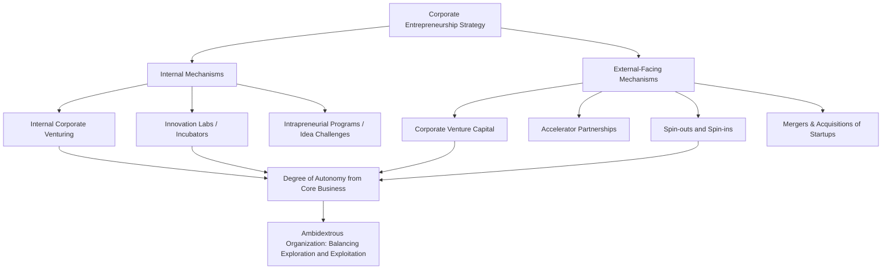

## Corporate Entrepreneurship and Intrapreneurship

### Definition and Core Concept

Corporate entrepreneurship refers to entrepreneurial activity — innovation, risk-taking, proactive pursuit of new opportunities — undertaken within the context of an established organization, as distinct from independent startup entrepreneurship. Intrapreneurship (a portmanteau of "intra-corporate entrepreneurship," a term popularized by Gifford Pinchot III in the 1980s) specifically describes the activity of individual employees who act as entrepreneurs within the firm, developing new products, services, or business lines using the parent organization's resources while operating with startup-like autonomy and initiative.

The underlying strategic problem corporate entrepreneurship addresses is well-documented in the organizational strategy literature: established firms possess resource, distribution, and market advantages that most startups lack, yet frequently struggle to innovate as effectively as smaller, more agile competitors due to structural, cultural, and incentive-based barriers inherent to large organizations.

### Forms of Corporate Entrepreneurship

Corporate entrepreneurship is typically categorized along several (sometimes overlapping) dimensions:

- **Corporate venturing** — creating new business units, often through internal venture divisions, that operate with some degree of independence from the core business
- **Strategic renewal** — transforming a firm's existing strategy, structure, or capabilities through internally generated entrepreneurial initiative, rather than creating new standalone ventures
- **Sustained regeneration** — the introduction of new products or services into existing or new markets through a continuous, ongoing innovation process embedded in core operations
- **Domain redefinition** — proactively creating a new product-market arena that competitors have not recognized, effectively redefining the competitive space the firm operates in
- **Organizational rejuvenation** — improving a firm's ability to execute strategy through internal changes to structure or processes, without necessarily creating new products or markets

[Inference] These categorizations, drawn primarily from Covin and Miles's influential typology (1999) and related corporate entrepreneurship scholarship, are analytically useful but overlap substantially in practice; most real corporate entrepreneurship initiatives combine elements of multiple categories rather than fitting cleanly into one.

### Entrepreneurial Orientation (EO)

A widely used construct for assessing an organization's entrepreneurial posture at the firm level (distinct from specific initiatives), Entrepreneurial Orientation is typically operationalized across five dimensions (extending the original three-dimension model by Miller, 1983, later expanded by Lumpkin and Dess, 1996):

1. **Innovativeness** — a tendency to engage in and support new ideas, experimentation, and creative processes
2. **Risk-taking** — willingness to commit significant resources to opportunities with uncertain outcomes
3. **Proactiveness** — a forward-looking, opportunity-seeking posture that anticipates future demand rather than merely reacting to competitors
4. **Competitive aggressiveness** — the intensity of a firm's efforts to outperform rivals, including direct and intense responses to competitive threats
5. **Autonomy** — the degree of independence given to individuals or teams to pursue entrepreneurial initiatives without excessive organizational constraint

[Unverified] The empirical relationship between firm-level EO and financial performance is well-studied but shows meaningfully varied effect sizes across industries, national contexts, and firm sizes in meta-analytic reviews; EO should be understood as a construct correlated with, rather than a guaranteed driver of, superior performance.

### Structural Mechanisms for Corporate Entrepreneurship

#### 1. Internal Corporate Venturing (ICV)

New business units created and initially funded from within the parent company, typically with a degree of operational separation from core business reporting lines, designed to pursue opportunities adjacent to or distinct from the core business.

#### 2. Corporate Venture Capital (CVC)

A distinct mechanism (also referenced in prior scaling and startup discussions) whereby a corporation makes minority equity investments in external, independent startups, typically pursuing a combination of financial return and strategic objectives (e.g., market intelligence, technology access, ecosystem development).

| Dimension | Internal Corporate Venturing | Corporate Venture Capital |
| --- | --- | --- |
| Entity structure | New internal unit or wholly owned subsidiary | External independent company, minority equity stake |
| Control | High, direct managerial control | Low to moderate, typically minority board representation |
| Primary objective | Building new internal capability/business line | Strategic insight, ecosystem access, financial return |
| Speed of external market feedback | Slower, insulated from external market discipline | Faster, subject to independent market and investor discipline |

#### 3. Innovation Labs and Incubators

Dedicated internal units (physically and/or organizationally separated from core operations) tasked with exploring new ideas using startup-style methods (e.g., Lean Startup practices), often functioning as a funnel that identifies promising concepts for further internal venturing or spin-out.

#### 4. Accelerator and Incubator Partnerships

Corporations partnering with or sponsoring external accelerator programs to gain early access to startup innovation, talent, and technology without the full commitment of direct CVC investment or acquisition.

#### 5. Spin-outs and Spin-ins

- **Spin-out** — a venture originally developed inside the corporation is established as an independent company, often to escape the constraints (bureaucracy, incompatible metrics, cultural friction) of the parent organization while retaining some ongoing relationship (equity stake, licensing, supply agreement)
- **Spin-in** — the reverse process, where an externally developed venture (sometimes one the corporation previously spun out or invested in) is reintegrated into the parent organization once validated

### Diagram: Corporate Entrepreneurship Structural Options

### The Ambidextrous Organization

A central theoretical framework for structurally managing corporate entrepreneurship is organizational ambidexterity (O'Reilly and Tushman, developed substantially through the 1990s–2000s), which addresses the tension between:

- **Exploitation** — refining, extending, and efficiently executing existing capabilities and business models (core business operations)
- **Exploration** — search, experimentation, risk-taking, and discovery of new capabilities and business models (entrepreneurial activity)

#### Structural Ambidexterity vs. Contextual Ambidexterity

- **Structural ambidexterity** — separating exploratory units (e.g., a dedicated innovation lab or ICV division) from exploitative core operations, typically with distinct structures, metrics, incentives, and sometimes physical locations, unified only at senior leadership level
- **Contextual ambidexterity** — building organizational capacity for individuals and teams to shift between exploitative and exploratory behaviors within the same unit, typically supported by a specific organizational context (discipline and stretch, paired with support and trust)

[Inference] The choice between structural and contextual ambidexterity is context-dependent; structural separation is more commonly recommended when the exploratory business model, culture, or metrics are fundamentally incompatible with the core business (as in Christensen's disruptive innovation framework, discussed below), while contextual approaches may be more suitable when exploration and exploitation activities can coexist within shared teams without direct conflict.

### Barriers to Corporate Entrepreneurship

- **Incentive misalignment** — compensation and promotion systems designed around predictable execution of the core business typically penalize the higher failure rates inherent to entrepreneurial experimentation
- **Resource allocation processes (capital budgeting bias)** — standard ROI-based capital allocation processes, calibrated for the core business's risk profile and time horizons, tend to systematically underfund speculative, longer-payback entrepreneurial initiatives (a dynamic central to Clayton Christensen's disruptive innovation theory)
- **Cultural resistance and risk aversion** — established organizational cultures often implicitly or explicitly discourage the risk-taking and failure tolerance required for genuine entrepreneurial activity
- **Cannibalization concerns** — internal resistance when a proposed venture threatens existing revenue lines, business units, or the interests of incumbent leadership
- **Metrics incompatibility** — core business metrics (quarterly revenue, established KPIs) are frequently inappropriate for evaluating early-stage ventures still searching for a viable business model (connecting directly to innovation accounting concepts covered under Lean Startup methodology)
- **Bureaucratic decision cycles** — layered approval processes designed for the core business slow entrepreneurial initiatives relative to the pace of external, independent startup competitors

### Disruptive Innovation and Corporate Entrepreneurship (Christensen)

Clayton Christensen's disruptive innovation theory provides an influential explanation for why established firms — even well-managed ones — often fail to respond effectively to certain categories of innovation, directly motivating the case for structurally separated corporate entrepreneurship mechanisms:

- Established firms' resource allocation processes are systematically biased toward sustaining innovations that serve existing profitable customers, because these initiatives fit predictable planning and capital budgeting processes
- Disruptive innovations typically appear unattractive by conventional metrics early on (smaller markets, lower margins, inferior performance on the dimensions valued by existing customers), leading rational, well-managed firms to underinvest in them
- Christensen's prescription — creating a separate organizational unit with its own processes, cost structure, and metrics for pursuing disruptive opportunities — is a direct structural application of corporate entrepreneurship principles

[Inference] Disruptive innovation theory has faced significant academic critique (notably from scholars such as Andrew King and Baljir Baatartogtokh, and Jill Lepore's widely discussed 2014 critique) regarding the theory's empirical support and predictive validity across the historical cases originally used to develop it; it remains influential in management practice but is not without contested empirical foundations.

### Individual-Level Intrapreneurship: Enabling Conditions

At the level of individual employee behavior, research on intrapreneurship identifies several organizational enabling conditions (drawing substantially on Pinchot's original work and subsequent corporate entrepreneurship climate research):

- **Management support** — visible, credible leadership endorsement of entrepreneurial initiative, including tolerance for the failure inherent in experimentation
- **Work discretion/autonomy** — sufficient latitude for employees to make decisions about how to pursue an opportunity without excessive oversight
- **Rewards/reinforcement** — incentive systems that recognize and reward entrepreneurial initiative and results, distinct from standard performance metrics
- **Time availability** — dedicated time (sometimes formalized, as in well-known "innovation time" policies at various technology companies) for employees to pursue exploratory projects outside core job responsibilities
- **Organizational boundaries** — clear enough boundaries (strategic focus areas, resource limits) to channel entrepreneurial energy productively, rather than leaving initiative entirely unstructured

### Governance Models for Formal Intrapreneurship Programs

- **Idea/innovation challenges and internal pitch competitions** — structured processes inviting employees to submit and pitch new venture ideas, typically with a formal evaluation and selection process
- **Internal "shark tank" style funding boards** — internal committees (sometimes explicitly modeled on venture capital governance) that allocate seed funding to promising internal proposals, subject to staged, milestone-based review
- **Sabbatical/secondment models** — allowing employees to temporarily leave core roles to work on venture ideas full-time, with a defined path back to their original role if the venture does not proceed
- **Formal "20% time" or innovation time policies** — allocating a fixed percentage of work time to self-directed exploratory projects [Inference: while widely cited as a practice associated with certain well-known technology companies, the actual scope, consistency, and current status of such formal policies across firms varies and specific claims about any named company's current practice should be independently verified rather than assumed static]

### Implementation Framework

**Key Points**

- Select structural mechanisms (ICV, CVC, innovation labs, spin-outs) based on the degree of incompatibility between the new venture's required business model/culture/metrics and the core business's existing processes
- Establish separate, appropriate evaluation metrics for entrepreneurial initiatives rather than applying core-business KPIs and capital budgeting logic uniformly
- Secure and sustain visible senior leadership sponsorship, since resource allocation bias toward the core business tends to reassert itself absent active counterbalancing
- Design incentive systems that do not penalize entrepreneurial risk-taking and experimentation-driven failure the same way they would penalize core-business execution failure
- Define clear strategic boundaries for intrapreneurial activity to focus initiative productively without stifling it entirely

### Illustrative Example (Generic, Non-Attributed)

An established industrial equipment manufacturer identifies an opportunity in software-enabled predictive maintenance services, a business model fundamentally different from its core hardware sales model (subscription revenue vs. one-time equipment sales, software talent needs vs. mechanical engineering talent, rapid iterative development vs. long hardware development cycles). Recognizing the incompatibility with core business processes and metrics, leadership establishes a structurally separate internal venture unit with its own P&L, staffed partly through internal transfers and partly through external software hires, reporting through a dedicated innovation governance board rather than standard business unit reporting lines. The unit is evaluated initially on customer validation and retention metrics (consistent with innovation accounting principles) rather than immediate revenue contribution, with a staged funding model resembling venture capital tranches tied to milestone achievement.

### Relationship to Broader Strategic Management Theory

- **Dynamic Capabilities** — corporate entrepreneurship mechanisms are a primary organizational vehicle for the "sensing" and "seizing" processes central to dynamic capabilities theory
- **Disruptive Innovation Theory (Christensen)** — provides the theoretical rationale for structural separation of exploratory ventures from core business resource allocation processes
- **Ambidextrous Organization Theory** — provides the structural design framework (structural vs. contextual ambidexterity) for balancing exploration and exploitation
- **Lean Startup Methodology** — provides the operational methodology (Build-Measure-Learn, innovation accounting) frequently adopted within internal corporate venture units
- **Resource-Based View** — corporate entrepreneurship can be understood as a mechanism for developing new valuable, rare, and difficult-to-imitate capabilities beyond the firm's existing resource base

### Conclusion

Corporate entrepreneurship and intrapreneurship address the structural and cultural challenge established organizations face in generating and executing genuinely novel initiatives despite possessing superior resources relative to independent startups. The core strategic insight — validated across disruptive innovation theory, ambidextrous organization research, and corporate venturing literature — is that standard organizational processes, metrics, and incentives calibrated for efficient execution of an existing business model are frequently incompatible with, and actively biased against, the requirements of entrepreneurial exploration. Effective corporate entrepreneurship strategy therefore depends less on generating entrepreneurial ideas (which established firms with talented employees typically can) and more on designing structural mechanisms, governance processes, and incentive systems that protect exploratory initiatives from the core business's natural tendency to defund or suppress them.

**Related Topics**

- Disruptive Innovation Theory (Christensen)
- Ambidextrous Organizations (Exploration vs. Exploitation)
- Corporate Venture Capital and Strategic Investment
- Dynamic Capabilities Framework (Teece)
- Entrepreneurial Orientation and Firm Performance
- Innovation Governance and Stage-Gate Funding Models
- Spin-outs, Spin-ins, and Corporate Divestiture Strategy
- Lean Startup Methodology and Strategic Iteration
- Mergers and Acquisitions of Startups (Acqui-hires and Technology Acquisition)
- Organizational Culture and Innovation Climate