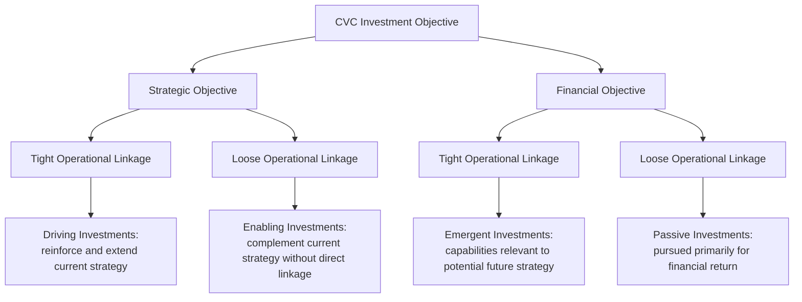

## Corporate Venture Capital Strategy

### Definition and Core Concept

Corporate Venture Capital (CVC) refers to the practice of an established corporation making minority equity investments in external, independent startup companies, typically pursuing a combination of financial return and strategic objectives that distinguish it from traditional (independent) venture capital. CVC investments are generally made either directly from the corporate balance sheet or through a dedicated corporate venture arm, and represent one of several external-facing mechanisms for corporate entrepreneurship (alongside accelerator partnerships, spin-outs, and acquisition, as covered previously).

### Distinguishing CVC from Traditional Venture Capital

| Dimension | Traditional (Independent) VC | Corporate Venture Capital |
| --- | --- | --- |
| Capital source | Limited partners (pension funds, endowments, family offices) via a fund structure | Parent corporation's balance sheet or dedicated fund |
| Primary objective | Financial return (maximizing fund IRR/multiple) | Combination of financial return and strategic objectives |
| Investment horizon | Typically bound by fund life (often 10 years) | Can be more flexible, tied to corporate strategic planning cycles rather than a fixed fund term |
| Decision-making | Investment committee within the VC firm | Often involves corporate strategy, business unit, and/or executive input alongside dedicated CVC team |
| Value-add to portfolio company | Board seats, network access, fundraising support | Distribution access, technical expertise, potential customer relationships, brand credibility |
| Risk to startup | Primarily financial/governance considerations | Additional considerations: potential competitive conflict, information asymmetry, strategic dependency risk |

[Inference] The degree to which CVC investment decisions weight strategic versus financial objectives varies substantially across programs and is not standardized; some CVC arms operate with financial-return mandates nearly identical to independent VC, while others explicitly subordinate financial return to strategic learning objectives.

### Strategic Objectives of CVC Programs

CVC programs are typically motivated by a combination of the following (Chesbrough's widely cited 2002 framework distinguishes these along two axes: strategic vs. financial objective, and tight vs. loose operational linkage to the corporation):

1. **Window on technology / market intelligence** — gaining early visibility into emerging technologies, business models, or competitive threats before they mature, informing internal strategic planning
2. **Ecosystem development** — investing in startups that build complementary products or services around the corporation's core platform, strengthening the overall value proposition (relevant to platform strategy)
3. **Access to innovation without internal R&D commitment** — a lower-cost, lower-commitment alternative to internal corporate venturing for accessing new capabilities
4. **Pipeline for future acquisitions** — using minority investment as a lower-risk, lower-commitment mechanism to evaluate a startup before a potential full acquisition
5. **Financial return** — direct financial gain from equity appreciation, particularly relevant for CVC arms operating with return mandates similar to independent VC funds
6. **Talent and cultural insight** — indirect benefits from exposure to startup working methods, informing broader organizational innovation practices

### Chesbrough's CVC Investment Framework

Henry Chesbrough's influential typology (Harvard Business Review, 2002) categorizes CVC investments along two dimensions: whether the primary objective is strategic or financial, and whether the investment maintains tight or loose operational linkage to the corporation's current business operations.

- **Driving investments** — strategic objective, tight linkage: investments in startups whose products or technologies directly extend or reinforce the corporation's current strategy and operations
- **Enabling investments** — strategic objective, loose linkage: investments in startups that complement the corporation's offerings (e.g., ecosystem partners) without being tightly integrated into current operations
- **Emergent investments** — financial objective, tight linkage: investments in startups with technologies or business models relevant to a corporation's potential future strategic direction, pursued in part for financial return but with an eye toward strategic optionality
- **Passive investments** — financial objective, loose linkage: investments made primarily for financial return with limited strategic relevance to current or anticipated corporate strategy

[Inference] In practice, many CVC investments do not map cleanly onto a single quadrant and objectives can shift over the life of an investment as the startup and corporate strategy evolve; Chesbrough's framework is best used as an analytical lens for periodic portfolio review rather than a rigid, fixed classification applied once at investment time.

### Governance Structures for CVC Programs

- **Balance sheet investment (direct)** — the corporation invests directly from its own balance sheet without a separate fund vehicle; offers maximum flexibility but can be more exposed to shifts in corporate financial priorities or leadership changes
- **Dedicated CVC fund/subsidiary** — a formally structured fund (sometimes with its own brand distinct from the parent corporation) with dedicated capital commitment and investment team, providing more insulation from short-term corporate budget pressure and often more credibility with startup founders and co-investors
- **Hybrid/evergreen structures** — a fund structure without a fixed fund life (unlike traditional 10-year VC funds), allowing continuous reinvestment and a longer time horizon aligned with corporate strategic planning rather than LP-driven fund cycles

#### Decision-Making Governance

- **Investment committee composition** — typically includes CVC team leadership plus representation from corporate strategy, finance, and relevant business units; the balance between centralized CVC judgment and business unit veto power significantly affects investment speed and startup-friendliness
- **Speed and decisiveness** — a frequently cited competitive disadvantage of CVC relative to independent VC is slower decision cycles due to additional corporate approval layers, which can matter significantly in competitive startup financing rounds where speed and certainty of close are valued by founders

### Structuring the Corporate-Startup Relationship

#### Equity Stake and Board Involvement

- CVC investments are typically minority stakes (not controlling), preserving the startup's independence and governance
- Board observer rights (attending board meetings without voting rights) are common, particularly for smaller or more strategically sensitive investments, as an alternative to full board seats
- Information rights (regular financial and operational updates) are typically negotiated as part of the investment terms

#### Managing Conflicts of Interest and Information Asymmetry

A well-documented risk in CVC relationships is the potential for the corporate investor to gain competitively sensitive information about the startup (or, by extension, the startup's other customers/partners) through the investment relationship, creating conflicts of interest that require careful governance:

- **Information barriers** — formal or informal separation between the CVC investment team and business units that might have a commercial conflict of interest with the startup's business
- **Most-favored-nation and exclusivity clause caution** — startups and their independent VC co-investors often scrutinize proposed contractual terms (e.g., rights of first refusal on acquisition, exclusivity requirements) that could constrain the startup's strategic flexibility or deter other investors and commercial partners
- **Signaling risk** — a startup's decision to decline or terminate a CVC relationship can be interpreted negatively by the market (a "signal" that the relationship soured), a risk that is generally less pronounced with a straightforward change in independent VC investors [Inference: the magnitude and prevalence of this signaling effect specifically has not been rigorously quantified in the empirical literature and is more commonly discussed as a qualitative risk in practitioner commentary]

### Value-Add Corporations Can Offer Portfolio Startups

- **Distribution and channel access** — leveraging the corporation's existing customer base, sales force, or distribution infrastructure
- **Technical and domain expertise** — access to specialized engineering, regulatory, or industry expertise the corporation has developed over time
- **Credibility and brand association** — startup credibility benefits from association with an established, recognized corporate investor, particularly relevant in enterprise sales contexts
- **Potential customer relationship** — the corporation itself may become a customer or commercial partner of the startup, independent of the equity investment
- **Follow-on and exit pathway** — the CVC relationship can create a natural pathway toward eventual acquisition, providing the startup (and its other investors) an additional potential exit option

### Common Failure Modes and Criticisms of CVC Programs

- **Strategic drift and program discontinuity** — CVC programs are frequently among the first areas cut during corporate budget tightening or leadership transitions, since their strategic value is harder to quantify than core business metrics, leading to inconsistent program continuity relative to independent VC funds [Inference: this pattern is widely discussed in practitioner and academic commentary on CVC program lifecycles, though precise failure/discontinuation rates across CVC programs broadly are not comprehensively tracked in a single authoritative dataset]
- **Misaligned incentives for CVC investment teams** — CVC professionals often lack the direct carried-interest compensation structures common in independent VC, potentially affecting talent retention and decision-making incentives relative to purely financially-motivated investors
- **Slow decision cycles losing competitive deals** — as noted, additional corporate governance layers can cause CVC investors to lose access to the most competitive financing rounds, where speed and certainty matter to founders
- **Startup wariness of strategic entanglement** — well-informed founders may avoid or limit CVC participation in financing rounds out of concern about competitive information exposure, restrictive terms, or the signaling risk of an eventual relationship termination
- **Unclear success metrics** — because CVC programs often blend financial and strategic objectives, evaluating program success (and, correspondingly, justifying continued corporate investment) is more complex than evaluating a pure financial-return fund

### Implementation Framework

**Key Points**

- Clarify the primary objective(s) — strategic intelligence, ecosystem development, acquisition pipeline, financial return, or some combination — before designing governance and mandate, since objective ambiguity undermines both investment selection and success measurement
- Select a governance structure (balance sheet vs. dedicated fund) that matches the desired degree of insulation from short-term corporate budget cycles and the credibility needed with startup founders and co-investors
- Establish information barriers and conflict-of-interest protocols proactively, particularly where the corporation operates in markets adjacent to or overlapping with portfolio company activities
- Design investment decision processes for competitive speed, recognizing that excessive approval layers are a well-documented disadvantage relative to independent VC
- Define explicit, realistic success metrics appropriate to the program's stated objectives (e.g., strategic learning outcomes and commercial partnerships generated, not solely financial return, for strategically oriented programs)

### Illustrative Example (Generic, Non-Attributed)

A global logistics corporation establishes a dedicated CVC fund (structured as an evergreen vehicle rather than a fixed-life fund) to invest in early-stage startups developing supply chain automation and route optimization technology. The fund's mandate explicitly weights strategic learning and ecosystem access alongside financial return, positioning most investments as "enabling" (strategic objective, loose operational linkage) in Chesbrough's framework. To manage conflict-of-interest concerns, the fund maintains an information barrier between the investment team and the corporation's core operations division, and startups are given board observer rather than full board seats to limit governance entanglement while preserving information access. Several portfolio companies subsequently become commercial technology partners of the parent corporation, independent of the equity relationship, illustrating the ecosystem development objective in practice.

### Relationship to Broader Strategic Management Theory

- **Corporate Entrepreneurship and Intrapreneurship** — CVC is one of several external-facing mechanisms for pursuing corporate entrepreneurship objectives, complementing internal corporate venturing and innovation labs
- **Real Options Reasoning** — minority CVC investments function as real options, providing the corporation the right (but not obligation) to pursue deeper commercial relationships, technology licensing, or full acquisition as uncertainty about the startup's technology or market resolves
- **Open Innovation (Chesbrough)** — CVC is a core mechanism within Chesbrough's broader open innovation framework, which argues firms should systematically source innovation from outside their own R&D boundaries
- **Platform Strategy and Ecosystem Development** — "enabling" CVC investments directly support platform strategies by strengthening the complementary ecosystem around a corporation's core offering
- **Mergers and Acquisitions Strategy** — CVC frequently functions as a pipeline mechanism feeding into subsequent M&A strategy, allowing lower-risk evaluation of potential acquisition targets before committing to full acquisition

### Conclusion

Corporate Venture Capital provides established corporations a flexible, lower-commitment mechanism (relative to internal venturing or acquisition) for pursuing external innovation objectives — market intelligence, ecosystem development, acquisition pipeline development, and financial return — through minority equity investment in independent startups. Chesbrough's strategic/financial and tight/loose linkage framework provides a useful analytical lens for classifying and periodically reviewing CVC investment objectives, though most programs blend multiple objectives simultaneously. The persistent strategic challenges facing CVC programs — governance speed relative to independent VC, conflict-of-interest management, program continuity through corporate budget cycles, and success metric ambiguity — mean that CVC effectiveness depends heavily on deliberate governance design rather than simply allocating capital toward external startup investment.

**Related Topics**

- Corporate Entrepreneurship and Intrapreneurship
- Open Innovation Framework (Chesbrough)
- Real Options Reasoning in Strategic Decision-Making
- Platform Strategy and Ecosystem Development
- Mergers and Acquisitions as Corporate Growth Strategy
- Venture Capital Financing Stages and Term Sheets
- Spin-outs, Spin-ins, and Corporate Divestiture Strategy
- Innovation Governance and Stage-Gate Funding Models
- Strategic Alliances and Joint Ventures
- Technology Scouting and Competitive Intelligence