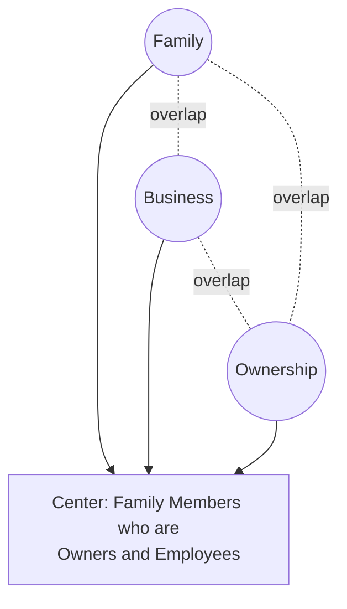
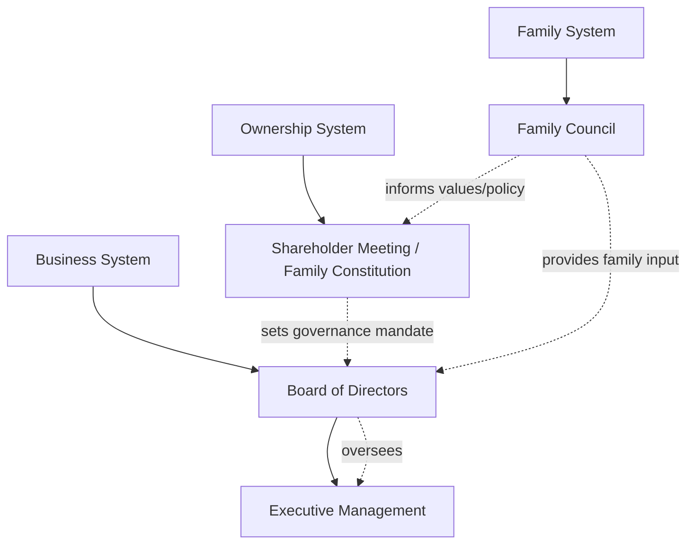

## Strategy in Family and Founder-Led Businesses

### Definition and Core Concept

Family and founder-led businesses are enterprises in which ownership, governance, and often management are concentrated in a founding individual or family, distinguishing them structurally and strategically from widely held public corporations with dispersed ownership and professional management. Strategic decision-making in these firms is shaped by a distinctive set of dynamics: the overlap (and frequent tension) between family/founder goals and business goals, concentrated and often long-tenured control, and distinctive succession and governance challenges not typically present in non-family firms.

[Inference] Family businesses are frequently cited as constituting a majority of businesses globally and a substantial share of GDP and employment in most economies, though precise figures vary considerably by country, definition of "family business" used, and data source, and should be treated as broad, source-dependent estimates rather than a single settled statistic.

### The Three-Circle Model of Family Business Systems

A foundational analytical framework (Tagiuri and Davis, Harvard Business School, 1982) models family businesses as the overlap of three distinct but interconnected systems:

- **Family circle** — individuals connected by kinship or marriage, with concerns centered on family harmony, relationships, and legacy
- **Business circle** — individuals involved in day-to-day management and operations, with concerns centered on operational performance and competitiveness
- **Ownership circle** — individuals holding equity/ownership stakes, with concerns centered on financial return, capital allocation, and governance rights

An individual can occupy one, two, or all three circles simultaneously (e.g., a family member who is both an owner and an active manager sits at the intersection of all three), and much of the distinctive complexity of family business strategy arises from individuals occupying different, sometimes conflicting, combinations of these roles.

### Distinctive Strategic Characteristics

#### Sources of Potential Competitive Advantage

- **Long-term orientation** — freed from short-term public market earnings pressure, family and founder-led firms can often pursue strategies with longer payback periods, including patient capital allocation to R&D or capability building
- **Reduced agency costs** — when ownership and management substantially overlap, classic principal-agent conflicts between shareholders and managers (a central concern in corporate governance theory) can be reduced, since owners and decision-makers are frequently the same individuals
- **Reputation and relationship capital** — long-tenured family involvement can build durable trust with employees, customers, suppliers, and communities, sometimes described in the literature as a distinctive form of "familiness" as a resource
- **Speed and decisiveness** — concentrated decision-making authority can enable faster strategic decisions than firms requiring broader stakeholder consensus

[Inference] Empirical research on family firm financial performance relative to non-family firms shows mixed results across studies, moderated by factors such as founder involvement (founder-led firms specifically often show different performance patterns than later-generation family firms), industry, and country context; broad claims that family firms systematically outperform or underperform non-family firms are not well supported as a general finding.

#### Sources of Potential Strategic Disadvantage

- **Succession risk** — leadership transitions are a well-documented point of vulnerability, with a frequently cited (though variably sourced) pattern that a significant proportion of family businesses do not survive intact through second and third generation transitions
- **Nepotism and capability mismatch** — family leadership succession based on kinship rather than demonstrated capability can result in leadership deficits relative to firms recruiting from a broader talent pool
- **Capital constraints** — reluctance to dilute family ownership can limit access to external equity capital needed for growth or competitive investment
- **Emotional decision-making and conflict avoidance** — family relationship dynamics can distort otherwise rational business decisions (e.g., reluctance to exit underperforming business lines associated with a particular family member, or avoidance of necessary but difficult personnel decisions)
- **Resistance to change** — strong attachment to founding strategy, products, or values (sometimes linked to founder identity) can create rigidity and slow strategic adaptation to changing market conditions

### Founder-Led Firms: Distinctive Considerations

Founder-led firms (where the original founder remains actively involved, whether or not other family members are involved) present some considerations distinct from multi-generational family firms:

- **Founder's imprint** — organizational culture, strategy, and structure often bear a strong, sometimes difficult-to-change imprint of the founder's original vision and decision-making style (a well-documented phenomenon in organizational imprinting research)
- **Concentrated authority and vision-driven strategy** — founder-led firms can pursue bold, differentiated strategic bets more readily than firms requiring broader consensus, but this concentration also creates single-point-of-failure risk
- **Founder transition risk** — the eventual departure of a founder (whether through succession, sale, or public offering) represents a distinct strategic inflection point, often requiring significant governance and cultural adaptation
- **Dual-class share structures** — a common mechanism (particularly in founder-led technology companies pursuing public listings) allowing founders to retain disproportionate voting control relative to their economic ownership stake, explicitly designed to preserve founder strategic control despite capital raising or partial ownership dilution [Inference: the use and prevalence of dual-class structures varies significantly by jurisdiction, stock exchange listing rules, and time period, and specific current prevalence figures should be verified against current market data rather than assumed static]

### Succession Planning as a Strategic Process

Succession is one of the most extensively studied strategic challenges specific to family and founder-led businesses.

#### Succession Options

- **Family succession** — leadership transitions to a family member, typically the next generation
- **Non-family professional management (with continued family ownership)** — family retains ownership/board control but hires professional, non-family executives for operational leadership
- **Sale to external party (strategic or financial buyer)** — the family exits ownership entirely through sale, sometimes to a private equity firm or strategic acquirer
- **Employee ownership transition (e.g., ESOP)** — ownership transitions to employees, preserving some elements of the firm's independence and culture without family or external buyer control
- **Public listing (IPO)** — the firm transitions to public ownership, typically with the family retaining a significant (sometimes controlling, via dual-class structures) stake

#### Succession Planning Best Practices (Illustrative Framework)

**Key Points**

- Begin succession planning well in advance of an anticipated transition, since governance, capability development, and stakeholder alignment for successors typically require years, not months
- Separate the selection of a successor from purely kinship-based assumptions; establish objective capability criteria evaluated (ideally) by parties including non-family board members or advisors
- Formalize governance structures (family constitutions, family councils, boards with independent directors) before succession becomes urgent, rather than during a crisis
- Address both business succession (who leads operations) and ownership succession (how equity is transferred, including tax and estate planning considerations) as related but distinct processes
- Build in mechanisms for resolving family conflict that do not require every disagreement to be adjudicated at the board or operational level

### Governance Structures Specific to Family Businesses

- **Family constitution/charter** — a formal document articulating family values, governance principles, employment policies for family members, and dispute resolution mechanisms, intended to provide clarity and reduce ambiguity-driven conflict
- **Family council** — a formal body (distinct from the corporate board) where family members discuss family-related matters, family employment policy, and shared values, without directly managing business operations
- **Board of directors with independent members** — bringing in non-family directors is a widely recommended governance practice to introduce external perspective, professional discipline, and objective input on strategic and succession decisions
- **Family office** — a dedicated entity (particularly in larger or wealthier family enterprises) managing family wealth, investments, and sometimes philanthropic activities separately from the operating business, allowing cleaner separation between family wealth management and business strategy

### Diagram: Governance Architecture for Family Firms

### Strategic Renewal and Transgenerational Entrepreneurship

A growing area of family business research examines "transgenerational entrepreneurship" — the capacity of family firms to create new streams of value across generations through continued entrepreneurial activity, rather than simply preserving an existing business unchanged. This connects family business strategy directly to corporate entrepreneurship concepts:

- Family firms with strong entrepreneurial orientation across generations show, in some studies, greater long-term survival and value creation than those that rely purely on preserving the founding business model unchanged [Inference: as with general EO-performance research, these findings are moderated by numerous contextual factors and should not be treated as a universal guarantee]
- Succession can be an opportunity to introduce genuine strategic renewal (new markets, new capabilities, professionalized management) rather than purely preserving prior strategy, provided governance structures allow successor generations meaningful strategic latitude

### Common Strategic Failure Patterns

- **Founder's imprint rigidity** — inability to evolve strategy or culture beyond the founder's original vision as market conditions change
- **Unresolved succession ambiguity** — delaying succession decisions until a health crisis or unexpected departure forces an unplanned, poorly prepared transition
- **Family conflict spillover into strategy** — business strategy decisions distorted by unresolved family relationship conflicts rather than objective business criteria
- **Undercapitalization from ownership dilution aversion** — foregoing growth opportunities that would require external capital, out of reluctance to dilute family control
- **Entitlement-driven leadership appointments** — placing family members in leadership roles based on kinship rather than validated capability, weakening competitive execution

### Implementation Framework

**Key Points**

- Establish formal governance structures (family council, constitution, independent board members) proactively rather than reactively during succession crises
- Separate family employment and compensation policy from business operating decisions to reduce conflict-of-interest distortion in strategic choices
- Evaluate succession candidates (family or non-family) against objective capability criteria, ideally with independent board or advisor input
- Treat succession planning as beginning years, not months, before an anticipated transition
- Consider transgenerational entrepreneurial renewal as an explicit strategic goal for succession, rather than assuming pure continuity of the existing business model is the default objective

### Illustrative Example (Generic, Non-Attributed)

A second-generation family manufacturing firm faces an approaching leadership transition as the founder's two children, both active in the business, hold differing views about the company's future direction (one favoring continued focus on the core product line, the other advocating expansion into an adjacent market). Rather than resolving this through informal family dynamics, the family establishes a formal family council to separate family relationship concerns from business strategy discussions, brings in two independent, non-family board members with relevant industry experience, and commissions an objective capability assessment of both potential successors facilitated by an external advisor. The board ultimately supports a hybrid strategic direction incorporating elements of both children's proposals, with governance structures in place to manage the ongoing family dynamic independently of subsequent operational decisions.

### Relationship to Broader Strategic Management Theory

- **Agency Theory** — family business governance directly engages agency theory concepts, though family firm agency dynamics differ from the classic shareholder-manager conflict (sometimes described in the literature as involving distinct "Type II" agency conflicts between controlling family owners and minority shareholders)
- **Resource-Based View** — "familiness" (the idiosyncratic bundle of resources arising from family involvement) is analyzed within RBV as a potential source of competitive advantage or disadvantage depending on context
- **Corporate Entrepreneurship** — transgenerational entrepreneurship research directly extends corporate entrepreneurship concepts into the multi-generational family business context
- **Organizational Imprinting Theory** — founder imprint research draws on broader organizational imprinting theory examining how founding conditions shape long-term organizational characteristics
- **Corporate Governance** — family business governance structures (family councils, constitutions, independent board members) represent a specialized application of general corporate governance principles adapted to concentrated, kinship-based ownership structures

### Conclusion

Strategy in family and founder-led businesses is shaped by the distinctive overlap of family, ownership, and business systems, generating both potential sources of competitive advantage (long-term orientation, reduced agency costs, relationship capital) and distinctive vulnerabilities (succession risk, capability mismatch from kinship-based appointments, capital constraints, and conflict spillover). Effective strategic management in this context depends heavily on deliberate governance design — family councils, constitutions, independent board representation, and structured succession planning — that separates family relationship dynamics from business decision-making without severing the family engagement that often constitutes a genuine source of competitive advantage. Succession, rather than being treated purely as risk to be managed, can also represent a strategic opportunity for genuine renewal when governance structures allow successor generations meaningful latitude to adapt strategy to changing conditions.

**Related Topics**

- Corporate Governance and Board Composition
- Agency Theory and Principal-Principal Conflicts
- Resource-Based View and "Familiness" as a Strategic Resource
- Corporate Entrepreneurship and Transgenerational Entrepreneurship
- Organizational Imprinting Theory
- Dual-Class Share Structures and Founder Control
- Private Equity and Family Business Ownership Transitions
- Employee Stock Ownership Plans (ESOPs) as Succession Mechanisms
- Estate Planning and Ownership Transfer Structures
- Strategy for Startups and New Ventures