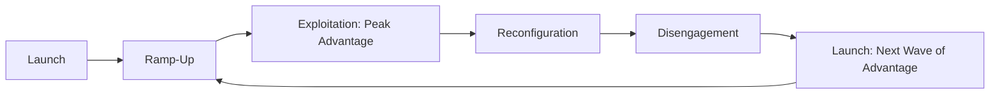
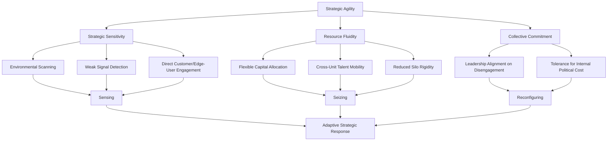

## Strategic Agility and Adaptive Strategy

### Definition and Core Concept

Strategic agility refers to an organization's capacity to continuously sense changes in its internal and external environment and rapidly, flexibly reallocate resources and reconfigure strategy in response — without sacrificing the operational discipline needed to execute effectively. Adaptive strategy is the broader strategic management paradigm underlying this capacity: an explicit rejection of the assumption (embedded in classical strategic planning) that the environment is stable and predictable enough to support long-range, fixed strategic plans, in favor of iterative, continuously revised strategic approaches.

The concept responds directly to a well-documented shift in the strategic management literature (notably associated with scholars such as Rita McGrath, and the broader "strategy-as-practice" and dynamic capabilities traditions) away from the classical positioning-based strategy paradigm (associated with Porter's five forces and generic strategies, which assume relatively durable competitive positions) toward frameworks better suited to environments characterized by rapid technological change, shorter competitive advantage duration, and increased market volatility.

### The Transient Advantage Framework (McGrath)

Rita McGrath's influential work (*The End of Competitive Advantage*, 2013) argues that in many contemporary industries, sustainable competitive advantage — long the central objective of classical strategic management — is increasingly rare, and that firms should instead organize around the pursuit of a continuous sequence of transient (temporary) competitive advantages.

#### The Transient Advantage Life Cycle

McGrath describes a wave-like life cycle replacing the assumption of durable advantage:

1. **Launch** — identifying and moving into a new opportunity before it is fully validated by the broader market
2. **Ramp-up** — scaling the advantage rapidly once initial validation occurs, capturing value while the advantage is strongest
3. **Exploitation** — the period of peak advantage, generating the greatest returns, but with a defined, often shortening, window
4. **Reconfiguration** — proactively adjusting resources, capabilities, or strategic focus as the advantage begins to erode, rather than waiting for erosion to force a reactive response
5. **Disengagement** — deliberately exiting or significantly reducing commitment to a declining advantage, redeploying freed resources toward emerging opportunities

[Inference] McGrath's framework is presented as a strategic reorientation applicable across many industries experiencing accelerated competitive dynamics, but the degree to which sustainable, durable advantage has genuinely become rarer across the broad economy (versus being more visible in specific fast-moving sectors such as technology) is not uniformly agreed upon in the strategic management literature, and more traditional, durable-advantage industries (e.g., certain regulated utilities, some natural resource extraction) may remain reasonably well described by classical positioning frameworks.

### Distinguishing Strategic Agility from Related Concepts

| Concept | Primary Focus | Relationship to Strategic Agility |
| --- | --- | --- |
| Organizational Agility | Broad operational and structural flexibility (processes, teams, technology) | Strategic agility is the strategy-formulation-level application of broader organizational agility |
| Dynamic Capabilities | Firm-level capacity to sense, seize, and reconfigure resources over time | Strategic agility can be understood as dynamic capabilities specifically applied to competitive strategy adjustment |
| Agile methodology (software/project management) | Iterative, incremental project execution practices (e.g., Scrum, Kanban) | A tactical/operational practice that can support strategic agility but is not synonymous with it; agile project methods operate at the execution level, strategic agility at the strategy formulation level |
| Adaptive strategy | The broader paradigm rejecting fixed, long-range planning in favor of continuous revision | The overarching strategic philosophy; strategic agility is the organizational capability that enables adaptive strategy to be executed effectively |

### Core Components of Strategic Agility

Drawing on the broader dynamic capabilities literature (Teece) and McGrath's specific contributions, strategic agility is typically analyzed as comprising several component capabilities:

#### 1. Strategic Sensitivity

The capacity to perceive and interpret changes in the competitive environment early and accurately, including weak signals not yet reflected in mainstream competitive analysis. This depends on:

- Active environmental scanning processes extending beyond conventional competitor analysis
- Organizational cultures that surface and take seriously dissenting or contrarian perspectives on emerging trends
- Direct engagement with customers, particularly non-consumers or edge-case users, who often reveal emerging shifts before mainstream markets do

#### 2. Resource Fluidity

The capacity to reallocate capital, talent, and other resources rapidly across business units or strategic initiatives, rather than having resources locked into fixed organizational structures or historical budget allocations. This typically requires:

- Capital budgeting processes with shorter review cycles and more frequent reallocation opportunities than traditional annual planning
- Organizational structures (or explicit mechanisms) allowing talent to move across business unit boundaries
- Reduced reliance on rigid, siloed profit-and-loss structures that discourage cross-unit resource sharing

#### 3. Collective Commitment / Leadership Unity

The capacity of a leadership team to make and execute difficult strategic decisions (including reconfiguration and disengagement decisions) without being paralyzed by internal political conflict, business unit self-interest, or excessive consensus-seeking. This is frequently cited as the most difficult component to build, since disengagement decisions in particular tend to generate internal resistance from stakeholders tied to declining initiatives.

### Sensing, Seizing, Reconfiguring: Connection to Dynamic Capabilities

Strategic agility can be mapped directly onto David Teece's dynamic capabilities framework (previously referenced in corporate entrepreneurship and CVC coverage), providing theoretical grounding:

- **Sensing** — identifying and assessing opportunities and threats, corresponding closely to McGrath's strategic sensitivity component
- **Seizing** — mobilizing resources to capture value from a sensed opportunity, corresponding to resource fluidity and the launch/ramp-up phases of the transient advantage life cycle
- **Transforming/reconfiguring** — continuously renewing organizational assets and structures to maintain competitiveness, corresponding to the reconfiguration and disengagement phases

### Diagram: Strategic Agility Component Model

### Organizational Structures Supporting Strategic Agility

- **Modular/reconfigurable organizational structures** — organizing around flexible project- or initiative-based units rather than rigid, permanent functional silos, enabling faster resource reallocation
- **Rolling strategic planning cycles** — replacing (or supplementing) annual strategic planning with more frequent (e.g., quarterly) strategic review and reallocation processes
- **Decentralized decision rights with clear strategic guardrails** — pushing certain strategic decisions closer to the point of market contact, within a framework of clearly communicated overall strategic intent, to increase response speed without sacrificing coherence
- **Portfolio management approaches to strategic initiatives** — treating strategic bets as an actively managed portfolio (with associated staged funding and kill-decision discipline), similar in spirit to the innovation accounting and internal venture governance approaches discussed in corporate entrepreneurship contexts

### Scenario Planning as a Tool for Adaptive Strategy

Scenario planning (developed substantially by Shell in the 1970s under Pierre Wack) is a widely used complementary tool for adaptive strategy, providing a structured method for strategic sensitivity and preparedness without relying on single-point forecasts:

- Multiple plausible future scenarios are developed (typically 3–4), deliberately spanning a range of divergent but internally consistent futures rather than a single predicted outcome
- Strategy is then stress-tested against each scenario, identifying strategic options that perform reasonably well across multiple scenarios ("robust" strategies) versus options that are highly scenario-dependent
- Scenario planning explicitly does not attempt to predict which scenario will occur, but instead builds organizational readiness to recognize which scenario is emerging and respond accordingly — directly supporting the strategic sensitivity component of strategic agility

### Real Options Reasoning and Adaptive Strategy

Real options reasoning (previously referenced in new venture and CVC strategy contexts) provides a decision-theoretic foundation for adaptive strategy: rather than committing fully to a single strategic path based on an upfront forecast, firms make smaller, staged investments that preserve the option to expand, contract, or abandon a strategic initiative as uncertainty resolves. This logic underlies several practical adaptive strategy mechanisms:

- **Staged capital commitments** tied to milestone achievement rather than full upfront investment
- **Pilot programs and limited market tests** before full-scale strategic commitment
- **Maintaining multiple parallel strategic bets** rather than concentrating all resources on a single predicted future

### Criticisms and Limitations of Strategic Agility Frameworks

- **Execution discipline trade-off** — excessive emphasis on flexibility and reconfiguration can undermine the operational discipline, focus, and accumulated capability-building that classical strategy frameworks (and resource-based view logic) identify as sources of durable advantage; agility and focus can be in genuine tension
- **Organizational fatigue from constant reconfiguration** — frequent strategic pivots and resource reallocation can create employee fatigue, reduced organizational commitment, and difficulty building the deep, specialized capabilities that take sustained investment to develop
- **Overgeneralization across industry contexts** — as noted, the degree to which transient advantage genuinely characterizes a given industry varies; applying agility-first strategic logic in industries where durable advantage remains achievable (e.g., through genuine scale economies, regulatory barriers, or network effects) may sacrifice available competitive advantage unnecessarily
- **Measurement and accountability challenges** — the more fluid resource allocation and decision rights central to strategic agility can create governance and accountability challenges (analogous to concerns raised about corporate entrepreneurship metrics) since traditional planning-and-control accountability structures assume more fixed commitments
- [Unverified] Rigorous, large-sample empirical evidence directly linking measured "strategic agility" (as opposed to related but distinct constructs like organizational flexibility generally) to superior long-run financial performance across industries remains more limited than the practitioner-oriented literature on the topic might suggest; much of the supporting evidence in popular strategy literature relies on illustrative case examples rather than large-sample causal research

### Implementation Framework

**Key Points**

- Build strategic sensitivity through structured, ongoing environmental scanning and direct engagement with edge-case customers or non-consumers, not solely through periodic formal strategic reviews
- Redesign capital allocation processes to allow more frequent reallocation than traditional annual budgeting cycles permit
- Build explicit organizational capacity and leadership alignment for disengagement decisions, since these are typically the most politically difficult and most frequently avoided component of strategic agility
- Use scenario planning to build strategic readiness across multiple plausible futures rather than committing prematurely to a single forecast-based plan
- Apply real options logic to major strategic commitments where genuine uncertainty exists, preferring staged investment over full upfront commitment
- Recognize the trade-off between agility and execution discipline; strategic agility is not a universal substitute for focus and capability depth, and the appropriate balance depends on the specific industry's pace of change

### Illustrative Example (Generic, Non-Attributed)

A consumer electronics company operating in a market experiencing accelerating technology cycles restructures its strategic planning process from an annual, fixed-budget cycle to a rolling quarterly review process, with a dedicated portion of capital held in reserve for reallocation to emerging opportunities identified through ongoing market sensing. When a previously profitable product category shows early signs of demand erosion (identified through direct engagement with early-adopter customer segments rather than waiting for mainstream sales data to confirm the trend), the leadership team makes a proactive reconfiguration decision, reallocating engineering talent and marketing budget toward an emerging adjacent category before competitors respond, rather than waiting for the declining category's performance to force a reactive, delayed response.

### Relationship to Broader Strategic Management Theory

- **Dynamic Capabilities Framework (Teece)** — provides the core theoretical architecture (sensing, seizing, reconfiguring) underlying strategic agility
- **Resource-Based View** — creates the central tension strategic agility must navigate: the RBV's emphasis on accumulated, difficult-to-imitate capability versus agility's emphasis on continuous reconfiguration
- **Scenario Planning and Strategic Foresight** — a core complementary tool for building the strategic sensitivity component of agility
- **Real Options Reasoning** — provides the decision-theoretic logic underlying staged, reversible strategic commitments central to adaptive strategy
- **Corporate Entrepreneurship** — portfolio approaches to strategic initiatives and staged, milestone-based funding mechanisms parallel the internal venture governance models discussed in corporate entrepreneurship contexts

### Conclusion

Strategic agility and adaptive strategy represent a significant reorientation of strategic management thinking away from the classical assumption of durable, plannable competitive advantage toward frameworks emphasizing continuous sensing, flexible resource reallocation, and disciplined reconfiguration and disengagement. McGrath's transient advantage framework and its underlying grounding in Teece's dynamic capabilities provide the primary theoretical architecture for this shift, while scenario planning and real options reasoning provide complementary practical tools for strategic preparedness under uncertainty. The central strategic tension this paradigm must navigate is the trade-off between agility and the accumulated capability depth that classical resource-based strategy identifies as a genuine source of durable advantage — meaning the appropriate degree of strategic agility to pursue is itself a context-dependent strategic choice rather than a universally optimal organizational posture.

**Related Topics**

- Dynamic Capabilities Framework (Teece)
- The End of Competitive Advantage and Transient Advantage (McGrath)
- Scenario Planning and Strategic Foresight
- Real Options Reasoning in Strategic Decision-Making
- Resource-Based View and Sustainable Competitive Advantage
- Corporate Entrepreneurship and Innovation Portfolio Management
- Organizational Ambidexterity (Exploration vs. Exploitation)
- Rolling Strategic Planning and Capital Allocation Processes
- Complexity Theory and Strategy in Volatile Environments
- Strategy-as-Practice: Micro-Foundations of Strategic Decision-Making