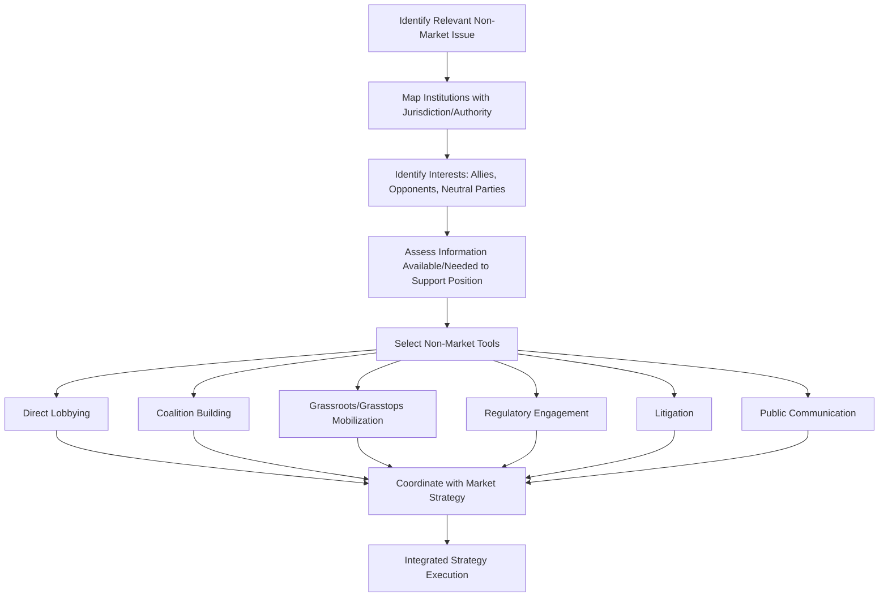

## Non-Market and Political Strategy

### Definition and Core Concept

Non-market strategy refers to the set of organizational activities directed at managing a firm's relationships with the social, political, legal, and regulatory environment — as distinct from "market strategy," which addresses competitive positioning in product and factor markets. Political strategy is typically treated as the core subset of non-market strategy concerned specifically with influencing government actors, legislation, regulation, and public policy outcomes. The foundational premise (developed substantially by David Baron in the 1990s, whose "integrated strategy" framework is central to this literature) is that firm performance is shaped by both the market environment (competitors, customers, suppliers) and the non-market environment (governments, regulators, activists, media, and public opinion), and that strategic management should address both systematically rather than treating non-market factors as peripheral risk management concerns.

### The Four I's Framework (Baron)

David Baron's widely used framework for analyzing the non-market environment identifies four key dimensions, often referred to as the "Four I's":

1. **Issues** — the specific policy, regulatory, or social questions relevant to the firm (e.g., a pending piece of legislation, a regulatory rulemaking process, an emerging public health or environmental concern)
2. **Institutions** — the formal and informal structures through which non-market issues are resolved (legislatures, regulatory agencies, courts, international bodies, industry self-regulatory organizations)
3. **Interests** — the various parties (firms, industry associations, advocacy groups, unions, competitors) with a stake in how an issue is resolved, and their respective positions
4. **Information** — the facts, data, and arguments available to and used by the various interested parties to influence institutional outcomes, including the firm's own capacity to generate credible information supporting its position

[Inference] Baron's framework is widely taught and applied as a diagnostic tool for structuring non-market analysis, though as an analytical framework it is primarily descriptive/organizing rather than predictive; it identifies what to analyze rather than specifying which strategic actions will succeed in a given non-market context.

### Market Strategy vs. Non-Market Strategy vs. Integrated Strategy

| Dimension | Market Strategy | Non-Market Strategy | Integrated Strategy |
| --- | --- | --- | --- |
| Primary arena | Product/factor markets | Government, regulatory, social/political arenas | Both, pursued jointly and coherently |
| Key actors | Competitors, customers, suppliers | Legislators, regulators, courts, NGOs, media, public opinion | All of the above |
| Typical tools | Pricing, product differentiation, distribution, M&A | Lobbying, coalition-building, regulatory engagement, litigation, public communication | Combined use, deliberately coordinated |
| Governance framework | Standard competitive strategy analysis (e.g., Five Forces) | Political and stakeholder analysis (e.g., Four I's) | Requires cross-functional coordination between strategy, government affairs, legal, and communications functions |

Baron's central prescriptive argument is that firms achieve superior outcomes by pursuing integrated strategy — deliberately coordinating market and non-market actions — rather than treating government affairs, legal, and corporate communications as functions isolated from core competitive strategy.

### Core Non-Market Strategic Activities

#### 1. Lobbying and Direct Government Engagement

Direct efforts to influence legislation, regulation, or government decisions through communication with legislators, regulators, and agency staff. This includes:

- Direct corporate lobbying (in-house government affairs teams)
- Third-party lobbying firms and consultants
- Testimony in legislative or regulatory proceedings
- Participation in formal regulatory comment periods (e.g., notice-and-comment rulemaking processes common in many regulatory systems)

[Unverified] The specific legal frameworks, disclosure requirements, and permissible scope of lobbying activity vary substantially by jurisdiction and are subject to ongoing legislative and regulatory change; firms operating across multiple jurisdictions typically require jurisdiction-specific legal guidance rather than relying on generalized lobbying practice descriptions.

#### 2. Coalition Building and Industry Association Strategy

Firms frequently pursue non-market objectives collectively rather than individually, through:

- Industry trade associations representing shared regulatory or legislative interests
- Ad hoc coalitions formed around specific issues, sometimes including firms that are otherwise market competitors
- Cross-sector coalitions with non-industry allies (e.g., environmental groups, labor organizations, consumer advocates) when interests align on a specific issue

[Inference] Collective action through coalitions carries an inherent free-rider risk (individual firms may benefit from favorable policy outcomes achieved primarily through other firms' or the association's efforts), a dynamic well documented in collective action theory (Olson) and relevant to why industry associations often need dues structures, selective benefits, or coordination mechanisms to sustain member participation.

#### 3. Grassroots and Grasstops Mobilization

- **Grassroots strategies** — mobilizing employees, customers, or the general public to communicate directly with policymakers (e.g., through employee advocacy campaigns, customer petition drives)
- **Grasstops strategies** — engaging influential, well-connected individuals (community leaders, former officials, respected local figures) who can communicate directly with policymakers with greater credibility or access than the firm itself

#### 4. Regulatory Strategy

Distinct from legislative lobbying, regulatory strategy addresses ongoing engagement with regulatory agencies responsible for implementing and enforcing law within their jurisdiction:

- Participating in formal rulemaking comment processes
- Building ongoing working relationships with agency staff (distinct from political appointees) who often have substantial technical influence over regulatory outcomes
- Anticipating and shaping the technical standards and compliance frameworks that translate broad legislative mandates into specific operational requirements

#### 5. Litigation as Strategy

Legal action (or the credible threat of it) can function as a deliberate non-market strategic tool, not solely a defensive/compliance activity:

- Challenging unfavorable regulations through the courts
- Using litigation to delay a competitor's market entry or a regulatory change
- Strategic use of intellectual property litigation to shape competitive dynamics

[Inference] The strategic use of litigation raises distinct ethical and reputational considerations (e.g., concerns about using litigation primarily to delay or increase costs for weaker-resourced opponents rather than to resolve a genuine legal dispute on the merits) that firms and their counsel must weigh against the immediate strategic benefit.

#### 6. Public Communication and Reputation Management

Shaping public opinion and media narratives on issues relevant to the firm's non-market position, including:

- Corporate public affairs and issue advertising campaigns
- Proactive media relations on policy-relevant topics
- Corporate social responsibility and stakeholder communication (connecting to the sustainability and stakeholder strategy concepts covered earlier)

### Diagram: Non-Market Strategy Formulation Process

### Firm-Specific vs. Collective Non-Market Strategy

- **Firm-specific strategy** — a firm pursues non-market objectives unilaterally, appropriate when the firm's interests diverge meaningfully from industry peers, or when it possesses unique resources (scale, reputation, information) to pursue the issue effectively alone
- **Collective strategy** — pursued jointly with other firms (typically through trade associations or coalitions), appropriate when interests are shared across an industry and collective voice carries more institutional weight than individual firm advocacy

[Inference] The choice between firm-specific and collective strategy is itself a strategic decision with trade-offs: collective strategy can amplify influence and share costs but requires interest alignment and surrenders some control over messaging and priorities to the collective body, while firm-specific strategy preserves control but may carry less institutional credibility or resource capacity.

### Political Risk Assessment

A related but distinct non-market strategy activity involves systematically assessing political and regulatory risk exposure, particularly relevant for firms operating internationally:

- **Regulatory risk** — exposure to adverse changes in laws or regulations affecting the firm's operations, cost structure, or market access
- **Expropriation/nationalization risk** — particularly relevant in certain international contexts, the risk of government seizure or forced divestiture of firm assets
- **Political instability risk** — broader exposure to disruption from political transitions, civil unrest, or governance breakdown in markets where the firm operates
- **Reputational/social license risk** — exposure to adverse public or activist reaction that can trigger regulatory or legislative response even absent formal government action initially

[Inference] Formal political risk assessment methodologies (drawing on political science, international relations, and risk management disciplines) vary considerably in rigor and approach across firms and consultancies; there is no single universally standardized methodology, and firms often combine qualitative expert judgment with available quantitative risk indices from various providers.

### Ethical Considerations in Non-Market Strategy

Non-market and political strategy raises distinctive ethical questions not present in conventional market competition:

- **Legitimacy of influence-seeking** — the boundary between legitimate advocacy (providing policymakers with relevant information and perspective) and inappropriate influence (e.g., actions that circumvent democratic accountability or transparency) is a genuinely contested normative question, not a settled matter
- **Transparency and disclosure** — the degree to which lobbying activity, political spending, and coalition membership should be publicly disclosed is subject to ongoing legal and normative debate that varies substantially across jurisdictions
- **Astroturfing concerns** — grassroots mobilization strategies that misrepresent organized corporate advocacy as spontaneous, independent public sentiment ("astroturfing") raise significant ethical and, in some jurisdictions, legal concerns distinct from genuine grassroots or grasstops engagement
- **Regulatory capture** — a well-documented phenomenon in political economy and regulatory theory where sustained industry influence over a regulatory agency can result in regulation serving industry interests over the broader public interest the regulation was intended to serve

Given the genuinely contested normative questions in this space (appropriate limits on corporate political influence, disclosure requirements, the proper role of money in politics), this section presents the descriptive strategic management framework and the range of positions in the debate rather than adjudicating which specific practices are appropriate — reasonable perspectives on these questions differ significantly across political and philosophical traditions.

### Common Implementation Failure Modes

- **Treating non-market strategy as purely defensive/reactive** — engaging only after an adverse regulatory or legislative threat has already materialized, rather than proactively shaping the issue environment before positions harden
- **Lack of coordination between non-market and market strategy functions** — government affairs, legal, and communications functions operating in isolation from core business strategy, missing opportunities for integrated strategy that Baron's framework specifically prescribes
- **Misjudging the interest landscape** — failing to accurately map which parties are genuine allies, genuine opponents, or persuadable neutral parties, leading to poorly targeted advocacy efforts
- **Overreliance on a single tool** — relying exclusively on direct lobbying without complementary coalition-building, information strategy, or public communication, reducing overall effectiveness
- **Reputational backlash from perceived overreach** — non-market tactics perceived as excessive, deceptive (e.g., astroturfing), or contrary to a firm's stated public values can generate reputational costs that outweigh the intended policy benefit

### Implementation Framework

**Key Points**

- Apply the Four I's framework systematically (issues, institutions, interests, information) before selecting specific non-market tactics
- Pursue integrated strategy by coordinating non-market activities directly with core competitive/market strategy, rather than treating government affairs as an isolated compliance or risk-management function
- Assess whether firm-specific or collective (coalition-based) strategy is more appropriate given the degree of interest alignment with industry peers on a given issue
- Build non-market capability proactively, ahead of specific regulatory threats, rather than only mobilizing reactively once an adverse issue has already progressed through relevant institutions
- Explicitly evaluate the ethical and reputational dimensions of proposed non-market tactics (e.g., transparency of grassroots mobilization, appropriateness of litigation strategy) given the genuinely contested normative terrain in this area

### Illustrative Example (Generic, Non-Attributed)

A firm in a heavily regulated industry anticipates upcoming legislative attention to a specific environmental compliance standard relevant to its operations. Applying Baron's framework, the firm maps the issue (the specific proposed standard), the institutions with jurisdiction (the relevant legislative committee and implementing regulatory agency), the interests involved (industry peers with aligned interests, environmental advocacy groups with opposing interests, and several legislators who are genuinely undecided), and the information landscape (existing technical studies on compliance cost and feasibility, and gaps the firm could credibly fill with its own data). The firm pursues an integrated strategy: joining an industry coalition for shared legislative advocacy while also independently commissioning and publishing a technical feasibility study (an information strategy), engaging directly with regulatory agency technical staff ahead of formal comment periods (a regulatory strategy), and coordinating messaging with its corporate communications function to ensure consistency between its public sustainability commitments and its non-market advocacy positions, avoiding the reputational risk of an apparent contradiction between stated values and political activity.

### Relationship to Broader Strategic Management Theory

- **Stakeholder Theory** — non-market strategy directly extends stakeholder management to government, regulatory, and civil society actors, connecting closely to the stakeholder capitalism concepts covered earlier in this course
- **Institutional Theory** — non-market strategy engages directly with institutional theory's concerns about how firms navigate and shape the formal and informal "rules of the game" governing their operating environment
- **Resource-Based View** — non-market capabilities (established government relationships, regulatory expertise, coalition access) can themselves constitute valuable, firm-specific strategic resources difficult for competitors to replicate quickly
- **Corporate Governance** — board oversight of political spending, lobbying activity, and associated reputational risk is an increasingly prominent corporate governance concern in many jurisdictions
- **Strategic Agility** — non-market environments are subject to the same volatility and transient-advantage dynamics discussed under strategic agility, requiring similar sensing and reconfiguration capabilities applied specifically to the political/regulatory domain

### Conclusion

Non-market and political strategy extends strategic management beyond conventional competitive analysis to encompass systematic engagement with government, regulatory, and civil society actors that materially shape firm performance and constraints. Baron's Four I's framework and integrated strategy concept provide the primary analytical architecture for this domain, emphasizing that non-market activity achieves the greatest strategic value when deliberately coordinated with core competitive strategy rather than isolated within specialized government affairs or legal functions. Because non-market strategy operates in a domain involving genuine, contested normative questions about the appropriate role and limits of corporate political influence, effective practice requires not only strategic and analytical rigor but also careful attention to the ethical, transparency, and reputational dimensions of specific non-market tactics.

**Related Topics**

- Stakeholder Capitalism and Purpose-Driven Strategy
- Institutional Theory and Organizational Fields
- Regulatory Capture and Political Economy
- Corporate Political Spending and Governance Disclosure
- Political Risk Assessment for International Operations
- Collective Action Theory and Industry Associations (Olson)
- Corporate Reputation Management and Crisis Communication
- ESG Metrics, Ratings, and Disclosure Frameworks
- Litigation Strategy and Intellectual Property Enforcement
- Strategic Agility and Adaptive Strategy