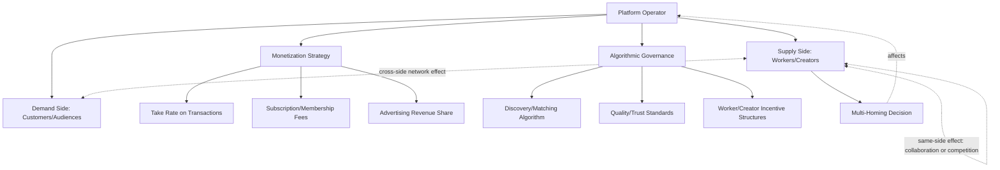

## Strategy in the Gig and Creator Economy

### Definition and Core Concept

The gig economy refers to labor markets organized around short-term, task-based, or project-based work arrangements, typically mediated by digital platforms connecting independent workers with customers or businesses, as distinct from traditional standing employment relationships. The creator economy refers to the ecosystem of individuals who generate income by producing content, media, or personal brand-driven products and services, typically distributed through digital platforms (social media, video, audio, newsletter, or livestreaming platforms) and monetized through a combination of platform-mediated revenue sharing, direct audience payment, brand partnerships, and product sales. Strategic management in both domains centers on platform-mediated relationships between the platform, independent workers/creators, and end customers or audiences — a structure that raises distinctive strategic questions not addressed by traditional employment-based organizational strategy.

### Platform Business Model Foundations

Both the gig and creator economies are structured around multi-sided platform business models, connecting distinct user groups (workers/creators and customers/audiences) who each derive value from the presence and participation of the other side — a dynamic central to platform and network effects theory.

#### Cross-Side and Same-Side Network Effects

- **Cross-side network effects** — value to one side of the platform increases as participation on the other side increases (e.g., more available gig workers makes a labor platform more attractive to customers seeking fast service; more content creators makes a platform more attractive to audiences seeking variety)
- **Same-side network effects** — value to participants on one side can also depend on participation levels within that same side (e.g., creators may benefit from a large, active creator community through collaboration opportunities, though same-side effects can also be negative, as increased worker/creator supply can intensify competition for the same demand)

### Strategic Framework for Platform Operators

#### Take Rate and Monetization Strategy

Platform operators must determine the percentage of transaction value (the "take rate") retained by the platform versus passed to workers/creators, a decision with significant strategic implications:

- Higher take rates increase platform revenue per transaction but can reduce worker/creator participation, particularly if competing platforms offer more favorable terms
- Lower take rates can attract and retain supply-side participation but require higher transaction volume to achieve platform profitability
- Some platforms pursue tiered or hybrid monetization (e.g., subscription access, advertising revenue sharing, transaction fees, premium feature fees) rather than a single take-rate mechanism

[Inference] Optimal take rate strategy is highly context-dependent on competitive intensity, switching costs, and the platform's relative bargaining power versus workers/creators, and specific take rate figures across platforms change frequently in response to competitive pressure; current rates for any specific platform should be verified directly rather than assumed static.

#### Worker/Creator Acquisition and Retention Strategy

- **Onboarding and quality control** — balancing ease of entry (to build supply-side scale) against quality/trust standards (important for demand-side satisfaction), a classic platform strategy trade-off
- **Algorithmic discovery and distribution** — platform algorithms determining which workers/creators receive visibility or job/task matching represent a significant, often opaque, strategic lever affecting worker/creator income and behavior, and a frequent source of platform-worker/creator tension
- **Multi-homing considerations** — the degree to which workers/creators participate simultaneously across multiple competing platforms ("multi-homing") affects platform bargaining power; platforms often pursue exclusivity incentives or algorithmic advantages for single-platform ("single-homing") participants to reduce multi-homing and strengthen platform lock-in

### Diagram: Gig/Creator Platform Strategic Architecture

### Worker/Creator-Side Strategic Considerations

For individuals operating within gig and creator platforms, strategic management concepts apply at the individual or micro-enterprise level:

#### Personal Brand as Strategic Asset

In the creator economy specifically, personal brand functions analogously to firm-level brand equity in conventional strategy — a differentiated, difficult-to-replicate resource (connecting to resource-based view logic) that can command premium pricing, audience loyalty, and cross-platform value transfer.

#### Platform Diversification Strategy (Multi-Homing from the Worker/Creator Perspective)

- **Single-platform concentration** — maximizes potential benefit from platform-specific algorithmic favor and audience-building momentum, but creates significant platform dependency risk
- **Multi-platform diversification** — reduces dependency risk (a single platform policy change, algorithm update, or account suspension cannot eliminate the individual's entire income/audience) but requires spreading limited time and content-production resources across multiple platforms, and audience-building momentum may not transfer proportionally

[Inference] The optimal balance between concentration and diversification strategy for individual creators depends heavily on the specific platforms' algorithmic dynamics, the creator's content format, and risk tolerance; there is no universally optimal diversification ratio established in the available literature, and creator strategy commentary on this topic is largely practitioner-derived rather than academically validated.

#### Direct-to-Audience Monetization ("Owning the Audience")

A significant strategic theme in creator economy commentary is the distinction between:

- **Platform-mediated monetization** — revenue dependent on platform-specific mechanisms (ad revenue share, platform-specific creator funds, algorithmic reach), which can be altered unilaterally by the platform and carries corresponding strategic risk
- **Direct audience monetization** — mechanisms allowing the creator to capture audience relationships independent of any single platform (e.g., email lists, paid membership/subscription products, owned websites), reducing platform dependency risk at the cost of requiring the creator to build and maintain this infrastructure directly

This distinction closely parallels traditional business strategy concerns about disintermediation risk and channel dependency.

### Regulatory and Classification Strategy: Worker Classification

A defining strategic and legal issue specific to the gig economy is the classification of platform workers as independent contractors versus employees, which carries substantial strategic and cost implications for platform operators:

- **Independent contractor classification** — typically allows platforms to avoid costs associated with traditional employment (minimum wage guarantees, overtime, employer-provided benefits, payroll tax obligations in many jurisdictions), a cost structure central to many gig platforms' original business models
- **Employee classification** — carries the above cost and compliance obligations, and has been the subject of extensive, ongoing litigation and legislation across multiple jurisdictions challenging the independent contractor classification used by many gig platforms

[Unverified] Worker classification law is a rapidly evolving and highly jurisdiction-specific area, with significant legislative and judicial activity in multiple countries and U.S. states; specific classification rules, relevant test criteria (e.g., "ABC tests" used in some jurisdictions), and the current legal status of any particular classification approach should be verified against current, jurisdiction-specific legal sources rather than treated as settled or uniform across markets.

Strategic responses by platform operators to this regulatory uncertainty have included:

- Lobbying and non-market strategy efforts (directly connecting to the non-market strategy concepts covered previously) to shape worker classification legislation
- Offering limited, portable benefit structures to independent contractors as a middle path, in some cases in response to legislative negotiation
- Adjusting algorithmic control mechanisms (e.g., degree of worker scheduling autonomy) partly in response to legal tests that weigh the degree of platform control over worker activity in classification determinations

### Trust and Reputation Systems as Strategic Infrastructure

Given the absence of traditional employment relationships and often limited direct interaction history between parties, gig and creator platforms rely heavily on reputation and rating systems as core strategic infrastructure:

- Two-sided rating systems (both parties rate each other) are common in gig labor platforms, addressing information asymmetry from both directions
- Reputation portability (or its absence) across platforms represents a significant strategic lock-in mechanism — workers/creators who have built substantial platform-specific reputation face switching costs if that reputation does not transfer to a competing platform
- [Inference] The design of rating and reputation systems (e.g., susceptibility to rating inflation, retaliatory rating behavior, or algorithmic bias) is an active area of platform design concern, though the specific effectiveness of any given design approach is difficult to generalize across platform contexts

### Competitive Dynamics Among Platforms

- **Winner-take-most dynamics** — strong cross-side network effects in many gig and creator platforms can create winner-take-most competitive dynamics similar to those discussed under blitzscaling and scaling strategy, incentivizing platforms to prioritize rapid scale even at the cost of near-term unit economics
- **Vertical specialization vs. horizontal breadth** — platforms face strategic choices between broad, generalist positioning (serving many task/content categories) versus narrow, vertical specialization (serving a specific niche particularly well), with different competitive and network effect dynamics for each approach
- **Disintermediation threat from creator/worker direct tools** — the growing availability of direct-to-audience and independent business infrastructure tools (payment processing, audience management, scheduling) creates an ongoing strategic threat to platforms whose value proposition rests primarily on discovery and matching rather than genuinely differentiated infrastructure

### Common Strategic Failure Modes

- **Underinvesting in trust and safety infrastructure** — as platforms scale, inadequate investment in quality control, dispute resolution, and safety mechanisms can erode the trust that underlies the entire platform value proposition
- **Algorithmic opacity generating worker/creator distrust** — unclear or frequently and unpredictably changing algorithmic discovery/matching rules can generate significant worker/creator dissatisfaction and platform-switching behavior, since income for these participants often depends directly on algorithmic treatment
- **Regulatory risk underestimation** — treating worker classification and platform regulation as a static, settled matter rather than an actively evolving legal and political risk requiring ongoing non-market strategy engagement
- **Take rate misjudgment** — setting take rates that appear optimal for near-term platform revenue but that drive worker/creator attrition to competing platforms or direct disintermediation over the longer term
- **For individual workers/creators: single-platform dependency** — building an income model entirely dependent on a single platform's continued goodwill, algorithm stability, and policy consistency, with no mitigation for platform-side risk

### Implementation Framework

**Key Points**

- Platform operators should treat take rate, algorithmic governance, and worker/creator acquisition strategy as interconnected strategic decisions rather than independent operational choices
- Worker classification and broader regulatory risk should be managed through proactive non-market strategy engagement rather than reactive legal compliance alone
- Trust and reputation system design is core strategic infrastructure, not a peripheral feature, given the absence of traditional employment relationship trust mechanisms
- Individual workers/creators should evaluate platform concentration versus diversification strategy explicitly, weighing algorithmic momentum benefits against platform dependency risk
- Direct-to-audience monetization capability represents a meaningful risk-mitigation strategy for individual creators, analogous to reducing channel dependency in conventional business strategy

### Illustrative Example (Generic, Non-Attributed)

A home services marketplace platform initially pursues aggressive supply-side (worker) acquisition with a low take rate and minimal quality screening to build two-sided scale quickly, consistent with blitzscaling logic given strong cross-side network effects in local service marketplaces. As the platform matures and faces increasing regulatory scrutiny regarding worker classification in several jurisdictions, it shifts strategy: introducing a limited portable benefits program for its independent contractor workforce (partly in response to ongoing non-market engagement with regulators), while gradually adjusting its take rate upward now that platform trust and switching costs have increased. Simultaneously, it invests in improved two-sided reputation infrastructure and dispute resolution to address quality concerns that emerged during the rapid early scaling phase, recognizing that trust infrastructure had been underinvested relative to growth during the initial scaling period.

### Relationship to Broader Strategic Management Theory

- **Platform Strategy and Network Effects** — the foundational theoretical architecture for both gig and creator economy strategic analysis
- **Resource-Based View** — personal brand and audience relationships function as individual-level strategic resources analogous to firm-level brand equity and customer relationships
- **Non-Market and Political Strategy** — worker classification and platform regulation represent a direct, high-stakes application of non-market strategy concepts to this specific industry context
- **Blitzscaling and Scaling Strategy** — winner-take-most dynamics in many gig and creator platforms directly connect to the blitzscaling framework's core applicability condition (strong network effects)
- **Corporate Entrepreneurship** — many individual gig workers and creators function, in effect, as micro-enterprises applying entrepreneurial strategy concepts (effectuation, resource constraints, opportunity identification) at an individual rather than firm level

### Conclusion

Strategy in the gig and creator economy centers on the distinctive dynamics of multi-sided platform business models mediating relationships between workers/creators and customers/audiences, requiring platform operators to navigate interconnected decisions about take rate, algorithmic governance, trust infrastructure, and an actively evolving regulatory environment around worker classification. At the individual level, gig workers and creators face genuine strategic choices analogous to conventional business strategy — platform concentration versus diversification, and platform-mediated versus direct-to-audience monetization — that determine their exposure to platform-side risk. As both regulatory scrutiny and competitive intensity in this space continue to evolve, effective strategy in this domain requires ongoing attention to non-market strategy, trust system design, and genuine two-sided value creation rather than treating rapid platform scale as a sufficient strategic objective on its own.

**Related Topics**

- Platform Strategy and Multi-Sided Network Effects
- Non-Market and Political Strategy (Worker Classification)
- Blitzscaling and Scaling Strategy for Growth Ventures
- Resource-Based View: Personal Brand and Audience as Strategic Assets
- Strategy for Startups and New Ventures (Individual/Micro-Enterprise Application)
- Reputation Systems and Trust Infrastructure Design
- Disintermediation and Channel Dependency Risk
- Corporate Entrepreneurship and Intrapreneurship
- Labor Market Regulation and Employment Classification Law
- Direct-to-Consumer and Owned-Audience Business Models