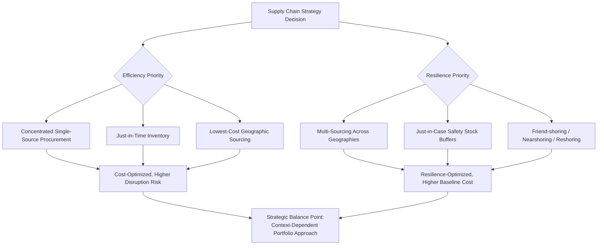

## Geoeconomics and Strategic Supply Chain Realignment

### Definition and Core Concept

Geoeconomics refers to the use of economic instruments — trade policy, investment restrictions, sanctions, export controls, industrial policy — by states to pursue geopolitical objectives, and correspondingly, the strategic management discipline concerned with how firms navigate an environment where economic and geopolitical considerations are increasingly intertwined. Strategic supply chain realignment refers to the deliberate restructuring of firms' sourcing, production, and logistics networks in response to geoeconomic pressures, distinct from supply chain optimization driven purely by cost, quality, or conventional operational efficiency considerations. This topic connects directly to non-market strategy (covered previously) but focuses specifically on the operational and supply chain strategic response to geopolitical and geoeconomic dynamics, rather than firms' efforts to directly influence policy outcomes.

### Drivers of Geoeconomic Supply Chain Pressure

- **Trade policy volatility** — tariffs, trade agreements, and their renegotiation or withdrawal creating shifting cost structures for cross-border sourcing and production
- **Export controls and technology restrictions** — government restrictions on the export of specific technologies, components, or intellectual property to certain countries or entities, particularly prominent in sectors such as semiconductors and advanced technology
- **Sanctions regimes** — restrictions on trade or financial transactions with specific countries, entities, or individuals, creating both compliance obligations and strategic supply chain risk if suppliers or customers become subject to sanctions
- **Industrial policy and reshoring incentives** — government subsidies, tax incentives, or regulatory requirements designed to encourage domestic or allied-country production of strategically significant goods (e.g., semiconductors, critical minerals, pharmaceuticals)
- **Geopolitical conflict and instability** — armed conflict, diplomatic rupture, or heightened bilateral tension directly disrupting trade routes, production facilities, or bilateral commercial relationships
- **Pandemic-driven supply chain disruption** — the COVID-19 pandemic served as a significant, widely cited catalyst accelerating firm attention to supply chain concentration risk, though [Inference] the degree to which post-pandemic supply chain changes reflect genuine strategic diversification versus temporary, situation-specific adjustments that partially reversed as disruptions eased remains a subject of ongoing empirical assessment rather than settled consensus

[Unverified] Because geoeconomic conditions — specific tariff levels, export control lists, sanctioned entities, and industrial policy programs — change frequently and are subject to rapid political developments, any specific current details should be verified against current government and international relations sources rather than assumed static from general strategic management principles.

### Strategic Response Frameworks

#### Friend-shoring, Nearshoring, and Reshoring

Firms have pursued several distinct geographic realignment strategies in response to geoeconomic pressure, often discussed together but analytically distinct:

| Strategy | Description | Primary Driver |
| --- | --- | --- |
| Reshoring | Relocating production back to the firm's home country | Reducing geopolitical exposure, industrial policy incentives, supply chain resilience |
| Nearshoring | Relocating production to geographically proximate countries (though not necessarily politically aligned ones) | Reduced logistics time/cost, some geopolitical risk mitigation, proximity to end markets |
| Friend-shoring | Relocating production to politically aligned countries, regardless of geographic proximity | Explicitly geopolitical risk mitigation, reducing dependency on geopolitically adversarial or unstable jurisdictions |
| Diversification (China+1 or similar models) | Maintaining existing production while adding parallel capacity in additional countries, rather than fully relocating | Balancing existing cost/scale advantages against concentration risk reduction |

[Inference] These strategies are not mutually exclusive, and many firms pursue a portfolio approach combining elements of diversification, selective reshoring for the most strategically sensitive components, and nearshoring for logistics-sensitive product categories, rather than adopting a single uniform geographic realignment strategy across their entire supply chain.

#### Supply Chain Resilience vs. Efficiency Trade-off

A central strategic tension in this domain is the trade-off between supply chain efficiency (cost minimization, typically achieved through concentrated sourcing from lowest-cost locations and just-in-time inventory practices) and supply chain resilience (the capacity to withstand and recover from disruption, typically requiring some redundancy, diversification, and inventory buffer that increase cost):

- **Just-in-time vs. just-in-case inventory strategy** — the classical lean/just-in-time inventory model, which minimizes carrying costs but creates vulnerability to disruption, versus a "just-in-case" approach maintaining larger safety stock buffers at higher carrying cost
- **Single-sourcing vs. multi-sourcing** — concentrating procurement with a single supplier (often achieving better pricing and quality coordination) versus deliberately maintaining multiple qualified suppliers across different geographies to reduce single-point-of-failure risk
- **Supply chain visibility investment** — investment in monitoring and mapping deeper tiers of the supply chain (beyond direct, "Tier 1" suppliers to Tier 2, Tier 3, and further upstream suppliers) to identify concentration risk and geopolitical exposure not visible through direct supplier relationships alone

### Risk Assessment Framework for Geoeconomic Supply Chain Exposure

- **Geographic concentration mapping** — systematically identifying the degree to which critical inputs, components, or production steps are concentrated in a single country or region, extending beyond direct (Tier 1) suppliers to deeper supply chain tiers where hidden concentration risk often resides
- **Criticality assessment** — distinguishing between commodity inputs (widely available, low switching cost) and critical/specialized inputs (limited alternative sources, high switching cost or technical barriers to substitution), since geoeconomic risk mitigation resources are typically best concentrated on the latter
- **Scenario planning application** — applying scenario planning methodology (previously discussed under strategic agility) specifically to geoeconomic scenarios (e.g., escalation of a specific bilateral tension, imposition of new export controls, sanctions expansion) to stress-test supply chain resilience under multiple plausible geopolitical futures
- **Dual-use and export control classification** — for firms in technology-relevant sectors, assessing whether specific products, components, or technical data are subject to export control classification requiring licensing or facing restriction for certain destination countries or end users

### Industrial Policy as a Strategic Consideration

Government industrial policy — subsidies, tax incentives, local content requirements, and public investment programs intended to encourage domestic or allied-country production of strategically significant goods — has become an increasingly significant factor firms must incorporate into supply chain and facility location strategy:

- **Subsidy-driven location decisions** — evaluating whether available government incentives materially affect the total cost calculus of alternative production locations, sometimes shifting decisions that would otherwise favor lower-cost locations absent the incentive
- **Local content and domestic production requirements** — some industrial policy programs condition subsidy eligibility or market access on meeting specific domestic production or sourcing thresholds, directly shaping supply chain design decisions
- **Cross-border coordination challenges** — firms with multinational operations must navigate potentially divergent or even conflicting industrial policy incentives and requirements across the different jurisdictions in which they operate

[Inference] The durability and long-term effectiveness of specific industrial policy programs in achieving their stated objectives (e.g., building durable domestic manufacturing capability versus temporarily redirecting investment location decisions that shift again once incentives expire) is a genuinely contested question in economic policy analysis, and firms making long-horizon capital investment decisions based on current industrial policy incentives face meaningful policy continuity risk.

### Integration with Non-Market Strategy

Geoeconomic supply chain strategy connects directly to the non-market strategy concepts discussed previously:

- Firms often engage directly in lobbying and coalition-building around trade policy, export control scope, and industrial policy program design, given the material impact these policy areas have on supply chain cost structures and feasible strategic options
- Political risk assessment (discussed under non-market strategy) is a direct input into geoeconomic supply chain risk assessment specifically
- Firms may pursue integrated strategy (Baron's framework) by simultaneously adjusting supply chain configuration and engaging in policy advocacy to shape the regulatory environment affecting that configuration

### Common Strategic Failure Modes

- **Underestimating deep-tier supply chain concentration** — focusing risk assessment on direct (Tier 1) suppliers while remaining unaware of concentration risk several tiers upstream, where a disruption can still halt production despite apparent Tier 1 diversification
- **Treating geoeconomic realignment as a one-time project rather than an ongoing capability** — geoeconomic conditions continue to evolve, requiring continuous reassessment rather than a single realignment decision assumed to remain valid indefinitely
- **Overcorrecting toward resilience at excessive cost** — pursuing extensive diversification or reshoring without rigorous cost-benefit analysis relative to the actual probability and cost of the disruption scenarios being mitigated against
- **Industrial policy dependency risk** — making long-horizon capital investment decisions primarily on the basis of current subsidy or incentive programs without adequately weighing policy continuity risk
- **Inadequate coordination between supply chain, legal/compliance, and non-market strategy functions** — treating export control compliance, sanctions risk, and supply chain design as separate workstreams rather than integrated strategic considerations, echoing the integrated strategy coordination failure discussed under non-market strategy generally

### Implementation Framework

**Key Points**

- Map supply chain concentration risk beyond direct suppliers to deeper tiers, since critical dependency risk frequently resides in upstream tiers not visible through standard supplier relationship management
- Apply criticality assessment to focus resilience investment on inputs where alternative sourcing is genuinely limited, rather than pursuing uniform diversification across all inputs regardless of substitutability
- Use scenario planning specifically calibrated to plausible geoeconomic disruption scenarios relevant to the firm's specific supply chain footprint
- Treat geoeconomic risk assessment as an ongoing, continuously updated capability rather than a single strategic realignment project
- Coordinate supply chain strategy explicitly with non-market strategy and legal/compliance functions, given the direct interaction between policy environment and feasible supply chain configurations

### Illustrative Example (Generic, Non-Attributed)

An electronics manufacturer conducts a deep-tier supply chain mapping exercise and discovers that while its direct (Tier 1) component suppliers are reasonably diversified across several countries, a specific critical sub-component used across nearly all its Tier 1 suppliers is sourced from a small number of Tier 3 suppliers concentrated in a single country subject to elevated geopolitical tension. Applying criticality assessment, the firm identifies this specific sub-component (rather than its broader supply chain generally) as the priority for resilience investment, pursuing qualification of an alternative supplier in a geopolitically diversified location for this specific input, while leaving other, more readily substitutable inputs under existing efficient, concentrated sourcing arrangements. The firm simultaneously engages its non-market strategy function to monitor and, where appropriate, provide input on relevant export control and industrial policy developments affecting this product category.

### Relationship to Broader Strategic Management Theory

- **Non-Market and Political Strategy** — geoeconomic supply chain strategy is closely intertwined with non-market strategy, particularly regarding trade policy, export control, and industrial policy engagement
- **Strategic Agility and Adaptive Strategy** — the continuously evolving geoeconomic environment requires the same sensing, resource fluidity, and reconfiguration capabilities discussed under strategic agility, applied specifically to supply chain configuration
- **Resource-Based View** — supply chain resilience capability (deep visibility, diversified qualified supplier relationships, rapid reconfiguration capacity) can itself constitute a valuable, difficult-to-replicate strategic resource relative to competitors with less mature supply chain risk management
- **Real Options Reasoning** — maintaining qualified but not fully utilized alternative suppliers or production locations functions as a real option, preserving the ability to shift production relatively quickly if geoeconomic conditions deteriorate, without the full upfront cost of parallel production capacity
- **Corporate Governance** — board-level oversight of geoeconomic and supply chain risk has become an increasingly prominent governance topic in many industries given the material financial and operational exposure involved

### Conclusion

Geoeconomics and strategic supply chain realignment address the increasingly significant intersection between geopolitical dynamics and operational supply chain strategy, requiring firms to balance the classical efficiency-resilience trade-off in a context of active and evolving trade policy, export control, sanctions, and industrial policy pressure. Effective strategic response depends on deep-tier supply chain visibility (extending risk assessment beyond direct suppliers), criticality-based prioritization of resilience investment, and close integration with non-market strategy functions given the direct influence of government policy on feasible supply chain configurations. Because geoeconomic conditions continue to evolve rapidly and are subject to significant political uncertainty, this domain requires treating supply chain risk management as an ongoing strategic capability rather than a fixed, one-time realignment decision.

**Related Topics**

- Non-Market and Political Strategy
- Strategic Agility and Adaptive Strategy
- Real Options Reasoning in Strategic Decision-Making
- Political Risk Assessment for International Operations
- Resource-Based View and Supply Chain Capability as Strategic Resource
- Scenario Planning and Strategic Foresight
- Export Control and Sanctions Compliance Strategy
- Industrial Policy and Government Subsidy Programs
- Corporate Governance and Board Oversight of Operational Risk
- International Market Entry Strategy