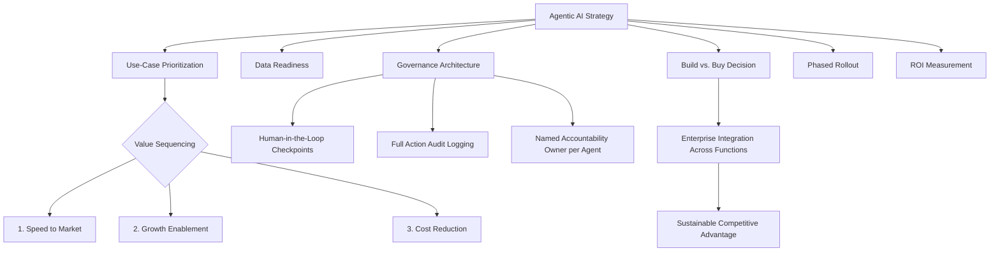

## Agentic AI and the Future of Strategic Management

### Definition and Core Concept

Agentic AI refers to artificial intelligence systems capable of autonomously planning, executing, and adapting multi-step workflows toward a defined goal with limited ongoing human intervention, distinguishing it from earlier generations of AI tools that primarily responded to individual, discrete prompts or automated single, narrowly defined tasks. In a strategic management context, agentic AI raises questions distinct from general AI adoption strategy: how autonomous decision-making systems should be integrated into strategic planning, resource allocation, and organizational decision rights, and how classical strategic management frameworks (competitive advantage, organizational design, governance) need to adapt as a growing share of operational and even some strategic-adjacent decisions are delegated to autonomous or semi-autonomous systems.

[Unverified] Because this is a rapidly evolving technology and practitioner area as of 2026, specific adoption statistics, named product capabilities, and vendor landscape details should be treated as reflecting current commentary and forecasts rather than settled, stable facts; adoption rates, governance norms, and best practices in this space are actively changing and should be verified against current sources for any time-sensitive decision.

### Distinguishing Agentic AI from Prior AI/Automation Categories

| Category | Characteristic Behavior | Human Involvement |
| --- | --- | --- |
| Traditional automation/RPA | Executes fixed, rule-based, pre-programmed steps | Human designs the full process in advance; system cannot adapt |
| Generative AI (single-turn) | Responds to individual prompts with generated content | Human initiates and evaluates each discrete interaction |
| Agentic AI | Autonomously plans a sequence of steps, uses tools, and adapts its approach to achieve a stated goal | Human sets the goal and constraints; system determines and executes the path, often with defined checkpoints |
| Multi-agent systems | Multiple specialized agents coordinate across a workflow or business domain | Human designs the overall orchestration architecture and governance; agents coordinate execution among themselves |

Agentic AI systems autonomously plan and execute multi-step workflows, effectively changing AI from a passive assistant into an active delegate, which is the central distinction driving new strategic management questions not present with earlier AI tool categories. [Decision Digital](https://www.decisiondigital.com/the-future-of-ai-in-business-strategy-for-2026/)

### Strategic Adoption Patterns as of 2026

According to industry analysis, agentic AI adoption is creating a divide between a small set of agent-first leaders and the broader set of organizations still early in adoption, with success in implementation being predominantly a function of people and change management rather than algorithmic capability alone. Sector-specific analysis suggests financial services is expected to be among the earlier sectors experiencing widespread agentic AI transformation, while broader enterprise forecasts suggest a substantial share of enterprise applications are expected to embed task-specific AI agents by the end of 2026, a sharp increase from prior years. [Agentic AI Strategy for CIOs and CTOs in 2026 | BCG +2](https://www.bcg.com/publications/2026/agentic-ai-strategy-cio-cto)

However, adoption is also associated with significant failure risk: a substantial proportion of agentic AI projects are forecast to be canceled by 2027 due to unclear return on investment and weak governance, with analysis suggesting most failures trace back to skipped governance and measurement processes rather than limitations in underlying model capability. [The JADA Squad](https://www.jadasquad.com/blog/ai-agent-strategy)[The JADA Squad](https://www.jadasquad.com/blog/ai-agent-strategy)

[Inference] The specific percentage figures cited across different industry analyses and forecasting firms vary somewhat and derive from different methodologies and definitions of "agentic AI" adoption; these figures should be understood as directional indicators of a rapidly growing but still early-stage and failure-prone adoption trend, rather than precise, mutually reconcilable statistics.

### Strategic Value Creation Sequencing

Industry strategic guidance suggests a specific prioritization logic for agentic AI value capture: speed first, growth second, and cost third, in that order — a sequencing that runs counter to the common initial instinct among business unit leaders to view agentic AI primarily as a cost/headcount reduction tool. This reflects a broader strategic principle that treating agentic AI purely as an automation-driven cost-cutting mechanism may substantially undervalue its potential contribution relative to speed-to-market and growth-oriented applications. [BCG](https://www.bcg.com/publications/2026/agentic-ai-strategy-cio-cto)

A related strategic discipline emphasized in current practitioner guidance is selective, value-driven deployment rather than broad application: agents are a powerful but costly technology, and simple, rule-based processes generally do not warrant agentic deployment — suggesting that effective agentic AI strategy requires the same rigor in identifying genuinely high-value use cases that characterizes any disciplined capital allocation decision, rather than uniform deployment across all possible workflows. [BCG](https://www.bcg.com/publications/2026/agentic-ai-strategy-cio-cto)

### Diagram: Agentic AI Strategic Value Framework

### Governance and Accountability Architecture

A recurring theme across current practitioner and consulting sources is that governance, not technical capability, is the primary determinant of agentic AI initiative success or failure. Recommended governance components include:

- **Human-in-the-loop checkpoints** — requiring human review for any agent action above a defined risk threshold, rather than fully autonomous operation across all decision types [The JADA Squad](https://www.jadasquad.com/blog/ai-agent-strategy)
- **Comprehensive audit logging** — logging every action an agent takes, not merely its final output, to enable retrospective accountability and error diagnosis [The JADA Squad](https://www.jadasquad.com/blog/ai-agent-strategy)
- **Named accountability ownership** — assigning a specific named person or team accountable for each agent's behavior, analogous to the way a human employee has a manager [The JADA Squad](https://www.jadasquad.com/blog/ai-agent-strategy)

This connects directly to a broader organizational design question: organizations will need to formally assign responsibility for agent behavior, requiring oversight skills that blend ethics, governance, and judgment, with the "agentic manager" role requiring different skills than the traditional "people manager" role. This suggests the emergence of a distinct managerial competency category — supervising autonomous systems rather than human direct reports — as a genuinely new organizational design consideration for strategic management. [Centric Consulting](https://centricconsulting.com/blog/agentic-ai-2026-four-predictions/)

### Implications for Executive Roles and Organizational Structure

Current analysis suggests agentic AI is contributing to a blurring of traditionally distinct C-suite technical roles: traditional boundaries between roles such as CISOs, CTOs, and CIOs are becoming increasingly blurry as agentic AI becomes integrated into organizations, with these traditionally technical roles becoming more strategic as agents begin to affect operations, workflows, and decision-making. Relatedly, decision-rights allocation for technology deployment appears to be shifting: a majority of technology stack and agentic deployment decisions now sit with the CIO or CTO, a real shift from prior AI adoption cycles where business unit leadership held comparable or greater influence over such decisions — with an accompanying risk that this shift makes agentic AI strategy overly technology-led rather than a genuine business-technology partnership. [Centric Consulting](https://centricconsulting.com/blog/agentic-ai-2026-four-predictions/)[BCG](https://www.bcg.com/publications/2026/agentic-ai-strategy-cio-cto)

At the individual contributor level, the anticipated shift in required skills involves a move from task execution toward supervisory and oversight functions: employees are expected to transition from task execution toward agent supervision and strategic oversight roles, requiring new skills in AI collaboration and strategic thinking, with successful organizational adoption depending on comprehensive training programs and a culture that embraces AI collaboration rather than treating it as a threat. [Guidewise](https://www.guidewise.ai/agentic-ai-the-strategic-imperative-every-ceo-must-master-for-2026/)[Guidewise](https://www.guidewise.ai/agentic-ai-the-strategic-imperative-every-ceo-must-master-for-2026/)

### Application Domains Relevant to Strategic Management

- **Supply chain and operations** — agentic AI applications are being used to underpin supply chain resilience by dynamically predicting disruptions and autonomously recalibrating procurement, production, and distribution schedules, directly relevant to the geoeconomic supply chain realignment concepts discussed previously in this chapter [AI Business Magazine](https://www.aibmag.com/featured-stories/agentic-ai-in-2026-strategic-business-partners-redefining-growth/)
- **Multi-agent orchestration across business functions** — multi-agent systems distribute specialized AI agents across business domains including procurement, manufacturing, marketing, and customer engagement, enabling concurrent, coordinated operational control at scale, representing a structural evolution beyond isolated, single-function AI tools toward integrated organizational infrastructure [AI Business Magazine](https://www.aibmag.com/featured-stories/agentic-ai-in-2026-strategic-business-partners-redefining-growth/)
- **Competitive and market strategy implications** — some analysis suggests agentic AI's strategic significance extends beyond internal productivity gains: the technology is increasingly viewed as a fundamental driver of enterprise growth and market differentiation, with self-aware, varying-autonomy agents beginning to blur traditional accountability lines and necessitating evolved frameworks for managing risk and competitive fairness [AI Business Magazine](https://www.aibmag.com/featured-stories/agentic-ai-in-2026-strategic-business-partners-redefining-growth/)

[Inference] Claims characterizing agentic AI as a source of durable competitive advantage should be evaluated cautiously and in relation to established competitive strategy theory (e.g., resource-based view criteria of value, rarity, and inimitability): to the extent agentic AI tools become widely commercially available across an industry, the sustainable competitive advantage is more likely to derive from proprietary data, superior organizational integration, and governance execution than from access to the underlying AI technology itself, which is likely to diffuse relatively quickly across competitors.

### Strategic Risks and Failure Modes

- **Governance underinvestment** — as noted, weak governance (rather than technical model limitations) is cited as the predominant driver of agentic AI project cancellation and failure
- **Unclear ROI and value measurement** — deploying agentic AI without clear, pre-defined success metrics tied to specific business value, echoing the innovation accounting principles discussed under Lean Startup methodology
- **Accountability diffusion** — autonomous or semi-autonomous agent decision-making can create ambiguity about who bears responsibility for erroneous or harmful outcomes, a novel organizational accountability challenge without a well-established precedent in traditional management theory
- **Overextension to poorly suited use cases** — applying costly agentic AI infrastructure to simple, rule-based processes that do not require autonomous planning capability, wasting resources relative to simpler automation alternatives
- **New cybersecurity attack surface** — agentic AI is contributing to an evolving cybersecurity battleground where identity theft targeting both human and AI agent credentials is becoming a primary attack vector for bypassing multi-factor security, representing a genuinely new category of security and risk management concern [Decision Digital](https://www.decisiondigital.com/the-future-of-ai-in-business-strategy-for-2026/)
- **Technology-led rather than business-led deployment** — as noted, concentrating agentic AI deployment decisions primarily within technical leadership risks disconnecting deployment from genuine business strategy and value-creation priorities

### Implementation Framework

**Key Points**

- Prioritize agentic AI use cases based on genuine value potential (speed, growth) rather than defaulting to cost-reduction framing, and avoid deploying agents for simple, rule-based processes better served by conventional automation
- Build governance architecture (human-in-the-loop checkpoints, comprehensive audit logging, named accountability ownership) proactively, since governance gaps are the most commonly cited driver of project failure
- Treat agentic AI strategy as a genuine business-technology partnership, with business strategy and priorities driving technology requirements rather than the reverse
- Invest in organizational change management and employee reskilling (toward agent supervision and oversight competencies) as a first-order strategic priority, not a secondary implementation detail
- Evaluate claims of agentic AI as a source of durable competitive advantage critically, applying established resource-based view criteria rather than assuming technology access alone confers sustainable differentiation

### Illustrative Example (Generic, Non-Attributed)

A mid-sized retailer evaluating agentic AI adoption resists initial pressure from operations leadership to deploy agents primarily for headcount reduction in customer service, instead applying the speed-growth-cost prioritization sequence: the firm first deploys an agentic system to accelerate new product launch coordination across marketing, inventory, and pricing functions (a speed-oriented application), establishing clear human-in-the-loop checkpoints for any pricing decision above a defined threshold and assigning a named product owner accountable for the agent's performance and audit trail. Only after demonstrating measurable value in this higher-priority application does the firm evaluate lower-priority, cost-oriented use cases, avoiding the common failure pattern of leading with cost-reduction framing before establishing organizational governance maturity and change management capability.

### Relationship to Broader Strategic Management Theory

- **Dynamic Capabilities Framework** — the sensing, seizing, and reconfiguring capabilities central to dynamic capabilities theory apply directly to how organizations identify, adopt, and continuously adjust agentic AI deployment strategy
- **Resource-Based View** — the critical question of whether agentic AI capability constitutes a source of sustainable competitive advantage (versus a rapidly diffusing, commodity capability) is best analyzed through classical RBV criteria (value, rarity, inimitability, organization)
- **Corporate Governance** — the emerging need for board-level oversight of agentic AI risk, accountability, and deployment strategy parallels existing corporate governance concerns regarding technology, cybersecurity, and operational risk oversight
- **Organizational Design Theory** — the blurring of traditional C-suite technical role boundaries and the emergence of "agentic manager" as a distinct organizational role represents a genuinely novel organizational design question for strategic management
- **Non-Market and Political Strategy** — as agentic AI regulation continues to develop across jurisdictions, non-market strategy engagement regarding AI governance frameworks is likely to become an increasingly relevant strategic consideration [Inference: the specific regulatory trajectory for agentic AI varies substantially by jurisdiction and is evolving rapidly; current regulatory status should be verified against up-to-date, jurisdiction-specific sources]

### Conclusion

Agentic AI represents a genuinely novel strategic management challenge distinct from prior AI adoption cycles, shifting the central strategic question from whether to adopt AI tools toward how to govern increasingly autonomous decision-making systems within organizational structures not originally designed for non-human accountability. Current evidence and practitioner analysis converge on governance — human-in-the-loop checkpoints, comprehensive audit logging, and named accountability — as the primary determinant of successful adoption, with technical model capability comprising a comparatively smaller driver of project outcomes. As with previous waves of information technology adoption, sustainable competitive advantage is likely to derive less from access to the underlying technology itself (which tends to diffuse relatively quickly) and more from superior organizational integration, governance discipline, and strategic use-case prioritization — reinforcing rather than replacing the fundamental logic of established strategic management theory even as the specific technological context evolves rapidly.

**Related Topics**

- Dynamic Capabilities Framework (Teece)
- Resource-Based View: Sustainable vs. Diffusing Technological Advantage
- Corporate Governance and Emerging Technology Risk Oversight
- Strategic Agility and Adaptive Strategy
- Non-Market and Political Strategy (AI Regulation)
- Geoeconomics and Strategic Supply Chain Realignment (Agentic Applications)
- Organizational Design and the Future of Managerial Roles
- Cybersecurity Strategy and Identity-Based Attack Vectors
- Innovation Accounting and ROI Measurement for Emerging Technology
- Change Management and Workforce Reskilling Strategy