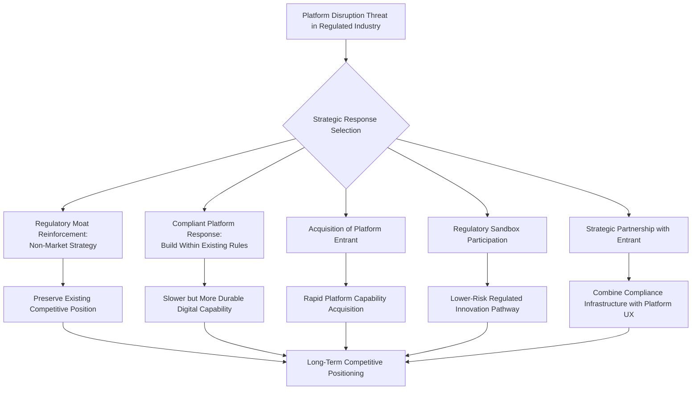

## Strategy in Platform-Disrupted and Regulated Industries

### Definition and Core Concept

This topic addresses the distinctive strategic challenges facing incumbent firms in industries that are simultaneously subject to (a) disruption by digital platform-based competitors and (b) substantial government regulation — a combination that creates strategic dynamics not fully captured by platform strategy theory or regulatory/non-market strategy theory in isolation. Industries exhibiting this combination prominently include financial services (banking, insurance), healthcare, transportation, energy and utilities, telecommunications, and professional services subject to licensure. The central strategic tension is that regulation, which often protects incumbents from platform-based disruption in the near term, simultaneously constrains the incumbents' own ability to respond with comparable platform-based innovation, while platform entrants often benefit strategically from regulatory arbitrage — operating in regulatory gray areas or jurisdictions with more permissive rules before regulation catches up to their business model.

### The Regulatory Arbitrage Dynamic

A defining pattern in platform disruption of regulated industries is regulatory arbitrage: new entrants structure their business model to fall outside, or in a gray area relative to, existing regulatory categories designed for incumbent business models, allowing them to avoid compliance costs and restrictions that incumbents must bear.

- **Classification avoidance** — platform entrants often argue (sometimes successfully, sometimes not, and frequently contested through litigation) that their business model constitutes a fundamentally different category of activity than the regulated incumbent activity it resembles or displaces (e.g., a ride-hailing platform arguing it is a technology/software company rather than a transportation provider)
- **Jurisdictional arbitrage** — operating initially in jurisdictions with more permissive or underdeveloped regulatory frameworks before expanding to more heavily regulated jurisdictions once scale and political capital have been established
- **First-mover regulatory shaping** — by achieving significant market presence and consumer adoption before regulators fully engage with the new business model, platform entrants can influence the eventual regulatory framework toward outcomes more favorable to their existing operations than would result from regulation designed prospectively

[Inference] The long-term sustainability of regulatory arbitrage as a strategic approach is contested; some platform entrants have faced significant retroactive regulatory and legal consequences once regulators fully engage (connecting to the non-market strategy concepts discussed previously), while others have achieved durable business models that reshape the regulatory category itself. Outcomes appear highly dependent on the specific regulatory jurisdiction, political environment, and degree of organized incumbent or stakeholder opposition, rather than following a single predictable pattern.

### Incumbent Strategic Response Patterns

#### 1. Regulatory Moat Reinforcement

Incumbents can pursue non-market strategy (as discussed previously) specifically aimed at maintaining or strengthening regulatory barriers that protect their existing position, including advocating for extending existing regulatory requirements to new platform entrants rather than exempting them.

#### 2. Compliant Platform Response ("Fast Follower Within the Rules")

Incumbents build their own platform-based or digitally enabled offerings while remaining within existing regulatory constraints, typically resulting in slower deployment than unregulated entrants but potentially more durable positioning once regulatory parity is eventually enforced across all competitors.

#### 3. Acquisition of Platform Entrants

Rather than building competing platform capability internally, incumbents acquire platform-native competitors or adjacent players, gaining platform technology and talent while bringing the acquired entity's operations within the incumbent's existing regulatory compliance infrastructure — a strategy that also mirrors the acquisition-as-corporate-venturing pipeline discussed under corporate venture capital strategy.

#### 4. Regulatory Sandbox Participation

Many regulators (particularly in financial services) have established formal "regulatory sandbox" programs allowing both incumbents and new entrants to test innovative products or business models under relaxed regulatory requirements and close regulatory supervision, providing a structured, lower-risk pathway for incumbents to pursue platform-style innovation without the full uncertainty of independent regulatory arbitrage. [Unverified] The specific availability, scope, and rules of regulatory sandbox programs vary substantially by jurisdiction and regulatory domain, and current program details should be verified against the specific regulator's current published guidance.

#### 5. Strategic Partnership with Platform Entrants

Rather than competing directly, incumbents in some cases pursue partnership arrangements with platform entrants, where the incumbent provides regulatory compliance infrastructure, capital, or an existing customer base, while the platform entrant provides technology and user experience capability — a structure sometimes described as "banking-as-a-service" or similar embedded-finance-style arrangements in the financial services context specifically.

### Diagram: Strategic Response Options for Regulated Incumbents

### Industry-Specific Illustrative Patterns (Generic, Non-Attributed)

| Industry | Platform Disruption Pattern | Distinctive Regulatory Consideration |
| --- | --- | --- |
| Financial services | Digital-first lending, payments, and banking platforms; embedded finance | Banking licenses, capital requirements, consumer protection law, anti-money-laundering compliance |
| Transportation | Ride-hailing and delivery platforms | Worker classification (connecting to gig economy strategy), local transportation licensing, safety regulation |
| Healthcare | Telehealth and digital health platforms | Medical licensure (often state/jurisdiction-specific), patient privacy law, clinical liability standards |
| Energy/utilities | Distributed energy and peer-to-peer energy trading platforms | Grid interconnection standards, utility rate regulation, public utility commission oversight |
| Professional services | AI-enabled and platform-mediated legal, accounting, and advisory services | Professional licensure requirements, unauthorized practice restrictions, fiduciary duty standards |

[Inference] The pace and pattern of platform disruption differs substantially across these industries based on the specific regulatory structure, degree of political organization among incumbents, and the presence or absence of safety-critical considerations that tend to slow regulatory accommodation of new entrants; healthcare and financial services, given safety and systemic risk considerations respectively, have generally seen more cautious regulatory engagement with platform disruption than, for example, transportation in many jurisdictions.

### Strategic Framework: Assessing Regulatory Vulnerability to Platform Disruption

A useful diagnostic for incumbents assessing their own vulnerability considers several factors:

- **Regulatory rationale strength** — whether existing regulation addresses a genuine, persistent market failure (e.g., safety, systemic risk, information asymmetry) versus primarily protecting incumbent economic interests without a strong independent public policy rationale; regulations of the latter type tend to be more vulnerable to erosion under sustained platform entrant pressure and political argument
- **Consumer switching cost and inertia** — the degree to which existing customer relationships, data, or embedded processes create switching costs that regulation alone does not fully explain, providing an independent source of incumbent resilience
- **Capital and infrastructure barriers independent of regulation** — some regulated industries also have significant capital or physical infrastructure barriers to entry (e.g., utility grid infrastructure) that persist even if regulatory barriers erode, while others (e.g., much of financial services) have comparatively lower non-regulatory barriers, making the regulatory barrier itself more strategically load-bearing
- **Political economy of potential deregulation** — the organized political interests (including consumer advocacy groups, labor organizations, and incumbent industry associations) that would support or oppose regulatory changes favorable to platform entrants, connecting directly to the interests and institutions dimensions of Baron's Four I's framework

### Common Strategic Failure Modes

- **Assuming regulatory protection is permanent** — treating existing regulatory barriers as a stable, durable source of competitive advantage without ongoing non-market strategy investment to maintain that protection or monitor erosion risk
- **Underinvesting in compliant digital capability while relying solely on regulatory moats** — incumbents that rely exclusively on regulatory protection without building genuine digital/platform capability risk sudden vulnerability if and when regulatory barriers are reduced or extended more evenly across competitors
- **Overestimating the durability of entrant regulatory arbitrage** — platform entrants that build their entire business model around a regulatory gray area without contingency planning for eventual regulatory closure of that gray area face significant strategic risk if and when regulators act
- **Failure to distinguish genuine public-interest regulation from protectionist regulation** — incumbents pursuing non-market strategy to preserve regulation lacking genuine public policy justification may face reputational and political risk if this rationale becomes publicly scrutinized, distinct from defending regulation with a robust independent public interest basis
- **Slow internal decision cycles relative to platform entrant speed** — even when pursuing a compliant platform response, incumbents' typically slower, more risk-averse internal decision processes (a dynamic discussed under strategic agility) can result in a permanently trailing competitive position relative to platform-native entrants, even without any regulatory disadvantage

### Implementation Framework

**Key Points**

- Assess honestly whether existing regulatory protection rests on a genuine, defensible public policy rationale or primarily protects incumbent economic interests, since this affects the durability of regulatory-moat-based strategy and the reputational risk of defending it
- Pursue non-market strategy to maintain a fair and updated regulatory framework, rather than assuming existing regulatory structure is static or permanently favorable
- Build genuine platform/digital capability in parallel with regulatory strategy, rather than relying on regulatory protection as a substitute for competitive digital capability development
- Evaluate acquisition of platform-native entrants as a capability-acquisition strategy where internal build timelines are unlikely to be competitive
- Engage proactively with regulatory sandbox or similar structured innovation programs where available, as a lower-risk pathway to platform-style innovation within regulatory constraints

### Illustrative Example (Generic, Non-Attributed)

An established regional bank faces growing competitive pressure from digital-native lending platforms operating with lower overhead and faster underwriting processes, partly enabled by operating in a less heavily regulated non-bank lending category. Rather than relying solely on non-market strategy to extend bank-level regulatory requirements to these competitors (a strategy facing uncertain political prospects and legitimate public debate about consumer protection trade-offs), the bank pursues a combined strategy: participating in its regulator's fintech sandbox program to pilot a faster digital underwriting process within existing regulatory guardrails, while separately acquiring a smaller digital lending platform to accelerate internal technology capability, bringing the acquired platform's operations under the bank's existing compliance infrastructure. This combined approach addresses both the near-term competitive gap and the longer-term strategic question of genuine digital capability development, rather than relying exclusively on regulatory moat preservation.

### Relationship to Broader Strategic Management Theory

- **Non-Market and Political Strategy** — regulatory moat maintenance and erosion represent a direct, high-stakes application of non-market strategy and Baron's Four I's framework
- **Platform Strategy and Network Effects** — understanding why and how platform entrants achieve competitive advantage in these industries requires the underlying platform and network effects theory discussed under gig and creator economy strategy
- **Corporate Venture Capital and Acquisition Strategy** — acquisition of platform-native entrants as a capability-acquisition mechanism connects directly to CVC and corporate entrepreneurship frameworks discussed previously
- **Strategic Agility** — the speed disadvantage regulated incumbents often face relative to platform-native entrants connects directly to the resource fluidity and collective commitment components of strategic agility
- **Institutional Theory** — the process by which platform entrants gradually gain legitimacy and reshape regulatory categories connects to institutional theory's concern with how organizations navigate, and eventually alter, the formal "rules of the game" governing their environment

### Conclusion

Strategy in platform-disrupted and regulated industries requires incumbents to navigate a genuinely distinctive strategic position: regulation that provides some protection from platform-based disruption while simultaneously constraining the incumbent's own capacity for platform-style innovation, against platform entrants who often gain initial competitive advantage through regulatory arbitrage that carries its own longer-term sustainability risk. Effective incumbent strategy typically requires a combined approach — non-market strategy to maintain a fair and updated regulatory framework, genuine investment in compliant digital/platform capability rather than reliance on regulatory protection alone, and selective use of acquisition or partnership to accelerate capability development where internal build timelines cannot match platform-native competitive speed. The durability of any given regulatory barrier depends significantly on whether it rests on a genuine, defensible public policy rationale, a consideration incumbents should weigh honestly both for strategic planning purposes and given the genuine public interest questions involved in the underlying regulatory policy debate.

**Related Topics**

- Non-Market and Political Strategy
- Platform Strategy and Multi-Sided Network Effects
- Strategy in the Gig and Creator Economy
- Corporate Venture Capital Strategy
- Strategic Agility and Adaptive Strategy
- Institutional Theory and Regulatory Legitimacy
- Regulatory Sandboxes and Structured Innovation Programs
- Mergers and Acquisitions as Capability Acquisition Strategy
- Embedded Finance and Banking-as-a-Service Models
- Political Risk Assessment for Regulated Industries