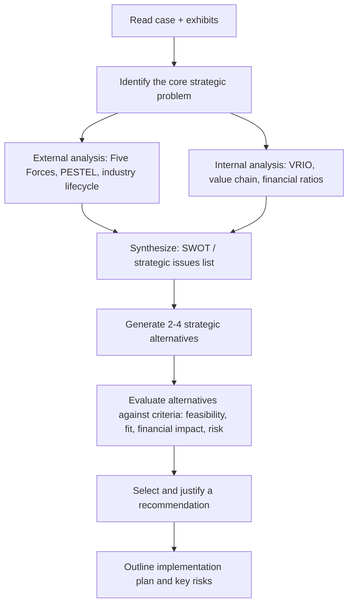

## Classic Strategic Management Case Studies

### Overview

Classic strategic management case studies are canonical, extensively documented business situations used in MBA and executive education to teach strategic analysis, decision-making under uncertainty, and the application of frameworks (Porter's Five Forces, SWOT, VRIO, BCG Matrix, Blue Ocean Strategy, etc.) to real-world corporate dilemmas. These cases are selected because they illustrate durable strategic principles — industry disruption, competitive positioning, diversification, turnaround management, globalization, and strategic renewal — in situations with well-documented outcomes that allow retrospective evaluation of the decisions made.

**Key Points**

- Case studies bridge the gap between abstract frameworks and messy real-world ambiguity.
- Classic cases are chosen because their outcomes are known, allowing students to evaluate strategic choices with the benefit of hindsight while still practicing forward-looking analysis.
- Most classic cases originate from Harvard Business School (HBS), Ivey Business School, or Darden, and are frequently updated with follow-up cases tracking the company's later trajectory.
- The pedagogical goal is not to memorize "what happened" but to practice the analytical process: problem identification, framework application, alternative generation, and recommendation with justification.

### Why Use Case Studies in Strategy Education

**Key Points**

- **Decision-forcing format**: Cases are typically written to end at a decision point, forcing students to commit to a recommendation rather than passively analyze.
- **Multi-framework integration**: Real cases rarely map cleanly onto a single framework; students must triangulate across industry analysis, internal resource analysis, and financial analysis simultaneously.
- **Ambiguity tolerance**: Cases deliberately include incomplete or contradictory information, mirroring the information asymmetry executives face.
- **Cross-functional synthesis**: Strategic decisions touch operations, finance, marketing, and organizational design at once, so cases train integrative thinking rather than siloed problem-solving.

### The Case Method: Analytical Process

A structured approach to dissecting any strategic case:

**Key Points**

- Step B (problem identification) is the most commonly mishandled step by students — many jump straight to frameworks without first isolating the actual decision the protagonist faces.
- Financial analysis (ratio trends, contribution margin, breakeven) should ground qualitative arguments — a recommendation unsupported by numbers is a weak recommendation in most grading rubrics.
- Step G should use explicit, stated evaluation criteria (not just "which alternative seems best") to make the recommendation defensible.

### Canonical Case Studies and Their Strategic Lessons

#### Southwest Airlines (Low-Cost Strategy & Focused Differentiation)

- **Core lesson**: How a tightly integrated "activity system" (point-to-point routing, single aircraft type, no seat assignments, fast turnarounds) creates a cost advantage that is difficult to imitate because it depends on fit among many mutually reinforcing choices, not one isolated tactic.
- **Frameworks applied**: Porter's activity-system mapping, generic strategies (cost leadership vs. differentiation), strategic fit.
- **Key takeaway**: Sustainable advantage often comes from the *system* of choices, not any single practice — a rival airline could copy one element (e.g., single aircraft type) without replicating the advantage.

#### Walmart (Supply Chain and Cost Leadership)

- **Core lesson**: How logistics infrastructure, supplier bargaining power, and information systems (cross-docking, EDI, later RFID) combine into a durable cost-leadership position in retail.
- **Frameworks applied**: Value chain analysis, VRIO (rarity and inimitability of the logistics network), bargaining power of suppliers.
- **Key takeaway**: Operational excellence, when embedded in proprietary systems and scale economies, can constitute a strategic resource in its own right.

#### Apple Inc. (Ecosystem Strategy and Differentiation)

- **Core lesson**: How integrating hardware, software, and services into a closed ecosystem creates switching costs and premium pricing power, illustrated across Apple's turnaround under Steve Jobs (1997) through the iPhone/App Store era.
- **Frameworks applied**: Blue Ocean Strategy (iPod/iTunes reshaping music distribution), platform strategy, differentiation-based generic strategy.
- **Key takeaway**: Ecosystem lock-in and complementary-product bundling can be a more durable moat than any single product's technical superiority.

#### Netflix (Disruption and Business Model Transformation)

- **Core lesson**: Sequential strategic pivots — DVD-by-mail disrupting Blockbuster, then streaming disrupting DVD, then content production disrupting studios — used to teach disruptive innovation theory and the risks of cannibalizing one's own business model proactively.
- **Frameworks applied**: Disruptive innovation (Christensen), dynamic capabilities, first-mover advantage analysis.
- **Key takeaway**: Firms that fail to disrupt themselves are often disrupted by others; strategic renewal sometimes requires deliberately obsoleting a current profit center.

#### Kodak (Strategic Inertia and the Innovator's Dilemma)

- **Core lesson**: Kodak invented core digital camera technology internally but delayed commercialization to protect film profits, illustrating how core rigidities and misaligned incentive structures can prevent a firm from acting on its own innovations.
- **Frameworks applied**: Innovator's Dilemma, core competencies vs. core rigidities, organizational inertia.
- **Key takeaway**: Possessing a superior technology is insufficient; organizational structure, incentives, and cannibalization fears can neutralize technical foresight. [Inference: the "who killed Kodak" narrative in popular retellings is more nuanced than pure technology denial — analysts differ on the relative weight of R&D underinvestment, brand strategy, and channel conflict as causes.]

#### Nokia (Loss of Market Leadership)

- **Core lesson**: A dominant mobile phone market leader lost its position to Apple and Android-based competitors due to slow software platform response (Symbian) and internal organizational silos, despite strong hardware engineering.
- **Frameworks applied**: Dynamic capabilities, platform competition, strategic groups analysis.
- **Key takeaway**: Competitive advantage in hardware-centric industries can be rapidly displaced when the basis of competition shifts to software/platform ecosystems.

#### Harley-Davidson (Turnaround and Brand-Based Strategy)

- **Core lesson**: Near-bankruptcy in the early 1980s followed by a turnaround built on quality improvement (adopting Japanese-style manufacturing practices), brand community cultivation (Harley Owners Group), and premium positioning.
- **Frameworks applied**: Turnaround strategy stages (retrenchment, stabilization, growth), brand equity as a strategic resource.
- **Key takeaway**: Turnarounds often require simultaneous operational fixes (quality, cost) and strategic repositioning (brand meaning) rather than either alone.

#### General Electric under Jack Welch (Portfolio Strategy)

- **Core lesson**: The "#1 or #2 in every market or fix, sell, close" doctrine used to teach corporate-level portfolio strategy, the BCG-style logic of resource allocation across a diversified conglomerate, and the risks of aggressive workforce reduction strategies ("Neutron Jack").
- **Frameworks applied**: BCG Growth-Share Matrix, corporate parenting theory, portfolio rationalization.
- **Key takeaway**: Corporate strategy at the multi-business level requires different tools than business-unit strategy — the central question becomes which businesses to own, not how any single business should compete.

#### Procter & Gamble (Global Brand Portfolio Management)

- **Core lesson**: Managing a large portfolio of consumer brands across highly diverse international markets, illustrating segmentation, brand architecture, and localization-vs-standardization trade-offs.
- **Frameworks applied**: Global integration vs. local responsiveness matrix (Bartlett & Ghoshal), brand portfolio strategy.
- **Key takeaway**: Multinational strategy requires explicit choices about which activities to standardize globally (R&D, some manufacturing) versus adapt locally (marketing, packaging).

#### Toyota (Lean Production and Operational Strategy as Competitive Advantage)

- **Core lesson**: The Toyota Production System (TPS) — just-in-time, jidoka, kaizen — treated not merely as an operations technique but as a source of sustained competitive advantage difficult for Western automakers to replicate.
- **Frameworks applied**: VRIO (organizational routines as a resource), dynamic capabilities, continuous improvement as strategic capability.
- **Key takeaway**: Operational routines embedded deeply in organizational culture can be more durable competitive advantages than patents or one-time process investments, precisely because they are hard to observe and imitate (causal ambiguity).

#### Starbucks (Scaling a Premium Experience Globally)

- **Core lesson**: Expanding a "third place" experiential retail concept internationally while managing brand dilution risk, franchise vs. company-owned trade-offs, and later a customer-experience turnaround under Howard Schultz's return.
- **Frameworks applied**: Experience economy positioning, international entry mode choice (joint venture, licensing, wholly owned), brand consistency vs. localization.

#### Blockbuster vs. Netflix (Head-to-Head Disruption Case)

- **Core lesson**: Frequently paired with the Netflix case to illustrate incumbent response failure — Blockbuster's late-night fees business model created organizational resistance to a subscription model that would cannibalize a profitable revenue stream.
- **Frameworks applied**: Business model innovation, switching costs, incumbent's dilemma.

**Example**

A typical exam-style prompt: *"You are a strategy consultant advising Kodak's board in 1996. Digital imaging technology exists in-house. Recommend a strategic response, addressing cannibalization risk, resource reallocation, and organizational barriers."* A strong answer would (1) frame the core tension as protecting film margins vs. capturing digital's growth trajectory, (2) apply a real-options lens to phased digital investment, (3) propose organizational separation (a "skunkworks" digital unit) to bypass internal political resistance, and (4) acknowledge the risk that internal fixes may be too slow relative to external entrants like Apple/Samsung not carrying legacy sunk-cost pressures.

### Framework Application Reference Table

| Case | Primary Framework(s) | Secondary Framework(s) | Central Tension |
| --- | --- | --- | --- |
| Southwest Airlines | Activity-system mapping | Generic strategies | Cost vs. differentiation fit |
| Walmart | Value chain | VRIO, bargaining power | Scale economies vs. imitability |
| Apple | Platform/ecosystem strategy | Blue Ocean | Premium pricing vs. openness |
| Netflix | Disruptive innovation | Dynamic capabilities | Self-cannibalization timing |
| Kodak | Innovator's Dilemma | Core rigidities | Protect legacy vs. invest in disruption |
| Nokia | Platform competition | Dynamic capabilities | Hardware excellence vs. software agility |
| Harley-Davidson | Turnaround stages | Brand equity | Cost fix vs. brand repositioning |
| GE (Welch era) | BCG Matrix | Corporate parenting | Portfolio pruning vs. growth investment |
| P&G | Global integration–local responsiveness | Brand portfolio strategy | Standardize vs. localize |
| Toyota | VRIO / dynamic capabilities | Continuous improvement | Imitable process vs. tacit routine |
| Starbucks | Experience economy | Entry mode choice | Scale vs. experience consistency |

### Common Analytical Pitfalls in Case Analysis

**Key Points**

- **Framework-first thinking**: Forcing a case into SWOT or Five Forces mechanically without first identifying what decision is actually being asked, producing generic, non-actionable output.
- **Recommendation without criteria**: Proposing "the company should diversify" without stating the evaluation criteria (financial return, risk, strategic fit, feasibility) used to select that path over alternatives.
- **Hindsight bias**: Because classic cases have known outcomes, students often reason backward ("they succeeded, so X must have been the right call") rather than evaluating the decision quality given the information available *at the time* the case is set.
- **Ignoring implementation**: A theoretically sound strategy that ignores organizational capacity, incentive alignment, or change-management risk is an incomplete answer in most rigorous grading rubrics.
- **Over-reliance on one data point**: Anchoring the entire recommendation on a single exhibit (e.g., one financial ratio) while ignoring qualitative signals in the narrative (management commentary, competitor behavior).

### Illustrative Case Positioning Map (svg_diagram)

<svg xmlns="http://www.w3.org/2000/svg" viewBox="0 0 640 420">
<text x="320" y="24" text-anchor="middle" font-size="16" font-weight="bold" fill="#1a1a1a">Case Positioning: Strategic Focus vs. Industry Disruption Level (svg_diagram)</text>
<line x1="80" y1="360" x2="600" y2="360" stroke="#333" stroke-width="1.5" />
<line x1="80" y1="360" x2="80" y2="60" stroke="#333" stroke-width="1.5" />

<text x="340" y="395" text-anchor="middle" font-size="13" fill="#333">Industry Disruption Level (Low to High)</text>

<text x="30" y="210" text-anchor="middle" font-size="13" fill="#333" transform="rotate(-90 30 210)">Internal vs. External Strategic Focus</text>

<text x="90" y="375" font-size="11" fill="#555">Low</text>

<text x="580" y="375" font-size="11" fill="#555">High</text>

<text x="65" y="70" font-size="11" fill="#555">Internal</text>

<text x="65" y="355" font-size="11" fill="#555">External</text>

<circle cx="160" cy="300" r="7" fill="#2563eb" />
<text x="172" y="304" font-size="12" fill="#1a1a1a">Toyota (TPS)</text>
<circle cx="200" cy="250" r="7" fill="#2563eb" />
<text x="212" y="254" font-size="12" fill="#1a1a1a">Walmart</text>
<circle cx="230" cy="150" r="7" fill="#dc2626" />
<text x="242" y="154" font-size="12" fill="#1a1a1a">GE (Welch)</text>
<circle cx="300" cy="330" r="7" fill="#059669" />
<text x="312" y="334" font-size="12" fill="#1a1a1a">Southwest Airlines</text>
<circle cx="380" cy="200" r="7" fill="#7c3aed" />
<text x="392" y="204" font-size="12" fill="#1a1a1a">Harley-Davidson</text>
<circle cx="430" cy="120" r="7" fill="#dc2626" />
<text x="442" y="124" font-size="12" fill="#1a1a1a">P&amp;G Global</text>
<circle cx="480" cy="90" r="7" fill="#ea580c" />
<text x="492" y="94" font-size="12" fill="#1a1a1a">Apple Ecosystem</text>
<circle cx="500" cy="330" r="7" fill="#ea580c" />
<text x="440" y="345" font-size="12" fill="#1a1a1a">Nokia Decline</text>
<circle cx="560" cy="310" r="7" fill="#0891b2" />
<text x="480" y="290" font-size="12" fill="#1a1a1a">Netflix Pivots</text>
<circle cx="550" cy="270" r="7" fill="#0891b2" />
<text x="470" y="255" font-size="12" fill="#1a1a1a">Kodak Delay</text>
<rect x="500" y="60" width="14" height="14" fill="#666" />
<text x="30" y="410" font-size="10" fill="#666">Note: positions are illustrative approximations for pedagogical framing, not precise empirical scores.</text>
</svg>

### Sample Discussion Question Bank

1. In the Southwest Airlines case, which single element of the activity system, if removed, would most damage the cost advantage — and why does interdependence make imitation difficult?
2. Contrast Kodak's and Netflix's responses to internally-recognized disruptive threats. What organizational design differences explain the divergent outcomes?
3. Using VRIO, evaluate whether Toyota's production system still constitutes a source of sustained competitive advantage today, given decades of benchmarking by competitors.
4. For the GE case, argue both for and against the "#1 or #2" portfolio doctrine as a general-purpose corporate strategy rule. [Inference: normative judgments here are contested among strategy scholars — some argue the doctrine understates long-tail option value in emerging businesses.]
5. What financial evidence in the Harley-Davidson case exhibits would you cite to justify prioritizing quality investment over price cuts during the turnaround?

**Next Steps**

- Porter's Five Forces Framework (deep dive)
- VRIO Framework and Resource-Based View
- Blue Ocean Strategy and Value Innovation
- Disruptive Innovation Theory (Christensen)
- BCG Growth-Share Matrix and Portfolio Analysis
- Corporate Turnaround Strategy Stages
- International Entry Mode Strategy (Bartlett & Ghoshal framework)
- Strategy Simulation Exercises and Capstone Project Design
- Financial Statement Analysis for Strategic Decision-Making
- Writing a Strategic Case Analysis Memo (structure and rubric)