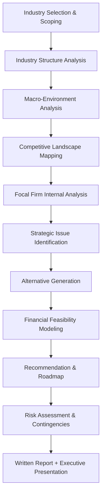

## Industry-Specific Strategic Analysis Projects

### Overview

Industry-specific strategic analysis projects are applied capstone-style assignments in which students select a real industry (or a firm within it) and conduct an end-to-end strategic analysis using the analytical toolkit of the course: external environment analysis, internal capability assessment, competitive positioning, and strategic recommendation. Unlike single-firm case studies (which are pre-written and decision-forcing), these projects require students to *originate* the data collection, structure the analysis independently, and defend an original recommendation — closely simulating the work of a strategy consultant or corporate development analyst.

**Key Points**

- The defining difference from a case study: no pre-packaged narrative or exhibits are provided; students must source public data (10-Ks, industry reports, earnings calls, trade publications) themselves.
- The project's rigor is judged less on the sophistication of any single framework and more on the *coherence* of the analytical chain: industry evidence → firm capability evidence → strategic issue → recommendation → implementation risk.
- Industry choice materially affects project difficulty: mature, data-rich industries (airlines, retail, banking) are easier to source but harder to differentiate; emerging or niche industries (climate tech, esports, generic biosimilars) require more synthesis but allow more original insight.

### Project Structure and Deliverable Components

**Key Points**

- Step A (scoping) should define industry boundaries explicitly — using a recognized classification system (e.g., NAICS/SIC/GICS codes) reduces later ambiguity about which competitors are "in scope."
- Step H (financial feasibility) is the most commonly under-weighted component in student projects; a recommendation should be pressure-tested against at least a simplified pro-forma or breakeven calculation.
- Step K typically has two audiences with different needs: a detailed written report (comprehensive, appendix-heavy) and an executive presentation (compressed to the 3-5 decisions that matter).

### Stage 1 — Industry Selection and Scoping

**Key Points**

- Define the industry using a standard classification (NAICS, SIC, or GICS) to bound competitor identification and data comparability.
- Specify the **level of analysis**: entire industry (e.g., "global smartphone industry"), a strategic group within it (e.g., "premium smartphone segment"), or a single firm's position within that group.
- Set a **time horizon**: historical analysis (last 3-5 years) versus forward-looking scenario analysis (next 3-5 years) changes which frameworks are emphasized.
- Identify data availability early — publicly traded focal firms (10-K/10-Q filings, earnings call transcripts) are dramatically easier to analyze rigorously than private or state-owned firms with limited disclosure.

### Stage 2 — Industry Structure Analysis (Porter's Five Forces)

Applied at the industry level, not the firm level, to establish the profit potential and competitive intensity of the space before evaluating any single company's position within it.

| Force | Key Diagnostic Questions | Common Data Sources |
| --- | --- | --- |
| Threat of new entrants | Capital requirements, regulatory barriers, brand loyalty, economies of scale | Industry reports (IBISWorld, Statista), regulatory filings |
| Bargaining power of suppliers | Supplier concentration, switching costs, forward integration threat | Supplier 10-Ks, input commodity data |
| Bargaining power of buyers | Buyer concentration, price sensitivity, backward integration threat | Customer concentration disclosures, distribution channel structure |
| Threat of substitutes | Price-performance trade-off of substitute products/services | Patent filings, adjacent-industry growth data |
| Rivalry among competitors | Number/diversity of competitors, industry growth rate, exit barriers | Market share reports, competitor annual reports |

**Key Points**

- Each force should be rated (e.g., low/moderate/high) with 2-3 sentences of specific evidence — unsupported ratings are a common source of lost credibility in grading.
- Five Forces analysis explains industry-level average profitability; it does *not* by itself explain why one firm outperforms another within the same industry — that requires internal (VRIO) analysis.

### Stage 3 — Macro-Environment Analysis (PESTEL)

**Key Points**

- **Political**: trade policy, antitrust posture, government procurement patterns relevant to the industry.
- **Economic**: interest rates, currency exposure (for globally sourced industries), business cycle sensitivity.
- **Social**: demographic shifts, changing consumer preferences (e.g., health consciousness in food & beverage).
- **Technological**: rate of technology substitution, R&D intensity norms in the industry.
- **Environmental**: regulatory exposure to emissions/sustainability standards, physical climate risk to supply chains.
- **Legal**: sector-specific regulation (e.g., FDA in pharma, Basel III in banking, FAA in aviation).
- PESTEL factors should be filtered for *materiality* to the specific industry — an exhaustive but undifferentiated PESTEL list (treating all six categories as equally important) is a common project weakness.

### Stage 4 — Competitive Landscape Mapping

**Key Points**

- **Strategic group mapping**: plot competitors on two strategically meaningful dimensions (e.g., price vs. product breadth, or geographic scope vs. vertical integration) to reveal clusters of firms competing on similar bases.
- **Benchmarking table**: compare focal firm and 3-5 key competitors on financial metrics (revenue growth, gross margin, ROIC) and non-financial metrics (market share, patent counts, geographic footprint).
- Strategic group maps should use axes chosen because they are the *actual* basis of competition in that industry — arbitrary axis selection undermines the map's diagnostic value.

### Strategic Group Map Example (svg_diagram)

<svg xmlns="http://www.w3.org/2000/svg" viewBox="0 0 620 420">
<text x="310" y="24" text-anchor="middle" font-size="16" font-weight="bold" fill="#1a1a1a">Strategic Group Map: Illustrative Airline Industry (svg_diagram)</text>
<line x1="80" y1="360" x2="580" y2="360" stroke="#333" stroke-width="1.5" />
<line x1="80" y1="360" x2="80" y2="60" stroke="#333" stroke-width="1.5" />

<text x="330" y="392" text-anchor="middle" font-size="13" fill="#333">Route Network Breadth (Regional to Global)</text>

<text x="35" y="210" text-anchor="middle" font-size="13" fill="#333" transform="rotate(-90 35 210)">Price Point (Low to Premium)</text>

<circle cx="140" cy="320" r="30" fill="#93c5fd" opacity="0.6" />
<text x="140" y="325" text-anchor="middle" font-size="11" fill="#1e3a8a">Low-cost regional carriers</text>
<circle cx="450" cy="300" r="34" fill="#86efac" opacity="0.6" />
<text x="450" y="305" text-anchor="middle" font-size="11" fill="#14532d">Global low-cost / ULCC</text>
<circle cx="480" cy="120" r="40" fill="#fca5a5" opacity="0.6" />
<text x="480" y="125" text-anchor="middle" font-size="11" fill="#7f1d1d">Global full-service legacy</text>
<circle cx="200" cy="130" r="28" fill="#fdba74" opacity="0.6" />
<text x="200" y="135" text-anchor="middle" font-size="11" fill="#7c2d12">Regional premium / business</text>

<text x="40" y="410" font-size="10" fill="#666">Note: illustrative clustering; real analysis requires updated market share and route-network data.</text>

</svg>

### Stage 5 — Focal Firm Internal Analysis

**Key Points**

- **VRIO analysis**: assess whether key resources/capabilities (brand, proprietary technology, distribution network, organizational culture) are Valuable, Rare, costly to Imitate, and whether the Organization is structured to exploit them.
- **Value chain analysis**: decompose primary activities (inbound logistics, operations, outbound logistics, marketing/sales, service) and support activities (infrastructure, HR, technology, procurement) to locate where margin and differentiation are actually created.
- **Financial ratio analysis**: profitability (gross margin, EBITDA margin, ROIC), liquidity (current ratio), leverage (debt/EBITDA), and efficiency (asset turnover, inventory turnover) trended over 3-5 years and benchmarked against competitors.
- **Core competency test**: apply Prahalad & Hamel's criteria — does the capability provide access to multiple markets, contribute significantly to perceived customer benefits, and resist easy imitation?

$$\text{ROIC} = \frac{\text{NOPAT}}{\text{Invested Capital}}$$

where NOPAT is Net Operating Profit After Tax. Comparing a focal firm's ROIC trend against its industry-average cost of capital indicates whether the firm is creating or destroying economic value — a foundational data point for the strategic issue diagnosis in Stage 6.

### Stage 6 — Strategic Issue Identification and SWOT Synthesis

**Key Points**

- Synthesize Stages 2-5 into a prioritized list of strategic issues (typically 3-5), not an exhaustive SWOT list — a 20-bullet SWOT with no prioritization is analytically inert.
- Each strategic issue should be framed as a decision tension (e.g., "expand into adjacent geographic markets vs. deepen share in core market") rather than a vague observation (e.g., "competition is increasing").
- Issues should be traceable back to specific evidence gathered in earlier stages — an issue with no evidentiary anchor is a hypothesis, not a finding.

### Stage 7 — Alternative Generation and Evaluation

**Key Points**

- Generate at least 2-3 genuinely distinct strategic alternatives per major issue (not superficial variants of the same idea) — e.g., organic expansion vs. acquisition vs. strategic partnership/joint venture as distinct paths to the same growth objective.
- Evaluate alternatives against explicit, stated criteria: strategic fit with existing capabilities, expected financial return, implementation risk, time-to-impact, and capital intensity.
- A simple weighted-scoring matrix (criteria × alternatives, each cell scored and weighted) makes the alternative-selection process transparent and defensible in the write-up.

### Stage 8 — Financial Feasibility Modeling

**Key Points**

- Build a simplified pro-forma: incremental revenue, incremental cost, and required capital investment for the recommended alternative over a 3-5 year horizon.
- Calculate at minimum a breakeven point and, where data allows, a rough NPV or payback period using a reasonable discount rate assumption.
- State all assumptions explicitly (market share capture rate, price point, cost structure) — the value of this stage is in showing the reasoning chain, not in false precision. [Inference: exact forecasted figures in a student project are illustrative estimates, not verified financial projections; actual outcomes depend on execution and market conditions that cannot be fully modeled in advance.]

### Stage 9 — Recommendation, Implementation Roadmap, and Risk Assessment

**Key Points**

- State the recommendation as a single clear strategic direction, not a hedge across multiple options.
- Build an implementation roadmap with sequenced milestones (e.g., 0-6 months, 6-18 months, 18-36 months) and identify the organizational changes (structure, incentives, capabilities to build or acquire) required.
- Include a risk register: identify 3-5 key risks to the recommendation (competitive response, execution risk, regulatory risk, macroeconomic risk) with a brief mitigation note for each.
- Behavior of markets and competitors in response to a recommended strategy cannot be fully predicted; any projected outcome should be understood as a reasoned estimate rather than a guaranteed result.

### Data Sourcing Reference

**Key Points**

- **Public filings**: 10-K (annual), 10-Q (quarterly), proxy statements (DEF 14A) — primary source for financials, risk factors, and management discussion for U.S.-listed firms; equivalent filings exist in other jurisdictions (e.g., annual reports under IFRS for many non-U.S. markets).
- **Earnings call transcripts**: reveal management's own framing of strategic priorities and analyst concerns, often more candid than the polished 10-K narrative.
- **Industry reports**: IBISWorld, Statista, Euromonitor, and trade-association publications provide market sizing and growth-rate estimates (note: figures often diverge across providers due to differing methodology — cross-check where possible).
- **Patent and trademark databases**: useful proxies for technological investment intensity in R&D-heavy industries.
- **Primary research (optional but strengthens the project)**: customer surveys, expert interviews, or store/site visits, where feasible within the course timeline.

### Common Project Pitfalls

**Key Points**

- **Data dump without synthesis**: presenting large volumes of gathered data (financial tables, market size figures) without connecting them to a strategic argument.
- **Framework checklist mentality**: applying every taught framework mechanically regardless of whether each one adds insight for the specific industry/firm chosen.
- **Recommendation disconnected from analysis**: proposing a strategic direction that isn't traceable to the strategic issues identified in Stage 6 — a common failure mode when the recommendation is decided before the analysis is conducted.
- **Ignoring the financial feasibility stage**: a qualitatively appealing strategy without a supporting financial sketch is treated as incomplete in most rigorous grading rubrics.
- **Underspecifying the focal firm's realistic capability to execute**: recommending a bold strategic pivot (e.g., "enter an entirely new business line") without addressing whether the firm possesses or can plausibly build the required capabilities.

### Sample Project Deliverable Outline

**Example**

A typical final deliverable package for this project type includes:

1. Executive summary (1 page): industry context, core issue, recommendation
2. Industry & macro-environment analysis (Five Forces + PESTEL)
3. Competitive landscape (strategic group map + benchmarking table)
4. Focal firm internal analysis (VRIO + value chain + financial trends)
5. Strategic issue synthesis (prioritized, evidence-linked)
6. Alternatives evaluation (weighted-scoring matrix)
7. Recommendation with financial feasibility sketch
8. Implementation roadmap and risk register
9. Appendices: full data tables, source list, financial model detail

### Evaluation Rubric Dimensions (Typical)

| Dimension | What Is Assessed |
| --- | --- |
| Analytical rigor | Correct, well-evidenced application of frameworks (not just framework recall) |
| Data quality & sourcing | Use of credible, appropriately cited primary and secondary sources |
| Synthesis | Coherence of the chain from evidence → issue → recommendation |
| Financial grounding | Presence and reasonableness of supporting financial analysis |
| Recommendation clarity | A single, decisive, well-justified strategic direction |
| Implementation realism | Feasibility given the focal firm's actual resources and capabilities |
| Communication | Clarity of written report and executive presentation |

**Next Steps**

- Porter's Five Forces Framework (deep dive)
- PESTEL and Macro-Environmental Scanning Techniques
- Strategic Group Mapping Methodology
- VRIO Framework and Resource-Based View
- Value Chain Analysis
- Financial Ratio Analysis for Strategic Diagnosis
- Weighted-Scoring Decision Matrices for Alternative Evaluation
- Pro-Forma Financial Modeling for Strategic Initiatives
- Business Simulation Exercises (as a complementary applied method)
- Executive Presentation Design for Strategy Recommendations