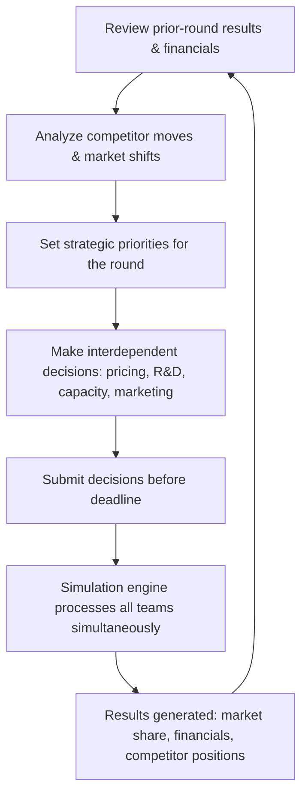

## Strategic Management Simulation Exercises

### Overview

Strategic management simulation exercises are computer-mediated, competitive learning environments in which student teams operate a virtual firm over multiple simulated periods (typically quarters or years), making interdependent strategic and operational decisions — pricing, R&D investment, capacity expansion, marketing spend, market entry — while competing against other teams whose decisions are processed simultaneously by an underlying market-response algorithm. Unlike static case studies, simulations create a dynamic, iterative feedback loop: each round's decisions produce results (market share, financial statements, competitor moves) that inform the next round's decisions, closely mimicking the real-time, competitive, and consequential nature of actual strategic management.

**Key Points**

- Simulations are the primary pedagogical tool for teaching **strategy as an iterative, competitive process** rather than a one-time analytical exercise — the defining pedagogical value over static case studies.
- Common commercial platforms include Capsim (Capstone, Foundation), Marketplace Simulations, GLO-BUS/BSG (Business Strategy Game), and industry-specific simulations (e.g., airline, hospital, supply-chain simulations).
- Outcomes are relative, not absolute: a team's performance is scored against competing teams' decisions in the same simulated market, so identical decisions can produce different results depending on the competitive field.
- Simulations typically culminate in a "Board of Directors" style presentation or written report justifying the team's strategic choices across the full run.

### Simulation Round Structure and Feedback Loop

**Key Points**

- Step F is critical to understand conceptually: all teams' decisions interact simultaneously (e.g., aggregate industry pricing affects total market demand), meaning a team's outcome depends on *both* its own decisions and every competitor's decisions in the same round.
- Because of this interdependence, post-round analysis (Step A/B) is as strategically important as the decision-making itself — teams that only look inward at their own numbers, without benchmarking against competitor results, tend to make decisions in a vacuum.
- Most platforms lock decisions at a submission deadline per round; late or default (unsubmitted) decisions typically roll over prior-round settings, which can silently misalign a team's strategy if not tracked carefully.

### Common Simulation Platforms and Their Focus

| Platform | Typical Focus | Decision Domains |
| --- | --- | --- |
| Capsim (Capstone) | Manufacturing/electronics sensor industry | R&D, marketing, production, finance, HR |
| Capsim Foundation | Simplified entry-level version of Capstone | Core R&D/marketing/production/finance |
| BSG (Business Strategy Game) | Global athletic footwear industry | Production, distribution, marketing, R&D, celebrity endorsements, corporate social responsibility |
| GLO-BUS | Similar global footwear/camera industry variant | Product design, plant operations, distribution, pricing |
| Marketplace Simulations | General management / cross-industry variants | Marketing, operations, finance, HR integration |
| Industry-specific simulations (airline, hospital, supply chain) | Sector-specific operational strategy | Domain-specific decision sets (fleet/route planning, bed capacity, logistics network) |

**Key Points**

- Despite differing industries, all major platforms share the same underlying pedagogical architecture: multi-period rounds, competitive interdependence, and financial statement generation (income statement, balance sheet, cash flow) as the primary performance record.
- Instructors typically customize simulation parameters (number of rounds, industry conditions, scoring weights) per course, so platform behavior can vary meaningfully between sections even on the same underlying software. [Unverified: exact scoring weightings and market-response parameters are instructor-configurable and not standardized across course sections.]

### Core Decision Domains (Cross-Platform)

**Key Points**

- **Research & Development**: investment in product performance/size improvements or new product line development; typically has a multi-round lag before results manifest, teaching patience and forward planning.
- **Production/Operations**: capacity expansion decisions, automation investment, plant utilization — involves trade-offs between fixed-cost commitment and flexibility.
- **Marketing**: pricing, promotion budget, sales force size/allocation across market segments — directly affects demand capture in the period submitted.
- **Finance**: decisions on debt issuance, stock issuance/repurchase, dividend policy — determines the capital available to fund operational/R&D decisions and affects leverage ratios monitored by the simulation's scoring engine.
- **Human Resources / Total Quality Management (where applicable)**: investments in training, compensation, or quality-improvement programs that reduce costs or improve productivity with a lag.
- Nearly all platforms enforce **resource constraints** (limited cash, production capacity, or R&D throughput per round), forcing genuine trade-off decisions rather than unconstrained optimization.

### Strategic Frameworks Applied Within Simulations

**Key Points**

- **Generic strategy commitment**: teams typically must choose and sustain a competitive positioning (cost leadership, broad differentiation, niche/focused differentiation) across rounds — flip-flopping strategies each round usually produces worse outcomes than a consistently executed position due to switching costs and brand/segment reputation effects built into most engines.
- **Segment-based competition**: most simulations model multiple market segments (e.g., low-end/price-sensitive vs. high-end/performance-sensitive) with distinct buying criteria, requiring explicit segment-targeting decisions analogous to real segmentation-targeting-positioning (STP) strategy.
- **Capacity and capital budgeting**: expansion decisions require forecasting demand and evaluating trade-offs comparable to real capital expenditure (capex) decisions, including the risk of over- or under-building capacity relative to realized demand.
- **Competitive intelligence**: analyzing competitor financial disclosures (provided each round in most platforms) to infer competitor strategy, similar to real-world competitive analysis using 10-Ks and earnings calls.

### Financial Analysis Within the Simulation

**Key Points**

- Each round typically produces a full set of financial statements (income statement, balance sheet, cash flow statement) for the team's virtual firm, requiring the same ratio analysis techniques used in real-firm case studies.
- Key ratios tracked across rounds: gross margin, ROE, ROA, current ratio, debt-to-equity, and often a proprietary composite score (e.g., Capsim's Balanced Scorecard) combining financial and non-financial performance metrics.

$$\text{ROE} = \frac{\text{Net Income}}{\text{Shareholders' Equity}}$$

- Cash flow management is frequently the most common source of simulated bankruptcy or emergency loans in student runs — teams that over-invest in capacity or R&D without securing adequate financing can trigger high-interest "emergency loans" in most platforms, materially damaging their financial score even if operational decisions were otherwise sound.

### Team Dynamics and Decision-Making Process

**Key Points**

- Simulations are typically run in teams of 3-5, requiring internal role allocation (e.g., a CFO-equivalent tracking financials, a CMO-equivalent handling marketing/segment decisions, a COO-equivalent handling production/R&D).
- Because decisions are interdependent (e.g., marketing spend without matching production capacity produces stockouts; production without matching demand produces excess inventory costs), cross-functional coordination *within* the team is itself a graded/observed skill in many course designs.
- Time pressure (submission deadlines) mimics real executive decision-making under incomplete information and limited analysis time — a deliberate pedagogical design choice, not an incidental constraint.

### Common Strategic Mistakes in Simulation Play

**Key Points**

- **Strategy drift**: changing competitive positioning every round in reaction to short-term results rather than committing to and refining a consistent strategy — most engines penalize inconsistency through brand/reputation carryover effects.
- **Overcapacity building**: expanding production capacity based on optimistic demand forecasts without stress-testing against competitor capacity additions in the same segment.
- **Neglecting R&D lag**: treating R&D as an immediate-payoff lever rather than accounting for the multi-round development lag most platforms build in, leading to under-investment early and scrambling late.
- **Ignoring competitor financials**: failing to read competitor disclosures each round, leading to strategic moves made "blind" relative to the actual competitive field.
- **Overleveraging**: financing aggressive growth primarily through debt without monitoring resulting interest burden and covenant-like leverage thresholds that some platforms penalize in the composite score.
- **Underweighting the write-up/presentation**: treating the simulation purely as a numbers game and neglecting the final strategic narrative deliverable, which in most courses carries substantial grading weight of its own.

### Typical Deliverables and Assessment Structure

**Key Points**

- **Round-by-round decision submissions**: the operational core of the exercise, usually not directly graded round-by-round but tracked for engagement.
- **Interim strategy memos**: short written justifications (1-2 pages) at defined checkpoints explaining the team's strategic rationale and adjustments.
- **Final performance ranking**: composite score relative to competing teams, often contributing a modest portion of the overall grade (since relative luck/competitive field effects are acknowledged as partially outside any one team's control).
- **Final strategic report and/or "Board presentation"**: the primary graded deliverable in most course designs, requiring the team to narrate its strategic arc across all rounds — initial strategy, key inflection points, responses to competitor actions, and lessons learned — connecting simulation experience back to course frameworks (generic strategies, VRIO, financial analysis).

**Example**

A representative interim strategy memo structure: (1) Round-over-round performance summary (market share, key financial ratios), (2) competitive positioning assessment relative to rival teams' inferred strategies, (3) explanation of the current round's key decisions and their rationale, (4) identified risks for the upcoming round (e.g., anticipated capacity constraint, competitor price war signal), (5) planned strategic adjustments. [Inference: specific memo formats and grading weightings vary by instructor and are not standardized across course sections.]

### Simulation vs. Case Study: Complementary Roles

| Dimension | Case Study | Simulation Exercise |
| --- | --- | --- |
| Data | Pre-packaged, fixed | Self-generated through decisions, evolves each round |
| Outcome | Known in advance (historical) | Unknown, determined by team + competitor decisions |
| Time horizon | Single decision point | Multi-round, iterative |
| Skill emphasis | Analytical framework application | Applied decision-making under interdependence and time pressure |
| Feedback | Retrospective (what happened historically) | Immediate, round-over-round |
| Team dynamic | Individual or small-group analysis | Sustained team coordination across the full run |

### Best Practices for Strong Simulation Performance

**Key Points**

- Establish a clear, written strategy statement (generic strategy + target segment) in Round 1 and revisit it explicitly before making major decisions each round, rather than reactively adjusting to the prior round's results alone.
- Build a simple internal tracking spreadsheet across rounds (own financials + competitor disclosures) to spot trends the platform's native reporting may not surface directly.
- Explicitly forecast demand before committing to capacity or marketing spend, using prior-round sell-through data and known competitor capacity as inputs.
- Assign clear internal ownership of each decision domain (R&D, production, marketing, finance) while maintaining a short pre-submission cross-check meeting to catch interdependency conflicts (e.g., marketing forecasting sales volume the production team hasn't budgeted capacity for).
- Treat the final report/presentation as a strategic narrative exercise, not a results recap — connect specific decisions back to the frameworks taught in the course (Five Forces shifts observed in-sim, VRIO-style resource build-up, generic strategy consistency).

**Next Steps**

- Generic Competitive Strategies (Cost Leadership, Differentiation, Focus)
- Financial Ratio Analysis for Strategic Diagnosis
- Capital Budgeting and Capacity Investment Decisions
- Market Segmentation, Targeting, and Positioning (STP)
- Competitive Intelligence and Competitor Analysis Techniques
- Team Decision-Making and Cross-Functional Coordination in Strategy
- Capstone Strategic Analysis Project Design
- Writing a Strategic Case Analysis Memo (structure and rubric)
- Balanced Scorecard and Non-Financial Performance Metrics
- Scenario Planning Under Competitive Uncertainty