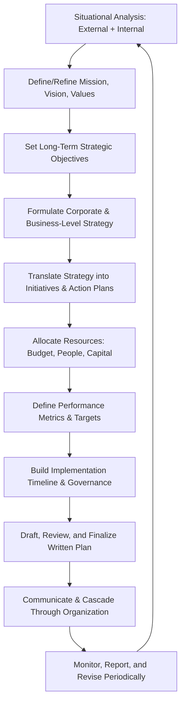
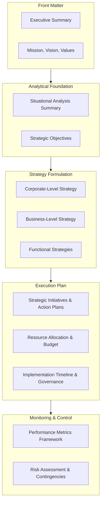

## Writing a Comprehensive Strategic Plan

### Overview

A comprehensive strategic plan is the formal written document that translates strategic analysis (external environment, internal capabilities, strategic issues) into a structured, actionable statement of organizational direction — typically covering a 3-5 year horizon — including mission/vision, strategic objectives, chosen strategy, resource allocation, implementation roadmap, and performance metrics. It serves as both a decision-making artifact (forcing explicit choices) and a communication/alignment tool (ensuring leadership, employees, and often external stakeholders share a common understanding of organizational direction.

**Key Points**

- A strategic plan differs from a strategic analysis (e.g., a case study or industry project write-up) in that it is **prescriptive and forward-committing** — it states what the organization *will do*, not merely what analysis suggests it *could* do.
- The plan must balance **aspirational direction** (mission/vision, long-term objectives) with **operational specificity** (concrete initiatives, owners, timelines, budgets) — a plan that is all aspiration or all operational detail fails its core communication purpose.
- Strategic plans are living documents in practice: most organizations formally revisit and revise them annually even within a multi-year planning horizon, given the pace of external environmental change.

### Strategic Plan Development Process

**Key Points**

- The process is cyclical, not linear — step K (monitoring/revision) feeds back into step A of the next planning cycle, reflecting the reality that strategic plans are periodically refreshed rather than written once and left static.
- Step D (strategy formulation) should occur only *after* steps A-C are complete; a common practical failure is organizations skipping directly to initiatives (step E) without a clearly articulated strategy to justify them.
- Step J (communication/cascading) is frequently under-resourced relative to its importance — a technically excellent plan that is not effectively communicated and translated into department-level goals typically fails at the implementation stage regardless of analytical quality.

### Core Components of a Comprehensive Strategic Plan

#### 1. Executive Summary

- A concise (typically 1-2 page) synthesis of the entire plan: the core strategic direction, top 3-5 objectives, and the rationale in brief.
- Written last, despite appearing first, since it must accurately summarize the completed plan rather than anticipate it.

#### 2. Mission, Vision, and Values Statements

- **Mission**: the organization's core purpose — why it exists, whom it serves, and how (present-tense, enduring).
- **Vision**: an aspirational description of what the organization seeks to become over the planning horizon (future-oriented, motivational).
- **Values**: the behavioral and cultural principles guiding decision-making, particularly under trade-off situations.

**Example**

A mission statement should answer "what business are we in and for whom," e.g., a regional hospital's mission might center on providing accessible, high-quality care to its service area, while its vision might describe becoming the region's most trusted health system within five years. Values might include patient-centeredness, clinical excellence, and community accountability — principles intended to guide resource-allocation trade-offs later in the plan.

#### 3. Situational Analysis Summary

- A condensed synthesis (not a full re-presentation) of the external analysis (Five Forces, PESTEL, competitive landscape) and internal analysis (VRIO, value chain, financial position) that justifies the strategic direction chosen.
- Should culminate in a clear, prioritized statement of the key strategic issues the plan is designed to address — the analytical "so what" bridging analysis to strategy.

#### 4. Strategic Objectives

- Specific, typically 3-7 long-term objectives spanning the planning horizon, ideally following SMART criteria (Specific, Measurable, Achievable, Relevant, Time-bound).
- Objectives should span multiple dimensions of organizational performance (financial, market position, operational capability, organizational/talent) rather than being purely financial, to avoid a narrow or short-termist plan.

**Example**

Rather than a vague objective like "improve profitability," a SMART-formulated objective would read: "Increase EBITDA margin from 12% to 16% by the end of Year 3 through a combination of supply chain cost reduction and premium product mix shift."

#### 5. Corporate-Level Strategy

- States the portfolio-level direction: which businesses/markets to compete in, and how resources are allocated across them (relevant primarily for diversified/multi-business organizations).
- Addresses growth strategy direction: organic growth, mergers & acquisitions, strategic alliances/joint ventures, or divestiture of underperforming units.

#### 6. Business-Level (Competitive) Strategy

- States the chosen generic competitive positioning for each relevant business unit or market segment: cost leadership, differentiation, or focus strategy.
- Should explicitly justify the choice against the situational analysis (e.g., why differentiation is viable given identified brand/capability strengths) rather than asserting a positioning without evidentiary grounding.

#### 7. Functional Strategies

- Translates business-level strategy into functional-area direction: marketing strategy, operations strategy, HR/talent strategy, financial/capital strategy, technology/digital strategy.
- Functional strategies must be internally consistent with one another and with the overarching business-level strategy — a common plan weakness is functional strategies drafted in silos that implicitly conflict (e.g., a cost-leadership business strategy paired with a premium-hiring/high-cost talent strategy without reconciliation).

#### 8. Strategic Initiatives and Action Plans

- The most operationally concrete section: specific named initiatives/projects that operationalize each objective, each with an owner, timeline, resource requirement, and success metric.
- Initiatives should be explicitly mapped back to the strategic objectives they support, so the plan's internal logic (objective → initiative) remains traceable.

| Initiative | Linked Objective | Owner | Timeline | Key Metric |
| --- | --- | --- | --- | --- |
| Supply chain vendor consolidation | EBITDA margin +4pp by Yr 3 | VP Operations | Yr 1-2 | Cost per unit reduction |
| Premium product line launch | EBITDA margin +4pp by Yr 3 | VP Product | Yr 1-3 | % revenue from premium SKUs |
| Regional market entry (2 new states) | Market share +5pp by Yr 3 | VP Sales | Yr 2-3 | New-market revenue |
| Leadership development program | Talent retention +10pp by Yr 2 | VP HR | Yr 1 | Voluntary turnover rate |

#### 9. Resource Allocation and Budget

- States the capital, operating expense, and headcount allocation supporting each major initiative, typically presented as a multi-year budget summary.
- Should reflect explicit trade-offs — since resources are finite, a credible plan shows *what is being deprioritized* to fund the stated priorities, not merely an additive wish list.

#### 10. Implementation Timeline and Governance

- A master timeline (often a Gantt-style view) sequencing initiatives across the planning horizon, showing dependencies between initiatives where relevant.
- Governance structure: who reviews progress (e.g., a steering committee), at what cadence (quarterly business reviews), and what escalation path exists for off-track initiatives.

#### 11. Performance Metrics and Monitoring Framework

- A defined set of key performance indicators (KPIs), often organized via a Balanced Scorecard (financial, customer, internal process, learning & growth perspectives) to avoid over-weighting purely financial metrics.
- Should specify baseline values, targets, and review frequency for each metric.

#### 12. Risk Assessment and Contingency Planning

- Identification of key risks to plan execution (competitive response, macroeconomic shifts, execution/capability risk, regulatory risk) with likelihood/impact assessment and mitigation approach.
- Often includes brief contingency triggers (e.g., "if category growth falls below X%, initiative Y will be paused and resources reallocated to Z").

### Strategic Plan Document Structure (Reference Outline)

### Cascading the Plan: Organizational Alignment

**Key Points**

- **Strategy cascading** (sometimes formalized via tools like Hoshin Kanri / policy deployment or OKRs) translates top-level strategic objectives into business-unit, then departmental, then individual-level goals, maintaining a clear line-of-sight from any individual's goals back to the corporate strategic plan.
- Misalignment commonly occurs when departmental goals are set independently of the strategic plan (e.g., via a separate annual budgeting process) rather than derived from it — auditing whether departmental KPIs actually trace back to plan objectives is a useful diagnostic during plan rollout.
- Communication of the plan (town halls, manager toolkits, FAQ documents) is a distinct workstream from writing the plan itself and should be budgeted and scheduled explicitly rather than treated as an afterthought.

### Common Weaknesses in Strategic Plans

**Key Points**

- **Vague, unmeasurable objectives**: statements like "become a leader in innovation" without a defined metric or timeframe render the objective unmanageable and unassessable.
- **Strategy-initiative disconnect**: a list of initiatives that do not clearly derive from the stated business-level strategy, suggesting the initiatives were determined independently (e.g., inherited from prior-year plans) rather than strategically derived.
- **Resource allocation mismatch**: a plan whose stated priorities are not reflected in the actual budget/headcount allocation — a frequent sign that the plan was written as an aspirational document disconnected from real operating decisions.
- **Absence of accountability structure**: initiatives without named owners or review cadence tend to stall during implementation regardless of strategic merit.
- **Static, unrevised plans**: treating the plan as a one-time document rather than building in a formal periodic review/revision cycle, leaving it disconnected from a changing external environment over the multi-year horizon.
- **Overloaded objective count**: attempting to pursue too many strategic objectives simultaneously (10+) dilutes organizational focus and resource concentration; most effective plans constrain to a small number (3-7) of clearly prioritized objectives.

### Strategic Plan vs. Business Plan vs. Operating Plan

| Document Type | Time Horizon | Primary Purpose | Primary Audience |
| --- | --- | --- | --- |
| Strategic Plan | 3-5 years | Define long-term direction, competitive positioning, and major resource bets | Board, executive leadership, senior management |
| Business Plan | Often used for new ventures/units; variable horizon | Justify a specific business or venture's viability, often for funding/approval | Investors, lenders, internal approval bodies |
| Annual Operating Plan / Budget | 1 year | Translate strategic plan into near-term financial and operational targets | Department/functional managers |

**Key Points**

- The annual operating plan should be explicitly derived from the strategic plan's initiatives for that year — the strategic plan sets the multi-year direction, while the operating plan sets the current-year execution detail and budget.
- A business plan (in the venture/funding sense) often incorporates strategic-plan-like content (mission, market analysis, strategy) but is typically written for a narrower audience and purpose (securing capital or approval) rather than organization-wide direction-setting.

**Next Steps**

- Mission, Vision, and Values Statement Development
- SMART Objective-Setting Techniques
- Balanced Scorecard Framework
- Hoshin Kanri / Policy Deployment and OKR Cascading
- Strategic Initiative Prioritization Methods
- Capital Budgeting and Resource Allocation Frameworks
- Strategy Implementation and Organizational Alignment
- Risk Assessment and Contingency Planning in Strategy
- Strategic Plan Communication and Change Management
- Annual Operating Plan and Budget Integration