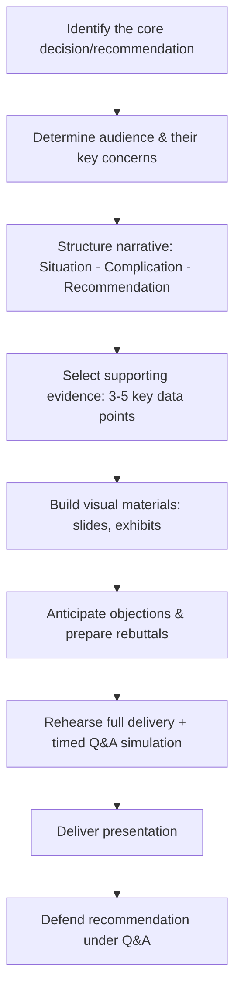
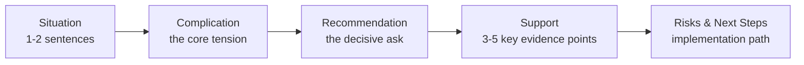

## Presenting and Defending Strategic Recommendations

### Overview

Presenting and defending strategic recommendations is the culminating communication skill in applied strategic management education: the ability to convey an analytically grounded strategic recommendation to a skeptical audience (instructors acting as a board of directors, executives, or investment committee) in a compressed format, and to withstand rigorous questioning of the underlying assumptions, data, and logic. Unlike a written report, this is an interactive, real-time exercise where the credibility of the recommendation is tested not just by its content but by the presenter's ability to defend it under challenge.

**Key Points**

- The presentation is judged on two distinct dimensions: the **quality of the recommendation itself** (is it well-reasoned and evidence-based) and the **quality of the defense** (can the presenter handle pushback without contradicting themselves, retreating unnecessarily, or becoming defensive).
- A capstone-style "Board presentation" or "executive pitch" typically compresses weeks of analysis into 10-20 minutes of delivery plus 10-20 minutes of question-and-answer (Q&A) — the compression itself is a skill, since it forces prioritization of the 3-5 points that actually matter.
- The most common failure mode is not weak analysis but poor **communication calibration**: over-explaining the process (how the analysis was done) rather than leading with the conclusion (what should be done and why).

### Presentation Development Process

**Key Points**

- Step A should be resolved before any slide is built — presentations that begin with slide construction before the core recommendation is crystallized tend to produce unfocused, analysis-heavy decks that bury the actual decision.
- Step F (anticipating objections) is frequently under-invested relative to its importance; a strong recommendation poorly defended in Q&A is remembered as a weak recommendation by most evaluators, regardless of the written analysis's quality.
- Step G (rehearsed Q&A simulation, not just rehearsed delivery) is the single highest-leverage preparation activity for the defense component specifically.

### Structuring the Recommendation Narrative

**Key Points**

- **Lead with the recommendation, not the analysis**: state the "what we recommend and why" in the first 60-90 seconds, then use the remaining time to substantiate it — reversing this order (building up to the recommendation at the end) risks losing a time-constrained or skeptical audience before the key point lands.
- A widely used narrative structure is **Situation → Complication → Recommendation → Support → Risks/Next Steps**:
  - *Situation*: brief context (1-2 sentences) — what is the business/strategic context.
  - *Complication*: the core strategic tension or problem forcing a decision.
  - *Recommendation*: the specific, decisive strategic direction proposed.
  - *Support*: the 3-5 strongest pieces of evidence justifying the recommendation.
  - *Risks/Next steps*: acknowledgment of key risks and the implementation path.
- This structure mirrors the "pyramid principle" common in management consulting communication: conclusion first, then supporting logic organized into a small number of mutually exclusive, collectively exhaustive (MECE) arguments.

### Presentation Structure Reference

### Selecting and Presenting Supporting Evidence

**Key Points**

- Prioritize the **3-5 strongest** data points rather than presenting the full analytical output — a common error is including every framework used (Five Forces, PESTEL, VRIO, financial ratios) rather than selecting only the specific evidence that most directly supports the recommendation.
- Evidence should combine **quantitative** (financial projections, market sizing, ratio trends) and **qualitative** (competitive dynamics, capability assessment) support — an all-quantitative or all-qualitative defense is generally less persuasive than a blended case.
- Visual exhibits (charts, not dense tables) should be used to convey quantitative evidence during live presentation; detailed tables belong in an appendix for reference during Q&A, not on the primary presentation slides.
- State the key assumption behind any financial projection explicitly on the slide (e.g., "assumes X% market share capture by Year 3") — an unstated assumption invites the most damaging category of Q&A challenge: "where did that number come from?"

### Anticipating and Preparing for Objections

A structured approach to pre-empting likely challenges:

| Objection Category | Example Challenge | Preparation Approach |
| --- | --- | --- |
| Data/assumption validity | "Where does that market growth rate come from?" | Cite source explicitly; have the raw figure and methodology ready |
| Competitive response | "What if [competitor] retaliates on price?" | Prepare a brief scenario analysis of the most likely competitive counter-move |
| Financial feasibility | "Can we actually afford this given current cash position?" | Have the pro-forma/breakeven analysis ready at a level of detail beyond the slide |
| Execution capability | "Does the organization have the capability to execute this?" | Address capability gaps directly and propose how they'd be closed (hire, partner, acquire) |
| Alternative not chosen | "Why not [alternative X] instead?" | Be ready to explain why the alternative was considered and rejected, using the same evaluation criteria applied to the recommendation |
| Downside risk | "What's the worst-case scenario?" | Have a specific worst-case estimate and a stated mitigation or exit trigger |

**Key Points**

- The "why not the alternative" objection is nearly universal in strategy Q&A and should always be pre-prepared — failing to have considered and be able to articulate why alternatives were rejected is one of the most damaging gaps in a defense.
- Objections about assumptions should be met with **specificity, not defensiveness** — citing the exact source or reasoning behind a number is more credible than asserting confidence without support.
- When a genuine weakness or gap exists in the analysis, acknowledging it directly and stating how it would be addressed is generally more credible than deflecting or over-defending an indefensible point.

### Delivering the Presentation

**Key Points**

- **Time discipline**: strict adherence to allotted time signals executive-level command of the material; running over time on the core presentation (before Q&A) is frequently penalized as a proxy for poor prioritization skill.
- **Slide density**: each slide should carry one primary message, stated as a clear headline (not a generic label like "Financial Analysis") — the headline should itself communicate the takeaway (e.g., "Premium segment entry improves margin by 4pp within 3 years").
- **Speaker roles in team presentations**: when multiple presenters share delivery, transitions should be explicitly signposted, and any team member should be able to answer Q&A on any section — a common credibility failure occurs when one team member cannot address a question outside their assigned section, suggesting the analysis was siloed rather than integrated.
- **Non-verbal calibration**: confident, measured delivery pace and eye contact with the panel (not the slides) are consistently associated with stronger perceived command of the material, though this is a general communication principle rather than a strategy-specific technique. [Inference: perceived confidence and its correlation with evaluator scoring can vary by evaluator and context; this is a general presentation-skills observation, not a strategy-management-specific finding.]

### Defending the Recommendation Under Q&A

**Key Points**

- **Listen to the full question before responding** — a common mistake under pressure is answering a perceived question rather than the actual question asked, particularly with multi-part questions.
- **Bridge, don't dodge**: if a question probes a genuine gap, acknowledge it briefly and bridge back to the core strength of the recommendation, rather than pretending the gap doesn't exist or over-elaborating a weak justification.
- **Maintain consistency with the written analysis**: contradicting a number or claim made in the accompanying written report during live Q&A is one of the most damaging credibility failures, as it suggests either the presenter doesn't know their own analysis or the analysis itself was inconsistent.
- **Distinguish fact from judgment calls in responses**: clearly signal when an answer is a data-supported fact ("our analysis showed...") versus a reasoned judgment call ("we believe...based on...") — conflating the two under pressure can make a defensible position sound overstated.
- **It is acceptable to say "we would need to gather more data on that"** for a genuinely unaddressed question, provided it's followed by a reasoned statement of how that data would be obtained and what decision it would inform — this is generally viewed more favorably than fabricating a confident but unsupported answer.

### Common Q&A Defense Pitfalls

**Key Points**

- **Over-hedging**: qualifying every statement so heavily that the recommendation itself sounds uncertain, undermining the decisiveness a strategic recommendation is supposed to convey.
- **Reversing position under pressure**: abandoning a well-reasoned recommendation the moment a panelist pushes back, rather than defending the reasoning while remaining genuinely open to specific, valid critiques — evaluators typically distinguish between stubbornness (bad) and unprincipled capitulation (also bad), rewarding reasoned conviction instead.
- **Answering with process instead of substance**: describing *how* the team analyzed something rather than directly answering *what* the analysis found, when asked a direct factual question.
- **Blaming teammates or external constraints**: attributing analytical gaps to time constraints or team division of labor rather than owning the recommendation as a unified team position.
- **Ignoring the moderator/panel dynamic**: failing to manage multiple simultaneous questioners in a group Q&A (e.g., not acknowledging a second question while still answering the first) can create a perception of disorganization.

### Presentation Rubric Dimensions (Typical)

| Dimension | What Is Assessed |
| --- | --- |
| Clarity of recommendation | Is the specific recommendation stated clearly and early? |
| Evidentiary support | Is the recommendation backed by relevant, well-selected evidence? |
| Narrative structure | Does the presentation flow logically (situation → complication → recommendation)? |
| Time management | Does delivery stay within allotted time? |
| Visual communication | Are slides clear, headline-driven, and appropriately data-supported? |
| Q&A responsiveness | Are questions answered directly, specifically, and consistently with the written analysis? |
| Composure under pressure | Does the presenter maintain professional composure without over-hedging or capitulating unnecessarily? |
| Team integration (if applicable) | Can all team members speak to the full analysis, not just their assigned section? |

### Rehearsal and Preparation Checklist

**Key Points**

- Conduct at least one full timed run-through of the core presentation before the actual delivery, including intended slide-by-slide transitions.
- Conduct a separate, dedicated **mock Q&A session** with a colleague or teammate playing a skeptical panelist, focused specifically on the objection categories in the table above.
- Prepare a concise "leave-behind" or appendix set of backup slides (detailed financial model, full framework outputs) accessible during Q&A but not part of the primary narrative.
- Confirm internal team alignment on the recommendation and its key numbers *before* the presentation — visible disagreement or inconsistency between team members during Q&A is one of the more damaging outcomes observable to evaluators.
- Identify in advance the single most likely "killer question" (the hardest objection the recommendation is vulnerable to) and ensure every team member has a consistent, prepared response to it.

**Example**

A well-executed opening might run: *"We recommend [Company] enter the premium segment via organic product development rather than acquisition, targeting a 4-point EBITDA margin improvement within three years. This is driven by three factors: our underutilized R&D capability, a premium-segment growth rate double the core market's, and a manageable capital requirement given current cash reserves. I'll walk through each, then address the key risks and how we'd mitigate them."* This immediately states the decision, previews the support structure, and signals risk-awareness — setting up a focused, defensible narrative for the Q&A that follows.

**Next Steps**

- The Pyramid Principle and Executive Communication Structure
- Building Effective Data Visualizations for Strategic Presentations
- Handling Difficult Questions and Objection Management
- Team-Based Case Competition Preparation
- Executive Presence and Non-Verbal Communication in Business Settings
- Writing a Strategic Case Analysis Memo (structure and rubric)
- Industry-Specific Strategic Analysis Projects (as the analytical source material for presentations)
- Board of Directors Communication and Governance Basics
- Scenario Planning and Risk Communication
- Capstone Strategic Analysis Project Design