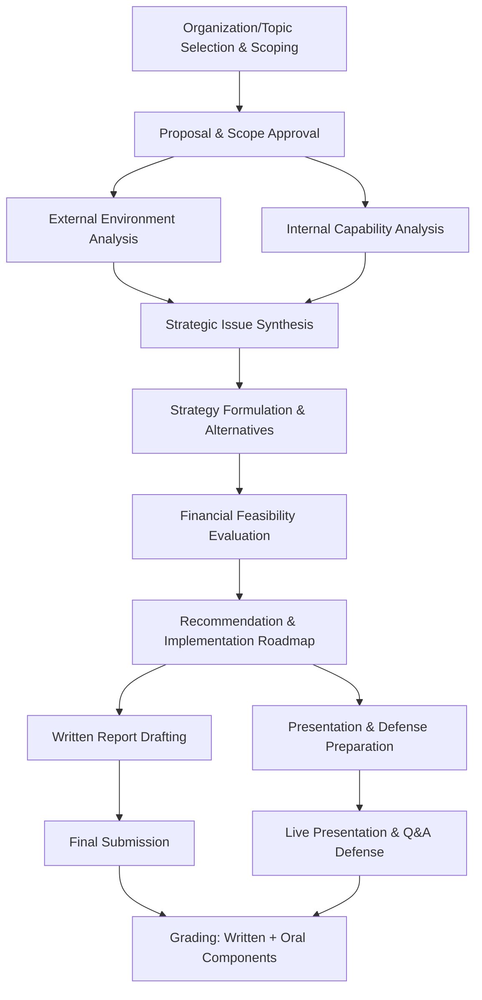

## Capstone Strategic Analysis Project

### Overview

The capstone strategic analysis project is the summative, integrative assignment concluding a strategic management course or program, requiring students (typically in teams) to synthesize the full analytical toolkit — external and internal analysis, strategy formulation, financial evaluation, implementation planning, and executive communication — into a single, comprehensive strategic engagement on a real organization, delivered as both a written report and a live presentation/defense. It differs from the earlier industry-specific analysis project primarily in scope, integration depth, stakes (typically weighted most heavily in final grading), and the expectation that all prior course modules (cases, simulation, frameworks) are visibly synthesized rather than applied in isolation.

**Key Points**

- The capstone is explicitly designed as an **integrative** exercise: strong performance requires demonstrating fluency across the entire course's frameworks and skills, not depth in any single one.
- Unlike a single-framework homework assignment, the capstone is graded holistically on the *coherence of the end-to-end argument* — from raw evidence through to a defended, actionable recommendation.
- Most programs treat the capstone as the primary evidence of course-level learning outcomes achievement, meaning its rubric typically maps directly back to the stated course objectives.

### Capstone Project Lifecycle

**Key Points**

- Step B (proposal/scope approval) exists specifically to prevent late-stage discovery that the chosen organization or topic lacks sufficient public data to support rigorous analysis — a frequent, avoidable cause of capstone difficulty.
- Steps C and D proceed in parallel but must converge cleanly at Step E; a common structural weakness is presenting external and internal analysis as separate, unconnected sections rather than synthesizing them into a unified set of strategic issues.
- The project produces two graded artifacts (written report and live defense, Steps I/J-L) that are typically weighted separately but expected to be fully consistent with one another.

### Selecting and Scoping the Capstone Organization

**Key Points**

- **Organization type trade-offs**: publicly traded firms offer the richest disclosure (10-K/10-Q, earnings calls, analyst reports) but more competition for original insight since they are heavily analyzed externally; private or nonprofit organizations offer more originality but require more resourceful data-gathering (interviews, secondary industry data, triangulation).
- **Scope definition**: explicitly bound the analysis — a single business unit, a specific geographic market, or a defined strategic question (e.g., "should Company X enter market Y") — rather than attempting to analyze an entire diversified conglomerate's full corporate strategy, which typically exceeds feasible depth within a course timeline.
- **Access consideration**: where feasible, securing even limited access to organizational insiders (an alumnus, a informational interview) meaningfully strengthens the internal analysis beyond what public data alone typically provides.
- A well-scoped capstone topic should be stated as a decision question (e.g., "How should [Company] respond to [specific competitive/market threat] over the next 3 years?") rather than an open-ended description (e.g., "analyze [Company]'s strategy") — the decision-question framing focuses the entire subsequent analysis toward an actionable recommendation.

### Integration of Prior Course Components

The capstone is structurally designed to draw on every earlier module in the "Applied Strategy" chapter:

| Prior Component | How It Feeds the Capstone |
| --- | --- |
| Classic case studies | Provides analogical reasoning patterns (e.g., recognizing a Kodak-style innovator's dilemma in the chosen organization) |
| Industry-specific analysis project | Provides the direct methodological template (Five Forces, PESTEL, VRIO, financial analysis) applied at greater depth |
| Simulation exercises | Provides intuition for interdependent decision trade-offs and multi-period strategic consistency, informing the implementation roadmap's realism |
| Strategic plan writing | Provides the document structure and content standards for the capstone's written deliverable |
| Presenting and defending recommendations | Provides the communication and Q&A defense skillset for the capstone's live presentation |

**Key Points**

- Instructors commonly grade explicitly for this integration — e.g., rewarding a team that draws an explicit, well-reasoned parallel between the chosen organization's situation and a classic case studied earlier, versus a team that treats each analytical section as disconnected from the rest of the course.

### Capstone Analytical Workflow (Detailed)

**Key Points**

- **External analysis**: Five Forces (industry structure), PESTEL (macro-environment), strategic group mapping (competitive landscape) — establishing the industry's profit potential and the organization's relative competitive position.
- **Internal analysis**: VRIO (resource/capability evaluation), value chain analysis (margin/differentiation sourcing), financial ratio analysis trended over 3-5 years and benchmarked against peers.
- **Synthesis**: a prioritized (not exhaustive) list of 3-5 strategic issues, each explicitly evidenced by specific findings from the external/internal analysis — the critical bridge step most heavily scrutinized in strong capstone rubrics.
- **Alternative generation and evaluation**: at least 2-3 genuinely distinct strategic alternatives per major issue, evaluated against explicit criteria (strategic fit, financial return, risk, feasibility, time-to-impact) via a transparent scoring approach (e.g., weighted-scoring matrix).
- **Financial feasibility modeling**: a simplified pro-forma, breakeven, and/or NPV estimate for the recommended alternative, with assumptions stated explicitly.
- **Recommendation and implementation roadmap**: a single, decisive strategic direction with a phased implementation timeline, resource requirements, organizational changes needed, and a risk register with mitigations.

$$\text{NPV} = \sum_{t=0}^{n} \frac{CF_t}{(1+r)^t}$$

where $CF_t$ is the net cash flow in period $t$ and $r$ is the discount rate — commonly used in the capstone's financial feasibility section to evaluate whether the recommended strategic initiative is expected to create shareholder/organizational value over the stated horizon. [Inference: the specific discount rate and cash flow assumptions used in a student capstone are estimates for pedagogical purposes, not verified financial projections.]

### Written Report Structure (Capstone-Level)

Building on the strategic plan structure but framed as an external strategic analysis and recommendation rather than an internally authored plan:

1. Executive summary
2. Organization and industry background
3. External environment analysis (Five Forces, PESTEL, strategic group map)
4. Internal capability analysis (VRIO, value chain, financial trends)
5. Strategic issue synthesis
6. Strategic alternatives and evaluation
7. Financial feasibility analysis
8. Recommendation
9. Implementation roadmap and risk assessment
10. Appendices (data tables, financial model detail, source list)

**Key Points**

- Section 2 (background) should be brief — enough to orient a reader unfamiliar with the organization, not a restatement of publicly available company history at length.
- Sections 3-4 should each end with a short synthesis paragraph connecting findings forward to Section 5, rather than leaving the reader to infer the connection.
- The appendices should contain the full depth of analysis (detailed financial models, complete framework outputs) so the main body can remain focused and readable — a common weakness is an overloaded main body that buries the core argument in supporting detail.

### Live Presentation and Defense Component

**Key Points**

- Structured using the Situation → Complication → Recommendation → Support → Risks narrative (see the "Presenting and Defending Strategic Recommendations" module), compressed typically to 15-20 minutes plus Q&A.
- The defense panel (instructor(s), sometimes external practitioners) will typically probe: (1) the validity of key data/assumptions, (2) why alternative strategic paths were rejected, (3) execution feasibility given the organization's actual capabilities, and (4) consistency between the live answers and the written report.
- Team members should be prepared to answer questions outside their individually authored section, since the capstone's integrative grading philosophy extends to the expectation that every team member understands the full analysis, not just their contribution.

### Typical Capstone Grading Rubric Structure

| Dimension | Approximate Emphasis | What Is Assessed |
| --- | --- | --- |
| Analytical rigor & framework application | High | Correct, evidence-based use of external/internal frameworks |
| Strategic synthesis & issue identification | High | Coherent bridge from analysis to prioritized strategic issues |
| Recommendation quality & justification | High | A single, well-justified, decisive recommendation |
| Financial feasibility | Moderate-High | Supporting quantitative analysis (pro-forma, breakeven/NPV) |
| Implementation realism | Moderate | Feasibility given organizational capability and resource constraints |
| Written communication | Moderate | Clarity, structure, and professionalism of the report |
| Oral presentation & defense | Moderate-High | Clarity of live narrative and quality of Q&A responses |
| Team integration | Moderate | Consistency and shared command of material across team members |

**Key Points**

- Exact weightings vary substantially by institution and instructor; the relative emphasis pattern shown is illustrative of common capstone rubric design rather than a fixed universal standard. [Unverified: specific point allocations are instructor/program-specific and not standardized.]

### Common Capstone Pitfalls

**Key Points**

- **Scope creep**: attempting to analyze an entire diversified organization's full global strategy rather than a properly bounded decision question, resulting in shallow coverage across too many issues.
- **Analysis-recommendation disconnect**: a recommendation that does not clearly trace back to the strategic issues identified, suggesting the conclusion was decided before (or independent of) the analysis.
- **Insufficient data triangulation**: relying on a single source (e.g., only the company's own annual report) without cross-checking against independent industry data or competitor disclosures, reducing analytical credibility.
- **Underdeveloped financial feasibility**: a qualitatively compelling recommendation unsupported by even a simplified financial model, which most rigorous capstone rubrics treat as a significant gap.
- **Team fragmentation**: sections written independently by different team members without a final integration pass, resulting in inconsistent terminology, redundant content, or even contradictory findings across sections.
- **Presentation-report inconsistency**: numbers or claims stated in the live defense that conflict with the written report, which evaluators typically treat as a serious credibility failure.
- **Neglecting risk and implementation realism**: presenting the recommendation as a certainty rather than acknowledging execution risk and competitive response, which undercuts the perceived sophistication of the analysis. Actual outcomes of any recommended strategy depend on execution quality and external conditions that cannot be fully controlled or predicted in advance.

### Capstone Project Timeline Template (Illustrative)

**Example**

A representative multi-week capstone schedule:

- **Weeks 1-2**: Organization/topic selection, proposal submission and approval, initial data-gathering.
- **Weeks 3-4**: External environment analysis (Five Forces, PESTEL, strategic group mapping) drafted.
- **Weeks 4-5**: Internal capability analysis (VRIO, value chain, financial ratios) drafted, run in parallel with external analysis.
- **Week 6**: Strategic issue synthesis workshop/checkpoint (often an instructor review point).
- **Weeks 7-8**: Alternative generation, evaluation, and financial feasibility modeling.
- **Week 9**: Recommendation and implementation roadmap finalized; written report drafting begins.
- **Week 10**: Written report finalized and submitted; presentation materials built and rehearsed, including a mock Q&A session.
- **Week 11**: Live presentations and defense delivered; final grading completed.

  [Inference: this timeline is an illustrative template; actual capstone schedules vary by program length and structure.]

### Self-Assessment Checklist Before Submission

**Key Points**

- Does the recommendation directly answer the specific decision question the project was scoped around?
- Is every major claim in the strategic issue synthesis traceable to specific evidence presented earlier in the report?
- Does the financial feasibility section state its key assumptions explicitly rather than presenting figures without justification?
- Is the implementation roadmap realistic given the organization's actual (not idealized) capabilities and resources?
- Have at least 2-3 genuinely distinct alternatives been evaluated, with a clear, criteria-based rationale for why the recommended one was chosen over the others?
- Are the written report and the presentation materials fully consistent in their key figures, claims, and recommendation?
- Has the team conducted at least one mock Q&A defense session anticipating the most likely challenging questions?

**Next Steps**

- Industry-Specific Strategic Analysis Projects (methodological foundation)
- Writing a Comprehensive Strategic Plan (document structure foundation)
- Presenting and Defending Strategic Recommendations (delivery skillset)
- Financial Feasibility Modeling: Pro-Forma, Breakeven, and NPV Analysis
- Strategic Alternative Evaluation via Weighted-Scoring Matrices
- Risk Assessment and Contingency Planning in Strategy
- Team-Based Analytical Project Management
- Course Learning Outcomes Mapping and Rubric Design (instructor-facing)
- Post-Capstone: Transitioning Strategic Analysis Skills to Professional Practice