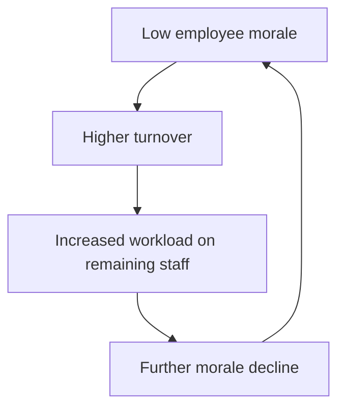

## Definition and Core Premise of Systems Thinking

### Formal Definition

Systems thinking is a discipline for analyzing and understanding how the components of a system interrelate and how a system behaves over time, within the context of larger systems. It is a lens that examines wholes rather than isolated parts, treating a system as an interconnected set of elements coherently organized in a way that achieves some function or purpose, rather than as an aggregation of unrelated components.

Formally, a system can be described as:

$$S = (E, R, F)$$

where $E$ is the set of elements, $R$ is the set of relationships (interconnections) between elements, and $F$ is the function or purpose the arrangement serves. Systems thinking asserts that $S$ cannot be fully understood by decomposing it into $E$ alone; the behavior of $S$ emerges primarily from $R$ and $F$.

### Core Premise

The foundational premise of systems thinking is that **the whole is more than the sum of its parts**, and more precisely, that a system's behavior arises from the *interaction* of its parts rather than from the parts in isolation. This premise rests on several interlocking claims:

- **Interconnectedness**: No element in a system functions independently; each element's behavior is shaped by, and shapes, the behavior of other elements.
- **Emergence**: System-level properties and behaviors (e.g., an organization's culture, an ecosystem's resilience, a market's volatility) arise from interactions and cannot be predicted by studying components in isolation.
- **Non-linearity**: Cause and effect in systems are often disproportionate, delayed, or bidirectional (feedback), unlike the linear, proportional relationships assumed in reductionist analysis.
- **Purpose over structure**: A system is defined more by what it does (its function or purpose) than by what it is made of; identical structures can serve different purposes, and different structures can serve the same purpose.

This stands in direct contrast to reductionism, the traditional scientific approach of breaking a phenomenon into its smallest constituent parts, understanding each part fully, and then reassembling that understanding to explain the whole. Systems thinking does not reject reductionist analysis outright — decomposition remains useful for understanding individual components — but it insists that decomposition alone is insufficient, because the interactions and feedback loops that generate real-world behavior are lost when a system is studied piece by piece.

### Key Points

- Systems thinking is a **paradigm and a set of analytical tools**, not a single technique; it spans qualitative frameworks (causal loop diagrams, iceberg models) and quantitative modeling (system dynamics, agent-based simulation).
- The discipline emerged formally in the mid-20th century, with major contributions from **Ludwig von Bertalanffy** (General Systems Theory, 1940s–1950s), **Norbert Wiener** (cybernetics, 1948), and later **Jay Forrester** (system dynamics, 1950s–1960s at MIT) and **Donella Meadows** (leverage points and popularization, 1990s–2000s).
- A system is bounded by a **boundary**, which distinguishes it from its **environment**; the choice of boundary is itself an analytical decision, not an objective given, and different boundary choices reveal or hide different behaviors.
- Systems exhibit **feedback loops** (reinforcing and balancing), **stocks and flows**, **delays**, and **emergent behavior** as core structural features — each of which is treated as a distinct subtopic in this chapter's subsequent items.
- The core premise implies a shift in the *type of question* asked: reductionism asks "what caused this event?"; systems thinking asks "what structure produces this pattern of behavior over time?"

### Example

Consider a company experiencing declining employee morale. A reductionist investigation isolates variables: it interviews individual employees, audits salary levels, and reviews the performance-review process, treating each as an independent cause to be fixed separately (e.g., raise pay, revise the review form).

A systems-thinking investigation instead asks how these elements interact over time. It might reveal a reinforcing feedback loop: low morale → higher turnover → increased workload on remaining staff → further morale decline → further turnover. The "root cause" is not any single element (pay, reviews, or workload) but the loop structure itself, and effective intervention requires targeting the loop (e.g., a temporary staffing buffer to break the reinforcing cycle) rather than any single node in isolation.

### Systems Thinking vs. Reductionist Analysis (svg_diagram)

<svg xmlns="http://www.w3.org/2000/svg" viewBox="0 0 760 380" font-family="Helvetica, Arial, sans-serif">
<rect x="0" y="0" width="760" height="380" fill="#ffffff" />
<text x="380" y="28" text-anchor="middle" font-size="18" font-weight="bold" fill="#1a1a1a">Reductionist vs. Systems Thinking (svg_diagram)</text>

<rect x="30" y="60" width="320" height="290" rx="10" fill="#f4f4f4" stroke="#999" stroke-width="1.5" />
<text x="190" y="90" text-anchor="middle" font-size="15" font-weight="bold" fill="#333">Reductionist Approach</text>
<circle cx="100" cy="140" r="26" fill="#cfe2ff" stroke="#3366cc" stroke-width="1.5" />
<text x="100" y="145" text-anchor="middle" font-size="12" fill="#1a1a1a">Part A</text>
<circle cx="190" cy="140" r="26" fill="#cfe2ff" stroke="#3366cc" stroke-width="1.5" />
<text x="190" y="145" text-anchor="middle" font-size="12" fill="#1a1a1a">Part B</text>
<circle cx="280" cy="140" r="26" fill="#cfe2ff" stroke="#3366cc" stroke-width="1.5" />
<text x="280" y="145" text-anchor="middle" font-size="12" fill="#1a1a1a">Part C</text>

<text x="190" y="200" text-anchor="middle" font-size="12" fill="#555">Studied independently,</text>

<text x="190" y="218" text-anchor="middle" font-size="12" fill="#555">no interaction modeled</text>

<line x1="100" y1="240" x2="100" y2="270" stroke="#999" stroke-width="1.5" marker-end="url(#arrow1)" />
<line x1="190" y1="240" x2="190" y2="270" stroke="#999" stroke-width="1.5" marker-end="url(#arrow1)" />
<line x1="280" y1="240" x2="280" y2="270" stroke="#999" stroke-width="1.5" marker-end="url(#arrow1)" />
<rect x="70" y="280" width="240" height="46" rx="6" fill="#ffe8cc" stroke="#cc8800" stroke-width="1.5" />
<text x="190" y="300" text-anchor="middle" font-size="12" fill="#1a1a1a">Sum of parts</text>
<text x="190" y="316" text-anchor="middle" font-size="12" fill="#1a1a1a">(A + B + C)</text>

<rect x="410" y="60" width="320" height="290" rx="10" fill="#eef7ee" stroke="#3a9d3a" stroke-width="1.5" />
<text x="570" y="90" text-anchor="middle" font-size="15" font-weight="bold" fill="#1a3d1a">Systems Approach</text>
<circle cx="490" cy="150" r="26" fill="#d4f0d4" stroke="#2e8b2e" stroke-width="1.5" />
<text x="490" y="155" text-anchor="middle" font-size="12" fill="#1a1a1a">Part A</text>
<circle cx="570" cy="200" r="26" fill="#d4f0d4" stroke="#2e8b2e" stroke-width="1.5" />
<text x="570" y="205" text-anchor="middle" font-size="12" fill="#1a1a1a">Part B</text>
<circle cx="650" cy="150" r="26" fill="#d4f0d4" stroke="#2e8b2e" stroke-width="1.5" />
<text x="650" y="155" text-anchor="middle" font-size="12" fill="#1a1a1a">Part C</text>
<line x1="513" y1="163" x2="550" y2="188" stroke="#2e8b2e" stroke-width="1.5" marker-end="url(#arrow2)" />
<line x1="590" y1="188" x2="627" y2="163" stroke="#2e8b2e" stroke-width="1.5" marker-end="url(#arrow2)" />
<line x1="640" y1="165" x2="513" y2="150" stroke="#2e8b2e" stroke-width="1.5" stroke-dasharray="4,3" marker-end="url(#arrow2)" />
<line x1="570" y1="226" x2="570" y2="275" stroke="#999" stroke-width="1.5" marker-end="url(#arrow1)" />
<rect x="470" y="280" width="200" height="46" rx="6" fill="#cfe8cf" stroke="#2e8b2e" stroke-width="1.5" />
<text x="570" y="300" text-anchor="middle" font-size="12" fill="#1a1a1a">Emergent behavior</text>
<text x="570" y="316" text-anchor="middle" font-size="12" fill="#1a1a1a">(interaction-driven)</text>
</svg>

### Causal Loop Structure of the Morale Example

### Distinguishing Facts from Inferences

- The historical attribution of General Systems Theory to von Bertalanffy and cybernetics to Wiener is well-documented intellectual history.
- The claim that a specific organization's morale decline follows the exact reinforcing loop shown above is illustrative; [Inference] real-world causal structures require empirical validation (e.g., through data on turnover and workload) before being treated as confirmed.
- Whether systems thinking "outperforms" reductionism in a given practical context is domain-dependent; [Unverified] this varies by field and problem type and is not a universal ranking.

### Related Topics

- Elements, Interconnections, and Function/Purpose of a System
- System Boundaries and the Environment
- Reinforcing and Balancing Feedback Loops
- Stocks, Flows, and System Structure
- Emergence and Non-linearity in Complex Systems
- History of General Systems Theory and Cybernetics
- System Dynamics Modeling (Jay Forrester)
- Leverage Points (Donella Meadows)