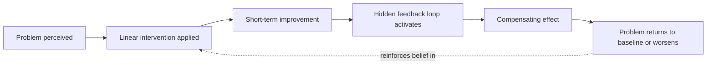

## Systems Thinking versus Reductionist and Linear Thinking

### Overview

Systems thinking, reductionism, and linear thinking represent three distinct epistemological approaches to understanding phenomena. They are not mutually exclusive in practice — reductionism is often a valid sub-step within a systems analysis — but they differ fundamentally in scope, assumptions about causality, and the kinds of questions they are equipped to answer. This item contrasts the three approaches directly and identifies the conditions under which each is appropriate or insufficient.

### Reductionism: Definition and Assumptions

Reductionism is the analytical strategy of understanding a complex phenomenon by decomposing it into its constituent parts, studying each part in isolation, and reconstructing the whole from the sum of that understanding. Its core assumptions are:

- **Decomposability**: A system can be broken into parts without losing essential information about how it behaves.
- **Independence**: Parts can be meaningfully studied outside the context of the whole.
- **Additivity**: The behavior of the whole equals the sum of the behavior of its parts.

Reductionism has been extraordinarily successful in domains where these assumptions hold, most notably classical mechanics, chemistry, and controlled laboratory biology, where isolating a variable and holding others constant is both possible and informative.

### Linear Thinking: Definition and Assumptions

Linear thinking is a mode of causal reasoning that assumes:

- **Proportionality**: Effects are proportional to their causes ($\Delta \text{output} \propto \Delta \text{input}$).
- **Unidirectionality**: Causes precede and produce effects in a single direction (A → B), without B feeding back to influence A.
- **Temporal immediacy**: Effects follow causes closely in time, with negligible or ignorable delay.
- **Single-cause attribution**: A given outcome can typically be traced to one dominant, identifiable cause.

Linear thinking underlies most everyday planning and much of traditional management practice (e.g., "if we increase advertising spend by 10%, sales will increase by 10%").

### Systems Thinking: Contrasting Assumptions

Systems thinking rejects or relaxes each of the above assumptions when studying complex, interconnected phenomena:

| Dimension | Reductionist / Linear Thinking | Systems Thinking |
| --- | --- | --- |
| Unit of analysis | Isolated parts or single variables | Interconnections and relationships between parts |
| Causality | Linear, unidirectional (A → B) | Circular, feedback-driven (A → B → A) |
| Effect proportionality | Proportional to cause | Often disproportionate (non-linear); small causes can produce large effects and vice versa |
| Time | Immediate or ignorable delay | Explicitly models delays between cause and effect |
| Behavior source | Sum of individual part behaviors | Emergent from interactions, not deducible from parts alone |
| Boundary | Often implicit or ignored | Explicitly defined and treated as an analytical choice |
| Typical question | "What caused this event?" | "What structure produces this pattern of behavior over time?" |
| Failure mode when misapplied | Misses feedback, delay, and emergent effects | Can be needlessly complex for genuinely simple, decomposable problems |

### Key Points

- Reductionism and linear thinking are not "wrong" — they are special cases that work well when a system is **loosely coupled**, has **negligible feedback**, and exhibits **short delays** between cause and effect.
- Systems thinking becomes necessary as **coupling strength**, **feedback density**, and **delay length** increase, because these are precisely the conditions under which linear extrapolation from parts fails to predict whole-system behavior.
- A classic diagnostic for linear-thinking failure is **policy resistance**: an intervention that should logically solve a problem instead produces no change or makes the problem worse, because the intervention ignored a compensating feedback loop (e.g., adding more traffic lanes to reduce congestion, which induces more driving and restores congestion — "induced demand").
- Systems thinking treats **event-level explanations** (what happened), **pattern-level explanations** (trends over time), and **structural-level explanations** (the underlying rules, stocks, and feedback loops generating the pattern) as a hierarchy, with structural explanation offering the highest leverage for intervention — this is often visualized as the "iceberg model," covered as a separate item in this chapter.
- Reductionist analysis remains a *component* of systems thinking: understanding individual stocks, flows, and delays (the parts) is a prerequisite to modeling how they interconnect (the whole). Systems thinking is additive to reductionism, not a wholesale replacement of it.

### Example

**Linear/reductionist framing of a hospital ER wait-time problem:**

Wait times are long → hire more doctors → wait times will proportionally decrease. This treats "doctor count" as an isolated variable with a direct, proportional effect on the outcome.

**Systems framing of the same problem:**

Hiring more doctors increases apparent capacity, which can lower the perceived wait time, which can increase patient willingness to visit the ER for non-urgent issues (including cases that might otherwise go to a primary care clinic), which increases patient volume, which raises wait times back toward the original level. The intervention interacts with a **balancing feedback loop** (self-correcting behavior around a demand threshold) that a purely linear "more doctors → less wait" model does not capture. [Inference] The specific strength and speed of this compensating effect vary by hospital, region, and patient population, and would need local data to confirm.

### Diagrammatic Comparison of Causal Structure (svg_diagram)

<svg xmlns="http://www.w3.org/2000/svg" viewBox="0 0 760 300" font-family="Helvetica, Arial, sans-serif">
<rect x="0" y="0" width="760" height="300" fill="#ffffff" />
<text x="380" y="28" text-anchor="middle" font-size="18" font-weight="bold" fill="#1a1a1a">Linear Causality vs. Circular Causality (svg_diagram)</text>

<text x="180" y="60" text-anchor="middle" font-size="14" font-weight="bold" fill="#333">Linear Thinking</text>

<rect x="60" y="90" width="100" height="50" rx="8" fill="`#cfe2ff`" stroke="`#3366cc`" stroke-width="1.5" />

<text x="110" y="120" text-anchor="middle" font-size="12" fill="`#1a1a1a`">Cause A</text>

<line x1="160" y1="115" x2="230" y2="115" stroke="#3366cc" stroke-width="2" marker-end="url(#arrowL)" />
<rect x="230" y="90" width="100" height="50" rx="8" fill="#cfe2ff" stroke="#3366cc" stroke-width="1.5" />
<text x="280" y="120" text-anchor="middle" font-size="12" fill="#1a1a1a">Effect B</text>

<text x="195" y="180" text-anchor="middle" font-size="11" fill="#555">Single direction,</text>

<text x="195" y="196" text-anchor="middle" font-size="11" fill="#555">no return path</text>

<text x="580" y="60" text-anchor="middle" font-size="14" font-weight="bold" fill="`#1a3d1a`">Systems Thinking</text>

<rect x="530" y="90" width="100" height="50" rx="8" fill="#d4f0d4" stroke="#2e8b2e" stroke-width="1.5" />
<text x="580" y="120" text-anchor="middle" font-size="12" fill="#1a1a1a">Variable A</text>
<path d="M 630 100 Q 690 90 690 150 Q 690 210 630 200" fill="none" stroke="#2e8b2e" stroke-width="2" marker-end="url(#arrowS)" />
<rect x="530" y="180" width="100" height="50" rx="8" fill="#d4f0d4" stroke="#2e8b2e" stroke-width="1.5" />
<text x="580" y="210" text-anchor="middle" font-size="12" fill="#1a1a1a">Variable B</text>
<path d="M 530 190 Q 470 180 470 150 Q 470 120 530 110" fill="none" stroke="#2e8b2e" stroke-width="2" marker-end="url(#arrowS)" />

<text x="580" y="270" text-anchor="middle" font-size="11" fill="#555">Feedback loop: A influences B, B influences A</text>

</svg>

### Policy Resistance Pattern

### When Each Approach Is Appropriate

- **Use reductionism/linear thinking when**: the system is tightly bounded, has few interacting variables, feedback is weak or absent, and delays between cause and effect are short (e.g., calculating the load capacity of a single beam, debugging a pure function with no side effects).
- **Use systems thinking when**: variables are densely interconnected, feedback loops are present, delays are significant relative to the decision cycle, and prior linear interventions have produced counterintuitive or resistant results (e.g., organizational change, public health policy, ecological management, software systems with distributed state).

### Related Topics

- Definition and Core Premise of Systems Thinking
- Feedback Loops: Reinforcing and Balancing
- Policy Resistance and Unintended Consequences
- The Iceberg Model (Events, Patterns, Structure, Mental Models)
- Delays in Causal Chains
- Emergence and Non-linear Causality
- Bounded Rationality and Mental Models in Decision-Making