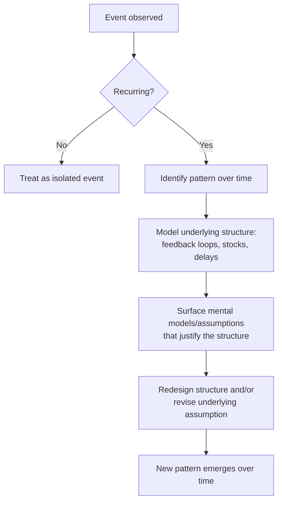

## Levels of Understanding: Events, Patterns, Structures, and Mental Models

### Overview

The Iceberg Model is a foundational framework in systems thinking that organizes explanation into four progressively deeper levels: **events**, **patterns of behavior**, **systemic structures**, and **mental models**. The metaphor draws on an iceberg, where only a small visible tip (events) sits above the waterline, while the vast majority of the mass — and the actual causal leverage — lies submerged and unseen (structures and mental models). The model's central claim is that intervention effectiveness increases as analysis moves from the visible tip toward the submerged base, even though the submerged levels are harder to observe and require more effort to uncover.

### Level 1: Events

Events are discrete, observable occurrences at a specific point in time — the "what happened." Events are the most visible and immediate level of understanding, and they dominate everyday attention, news reporting, and reactive decision-making.

- **Characteristics**: Singular, time-bound, easily noticed, easy to react to.
- **Typical question**: "What just happened?"
- **Typical response mode**: Reactive — putting out the immediate fire.
- **Example**: A specific customer complains about a delayed shipment on a specific date.

Reacting only at the event level produces short-term fixes that do not prevent recurrence, because the event is a symptom, not a cause.

### Level 2: Patterns of Behavior

Patterns are trends that emerge when events of a similar type are tracked over time. Recognizing a pattern requires shifting from a single snapshot to a time-series view.

- **Characteristics**: Requires historical data or repeated observation; reveals trends, cycles, and trajectories.
- **Typical question**: "Has this been happening repeatedly? What's the trend?"
- **Typical response mode**: Anticipatory — recognizing that a class of events recurs and preparing for the next occurrence.
- **Example**: Reviewing shipment records reveals that delivery delays spike predictably every quarter-end, not just on the one date the customer complained about.

Pattern-level analysis is a substantial improvement over event-level reaction because it allows anticipation, but it still does not explain *why* the pattern exists.

### Level 3: Systemic Structures

Structure refers to the underlying arrangement of physical components, policies, rules, information flows, feedback loops, and stocks-and-flows that generate the observed patterns. This is the level where causal loop diagrams, stock-and-flow models, and system archetypes operate.

- **Characteristics**: Not directly observable — must be inferred or modeled from patterns; includes feedback loops, delays, incentive structures, and resource constraints.
- **Typical question**: "What is producing this pattern? What structure, if changed, would change the pattern itself?"
- **Typical response mode**: Generative/design — redesigning the structure so the undesirable pattern stops recurring.
- **Example**: Investigation reveals that quarter-end delays are produced by a sales-incentive structure that rewards deal-closing before quarter close, causing a demand spike that exceeds warehouse fulfillment capacity every quarter — a structural mismatch between an incentive policy (reinforcing loop) and a fixed capacity constraint (balancing loop).

Structural-level intervention (e.g., smoothing the sales incentive over the quarter, or adding flexible fulfillment capacity) addresses the loop that generates the pattern, rather than the individual events it produces.

### Level 4: Mental Models

Mental models are the deepest level: the often-unexamined beliefs, assumptions, values, and worldviews held by the people who design and operate within the structure — the reason the structure exists and persists in its current form in the first place.

- **Characteristics**: Implicit, culturally embedded, frequently unconscious; shape which structures are considered acceptable, legitimate, or even conceivable.
- **Typical question**: "What beliefs and assumptions caused us to design the structure this way? What must people believe for this structure to make sense to them?"
- **Typical response mode**: Transformative — shifting the underlying assumption changes which structures leadership is willing to consider at all.
- **Example**: The sales-incentive structure exists because leadership holds the mental model that "quarterly targets are the only meaningful measure of sales performance." Until this belief is examined and potentially revised (e.g., toward smoother, continuous performance metrics), any structural fix is likely to be reintroduced or subverted, because the structure is an expression of that belief.

### Key Points

- The four levels form a **causal hierarchy**, not four independent explanations: mental models shape structures, structures generate patterns, and patterns manifest as discrete events. Effective diagnosis moves downward through the hierarchy; effective intervention design often targets the lower (structure/mental model) levels while implementation still has to manage upper-level (event) consequences.
- **Leverage increases with depth, but so does the difficulty of intervention.** Changing an event is easy but has no lasting effect; changing a mental model is difficult and slow but can transform an entire class of future structures and patterns. This maps directly onto Donella Meadows's "leverage points" framework (a related, more granular treatment covered elsewhere in this curriculum).
- Most organizations and individuals default to **event-level firefighting** because events are the most visible, urgent, and emotionally salient level; deliberate practice is required to consistently ask "what pattern is this part of?" and "what structure produces that pattern?"
- Mental models are the hardest level to access because they are often **invisible to the people holding them** — surfacing them typically requires facilitated reflection, direct questioning of "why do we do it this way?", or contrasting the organization's assumptions against an outside perspective.
- The Iceberg Model complements, rather than replaces, causal loop diagrams and stock-and-flow modeling: it is a **diagnostic sequencing tool** that tells the analyst *where* to look (structure, then mental models) before applying the more detailed modeling techniques covered later in this curriculum.

### Example: Full Iceberg Walkthrough

**Scenario**: A software team repeatedly ships buggy releases.

- **Event**: A specific release on a specific date crashes in production.
- **Pattern**: Reviewing the last eight releases shows that crash rates spike every time a release ships within 48 hours of the sprint deadline.
- **Structure**: The sprint planning process consistently over-commits story points, leaving testing compressed into the final 48 hours regardless of scope — a fixed-deadline, variable-scope structure with an implicit reinforcing loop where "we'll catch up next sprint" repeatedly fails to happen because next sprint inherits the same over-commitment.
- **Mental model**: Team leadership believes "committing to more work motivates the team to work harder," treating capacity as elastic rather than fixed. Until this belief is revisited (e.g., toward capacity-based planning informed by historical velocity), the over-commitment structure will likely persist even if a specific process fix is imposed once. [Inference] The specific belief driving any given team's over-commitment pattern must be confirmed through direct inquiry with that team's leadership rather than assumed.

### The Iceberg Model (svg_diagram)

<svg xmlns="http://www.w3.org/2000/svg" viewBox="0 0 700 460" font-family="Helvetica, Arial, sans-serif">
<rect x="0" y="0" width="700" height="460" fill="#ffffff" />
<text x="350" y="28" text-anchor="middle" font-size="18" font-weight="bold" fill="#1a1a1a">The Iceberg Model (svg_diagram)</text>

<rect x="0" y="120" width="700" height="340" fill="#dceaf7" />
<line x1="0" y1="120" x2="700" y2="120" stroke="#7fa8c9" stroke-width="2" stroke-dasharray="6,4" />
<text x="650" y="112" font-size="11" fill="#4a4a4a">waterline</text>

<polygon points="300,60 400,60 350,120" fill="#f7d6d6" stroke="#c0392b" stroke-width="1.5" />
<text x="350" y="45" text-anchor="middle" font-size="13" font-weight="bold" fill="#1a1a1a">EVENTS</text>
<text x="350" y="90" text-anchor="middle" font-size="10" fill="#1a1a1a">"What happened?"</text>

<polygon points="220,120 480,120 420,220 280,220" fill="#ffe8cc" stroke="#cc8800" stroke-width="1.5" />
<text x="350" y="150" text-anchor="middle" font-size="13" font-weight="bold" fill="#1a1a1a">PATTERNS</text>
<text x="350" y="170" text-anchor="middle" font-size="10" fill="#1a1a1a">"Has this happened</text>
<text x="350" y="184" text-anchor="middle" font-size="10" fill="#1a1a1a">before? Trend?"</text>

<polygon points="150,220 550,220 470,340 230,340" fill="#d4f0d4" stroke="#2e8b2e" stroke-width="1.5" />
<text x="350" y="260" text-anchor="middle" font-size="13" font-weight="bold" fill="#1a1a1a">STRUCTURES</text>
<text x="350" y="280" text-anchor="middle" font-size="10" fill="#1a1a1a">"What is producing</text>
<text x="350" y="294" text-anchor="middle" font-size="10" fill="#1a1a1a">this pattern?"</text>

<polygon points="60,340 640,340 500,440 200,440" fill="#cfe2ff" stroke="#3366cc" stroke-width="1.5" />
<text x="350" y="380" text-anchor="middle" font-size="13" font-weight="bold" fill="#1a1a1a">MENTAL MODELS</text>
<text x="350" y="400" text-anchor="middle" font-size="10" fill="#1a1a1a">"What beliefs shaped</text>
<text x="350" y="414" text-anchor="middle" font-size="10" fill="#1a1a1a">this structure?"</text>

<line x1="30" y1="440" x2="30" y2="60" stroke="#555" stroke-width="2" marker-end="url(#arrUp)" />
<text x="15" y="250" font-size="11" fill="#555" transform="rotate(-90 15 250)">Increasing leverage</text>
</svg>

### Diagnostic Flow Across Levels

### Related Topics

- Definition and Core Premise of Systems Thinking
- Systems Thinking versus Reductionist and Linear Thinking
- Why Systems Thinking Matters: Motivating Problems
- Leverage Points (Donella Meadows)
- Causal Loop Diagrams
- Systems Archetypes
- Reinforcing and Balancing Feedback Loops
- Surfacing and Challenging Mental Models (Double-Loop Learning)