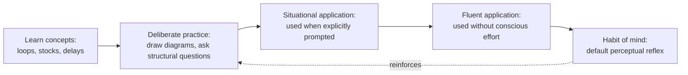

## Systems Thinking as a Discipline and Habit of Mind

### Overview

Beyond being a set of analytical tools (causal loop diagrams, stock-and-flow models, system archetypes), systems thinking is best understood as a **discipline** — a domain of cultivated, practiced skill in the sense used by Peter Senge in *The Fifth Discipline* (1990) — and as a **habit of mind**: a recurring, largely automatic pattern of perception and questioning that a practitioner applies by default, not just when consciously invoked. This item examines what it means to internalize systems thinking as an ongoing cognitive practice rather than an occasional technique reached for on demand.

### Discipline vs. Technique

A **technique** is applied situationally: a person reaches for a causal loop diagram when a specific problem calls for it, then sets it aside. A **discipline**, by contrast, is a body of practice cultivated continuously over time, the way a musician practices scales daily regardless of whether a specific performance is imminent, so that the underlying capability is available instantly when needed.

Senge's *Fifth Discipline* framework treats systems thinking as the **integrating discipline** that binds four other organizational learning disciplines:

- **Personal mastery**: continually clarifying and deepening personal vision and seeing reality objectively.
- **Mental models**: surfacing and challenging deeply held internal assumptions and generalizations.
- **Shared vision**: building a genuine common commitment to a future among a group.
- **Team learning**: aligning and developing the capacity of a team to think and act together.

Senge argues these four disciplines produce fragmented improvement without systems thinking, because none of them alone accounts for how the disciplines interact with one another and with the surrounding organizational structure — systems thinking is the "fifth discipline" that makes visible the interdependencies among the other four.

### Habit of Mind: Default Perceptual Reflexes

As a habit of mind, systems thinking manifests as a set of reflexive questions a practitioner asks automatically, without deliberate invocation, whenever facing a problem, decision, or observation:

- **"What is this connected to?"** — reflexively looking beyond the immediate object of attention to its relationships.
- **"What happened before this, and what might happen after?"** — reflexively situating an event within a time sequence rather than treating it as a snapshot.
- **"Whose behavior is reinforcing or balancing this?"** — reflexively scanning for feedback rather than assuming one-way causation.
- **"What am I assuming that makes this solution seem obvious?"** — reflexively interrogating one's own mental model rather than treating it as neutral fact.
- **"Where is the boundary of what I'm considering, and what did I leave out?"** — reflexively questioning scope rather than accepting the given frame.

These questions function similarly to how a practiced editor reflexively notices grammar errors while reading for pleasure, or a practiced clinician reflexively notices abnormal vital signs while making casual conversation with a patient: the skill has become part of ambient perception rather than a deliberately triggered procedure.

### Key Points

- Systems thinking as a discipline requires **deliberate, repeated practice** — commonly through techniques such as behavior-over-time graphing, causal loop diagram sketching, and structured retrospective analysis ("the five whys" extended into loop identification) — until these become fluent enough to apply informally and quickly.
- As a **habit of mind**, systems thinking changes the *default* mode of perception: a practitioner without this habit notices events; a practitioner with this habit notices events but automatically also asks about the pattern and structure behind them, even in casual, non-analytical contexts.
- Peter Senge's contribution reframes systems thinking from a standalone analytical method into an **organizational learning capability**: the discipline is not just something an individual analyst applies to a diagram, but something a whole learning organization must cultivate collectively for double-loop learning (revising underlying assumptions, not just correcting actions) to occur.
- Cultivating this habit typically follows a **skill-acquisition trajectory** analogous to other complex cognitive skills: conscious, effortful application (deliberately drawing loop diagrams) precedes fluent, largely unconscious application (noticing loop structures while listening to a meeting).
- A common obstacle to developing the habit is **cognitive load**: linear, event-level thinking is cognitively cheaper and faster, so under time pressure or stress, practitioners often default back to linear reasoning even after having developed systems-thinking skill, unless the habit has been deeply enough ingrained to persist under pressure. [Inference] The degree to which systems-thinking habits persist under high-stress conditions likely varies by individual and by the depth/duration of prior practice, and is not uniform across practitioners.

### Example: Discipline in Practice

A project manager who has only learned systems thinking as a *technique* draws a causal loop diagram once during a formal retrospective meeting, then returns to linear status reporting for the remaining eleven months of the project.

A project manager who has developed systems thinking as a *discipline and habit of mind* reflexively asks, during an ordinary daily stand-up when a team member reports being blocked, "What upstream process is producing these blockers repeatedly, and is our current escalation process reinforcing or reducing this pattern?" — without needing to schedule a special retrospective or consciously decide to "apply systems thinking." The analytical reflex has become part of how they process routine information.

### Discipline-to-Habit Progression

### Discipline vs. Habit Comparison

| Dimension | Systems Thinking as Technique | Systems Thinking as Discipline | Systems Thinking as Habit of Mind |
| --- | --- | --- | --- |
| Trigger | Situational, on demand | Scheduled, deliberate practice | Automatic, unprompted |
| Effort | Conscious, deliberate | Conscious, cultivated over time | Largely unconscious |
| Scope | Single problem or diagram | Ongoing personal/organizational capability | Ambient perceptual default |
| Failure mode when absent | Tool not reached for when needed | Skill atrophies without practice | Reverts to linear thinking under pressure |
| Organizational analogue (Senge) | One-off workshop exercise | Integrating discipline binding the other four | Learning organization culture |

### Related Topics

- Definition and Core Premise of Systems Thinking
- Levels of Understanding: Events, Patterns, Structures, and Mental Models
- Peter Senge and *The Fifth Discipline*
- Double-Loop Learning and Challenging Mental Models
- The Learning Organization
- Personal Mastery, Shared Vision, and Team Learning
- Cognitive Load and Default Reasoning Under Pressure