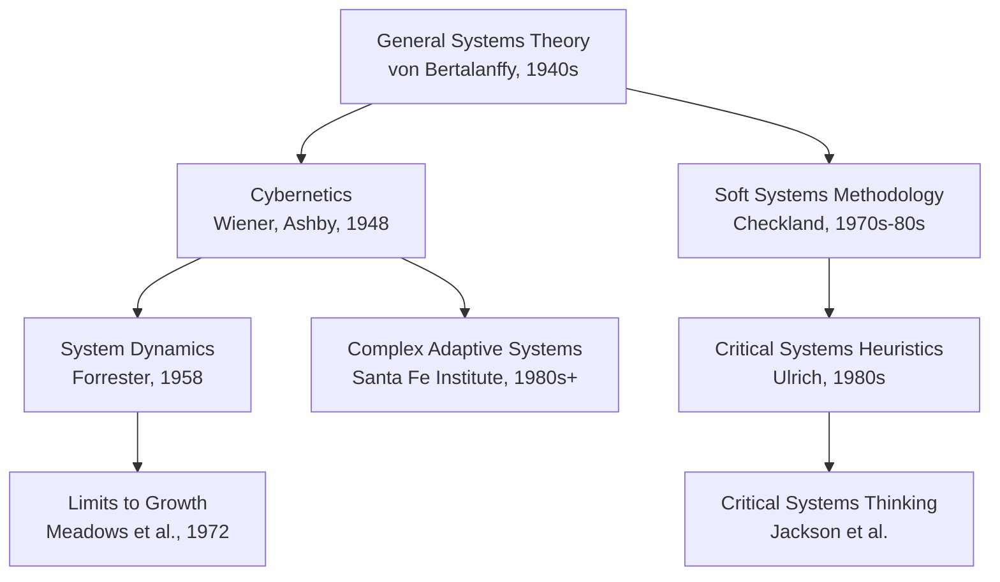

## Overview of the Systems Thinking Field and Its Branches

### Overview

Systems thinking is not a single unified method but an umbrella field encompassing several historically distinct branches, each developed to address different classes of complexity — from tightly quantifiable industrial processes to ambiguous, value-laden social problems. This item surveys the major branches, their originating context, characteristic tools, and the type of problem each is best suited to address.

### Branch 1: General Systems Theory (GST)

**Originator**: Ludwig von Bertalanffy, biologist, 1940s–1950s.

**Core idea**: GST proposed that certain organizing principles — wholeness, hierarchy, openness to environment, self-regulation — apply universally across biological, physical, and social systems, making it possible to study "systems" as a general category independent of the specific substance (cells, machines, organizations) being examined.

**Characteristic contribution**: Established the conceptual vocabulary (open vs. closed systems, hierarchy, isomorphism across domains) that all later branches inherited.

**Best suited for**: Foundational, cross-disciplinary conceptual framing rather than operational problem-solving.

### Branch 2: Cybernetics

**Originator**: Norbert Wiener, mathematician, 1948 (*Cybernetics: Or Control and Communication in the Animal and the Machine*); parallel contributions from W. Ross Ashby.

**Core idea**: Cybernetics studies **control and communication** through feedback in both machines and living organisms, formalizing concepts such as **negative feedback** (error-correcting, goal-seeking behavior) and **requisite variety** (a regulating system must have at least as much variety/complexity as the system it seeks to control — Ashby's Law).

**Characteristic contribution**: The mathematical and conceptual foundation of feedback loops later adopted throughout every other branch of systems thinking; also underlies modern control theory and much of robotics and automation.

**Best suited for**: Analyzing self-regulating mechanisms in both technical (thermostats, autopilots) and organizational (management control systems) contexts.

### Branch 3: System Dynamics

**Originator**: Jay Forrester, MIT, late 1950s–1960s (*Industrial Dynamics*, 1961; later *Urban Dynamics*, 1969; *World Dynamics*, 1971).

**Core idea**: System dynamics models systems as networks of **stocks** (accumulations), **flows** (rates of change into/out of stocks), and **feedback loops**, typically formalized in simulateable computer models to study how structure produces behavior over time, including counterintuitive and delayed effects.

**Characteristic contribution**: Quantitative simulation modeling (using tools such as Vensim, Stella, or AnyLogic); the foundational methodology behind the *Limits to Growth* study (1972, Donella Meadows et al.) commissioned by the Club of Rome, which modeled global population, industrial output, resource depletion, and pollution.

**Best suited for**: Quantifiable systems with clear stock-and-flow structure where simulation can test policy scenarios before real-world implementation — corporate operations, epidemiology, resource management, urban infrastructure.

### Branch 4: Soft Systems Methodology (SSM)

**Originator**: Peter Checkland, Lancaster University, 1970s–1980s (*Systems Thinking, Systems Practice*, 1981).

**Core idea**: Developed specifically because "hard" systems approaches (like system dynamics) assume the problem and desired end-state are well-defined and measurable — an assumption that fails for messy, human-activity-dominated situations where stakeholders disagree on what the problem even is. SSM instead treats the situation itself as problematic and uses structured stages (rich pictures, root definitions using the **CATWOE** framework — Customers, Actors, Transformation, Worldview, Owner, Environmental constraints) to build multiple legitimate models of purposeful human activity and compare them against the real situation to generate debate and accommodation among stakeholders.

**Characteristic contribution**: A qualitative, participatory methodology for "wicked," ill-structured problems where the difficulty lies in disagreement about goals, not merely in complexity of mechanism.

**Best suited for**: Organizational change situations involving multiple stakeholders with conflicting perspectives (policy design, organizational restructuring) rather than technically quantifiable systems.

### Branch 5: Critical Systems Thinking / Critical Systems Heuristics

**Originator**: Werner Ulrich (Critical Systems Heuristics, early 1980s), building on and critiquing both hard and soft systems traditions; further developed within the broader "Critical Systems Thinking" movement (Michael Jackson and others).

**Core idea**: Adds explicit attention to **power, values, and whose perspective is privileged** when a system's boundary is drawn. Ulrich argued that every systems analysis embeds an implicit judgment about who benefits and who is excluded ("boundary judgments"), and that this judgment should be surfaced and critically examined rather than left implicit.

**Characteristic contribution**: A framework of boundary-critique questions (e.g., "who is the intended beneficiary of this system, and who might be negatively affected but has no voice in defining it?").

**Best suited for**: Situations involving significant power asymmetry or ethical stakes, such as public policy affecting marginalized groups, where a technically "correct" model can still be normatively problematic if its boundary excludes affected parties.

### Branch 6: Complex Adaptive Systems (CAS) / Agent-Based Modeling

**Originators**: Multidisciplinary, prominently associated with the Santa Fe Institute from the 1980s onward (John Holland, Stuart Kauffman, and others).

**Core idea**: Studies systems composed of many interacting, adaptive **agents** following local rules, where global, often unpredictable patterns (emergence, self-organization, phase transitions) arise from the bottom up rather than being centrally designed. Distinct from system dynamics' aggregate stock-and-flow view, CAS/agent-based modeling simulates individual agents and observes emergent population-level behavior.

**Characteristic contribution**: Agent-based simulation tools (e.g., NetLogo) and concepts such as self-organization, edge of chaos, and fitness landscapes.

**Best suited for**: Systems where heterogeneous individual behavior matters and aggregate averages would obscure the dynamics — ecosystems, epidemics with heterogeneous contact networks, financial markets, social contagion.

### Key Points

- The branches split broadly into **"hard" systems approaches** (system dynamics, cybernetics — assuming a definable problem amenable to quantitative modeling) and **"soft" systems approaches** (SSM, critical systems thinking — assuming the problem itself is contested and requires qualitative, participatory sense-making).
- No single branch is universally superior; **branch selection depends on problem type**: well-defined quantifiable dynamics favor system dynamics or cybernetics, while contested, multi-stakeholder situations favor SSM or critical systems thinking, and heterogeneous emergent phenomena favor agent-based modeling.
- All branches share the same **conceptual DNA** inherited from GST and cybernetics: feedback, boundary, emergence, and hierarchy are common vocabulary across every branch even where methods diverge sharply.
- The field has historically progressed from **more mechanistic/quantitative origins (GST, cybernetics, system dynamics)** toward **more participatory/critical extensions (SSM, critical systems heuristics)** as practitioners encountered problems where the "hard" approaches' assumption of a well-defined objective function broke down.
- Contemporary practice often **blends branches** pragmatically (e.g., using SSM to first clarify a contested problem definition among stakeholders, then building a system dynamics model to quantify the agreed-upon structure) rather than adhering strictly to one school. [Inference] The degree of blending in practice varies considerably by practitioner, institution, and problem domain, and is not standardized.

### Branch Comparison Table

| Branch | Originator(s) | Era | Core Tool | Problem Type |
| --- | --- | --- | --- | --- |
| General Systems Theory | von Bertalanffy | 1940s–50s | Conceptual vocabulary | Cross-disciplinary foundations |
| Cybernetics | Wiener, Ashby | 1948+ | Feedback/control formalism | Self-regulating mechanisms |
| System Dynamics | Forrester, Meadows | 1958+ | Stock-flow simulation | Quantifiable dynamic systems |
| Soft Systems Methodology | Checkland | 1970s–80s | Rich pictures, CATWOE | Contested, multi-stakeholder situations |
| Critical Systems Heuristics | Ulrich | 1980s+ | Boundary critique questions | Power/value asymmetries |
| Complex Adaptive Systems | Santa Fe Institute et al. | 1980s+ | Agent-based simulation | Emergent, heterogeneous-agent phenomena |

### Field Genealogy

### Related Topics

- Definition and Core Premise of Systems Thinking
- Systems Thinking versus Reductionist and Linear Thinking
- Systems Thinking as a Discipline and Habit of Mind
- Stocks, Flows, and System Dynamics Modeling
- Soft Systems Methodology and CATWOE
- Critical Systems Heuristics and Boundary Judgments
- Complex Adaptive Systems and Emergence
- The Limits to Growth and Club of Rome Modeling