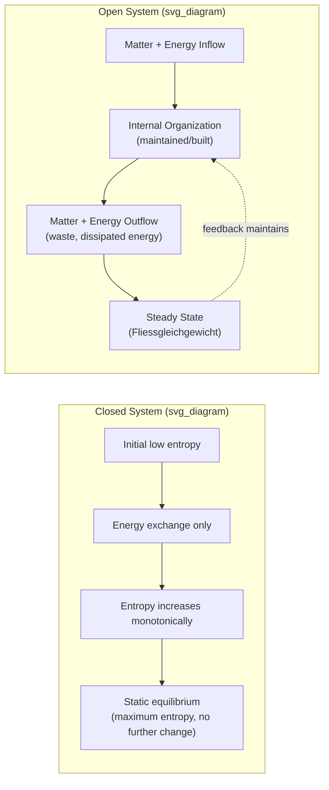

## General Systems Theory and Ludwig von Bertalanffy

### Overview and Historical Context

General Systems Theory (GST) emerged in the mid-20th century as an attempt to construct a unified, transdisciplinary framework capable of describing principles that apply across biological, physical, social, and technical systems. Its principal architect, Ludwig von Bertalanffy (1901–1972), was an Austrian-born theoretical biologist whose dissatisfaction with the reductionist, mechanistic paradigm dominant in early 20th-century biology led him to seek a more holistic explanatory framework. Bertalanffy first articulated the core ideas of what would become GST in the 1920s and 1930s, publishing his organismic conception of biology, and formalized the broader theory in lectures during the 1930s at the University of Chicago, though the outbreak of World War II delayed wider dissemination. The theory reached full maturity and public prominence with his 1968 book *General System Theory: Foundations, Development, Applications*, which remains the canonical reference text.

Bertalanffy's work did not emerge in isolation. It intersected with, and helped catalyze, a broader mid-century intellectual movement toward systems-based and cybernetic thinking, including Norbert Wiener's cybernetics (1948), Claude Shannon's information theory (1948), and the interdisciplinary Macy Conferences (1946–1953) that brought together biologists, mathematicians, anthropologists, and engineers. In 1954, Bertalanffy co-founded the Society for General Systems Research (later renamed the International Society for the Systems Sciences) alongside Kenneth Boulding, Ralph Gerard, and Anatol Rapoport, institutionalizing systems theory as a distinct interdisciplinary field.

### Bertalanffy's Core Motivation: Critique of Reductionism

Bertalanffy's foundational grievance was with what he called the mechanistic worldview, which explained complex phenomena entirely by decomposing them into constituent parts and analyzing those parts in isolation. He argued this approach, while successful for simple, linear, and closed physical systems, was inadequate for explaining living organisms, whose defining characteristics — growth, self-regulation, adaptation, and purposive behavior — arise from the organized interaction of parts rather than from the parts themselves.

His alternative, which he termed the "organismic" perspective, held that an organism must be studied as an integrated whole, and that biological phenomena exhibit properties of **organization** that cannot be reduced to the sum of isolated component behaviors. This is the historical root of the now-famous systems-thinking maxim that "the whole is greater than the sum of its parts" — more precisely, in Bertalanffy's own formulation, the whole displays properties that are meaningless when applied to isolated parts, because those properties are a function of the relationships and interactions between the parts, not the parts in isolation.

### The Concept of Systems as Bertalanffy Defined Them

Bertalanffy defined a system generally as a **set of elements standing in interrelation among themselves and with the environment**. This deceptively simple definition carries substantial theoretical weight: it shifts the unit of analysis from the element to the relation, and it insists that any adequate description of a system must specify not just its components but the environment against which the system is bounded.

**Key Points**

- A system is defined by interrelations, not merely by an inventory of parts.
- Systems are always defined relative to a boundary distinguishing them from an environment.
- The nature of the system-environment boundary (permeable, selective, rigid) determines whether a system is open or closed.
- Systems exhibit emergent properties — characteristics of the whole not present in, or predictable from, any single part in isolation.

### Open Systems Theory

Perhaps Bertalanffy's single most consequential technical contribution was his theory of **open systems**, which he developed initially in the context of thermodynamics and biological metabolism. Classical thermodynamics, as formulated for **closed systems**, describes systems that exchange energy but not matter with their environment, and are governed by the second law of thermodynamics: entropy in a closed system tends to increase toward a state of maximum disorder (thermodynamic equilibrium).

Living organisms, Bertalanffy observed, are not closed systems in this sense. They continuously exchange both matter and energy with their environment — taking in nutrients, expelling waste, absorbing and dissipating energy — while maintaining, and often increasing, their internal organization over time. This apparent defiance of entropic decay is what Bertalanffy formalized as **open system theory**: a system that maintains itself in a continuous inflow and outflow, building up and breaking down of component materials, while sustaining a steady state (*Fliessgleichgewicht*, or "flowing equilibrium").

He distinguished this steady state carefully from equilibrium in the classical thermodynamic sense:

- **Closed-system equilibrium**: a static, time-invariant end state reached once entropy is maximized and all gradients are dissipated; the system, once there, does no further work and cannot spontaneously return to a prior state if perturbed.
- **Open-system steady state**: a dynamic condition in which the system's composition and structure remain approximately constant over time, but only because matter and energy are continuously flowing through it; the constancy is maintained actively, against entropic decay, by continuous exchange with the environment.

Mathematically, Bertalanffy modeled open systems using systems of differential equations describing the rates of change of state variables $Q_i$ as functions of the system's other state variables, generalized as:

$$\frac{dQ_i}{dt} = f_i(Q_1, Q_2, \ldots, Q_n)$$

For a steady state to hold, the net rate of change across all state variables approaches zero even though throughput of matter and energy continues:

$$\frac{dQ_i}{dt} \approx 0 \quad \text{while} \quad \text{influx} \approx \text{efflux} \neq 0$$

This framework let Bertalanffy formally explain phenomena such as **equifinality** — the capacity of an open system to reach the same final state from different initial conditions or via different paths, a property observed in embryonic development (where an embryo can reach a normal adult form even after considerable early perturbation) but which is impossible in closed, deterministic mechanical systems whose final state is uniquely fixed by initial conditions.

### The Isomorphism Principle

The theoretical ambition that made GST "general" rather than merely biological was Bertalanffy's claim of **structural isomorphism**: that formally identical or analogous laws hold for the behavior of entities that are, in substantive content, entirely different — a population of cells, a national economy, an ecosystem, and a bureaucratic organization might all exhibit the same abstract dynamic (e.g., logistic growth, negative feedback stabilization, hierarchical control) despite having nothing in common physically or materially.

This is the theoretical justification for transferring concepts across disciplines: if a growth-and-saturation dynamic governs bacterial colonies, population demographics, and market adoption of new technologies according to the same underlying differential equation, then a single mathematical and conceptual toolkit — GST — can, in principle, describe all of them. Bertalanffy explicitly proposed GST as a search for such isomorphisms across the sciences, aiming to identify the general laws applicable to "systems in general," irrespective of the nature of their component elements or the forces governing them.

**Example**

The logistic growth equation

$$\frac{dN}{dt} = rN\left(1 - \frac{N}{K}\right)$$

was used by Bertalanffy and contemporaries to describe organismic growth curves (with $N$ as body mass or cell count and $K$ as an asymptotic maximum), and the identical mathematical form independently describes population ecology (with $N$ as population size and $K$ as carrying capacity) and the diffusion of innovations in sociology and economics (with $N$ as adopters and $K$ as market saturation). The isomorphism is not a metaphor; Bertalanffy argued it reflects a genuine structural commonality in how bounded growth processes operate, regardless of substrate.

### Hierarchy of Systems and Levels of Organization

Bertalanffy, along with later collaborators such as Kenneth Boulding, articulated the idea that systems exist as a **hierarchy of levels of organization**, each level built from the organized interaction of units at the level below, and each exhibiting emergent properties not present at the lower level. Boulding's widely cited 1956 hierarchy — frameworks, clockworks, thermostats (cybernetic systems), cells, plants, animals, humans, social organizations, and transcendental systems — was explicitly framed as an elaboration of Bertalanffy's general-systems program, ordering systems by increasing complexity of internal organization and self-regulation.

This hierarchical view underlies a core systems-thinking commitment: understanding a phenomenon at one level (e.g., an individual organism) requires reference both to the organization of its constituent lower-level systems (e.g., organs, cells) and to its embedding within higher-level systems (e.g., populations, ecosystems), because causal influence in an open system runs in both directions across levels.

### Relation to Cybernetics and Contemporary Systems Movements

GST is frequently discussed alongside, and sometimes conflated with, **cybernetics** (Norbert Wiener) and **information theory** (Claude Shannon), which arose in the same decade and shared the ambition of cross-disciplinary generality. The distinction is meaningful:

| Framework | Primary Focus | Central Mechanism |
| --- | --- | --- |
| General Systems Theory (Bertalanffy) | Organization, wholeness, and open-system dynamics of living and organized entities | Structural isomorphism across substantively different systems; open-system steady states |
| Cybernetics (Wiener) | Control and communication in animals and machines | Negative feedback loops regulating deviation from a goal state |
| Information Theory (Shannon) | Quantification of information transmission | Entropy as a measure of uncertainty/information content in a communication channel |

Bertalanffy was in dialogue with, and to some degree critical of, cybernetics, arguing that feedback-based homeostatic control (a closed-loop, essentially mechanistic model) was insufficient to capture the full range of open-system phenomena he observed in growth, development, and evolution — processes that involve structural change and increasing complexity, not merely maintenance of a fixed set point. This tension between **homeostatic/regulatory** models and **developmental/generative** models remains a live distinction within contemporary systems thinking.

### Key Concepts Bertalanffy Introduced or Popularized

**Key Points**

- **Wholeness and organization**: system properties depend on relations among parts, not summation of isolated part properties.
- **Open system**: continuous exchange of matter/energy with environment while maintaining organized structure.
- **Steady state (Fliessgleichgewicht)**: dynamic constancy maintained through continuous throughput, distinct from static equilibrium.
- **Equifinality**: convergence to the same end state from different starting conditions or paths, characteristic of open systems.
- **Isomorphism**: structurally identical laws/behavior appearing across substantively unrelated systems.
- **Hierarchical order**: systems nested within systems, each level exhibiting properties emergent relative to the level below.
- **Progressive segregation and mechanization**: Bertalanffy's observation that systems, over developmental or evolutionary time, tend to move from a state of dynamic, highly interdependent interaction toward more fixed, specialized, and mechanistic subsystem arrangements (e.g., an embryo's initially highly regulative tissue differentiating into fixed organs).

### Diagram: Closed vs. Open System Dynamics (svg_diagram)

### Applications and Influence Across Disciplines

GST's cross-disciplinary ambition means its direct and indirect influence spans numerous fields:

- **Biology and ecology**: population dynamics, ecosystem energy flow, homeostasis in physiology, developmental biology's treatment of equifinality.
- **Organizational theory and management**: the "organization as open system" model (notably developed further by Daniel Katz and Robert Kahn in *The Social Psychology of Organizations*, 1966), viewing firms as importing resources/information, transforming them, and exporting outputs while maintaining a negentropic (organization-preserving) internal state.
- **Family therapy and psychology**: systemic family therapy (e.g., the Milan school, structural family therapy) explicitly borrowed the concept of the family as an open system with boundaries, subsystems, and homeostatic tendencies.
- **Sociology**: Talcott Parsons's structural-functionalism drew on systems concepts to model society as a self-regulating system of interdependent subsystems.
- **Engineering and computer science**: systems engineering methodology, and later, object-oriented and modular software design, echo the systems-theoretic emphasis on interfaces, boundaries, and emergent behavior of composed components.
- **Ecology and environmental science**: ecosystem modeling as networks of open-system energy and material flows (further developed by Howard T. Odum's systems ecology).

### Criticisms and Limitations

**Key Points**

- **Vagueness and lack of falsifiability**: critics (notably some philosophers of science) argued that GST's generality came at the cost of specificity — claims of "isomorphism" across biology, sociology, and physics were sometimes seen as loose analogy rather than rigorous, testable, shared mathematical structure.
- **Limited predictive power**: unlike a physical theory that yields precise, falsifiable quantitative predictions, GST largely offers a descriptive and conceptual vocabulary rather than a predictive calculus, which some scientists viewed as reducing its status to a heuristic or metaphorical framework rather than a full scientific theory.
- **Overreach in social science application**: applying open-system and equifinality concepts to social and organizational phenomena risked, critics argued, an unwarranted naturalization of social processes as if they behaved with the lawlike regularity of thermodynamic or biological systems. [Inference]
- **Superseded formalism**: much of the specific mathematical apparatus Bertalanffy used (early nonlinear dynamics, basic differential equation systems) was later absorbed into, and substantially extended by, complexity science, nonlinear dynamical systems theory, network theory, and chaos theory, which offer more rigorous and computationally tractable tools for the phenomena GST described qualitatively.

### Bertalanffy's Legacy in Contemporary Systems Thinking

Even where the specific formal apparatus of 1950s–60s GST has been superseded, its conceptual legacy is foundational to virtually all subsequent systems thinking traditions:

- Jay Forrester's **System Dynamics** (1960s, MIT) operationalized feedback-loop and stock-and-flow thinking into simulation methodology, building on the systems-theoretic premise that structure drives behavior.
- Peter Senge's **The Fifth Discipline** (1990) popularized systems thinking for organizational learning, explicitly citing the systems-theoretic lineage running through Bertalanffy and Forrester.
- **Soft Systems Methodology** (Peter Checkland) and **Critical Systems Thinking** extended systems concepts into the domain of ill-structured social and organizational problems, moving beyond Bertalanffy's more biologically-grounded formalism while retaining his core holistic commitments.
- The contemporary emphasis in systems thinking on **feedback loops, emergence, boundaries, and hierarchy** — the standard vocabulary taught in any modern systems-thinking curriculum — traces its conceptual lineage directly to Bertalanffy's mid-century synthesis.

### Related Topics

- Norbert Wiener and the foundations of cybernetics
- The Macy Conferences and the interdisciplinary systems movement
- Kenneth Boulding's hierarchy of systems complexity
- Jay Forrester and System Dynamics
- Thermodynamics, entropy, and negentropy in living systems
- Homeostasis and cybernetic feedback control
- Talcott Parsons and structural-functionalism in sociology
- Complexity science and nonlinear dynamical systems as successors to classical GST