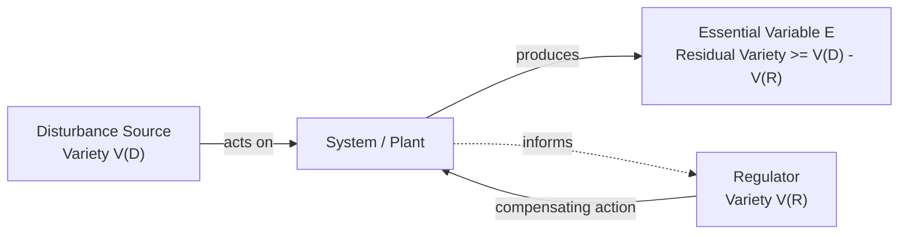

## W. Ross Ashby and the Law of Requisite Variety

### Overview and Historical Context

William Ross Ashby (1903–1972) was a British psychiatrist and cybernetician whose work provided much of the rigorous mathematical backbone that Wiener's original cybernetics lacked. Trained in medicine and practicing as a psychiatrist, Ashby became interested in the mechanistic basis of adaptive behavior in the brain, leading him to construct the **Homeostat** (1948), an electromechanical device with four interconnected units that demonstrated self-stabilizing behavior by automatically reconfiguring its internal connections whenever perturbed away from a target state — one of the earliest working demonstrations of a machine exhibiting adaptive, ultrastable behavior without external instruction.

Ashby's major theoretical works, *Design for a Brain* (1952) and *An Introduction to Cybernetics* (1956), systematized cybernetics using set theory and information theory, giving the field a formal mathematical foundation that made it exportable to disciplines far beyond neurophysiology, including management, ecology, and organizational theory. His most enduring and widely cited contribution is the **Law of Requisite Variety**, formalized in *An Introduction to Cybernetics*.

### Defining Variety

Ashby defined **variety** as the number of distinguishable states or elements a system can exhibit. For a set of possible states $S$, variety is typically expressed as the count of distinct states, or, following Ashby's information-theoretic treatment, as the base-2 logarithm of that count (measured in bits):

$$V(S) = \log_2 |S|$$

Variety is Ashby's operationalization of complexity: a system with more possible distinguishable states has higher variety, and is correspondingly harder to predict or fully control, because there are more ways for it to behave.

### The Law of Requisite Variety

Ashby's Law of Requisite Variety states, in its most compact formulation: **only variety can destroy variety**. More precisely: for a regulator to successfully control (i.e., cancel out or compensate for) the disturbances produced by a system, the regulator must possess at least as much variety as the disturbances it is attempting to regulate.

Formally, if $D$ represents the variety of disturbances a system can produce and $R$ represents the variety of responses available to the regulator, then successful regulation (holding the essential output variable $E$ within an acceptable range, regardless of disturbance) requires:

$$V(R) \geq V(D)$$

Equivalently, expressed via the reduction in outcome variety achievable:

$$V(E_{\min}) \geq V(D) - V(R)$$

which shows that the residual variety in the essential/output variable $E$ can be driven no lower than the gap between disturbance variety and regulator variety. If the regulator's variety is insufficient relative to the disturbance's variety, some of that disturbance variety will necessarily "leak through" into the outcome, regardless of how cleverly the regulator is designed — this is a mathematical/logical necessity in Ashby's framework, not merely an empirical tendency.

**Key Points**

- Requisite variety is a *necessary* condition for regulation, not a sufficient one; having enough variety does not by itself guarantee good regulation, but lacking it guarantees regulation will fail against at least some disturbances.
- The law applies regardless of the physical substrate of the regulator or the disturbance — it is a formal, information-theoretic constraint, which is precisely why it transferred so readily from engineering/neurophysiology into management and social systems theory.
- "Variety" here is a measure of *possible distinguishable states*, not a value judgment; more variety is not intrinsically better, only more capable of matching a correspondingly variable disturbance.

### Illustrative Example

**Example**

Consider a thermostat-controlled heating system in a building. The building's internal temperature is disturbed by numerous external factors: outdoor temperature swings, number of occupants, open windows, sunlight through windows, appliance heat output — each contributing to the total "disturbance variety" the system must cope with. A simple on/off thermostat with only two states (heater on, heater off) has very low regulator variety. If disturbances are simple (e.g., only outdoor temperature varies slowly), this low-variety regulator may suffice. But if disturbances become more varied and rapid (multiple heat sources, humidity swings, zone-specific needs), a two-state regulator cannot match that variety, and the Law of Requisite Variety predicts — as a mathematical certainty, not merely a design heuristic — that some disturbances will produce uncontrolled temperature deviations. A more sophisticated regulator (multi-zone, variable-output HVAC with humidity control, adaptive scheduling) increases regulator variety to match, which is precisely why such systems achieve tighter control.

### Diagram: Requisite Variety in a Regulation Loop (svg_diagram)

### Mechanisms for Achieving Requisite Variety

Since a regulator's own variety is often physically or economically limited, Ashby's framework implies several practical strategies for achieving adequate regulation despite this constraint, all widely used in systems thinking and management theory:

- **Variety amplification**: increasing the regulator's effective variety, e.g., through better sensors, more actuators, more sophisticated control logic, delegation to sub-regulators, or automation that multiplies a single operator's effective response repertoire.
- **Variety attenuation**: reducing the variety the regulator must actually cope with, e.g., through standardization, buffering, categorization, filtering out irrelevant disturbances, or environmental engineering that limits the range of disturbances that can occur in the first place.
- **Buffering/decoupling**: inserting an intermediate stage (e.g., inventory buffers in supply chains, or slack resources in an organization) that absorbs disturbance variety before it reaches the core regulator, effectively attenuating variety at the point of contact.
- **Hierarchical/recursive regulation**: delegating regulation of specific sub-disturbances to specialized lower-level regulators, each of which need only match the variety of its local disturbance domain rather than the full system's aggregate variety — a principle later formalized by Stafford Beer as the **recursive structure** of the Viable System Model.

### Ashby's Broader Theoretical Apparatus

Beyond the Law of Requisite Variety, Ashby contributed several other foundational cybernetic concepts:

- **Ultrastability**: a system property whereby, if a primary regulatory mechanism fails to keep an essential variable within viable limits, a slower, higher-level mechanism triggers a structural reorganization of the system itself (not merely a parameter adjustment) until viable regulation is restored — demonstrated mechanically by the Homeostat's self-rewiring behavior. This anticipates later concepts of adaptive and self-organizing systems.
- **The Law of Requisite Knowledge** (a corollary sometimes attributed to Ashby's broader framework): effective regulation requires not only sufficient response variety but sufficient *information* about the disturbance to select the correct response — variety alone does not help if the regulator cannot detect which disturbance state is occurring.
- **Black box theory**: Ashby formalized methods for characterizing and modeling a system's behavior purely from its observable input-output relations, without assuming access to its internal mechanism — a foundational idea for systems analysis of opaque or overly complex systems, and directly influential on later software engineering and systems-testing practice.
- **The Markov/state-transition formalism for adaptive behavior**: Ashby modeled organisms and machines as systems transitioning among a finite set of states under environmental input, providing an early rigorous bridge between cybernetics and what would become computational and information-theoretic models of adaptive systems.

### Relationship to General Systems Theory and Wiener's Cybernetics

Ashby's work is often regarded as the mathematically rigorous complement to Wiener's more qualitative and metaphor-rich original cybernetics. Where Wiener established the conceptual link between feedback control and purposive behavior, Ashby supplied set-theoretic and information-theoretic formalism that made cybernetic claims precise and, in the case of requisite variety, essentially provable as a logical theorem about any regulator-disturbance system, independent of physical implementation. This formal generality is why requisite variety, more than almost any other single cybernetic concept, was exported wholesale into management cybernetics, organizational design, and law/policy analysis, fields where Wiener's engineering-flavored feedback-loop language was a less natural fit.

Ashby's work also intersects with Bertalanffy's General Systems Theory in the shared concern for self-regulation and stability, though Ashby's approach — grounded in exhaustive state-space enumeration and information theory — is more formally tractable and computationally oriented than Bertalanffy's more qualitative, thermodynamically-inspired open-systems language.

### Applications in Management and Organizational Systems Thinking

**Key Points**

- **Stafford Beer's Viable System Model** builds requisite variety into its central design principle: each recursive level of an organization must possess variety matching the variety of the environment/disturbances it directly manages, with variety engineering (amplifiers and attenuators) as an explicit design activity.
- **Organizational design**: the law is frequently invoked to argue that a management team or control function must have response repertoire (staff, decision authority, information systems) proportional to the complexity of the environment it manages — an underqualified or overly rigid management structure will, per the law, necessarily fail to regulate against sufficiently variable market or operational conditions.
- **Policy and regulatory design**: the law is used to argue that regulatory bodies must possess sufficient variety (expertise, enforcement mechanisms, monitoring granularity) to match the variety of behaviors in the regulated domain, or regulation will be systematically incomplete.
- **Information systems and automation**: the design of dashboards, alerting systems, and automated control logic in IT operations and DevOps is frequently framed, explicitly or implicitly, in requisite-variety terms — automation is a variety amplifier for a fixed number of human operators.

### Criticisms and Limitations

**Key Points**

- **Practical measurability of variety**: critics note that while variety is mathematically well-defined for simple, enumerable state spaces, real organizational or social "disturbance variety" is often not cleanly enumerable, making direct quantitative application of the law difficult outside controlled engineering contexts. [Inference]
- **Normative overreach**: some critics argue that requisite variety, while a valid formal constraint, is sometimes invoked in management literature as if it were a complete design methodology rather than a single necessary condition among many for effective regulation. [Inference]
- **Assumes a stable definition of "essential variable"**: the law's guarantee is only meaningful relative to a well-specified set of variables the regulator is trying to keep within bounds; ambiguity or disagreement about what counts as "essential" in a social or organizational system can undermine straightforward application.

### Legacy in Contemporary Systems Thinking

The Law of Requisite Variety remains one of the most frequently cited "laws" in the entire systems-thinking canon, functioning as a rigorous formal justification for intuitions about matching complexity of response to complexity of challenge. It underlies:

- **Stafford Beer's Viable System Model** and management cybernetics more broadly.
- Contemporary discussions of organizational agility, resilience, and adaptive capacity, where "requisite variety" is often invoked (sometimes loosely) to argue for decentralization, diversity of skills, and distributed decision authority as means of matching environmental complexity.
- Complexity science's treatment of adaptive systems, where Ashby's ultrastability concept anticipates later formal treatments of self-organization and adaptation in complex adaptive systems.
- Information systems design, where variety engineering concepts inform the architecture of monitoring, alerting, and automated control systems.

### Related Topics

- General Systems Theory and Ludwig von Bertalanffy
- Cybernetics and Norbert Wiener
- Stafford Beer's Viable System Model and management cybernetics
- Second-order cybernetics and Heinz von Foerster
- Complex adaptive systems and self-organization
- Information theory and Claude Shannon
- Homeostasis and ultrastability in biological regulation