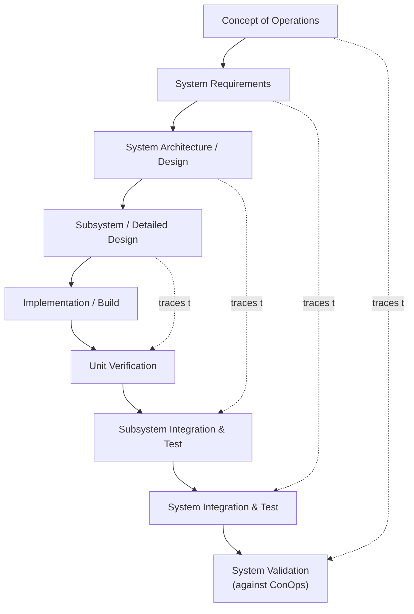

## Operations Research and Early Systems Engineering

### Overview and Historical Context

Operations Research (OR) emerged during World War II as an applied discipline dedicated to using quantitative, mathematical methods to optimize the allocation of scarce resources under operational constraints. The field's origin is conventionally traced to British military efforts beginning in 1937–1938, when physicist Patrick Blackett assembled interdisciplinary teams — famously including biologists, physicists, and mathematicians — to analyze the operational effectiveness of newly deployed radar systems (Chain Home) and later to optimize convoy tactics, anti-submarine warfare patterns, and bombing strategies. The term "operational research" (British usage) arose because these teams studied the *operations* of military systems empirically, in contrast to weapons research, which focused on the technology itself.

The United States rapidly adopted and expanded these methods, applying OR to logistics, supply chain optimization, and strategic bombing analysis. After the war, the discipline transitioned into civilian industry, academia, and government planning, formalized institutionally through the founding of the Operations Research Society of America (ORSA, 1952) and The Institute of Management Sciences (TIMS, 1953; the two merged into INFORMS in 1995). This same postwar period saw the parallel emergence of **systems engineering** as a formal discipline, driven substantially by Bell Labs' need to manage the enormous technical complexity of large telecommunications and defense projects (including work supporting the Nike missile system), and by the broader recognition — shared with the cybernetics and general systems movements — that complex sociotechnical projects required an explicit, top-down methodology for specifying, integrating, and validating large numbers of interacting subsystems.

### Core Techniques of Operations Research

OR developed a substantial toolkit of quantitative optimization and modeling techniques, many of which remain foundational not just to OR itself but to the broader quantitative side of systems thinking:

**Key Points**

- **Linear programming (LP)**: optimization of a linear objective function subject to linear equality/inequality constraints, formalized and made computationally tractable by George Dantzig's **simplex method** (1947), developed originally for U.S. Air Force logistics planning.
- **Queuing theory**: mathematical modeling of waiting lines and service systems, building on Agner Krarup Erlang's earlier telephone-traffic work, applied extensively to manufacturing throughput, call-center staffing, and network traffic engineering.
- **Inventory theory**: models for optimal reorder quantities and timing under demand uncertainty (e.g., the Economic Order Quantity model), foundational to supply chain and logistics management.
- **Network optimization**: shortest-path, maximum-flow, and minimum-cost-flow algorithms applied to transportation, logistics, and infrastructure planning.
- **Game theory**: von Neumann and Morgenstern's minimax and strategic-interaction formalism (1944), applied within OR to competitive resource allocation and strategic military/business decisions.
- **Monte Carlo simulation**: stochastic simulation methods (developed by Stanislaw Ulam and John von Neumann at Los Alamos) applied to systems too complex for closed-form analytical solution.
- **Markov decision processes and dynamic programming**: Richard Bellman's formalization (1950s) of sequential decision-making under uncertainty, expressed via the Bellman equation:

$$V(s) = \max_{a} \left[ R(s,a) + \gamma \sum_{s'} P(s'|s,a) V(s') \right]$$

where $V(s)$ is the value of state $s$, $R(s,a)$ the immediate reward of action $a$, $\gamma$ a discount factor, and $P(s'|s,a)$ the transition probability to state $s'$.

### The OR Methodology as a Systems-Thinking Precursor

OR's characteristic methodology — problem formulation, model construction, solution derivation, and validation against real-world operational data — established a template of quantitative, model-based reasoning about complex operational systems that directly prefigures core systems-thinking practice. Its central working assumption, that a complex operational problem can be usefully abstracted into a formal mathematical model whose optimal solution then informs real-world decisions, is a direct ancestor of the systems-thinking commitment to modeling system structure explicitly rather than reasoning purely qualitatively or intuitively about complex situations.

**Example**

The classic OR **transportation problem** — minimizing the cost of shipping goods from a set of supply origins $i$ to a set of demand destinations $j$, given per-unit shipping costs $c_{ij}$, supply capacities $s_i$, and demand requirements $d_j$ — is formulated as a linear program:

$$\min \sum_{i} \sum_{j} c_{ij} x_{ij} \quad \text{subject to} \quad \sum_j x_{ij} \leq s_i,\ \sum_i x_{ij} \geq d_j,\ x_{ij} \geq 0$$

This formalization exemplifies the OR approach systems thinking inherited: decompose the operational problem into explicit variables, constraints, and an objective, then solve rigorously rather than by ad hoc judgment — while, in more mature systems-thinking practice, remaining alert to the risk that this decomposition can strip out important qualitative, feedback-driven, or emergent behavior the linear/static model cannot represent.

### The Emergence of Systems Engineering

Systems engineering formalized as a distinct discipline in the 1950s–1960s, driven by the scale and technical complexity of Cold War-era aerospace and defense programs (ICBMs, the Apollo program, complex radar and command-and-control networks) that exceeded what any single engineering specialty could manage in isolation. Its central premise is that large, complex technical systems require an explicit **systems life-cycle methodology** spanning requirements definition, functional decomposition, interface management, integration, verification, and validation — treating the coordination and interaction of subsystems, not merely the subsystems themselves, as the primary engineering challenge.

**Key Points**

- **Requirements engineering**: systematic elicitation, specification, and traceability of what a system must do, established as a discrete engineering discipline to prevent costly late-stage rework caused by ambiguous or incomplete requirements.
- **Functional decomposition and interface management**: breaking a large system into subsystems with clearly specified interfaces, enabling parallel development by separate teams while managing the risk of integration failure — a direct engineering operationalization of the systems-theoretic concern with boundaries and inter-component relations.
- **The V-model and systems engineering life cycle**: a widely used framework pairing each decomposition/design stage (left side of the "V") with a corresponding integration/verification stage (right side), ensuring that every specified requirement is eventually verified against a corresponding test.
- **Trade-off (trade study) analysis**: formal, often quantitative, comparison of competing design alternatives against multiple weighted criteria (cost, performance, risk, schedule) — an operational instantiation of the OR optimization mindset applied to system architecture decisions rather than pure resource allocation.
- **Configuration management**: formal control of a system's design baseline and change history, essential once systems become too large and long-lived for any individual to track ad hoc.

### Diagram: The Systems Engineering V-Model (svg_diagram)

### Relationship to Cybernetics and General Systems Theory

OR and early systems engineering developed largely in parallel with, rather than directly derived from, Wiener's cybernetics and Bertalanffy's General Systems Theory, but the three movements converged on shared intellectual ground and substantially cross-pollinated by the late 1950s. All three shared:

- A rejection of purely intuitive, unaided human judgment as sufficient for managing complex systems, in favor of explicit formal modeling.
- A cross-disciplinary methodology, assembling mathematicians, engineers, and domain specialists into unified analytical teams (mirrored in OR's WWII interdisciplinary teams and the Macy Conferences' interdisciplinary cybernetics community).
- An emphasis on the system as the unit of analysis, rather than any single component — OR's insistence on "optimizing the whole operation" rather than any single sub-process is a direct operational analogue to the GST/cybernetics insistence on emergent, whole-system properties.

Where OR and systems engineering differ most sharply from cybernetics and GST is in their comparatively narrower, more applied and prescriptive orientation: OR and systems engineering are fundamentally *design and decision-support disciplines* aimed at solving specific, bounded operational or engineering problems, whereas cybernetics and GST aimed at descriptive, explanatory, transdisciplinary theories of system behavior in general. [Inference] This distinction is why OR/systems engineering historically institutionalized within engineering schools and industry, while cybernetics and GST retained a more academic, theoretical, and eventually more diffuse institutional presence.

### Influence on Contemporary Systems Thinking

**Key Points**

- **System Dynamics** (Jay Forrester, MIT, 1950s–60s) emerged directly from Forrester's background in servomechanism engineering and his exposure to the operations-research and industrial-engineering culture of postwar MIT, fusing feedback-control mathematics with OR-style quantitative modeling of industrial and social systems.
- **Soft Systems Methodology** (Peter Checkland, 1970s–80s) was developed explicitly as a critique of and complement to "hard" OR/systems-engineering methods, which Checkland argued worked well for well-defined technical problems but broke down when applied to ill-structured, value-laden human and organizational situations — a foundational split in systems thinking between "hard" (OR/engineering-style) and "soft" (interpretive, participatory) systems approaches.
- **Project management methodology**: modern large-scale project management (critical path method, PERT charts — both developed within the OR tradition in the 1950s) traces directly back to the OR/systems-engineering toolkit.
- **Systems architecture practice** in contemporary software and enterprise systems design continues to use the requirements-traceability, interface-management, and trade-study concepts pioneered in mid-century systems engineering, now embedded in frameworks such as INCOSE's Systems Engineering Body of Knowledge and standards like ISO/IEC/IEEE 15288.

### Criticisms and Limitations

**Key Points**

- **The "hard systems" critique**: OR and classical systems engineering assume that problems can be adequately specified as well-structured optimization or design problems with clear objectives and constraints; critics (most influentially Checkland) argue this assumption fails for social and organizational "messes" characterized by multiple, conflicting stakeholder perspectives on what the problem even is.
- **Reductionist decomposition risk**: functional decomposition, while operationally indispensable for managing large engineering efforts, risks under-representing emergent behavior and feedback effects that arise only from whole-system interaction — an irony given that systems engineering explicitly exists to manage cross-subsystem interaction, but decomposition-first methodology can still obscure genuinely emergent, non-decomposable dynamics. [Inference]
- **Optimization under fixed assumptions**: classical OR models typically assume static or well-characterized stochastic parameters (fixed costs, known probability distributions); their prescriptions can degrade significantly under genuine structural uncertainty or adversarial/adaptive environments not captured in the original model.

### Related Topics

- General Systems Theory and Ludwig von Bertalanffy
- Cybernetics and Norbert Wiener
- Jay Forrester and the origins of System Dynamics
- Soft Systems Methodology and Peter Checkland
- Linear programming, dynamic programming, and mathematical optimization
- The V-model and modern systems engineering standards (ISO/IEC/IEEE 15288)
- Project management origins: PERT, Critical Path Method, and Gantt charts