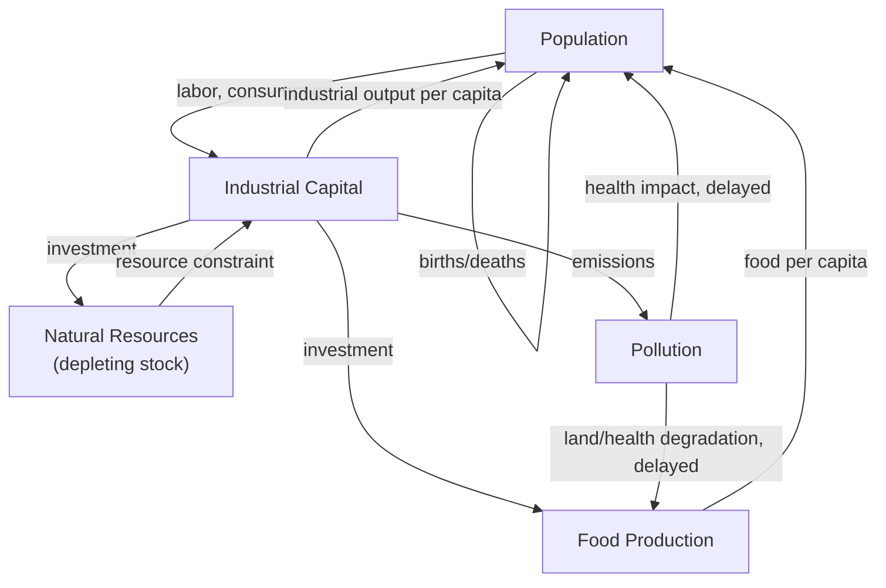

## The Club of Rome and Limits to Growth

### Overview and Historical Context

The Club of Rome is an international think tank founded in 1968 by Italian industrialist Aurelio Peccei and Scottish scientist Alexander King, convened to address what its founders termed the "world problematique" — the interlocking set of global challenges (population growth, resource depletion, pollution, industrialization, food production) that no single discipline or nation could adequately analyze in isolation. Motivated by the belief that conventional, siloed academic and policy analysis was structurally incapable of capturing the interconnected, global-scale dynamics of these problems, the Club of Rome commissioned a team at MIT, led by Jay Forrester and subsequently by Dennis Meadows, Donella Meadows, Jørgen Randers, and William Behrens III, to construct a formal computer simulation model of global socioeconomic and environmental dynamics.

The resulting 1972 report, ***The Limits to Growth***, sold millions of copies and became one of the most influential — and most contested — works in the history of environmental and systems science. It is a landmark event in the popularization of systems thinking, being the first major application of System Dynamics methodology to a global-scale policy question, and it thrust feedback-loop-based modeling into mainstream political and public discourse for the first time.

### The World3 Model

The technical core of *Limits to Growth* was **World3**, a System Dynamics simulation model built directly on the stock-and-flow and feedback-loop methodology Jay Forrester had developed in industrial dynamics and urban dynamics, and had first applied to a global model (**World2**) in his own 1971 book *World Dynamics*. World3 modeled the interactions among five principal global subsystems, each represented as a set of interconnected stocks (accumulations) and flows (rates of change) governed by feedback loops:

**Key Points**

- **Population**: births, deaths, and population growth rate, influenced by industrial output per capita, food per capita, and pollution.
- **Industrial capital**: capital investment, depreciation, and industrial output, constrained by available resources and capital allocation decisions.
- **Natural resources**: a finite, non-renewable resource stock depleted by industrial and agricultural activity.
- **Food production/agriculture**: arable land, land yield, and food output, subject to diminishing returns from land degradation and pollution.
- **Pollution**: persistent pollution generation from industrial and agricultural activity, with a lag between emission and environmental/health impact.

These five subsystems were coupled through dozens of nonlinear feedback loops — for example, higher industrial output increases both food production capacity (via agricultural investment) and pollution (via industrial emissions), while pollution in turn degrades land yield and increases mortality, creating delayed negative feedback on population and industrial growth. This structure exemplifies the core System Dynamics thesis that **complex, counterintuitive system behavior emerges from the interaction of simple, well-understood feedback loops operating with time delays**, rather than from any single dominant cause.

### Diagram: Simplified World3 Feedback Structure (svg_diagram)

### Core Findings and the Overshoot-and-Collapse Archetype

Running World3 under a range of scenarios, the *Limits to Growth* authors found that under the "standard run" (business-as-usual assumptions with no major policy change), the model consistently produced a characteristic trajectory: exponential growth in population and industrial output through the mid-20th century, followed by **overshoot** — growth continuing past the level the resource base and pollution-absorption capacity could sustainably support — and then **collapse**, a relatively rapid decline in population and industrial capital once accumulated resource depletion and pollution effects overwhelmed the system's capacity to sustain further growth.

This overshoot-and-collapse pattern is now recognized as one of the canonical **system archetypes** in systems thinking — a generic structure ("Limits to Growth" or "Limits to Success" in Senge's later taxonomy) in which a reinforcing feedback loop drives growth, while a balancing feedback loop, initially weak or slow relative to the reinforcing loop, eventually becomes dominant, but by the time it does, the accumulated overshoot forces a correction that overshoots the sustainable level in the opposite direction (collapse) rather than gently converging to the true limit.

**Key Points**

- **Reinforcing (positive) loop**: population and capital growth reinforce each other exponentially in the absence of binding constraints.
- **Balancing (negative) loop with delay**: resource depletion and pollution accumulation act as balancing forces, but with substantial *time delays* between cause (emission, extraction) and effect (health impact, resource scarcity) that prevent the balancing loop from exerting corrective pressure until well after the sustainable limit has been exceeded.
- **The critical role of delay**: the report's central systems-thinking lesson is that time delays in balancing feedback loops are what convert a soft, adjustable limit into a hard overshoot-and-collapse dynamic; without the delay, the system could approach its limit asymptotically rather than overshooting it destructively.

The report also modeled several alternative policy scenarios (e.g., doubled resource availability, aggressive pollution control, birth control policies, stabilized industrial output), most of which delayed but did not eliminate eventual overshoot unless multiple reinforcing feedback loops were addressed simultaneously — the report's central policy argument was that piecemeal, single-variable interventions were systematically insufficient against a multi-loop reinforcing growth dynamic, and that only comprehensive, coordinated stabilization of population and industrial capital growth (a "stabilized world" scenario) avoided collapse in the model.

**Example**

In the model's stabilized-world scenario, the authors imposed simultaneous constraints: births set equal to deaths (zero population growth), industrial capital investment set equal to depreciation (zero net capital growth), a shift in economic priority toward services and food production over material goods, resource-efficient technology, and pollution control — illustrating the systems-thinking principle that leverage in a multi-loop reinforcing system typically requires intervening on the structure driving multiple loops simultaneously, not on any single variable in isolation.

### Methodological Reception and Controversy

*Limits to Growth* was, from publication, the subject of intense academic and political controversy, and remains a useful case study in the epistemic challenges of large-scale simulation modeling:

**Key Points**

- **Economists' critique**: mainstream economists (notably in a well-known 1973 critique from a Sussex University team, and later critiques associated with economists such as Julian Simon) argued the model inadequately represented price mechanisms, technological innovation, and resource substitution — the tendency of markets to respond to scarcity by developing substitutes, increasing extraction efficiency, or shifting demand, dynamics they argued World3 either omitted or treated too crudely. [Inference — this reflects a real and influential critique, though its ultimate validity remains contested among specialists.]
- **Misreading as "prediction of collapse by year X"**: the report was frequently — and, according to the original authors and many subsequent scholars, inaccurately — characterized in popular media as predicting a specific collapse date; the authors' actual claim was structural (the *dynamic pattern* of overshoot-and-collapse under business-as-usual assumptions), not a precise date-stamped forecast, and they explicitly framed the work as scenario exploration rather than point prediction.
- **Data and parameter uncertainty**: critics noted that 1970s-era data on global resource reserves, pollution absorption capacity, and technological change rates carried substantial uncertainty, and that the model's qualitative conclusions were sensitive to parameter assumptions that were themselves contestable. [Inference]
- **Subsequent empirical revisits**: several later studies (including a notable 2008 comparison by Graham Turner and further updates through the 2010s–2020s) compared several decades of observed global data against the original World3 "standard run" scenario and reported the observed trajectory tracked that scenario reasonably closely on several variables (industrial output, pollution, resource use), a finding cited by defenders of the model's structural validity, though the interpretation and robustness of these comparisons themselves remain debated among specialists. [Unverified — specific quantitative correspondence claims vary across follow-up studies and should be checked against the current primary literature for precise figures.]

### Contribution to Systems Thinking Methodology

Independent of the substantive debate over its environmental conclusions, *Limits to Growth* made several durable methodological contributions to the systems-thinking field:

- It was the first high-profile demonstration that formal System Dynamics simulation could be applied at global, multi-decade, multi-sector scale, establishing computer simulation as a legitimate and policy-relevant tool for reasoning about complex global systems, not merely industrial or urban subsystems as in Forrester's earlier work.
- It popularized, for a lay and policy audience for the first time, the core systems-thinking vocabulary of stocks, flows, reinforcing and balancing feedback loops, and time delays as explanatory mechanisms for real-world social and environmental dynamics.
- It established **overshoot-and-collapse** as a canonical system archetype, subsequently generalized and taught (notably by Donella Meadows in her later systems-thinking pedagogy, including *Thinking in Systems: A Primer*, 2008) as one of a handful of recurring generic structures systems thinkers are trained to recognize across otherwise unrelated domains.
- It catalyzed decades of follow-on work in ecological economics, sustainability science, and integrated global-systems modeling (e.g., Integrated Assessment Models used in climate policy), which inherited and extended its core method of coupling economic, demographic, and biophysical subsystems within a single dynamic simulation.

### Legacy and Sequels

The original team produced two major sequels reassessing the model against subsequent decades of real-world data and updated assumptions: *Beyond the Limits* (1992) and *Limits to Growth: The 30-Year Update* (2004), both concluding that the world had, in the authors' assessment, already moved into an overshoot condition on several key dimensions and reaffirming the core structural argument of the original report while updating specific parameters and scenario framings.

### Related Topics

- Jay Forrester and the origins of System Dynamics
- System archetypes: reinforcing loops, balancing loops, and overshoot-and-collapse
- Donella Meadows and *Thinking in Systems: A Primer*
- Stocks, flows, and time delays in dynamic systems modeling
- Ecological economics and planetary boundaries
- Integrated Assessment Models in climate policy
- General Systems Theory and Ludwig von Bertalanffy