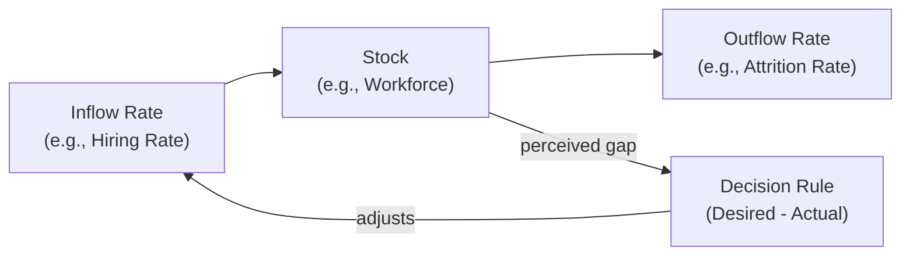

## Jay Forrester and the Origins of System Dynamics

### Overview and Historical Context

Jay Wright Forrester (1918–2016) was an American engineer and MIT professor whose career trajectory — from electrical/servomechanism engineering, through digital computer design, into industrial management, and finally into the founding of a new discipline — makes him one of the most direct institutional bridges between cybernetics-era control theory and modern systems thinking. Before turning to systems dynamics, Forrester led the design of the **Whirlwind computer** at MIT (1940s–50s), one of the first digital computers capable of real-time operation, and subsequently directed the development of core memory (magnetic-core RAM), a foundational computer-memory technology, work that directly connected him to the servomechanism and feedback-control engineering culture from which cybernetics itself emerged.

In 1956, Forrester joined MIT's Sloan School of Management, where he began applying his engineering background in feedback control and dynamic systems to the behavior of industrial organizations — a shift catalyzed by his observation, working with General Electric management, that instability in GE's household-appliance production and employment levels (alternating hiring booms and layoffs) could be explained not by external market shocks alone but by the internal feedback structure of GE's own inventory and workforce decision policies. This insight became the founding case study of what Forrester named **Industrial Dynamics**, published in his 1961 book of the same name — the founding text of the System Dynamics field.

### Core Methodological Innovation: Stocks, Flows, and Feedback

Forrester's central methodological contribution was to translate the mathematics of continuous-time feedback control systems — differential/difference equations describing rates of change — into a modeling framework specifically designed for the structure of organizational, economic, and social systems, built around three foundational primitives:

**Key Points**

- **Stocks (levels)**: accumulations that represent the state of the system at a point in time — inventory, population, capital, workforce, backlog — the only quantities in the system that can be directly measured at an instant and that give the system memory (a stock's current value depends on its entire history of inflows and outflows, not merely current conditions).
- **Flows (rates)**: the rates at which stocks increase or decrease — production rate, hiring rate, birth rate, shipment rate — flows are the only means by which stocks can change, and flows themselves are typically governed by decision rules or policies that depend on the current values of one or more stocks.
- **Feedback loops**: closed causal chains in which a stock's level influences a decision/flow rate, which in turn changes the stock's level, closing the loop; loops are classified as **reinforcing** (R, amplifying deviation) or **balancing** (B, opposing/damping deviation toward a goal).

Mathematically, a stock $S$ evolves according to the integral of its net flow:

$$S(t) = S(0) + \int_0^t \left[ \text{Inflow}(\tau) - \text{Outflow}(\tau) \right] d\tau$$

or in discrete-time simulation form (as implemented in Forrester's DYNAMO simulation language):

$$S(t + \Delta t) = S(t) + \Delta t \left[ \text{Inflow}(t) - \text{Outflow}(t) \right]$$

Flows are typically specified as functions of stocks and auxiliary variables via decision-rule equations, e.g., a hiring-rate policy of the form:

$$\text{Hiring Rate}(t) = f\big(\text{Desired Workforce}(t) - \text{Actual Workforce}(t),\ \text{Adjustment Time}\big)$$

which formalizes the idea that management decisions (flows) are themselves responses to perceived gaps between desired and actual system state (stocks) — embedding Ashby/Wiener-style feedback-control logic directly into an organizational management model.

### Diagram: Basic Stock-and-Flow Structure with Feedback (svg_diagram)

### Industrial Dynamics: The Founding Application

Forrester's original 1961 *Industrial Dynamics* work modeled supply chains and production-distribution systems, demonstrating a phenomenon now universally known in operations management as the **Forrester Effect** or **Bullwhip Effect**: small, relatively smooth fluctuations in end-customer demand become progressively amplified as they propagate backward through a multi-stage supply chain (retailer → wholesaler → distributor → factory), purely as a consequence of each stage's inventory-management decision policies and the time delays inherent in ordering, production, and shipping — with no need for any external shock or irrational behavior by any individual actor to produce large, destabilizing oscillations at the upstream end of the chain.

**Example**

In Forrester's canonical production-distribution model, each supply chain stage sets its order quantity based on a policy responding to (a) the gap between desired and actual inventory and (b) the gap between desired and actual "supply line" (unfilled orders in transit). Because each stage has imperfect, delayed visibility into the *actual* end-customer demand (seeing only the amplified order signal from the stage immediately downstream), a modest, temporary uptick in retail demand causes the retailer to over-order (to rebuild depleted inventory and account for orders in transit), which the wholesaler perceives as a larger demand increase and over-orders further, and so on — producing progressively larger oscillations upstream. This is a direct organizational-scale illustration of Ashby's Law of Requisite Variety failing in practice: each stage's ordering policy (a low-variety, locally rational heuristic) is insufficient to correctly infer the true, higher-variety state of end-customer demand from the limited, delayed information available to it.

### Extension to Urban and Global Systems

Having established the methodology at the scale of a single firm or supply chain, Forrester extended System Dynamics to progressively larger systems:

- ***Urban Dynamics*** (1969) modeled the growth, aging, and decline of cities as a dynamic system of interacting housing, business, and population stocks, controversially concluding that certain well-intentioned urban policies (e.g., large-scale low-income housing construction) could, through feedback effects on land use and business investment, worsen rather than improve long-run urban economic conditions — an early and contentious example of the systems-thinking finding that policy interventions can produce **counterintuitive** or even **policy-resistant** outcomes when they fail to account for a system's full feedback structure.
- ***World Dynamics*** (1971), the **World2** model, was Forrester's own direct precursor to the Club of Rome's *Limits to Growth* project; Forrester built World2 in response to a request from the Club of Rome to demonstrate whether System Dynamics could usefully model global-scale population, industrialization, and resource dynamics, and his student Dennis Meadows subsequently led the expanded **World3** model used in the 1972 report.

### The DYNAMO Simulation Language

To make stock-and-flow modeling computationally tractable at a time when general-purpose programming was inaccessible to most managers and social scientists, Forrester's group developed **DYNAMO** (DYNAmic MOdels), a specialized simulation language (first released 1959) providing built-in constructs for levels (stocks), rates (flows), and auxiliary equations, with simulation proceeding via fixed-time-step numerical integration (typically Euler's method) of the system's difference equations. DYNAMO was the dominant System Dynamics modeling tool for over two decades and directly shaped the visual and notational conventions (stock-and-flow diagrams with explicit level/rate/auxiliary distinctions) that persist in modern System Dynamics software such as Stella, Vensim, and AnyLogic.

### Core Systems-Thinking Principles Forrester Established

**Key Points**

- **Structure drives behavior**: a system's feedback-loop structure, not the intentions or competence of the individual actors within it, is typically the dominant determinant of its overall dynamic behavior — a principle Forrester considered his central intellectual contribution and which remains the foundational premise of the entire System Dynamics field.
- **Counterintuitive behavior of social systems**: complex feedback systems routinely produce outcomes that contradict the intuitive, linear, "more cause produces proportionally more effect" mental models most people naturally apply, particularly because of time delays and nonlinearities that separate cause from effect in time and magnitude.
- **Policy resistance**: many well-intentioned interventions fail or backfire specifically because they target a symptom-level variable rather than the underlying feedback structure generating that symptom, and/or because other balancing feedback loops in the system compensate for or counteract the intervention.
- **Leverage points**: because feedback structure, not any single component, drives system behavior, effective intervention requires identifying points in the feedback structure (e.g., a dominant reinforcing loop, a critical information delay) where a comparatively small structural change produces disproportionately large improvement in system behavior — a concept later extensively elaborated by Forrester's student and collaborator Donella Meadows.

### Relationship to Cybernetics and General Systems Theory

Forrester's System Dynamics is, in a direct genealogical sense, an engineering-and-management-oriented specialization and operationalization of the broader cybernetic and general-systems intellectual project: it takes Wiener's feedback-control mathematics and Ashby's state-space/regulation formalism and repackages them into a modeling methodology specifically tailored for simulating industrial, urban, and social systems using accessible stock-and-flow diagrams and dedicated simulation software, rather than the more abstract, transdisciplinary theoretical vocabulary of Bertalanffy's GST or Wiener's original cybernetics. Where GST asked "what general laws govern all systems" and cybernetics asked "how does feedback produce goal-directed behavior," Forrester's System Dynamics asked the more applied question: "how can we build computable simulation models of specific real-world social and economic systems precise enough to test policy interventions before implementing them in the real world."

### Legacy and Institutionalization

System Dynamics was institutionalized as an academic field through the MIT System Dynamics Group (which Forrester founded and led for decades) and the System Dynamics Society (founded 1983). Forrester's direct students and collaborators — including Dennis Meadows, Donella Meadows, and John Sterman (author of the widely used textbook *Business Dynamics*, 2000) — extended the field into business strategy, environmental and sustainability modeling, public health, and, significantly, into the popularization of systems thinking for general management audiences (most notably via Peter Senge's *The Fifth Discipline*, 1990, which built its "systems archetypes" and "learning organization" concepts directly on Forresterian System Dynamics foundations translated into more qualitative, accessible language for practitioners).

### Related Topics

- The Club of Rome and *Limits to Growth*
- Donella Meadows, leverage points, and *Thinking in Systems: A Primer*
- Peter Senge and *The Fifth Discipline*
- The Bullwhip Effect in supply chain management
- Cybernetics and Norbert Wiener
- W. Ross Ashby and the Law of Requisite Variety
- Stock-and-flow modeling software: Stella, Vensim, and AnyLogic
- System archetypes and policy resistance