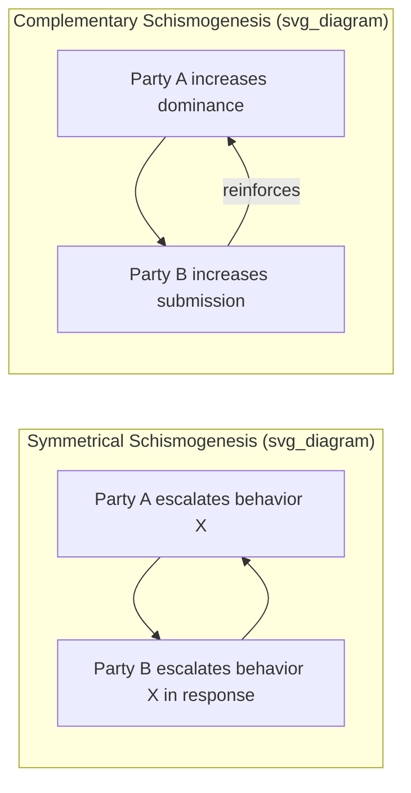

## Gregory Bateson and Ecology of Mind

### Overview and Historical Context

Gregory Bateson (1904–1980) was a British-American anthropologist, social scientist, and cybernetician whose intellectually eclectic career — spanning anthropology, psychiatry, linguistics, animal communication, and epistemology — made him one of the most influential figures in extending cybernetic and systems concepts beyond engineering and biology into the study of mind, communication, and human relationships. Trained initially in biology and anthropology at Cambridge, Bateson conducted early ethnographic fieldwork in New Guinea and Bali (partly in collaboration with his then-wife, anthropologist Margaret Mead), developing his concept of **schismogenesis** — progressive, self-reinforcing escalation or divergence in patterns of interaction between individuals or groups — an early, ethnographically grounded instance of positive-feedback thinking applied to social relationships, predating his direct engagement with formal cybernetics.

Bateson was a core participant in the Macy Conferences on Cybernetics (1946–1953), where his direct engagement with Wiener, McCulloch, and von Neumann's formal feedback and information concepts fused with his anthropological and psychiatric interests, launching the decades-long intellectual project collected in his landmark 1972 anthology, ***Steps to an Ecology of Mind***, and continued in his final book, ***Mind and Nature: A Necessary Unity*** (1979).

### Core Thesis: Mind as an Ecological, Relational Phenomenon

Bateson's central and most enduring theoretical move was to argue that **mind is not a property localized within an individual brain or organism, but a property of systems of relationship and information circulation** — that mental process, properly understood, is a characteristic of certain kinds of circuits of information exchange, wherever those circuits occur, whether within a single nervous system, between two people in conversation, within an ecosystem, or across a person and the tool or environment they interact with. This is the direct conceptual origin of his famous, deliberately provocative example: a blind man's cane is, in the relevant cybernetic/informational sense, part of the "mind" that is navigating the street, because the relevant circuit of information (tapping, feedback, course correction) runs through the cane and cannot be meaningfully bounded at the skin.

**Key Points**

- Bateson defined mind operationally via criteria for what constitutes a "mental" system: it must consist of interacting parts/components, the interaction must be triggered by *difference* (not raw energy transfer, since minds work via information, and information, in Bateson's famous formulation, is "a difference that makes a difference"), mental process requires collateral energy (energy internal to the responding part, not merely the energy of the triggering signal, as in a reflex vs. a kicked stone), mental process is circular or more complex in causal structure (i.e., involves feedback, not simple linear causation), and the effects of difference are to be regarded as transforms of events that preceded them.
- This reframes "information" and "mind" in fundamentally relational, systemic terms — inseparable from cybernetics' emphasis on circuits and feedback, but extended by Bateson well beyond engineered or biological control systems into epistemology, ecology, and the study of human relationships.

### "A Difference That Makes a Difference": Information Redefined

Bateson's most widely quoted formulation — that the elementary unit of information is **"a difference which makes a difference"** — reframes Shannon-Wiener information theory in explicitly relational, context-dependent terms. A difference in the world (e.g., a temperature gradient, a change in a person's tone of voice) only constitutes *information*, in Bateson's sense, if it is registered by, and makes a difference to, some receiving system capable of responding to it — information is not an intrinsic property of a signal in isolation but a relational property that requires a receiving system with the capacity to be affected by the distinction.

This move is significant for systems thinking because it insists that a system's boundaries, and what counts as "information" flowing across them, cannot be specified independently of specifying which differences a particular observer or organism is capable of registering — a direct precursor to the second-order cybernetics concern (developed contemporaneously by Bateson's colleague Heinz von Foerster) with the observer's inescapable role in constituting what a system even is.

### The Double Bind Theory

Bateson's most clinically influential specific contribution was the **double bind theory** of communication pathology, developed with colleagues Jay Haley, Don Jackson, and John Weakland in the 1950s, originally as a hypothesis about the family communication patterns associated with schizophrenia (a causal claim now generally regarded within psychiatry as unsupported and largely abandoned, though the underlying communication-pattern concept retains broader currency).

A double bind, as Bateson formally defined it, requires several simultaneous conditions:

**Key Points**

- Two or more people in an intense relationship where accurate interpretation of communication genuinely matters for the recipient.
- A primary injunction delivered at one logical level (e.g., an explicit verbal statement, such as "come here, I love you").
- A secondary, contradictory injunction delivered at a different logical level (e.g., non-verbal cues signaling rejection or discomfort — tone, posture, withdrawal) that conflicts with the first.
- A tertiary, negative injunction prohibiting the recipient from commenting on or escaping the contradiction (e.g., an implicit or explicit rule against naming the inconsistency, or leaving the relationship/field).
- Repetition of this pattern over time, such that it becomes an habitual expectation the recipient cannot resolve through any single act of interpretation.

The theoretical significance for systems thinking lies in Bateson's use of **Bertrand Russell's theory of logical types** — the idea that a message about a relationship (a "metamessage" or communication about communication) belongs to a different logical level than an object-level message, and that contradictions between these levels create a structurally unresolvable bind for a system (a person, a relationship) that lacks a way to "step outside" the frame to comment on it. This logical-typing framework — messages about messages occupying a distinct, higher logical level — became a general tool in Bateson's broader systems epistemology.

### Schismogenesis and Systemic Escalation

Bateson's earlier ethnographic concept of **schismogenesis**, developed from his 1930s New Guinea fieldwork (published in *Naven*, 1936), described how patterns of interaction between individuals or groups can become progressively exaggerated over time through what is, in retrospect, clearly describable as a positive feedback process. He distinguished two forms:

- **Symmetrical schismogenesis**: both parties respond to the other's behavior with escalating versions of the *same* behavior (e.g., mutual competitive boasting, an arms race), driving progressive divergence/escalation in the same direction for both.
- **Complementary schismogenesis**: parties respond with escalating *opposite* behaviors that mutually reinforce each other (e.g., one party's increasing dominance provokes the other's increasing submission, which further encourages dominance), driving the relationship toward increasingly extreme and rigid role polarization.

Both patterns, left unchecked by some external constraint or internal correction, tend toward breakdown of the relationship or system — an early, non-mathematized but structurally precise anticipation of positive-feedback runaway dynamics that Bateson would later explicitly connect to cybernetic feedback theory once he engaged with Wiener's formal framework at the Macy Conferences.

### Diagram: Schismogenesis as Positive Feedback (svg_diagram)

### Ecology of Mind and the Critique of Purposive, Fragmented Thinking

In his later synthesis, Bateson extended his relational theory of mind into an explicitly ecological and ethical argument: he contended that Western industrial civilization's characteristic mode of thought — treating "self," "purpose," and "control" as properties of an isolated individual or agency acting *upon* an external, separate environment — is not merely philosophically naive but practically dangerous, because it systematically ignores the fact that the individual, the social system, and the surrounding ecosystem constitute a single, larger cybernetic system whose overall stability requires respecting feedback loops that a narrowly self-interested, short-term-purposive actor will tend to violate.

**Key Points**

- Bateson argued that conscious purpose, because it operates on a narrower and more truncated slice of the total feedback structure of mind-plus-environment than the full unconscious/ecological system does, is systematically liable to generate locally rational but globally destructive interventions — a direct conceptual ancestor of later systems-thinking warnings about policy resistance and unintended consequences (echoing, and partly influencing, the concerns later formalized quantitatively in Forrester's Urban Dynamics and the Club of Rome's Limits to Growth).
- This argument underlies Bateson's influential, if diffusely articulated, contribution to ecological thought: environmental crises are not merely a matter of insufficient technical knowledge or willpower but reflect a deeper "epistemological error" — a mistaken, artificially bounded model of where the self ends and the environment begins — that leads industrial societies to treat ecosystems as external resources to be optimized against rather than as encompassing systems of which human society and mind are integral, feedback-coupled parts.

### Relationship to Cybernetics, GST, and Second-Order Cybernetics

Bateson's work is best understood as the primary bridge by which first-generation, engineering-and-biology-flavored cybernetics (Wiener, Ashby) was translated into the social sciences, psychiatry, and epistemology, and as a direct forerunner of **second-order cybernetics** (Heinz von Foerster's "cybernetics of observing systems"). Bateson's insistence that information/mind cannot be defined independent of a receiving system's capacity to register difference, and his extended treatment of the double bind's dependence on logical-level distinctions the participants themselves cannot easily observe from outside, both anticipate von Foerster's core second-order concern that observers are always embedded within, and constitutive of, the systems they claim to observe from outside.

Relative to Bertalanffy's GST, Bateson shared the commitment to holism and the rejection of reductionist, part-by-part explanation, but pursued this commitment into the domains of communication, mind, and culture rather than Bertalanffy's more biologically and thermodynamically grounded open-systems formalism — the two bodies of work are complementary rather than competing, each extending systemic/holistic thinking into a different substantive domain.

### Legacy in Contemporary Systems Thinking

**Key Points**

- Bateson's relational theory of mind and information directly influenced family systems therapy (the double bind concept helped found the "Palo Alto Group" / MRI brief therapy tradition, and Bateson's broader systemic-communication framework shaped the Milan school of systemic family therapy).
- His ecological epistemology is widely cited as an intellectual forerunner of contemporary systems-based environmental and sustainability thinking, emphasizing that environmental problems are fundamentally problems of mismatched mental models and system boundaries, not merely insufficient technical capacity — a theme echoed in Donella Meadows's later systems-thinking pedagogy on paradigms and mental models as high-leverage intervention points.
- Bateson's logical-typing analysis of communication (messages about messages occupying distinct logical levels) remains an influential tool in organizational systems thinking for analyzing dysfunction in organizational communication and culture, where contradictions between stated values (object-level messages) and enacted norms (meta-level messages) can produce organizational analogues of double-bind dynamics.
- His work is frequently cited as a key intellectual precedent for **second-order cybernetics** and **constructivist/participatory systems methodologies** (including aspects of Peter Checkland's Soft Systems Methodology), which foreground the observer's embeddedness within, rather than external position to, the systems being studied or intervened in.

### Related Topics

- Cybernetics and Norbert Wiener
- Second-order cybernetics and Heinz von Foerster
- Systemic and structural family therapy
- Donella Meadows, leverage points, and mental models/paradigms
- General Systems Theory and Ludwig von Bertalanffy
- Soft Systems Methodology and Peter Checkland
- Bertrand Russell's theory of logical types