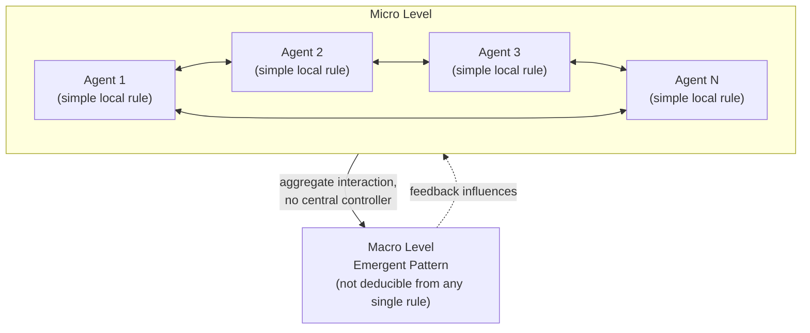

## The Santa Fe Institute and the Rise of Complexity Science

### Overview and Historical Context

The Santa Fe Institute (SFI) was founded in 1984 in Santa Fe, New Mexico, by a group of scientists centered at Los Alamos National Laboratory — including physicist George Cowan, Nobel laureate physicist Murray Gell-Mann, and economist Kenneth Arrow — motivated by the conviction that many of the most important unsolved scientific problems (the origin of life, the dynamics of economies, the evolution of ecosystems, the emergence of consciousness) shared a common underlying character that neither traditional reductionist physics nor siloed disciplinary specialization was well equipped to address: they were all instances of **complex adaptive systems**, composed of large numbers of interacting components whose collective behavior produces emergent, often unpredictable, macro-level order that cannot be straightforwardly derived from the properties of the individual components alone.

SFI's founding represents a direct institutional and intellectual continuation of the systems-science lineage running through cybernetics and General Systems Theory, but marks a significant methodological shift: whereas Bertalanffy's GST and Wiener's cybernetics sought general qualitative principles and analogies across disciplines, SFI-style complexity science pursued rigorous, computationally intensive, mathematically grounded modeling of complex systems, heavily reliant on agent-based simulation, statistical mechanics, nonlinear dynamics, and (from the 1990s onward) increasingly large-scale computation — treating complexity as a subject amenable to the same kind of quantitative, falsifiable theorizing as physics, rather than primarily a source of qualitative cross-disciplinary metaphor.

### Defining Complex Adaptive Systems

A **complex adaptive system (CAS)**, in the sense developed at SFI (particularly by John Holland, one of the institute's most influential early figures and the originator of genetic algorithms), is characterized by a specific cluster of properties distinguishing it from both simple mechanical systems and from merely "complicated" systems with many parts but no adaptive or emergent character:

**Key Points**

- **Large numbers of interacting agents/components**, each following relatively simple local rules of behavior, without centralized control dictating overall system behavior.
- **Emergence**: macroscopic patterns, structures, or behaviors arise from the aggregate interaction of components, and these emergent patterns are not straightforwardly predictable or deducible from the rules governing individual components in isolation — a technically sharper, more computationally grounded descendant of Bertalanffy's qualitative claim that "the whole is more than the sum of its parts."
- **Adaptation and learning**: components (agents) adjust their behavior over time in response to feedback from the environment or from other agents, often via selection-like processes (differential survival/replication of successful strategies), enabling the system as a whole to change its aggregate behavior over time without any single agent or external controller directing that change.
- **Nonlinearity**: system responses are not proportional to inputs; small perturbations can produce disproportionately large effects (sensitivity to initial conditions, as formalized in chaos theory) or, conversely, large perturbations can be absorbed with little effect, depending on the system's current state relative to critical thresholds.
- **Self-organization**: ordered structure arises spontaneously from local interactions without an external organizing template or blueprint — a phenomenon studied rigorously via statistical mechanics analogies (phase transitions, critical phenomena) imported directly from physics.

### Core Technical Tools and Concepts

**Key Points**

- **Agent-based modeling (ABM)**: simulating a system as a population of autonomous agents, each governed by simple behavioral rules and local information, then observing the emergent aggregate dynamics that result from their interaction — the primary computational methodology of SFI-style complexity science, distinct from the top-down, aggregate stock-and-flow equations of classical System Dynamics.
- **Cellular automata**: discrete, grid-based models (formalized by John von Neumann and later popularized by Stephen Wolfram and John Conway's Game of Life) in which each cell's state updates according to simple local rules based on neighboring cells' states, widely used at SFI to study how simple local rules can generate complex, sometimes computationally universal, global patterns.
- **Genetic algorithms and evolutionary computation**: John Holland's formalization (from the 1970s, extensively developed at SFI) of optimization and adaptation processes modeled on biological evolution — populations of candidate solutions undergo selection, crossover, and mutation across generations, providing both a practical computational optimization technique and a general model of adaptive search in complex fitness landscapes.
- **Self-organized criticality**: a concept developed by Per Bak (associated with, though not exclusively at, SFI) describing how certain complex systems naturally evolve toward a critical state at which even small perturbations can trigger cascading events of any size, following power-law distributions — the canonical illustrative example being a sandpile that self-organizes to a critical slope at which additional grains trigger avalanches of highly variable size, used as a model for phenomena ranging from earthquakes to stock market crashes to extinction events.
- **Power laws and scale invariance**: many complex systems exhibit statistical distributions of event sizes (city sizes, earthquake magnitudes, firm sizes, word frequencies) following power-law rather than normal distributions, expressed as $P(x) \propto x^{-\alpha}$, indicating the absence of a characteristic scale and a qualitatively different statistical regime than the systems classical statistics was built to describe.
- **Fitness landscapes**: a metaphor and formal tool (originating in evolutionary biology with Sewall Wright, extensively used at SFI) representing the relationship between a system's configuration (genotype, strategy, organizational structure) and its performance/fitness as a landscape of peaks and valleys that adaptive search processes must navigate, useful for reasoning about local optima, rugged landscapes, and the difficulty of complex optimization/adaptation.

### Diagram: Emergence in Complex Adaptive Systems (svg_diagram)

### The Complexity Economics Program

One of SFI's most influential and enduring specific research programs, launched at its 1987 founding conference on economics (bringing together physicists and economists including Kenneth Arrow, Brian Arthur, and Philip Anderson), was **complexity economics** — an explicit challenge to the neoclassical economic assumption of perfectly rational agents converging on unique equilibria, replaced with models of boundedly rational, adaptively learning agents interacting in markets that may exhibit multiple equilibria, path dependence, and persistent disequilibrium dynamics.

**Example**

Brian Arthur's influential SFI-era work on **increasing returns and path dependence** modeled how, in industries with network effects or learning-curve advantages (e.g., competing technology standards), small, essentially random early advantages can be amplified through positive feedback (more adopters → more investment/improvement → still more adopters) into durable market dominance — a dynamic inconsistent with classical economic models assuming diminishing returns and unique, efficient equilibria, and now a standard explanatory framework for phenomena such as technology-standard lock-in (e.g., the QWERTY keyboard layout as a canonical, if contested, illustrative case).

### Relationship to Earlier Systems Science Traditions

SFI-style complexity science is best understood as both a continuation and a significant methodological refinement of the systems-science lineage running through GST and cybernetics:

**Key Points**

- **Continuity**: SFI complexity science inherits the core commitments of holism, emergence, and the rejection of purely reductionist explanation shared with Bertalanffy's GST and Wiener/Ashby's cybernetics; SFI researchers explicitly acknowledged this genealogy, and Murray Gell-Mann's own writing on "complex adaptive systems" directly echoes earlier systems-theoretic language about hierarchical levels of organization and emergent whole-system properties.
- **Methodological refinement**: where GST and classical cybernetics often operated at the level of qualitative analogy and relatively simple, hand-derived differential-equation models (as in Forrester's System Dynamics), SFI-era complexity science leveraged the dramatic increase in available computational power from the 1980s onward to build large-scale agent-based and statistical-mechanical models capable of generating precise, testable, quantitative predictions (e.g., specific power-law exponents, phase-transition thresholds) rather than purely qualitative structural claims.
- **Shift in mathematical toolkit**: statistical mechanics, nonlinear dynamics/chaos theory, network theory, and evolutionary computation became the dominant formal apparatus of complexity science, substantially extending and in some respects superseding the more limited differential-equation and information-theoretic tools available to Wiener, Ashby, and Bertalanffy in the 1940s–60s.
- **Institutional divergence**: whereas GST and cybernetics institutionalized primarily through dedicated professional societies straddling many disciplines (Society for General Systems Research, American Society for Cybernetics) with comparatively diffuse ongoing visibility, SFI established a durable, well-funded, and prestigious independent research institution that continues to actively train researchers (including through its influential summer schools) and produce foundational complexity-science literature into the present day.

### Network Science as a Complementary Development

Substantially overlapping with and reinforcing SFI's complexity program, **network science** — formalized through Duncan Watts and Steven Strogatz's small-world network model (1998) and Albert-László Barabási and Réka Albert's scale-free network model (1999) — provided rigorous mathematical tools for characterizing the structure of interaction topology in complex systems (social networks, the internet, biological signaling networks, power grids), showing that many real-world networks share statistical structural properties (short average path lengths, high clustering, power-law degree distributions) with significant consequences for system robustness, vulnerability to targeted attack, and the dynamics of contagion/information spread across the network — extending complexity science's toolkit specifically to the *structure of connectivity* itself as a first-class object of study, complementing agent-based models' focus on *behavioral rules*.

### Criticisms and Limitations

**Key Points**

- **Universality claims under scrutiny**: some critics have questioned whether certain widely publicized complexity-science findings — particularly claims of universal power-law scaling across highly disparate systems (cities, firms, biological metabolism) — reflect genuine deep universal mechanisms or are, in some cases, artifacts of specific data-fitting choices or less universal than initially claimed. [Inference — this reflects an active area of methodological debate within complexity science itself, not a settled consensus.]
- **Model validation challenges**: agent-based models, due to their large number of free parameters and behavioral-rule choices, can often be tuned to reproduce a wide range of qualitative emergent patterns, raising methodological concerns about falsifiability and the risk of overfitting a model's rules to a desired emergent outcome rather than deriving that outcome from independently justified assumptions. [Inference]
- **Gap between qualitative insight and actionable prediction**: as with earlier systems-theoretic frameworks, critics note that complexity science's emergent, self-organizing, and power-law framing, while often descriptively illuminating, does not always translate into specific, actionable, quantitatively precise predictions applicable to a given real-world policy or engineering decision. [Inference]

### Legacy in Contemporary Systems Thinking

**Key Points**

- SFI-style complexity science substantially reshaped how contemporary systems thinking treats emergence, self-organization, and adaptation, supplementing the earlier feedback-loop-centric vocabulary of System Dynamics with concepts such as fitness landscapes, phase transitions, and power-law/scale-free structure.
- Agent-based modeling, pioneered and popularized substantially through SFI-affiliated researchers, has become a standard complementary methodology alongside System Dynamics in contemporary systems-thinking practice, particularly for systems where heterogeneous individual agent behavior (rather than aggregate stocks and flows) is the primary driver of emergent dynamics.
- Complexity economics remains an active and increasingly mainstream subfield of economics, with SFI continuing to serve as a central hub connecting complexity science to economics, ecology, network science, and computational social science.
- The complexity-science emphasis on **robustness, resilience, and the edge of chaos** (the hypothesis, associated with researchers including Stuart Kauffman and Christopher Langton, that complex adaptive systems often self-organize toward a regime poised between excessive order and excessive disorder, maximizing adaptability) has become a widely cited framework in organizational and ecological resilience thinking within contemporary systems-thinking practice.

### Related Topics

- General Systems Theory and Ludwig von Bertalanffy
- Cybernetics, Norbert Wiener, and second-order cybernetics
- Jay Forrester and System Dynamics as a complementary quantitative methodology
- Agent-based modeling and John Holland's genetic algorithms
- Network science: small-world and scale-free networks
- Self-organized criticality and power-law distributions
- Complexity economics and Brian Arthur's path dependence
- Chaos theory and nonlinear dynamical systems